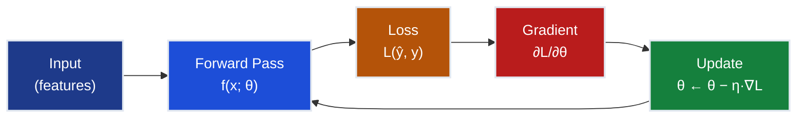
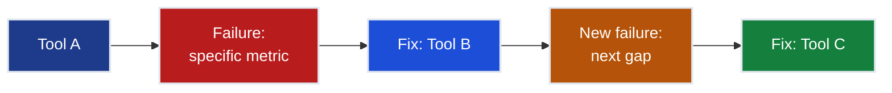

# Authoring Guide — AI Portfolio

> This is the living standard for all authored content under `notes/` and `learning/`.
> It supersedes both [`learning/genai/authoring-guide.md`](learning/genai/authoring-guide.md) and [`notes/authoring-guidelines.md`](notes/authoring-guidelines.md).
> Those documents remain as historical reference; this document is the single source of truth going forward.
>
> **Gold standards:**
> - Mechanistic depth — [`learning/genai/02-transformers/transformers.ipynb`](learning/genai/02-transformers/transformers.ipynb)
> - Narrative/business framing — [`learning/genai/04-llm/01-llm-finetuning.ipynb`](learning/genai/04-llm/01-llm-finetuning.ipynb)
> - Notes chapter — [`notes/03-ai/ch01-transformer-architecture/transformer-architecture.md`](notes/03-ai/ch01-transformer-architecture/transformer-architecture.md)

---

## 1 · Core Philosophy

Every chapter is built around one idea: **make the reader want the concept before giving it to them.**

Not "here is a technique, here is the code." Instead: a specific, named system is trying to do something real. It runs into a measurable wall. The concept is the tool that breaks through that wall.

Three habits are non-negotiable:

1. **The Grand Challenge is the pedagogical spine.** Every track threads one production system through all its chapters. Concepts are introduced when the system hits a specific, named, numbered blocker — not when it is "time to cover the topic." A reader who loses the grand challenge thread has lost the point of the chapter.

2. **Don't assert — demonstrate.** Every claim ("residuals help gradient flow," "pagination silently truncates your corpus," "Huber fixes the outlier hijack") is followed by code or a concrete number that proves it. If a claim has no proof it is decoration.

3. **Failure first.** Concepts are discovered by exposing what breaks, not by listing them:
   ```
   Tool → Specific Failure → Minimal Fix → That Fix's Failure → Next Tool
   ```
   If a section covers three methods, it must show what breaks with method 1 *before* introducing method 2.

---

## 2 · The Grand Challenge Pattern

Every track is anchored to one production system with real constraints, a named stakeholder, and a measurable target.

| Track | Grand Challenge | System | Key Target |
|-------|----------------|--------|-----------|
| **ML / 01-Regression** | SmartVal AI | California Housing | <$40k MAE |
| **ML / 02-Classification** | FaceAI | CelebA | >90% avg accuracy |
| **ML / 03-NeuralNetworks** | UnifiedAI | CA Housing + CelebA | ≤$28k MAE + ≥95% accuracy |
| **ML / 04-Recommender** | FlixAI | MovieLens 100k | >85% hit@10 |
| **ML / 05-AnomalyDetection** | FraudShield | Credit Card Fraud | 80% recall @ 0.5% FPR |
| **ML / 06-RL** | AgentAI | GridWorld + CartPole | CartPole ≥195/200 steps |
| **ML / 07-Unsupervised** | SegmentAI | UCI Wholesale | Silhouette >0.5 |
| **ML / 08-Ensemble** | EnsembleAI | California Housing | Beat single models by 5%+ |
| **AI** | Mamma Rosa's PizzaBot | Conversational AI | >32% conversion, <$0.07/conv |
| **AIInfrastructure** | InferenceBase | Llama-3-8B self-hosting | <$15k/mo, ≤2s p95 |
| **MultiAgentAI** | OrderFlow | B2B PO automation | 1,000 POs/day, <4hr SLA |
| **MultimodalAI** | VisualForge Studio | Local diffusion pipeline | <30s/image, ≥4.0/5.0 quality |
| **InterviewGuides** | Interview-Ready Engineer | Technical interview prep | Land senior AI/ML role |

**What the grand challenge does:** it converts "learn about pagination" into "the API is silently truncating your training data and your model doesn't know it." The failure the reader just witnessed is real, measured, and belongs to a system they have been following since chapter one.

Each chapter must:
1. Open with § 0 showing the specific wall the system just hit — with named numbers
2. Unlock at least one constraint measurably by the end
3. State that unlock with a measured result, not a description

---

## 3 · Voice and Register

The register is: **technical-practitioner, second person, conversational within precision.**

The reader is a capable engineer. They don't need to be impressed. They need to know what is breaking and what fixes it. Every sentence earns its place.

### Rules

**1. Second person is the default.** Place the reader inside the scenario at all times.
> "You're the Lead AI Engineer at SmartVal. Your model needs historical transaction data. The API has other ideas."
> "You just ran gradient descent. Very slowly. And by feel."

**2. Make the reader want it before giving it.** Before introducing any mechanism, the reader must feel the absence of it — either through the grand challenge failure (§ 0) or a "Predict:" setup that lets them be wrong.

**3. Dry, brief humour — at most once per major concept.** Never laboured.
> "By feel." / "The CEO is not amused." / "That's it."

**4. No academic register.** These phrases are forbidden:
- "In this section we demonstrate..."
- "It can be shown that..."
- "The reader may note..."
- "Let us explore..." / "We present..." / "This section introduces..."

**5. No emojis.** Text-only callout labels throughout:
- `**Predict:**` not 🔮
- `**Your turn:**` not 🧪
- `**Warning:**` not ⚠️
- `**Checkpoint:**` not ✅

Emojis render inconsistently across platforms, add visual noise, and reduce the register to tutorial-blog. Technical documentation relies on clear text formatting.

---

## 4 · Chapter Structure

### 4.1 Story Header

Every chapter opens with three items in a `>` blockquote, in this order:

**Item 1 — The story.** Who invented this, in what year, on what problem. Specific names, dates, papers. One paragraph. The last sentence connects the historical moment to the reader's current system.

**Item 2 — Where you are.** One paragraph naming what previous chapters delivered and what gap remains. Named constraint statuses, specific metric numbers.

**Item 3 — Notation.** A single inline sentence listing all symbols used in this chapter:
> "$x$ — input feature (`MedInc`); $y$ — true target; $\hat{y} = wx + b$ — model prediction; $N$ — samples; $L$ — MSE loss; $\eta$ — learning rate."

### 4.2 § 0 — The Challenge

Every chapter opens with § 0. Format is fixed:

```markdown
## 0 · The Challenge

> **The mission**: [Grand Challenge name] — [one-line constraint list]

**What we know so far:**
- [Previous chapter achievements with named metrics]
- **But we still can't [specific named gap]**

**What's blocking us:**
[2–4 sentences. Concrete, named, with numbers.
 Not "accuracy issue" but "$55k MAE vs. $40k target — 38% over."
 Not "data problem" but "API returns 10 records by default, not 200+ needed for training."]

**What this chapter unlocks:**
[Capability + expected metric delta]
```

**Rules for § 0:**
- The gap is never "our model is not accurate enough" — it is a specific numbered overshoot
- The blocker is never abstract — it is the named failure in the track's running example
- Constraint achievements note before and after numbers

### 4.3 Running Example

One running example threads through every section of a chapter. Never a new toy dataset per section. New mechanisms are always shown operating on the thing the reader already knows.

### 4.4 Part Structure — Per Major Concept

Each major concept follows this skeleton:

```
[Why you need this — the failure the previous step just produced]
→ [Build or implement the minimal version]
→ [Prove or measure the claim with code]
→ [Reflection: what this fixed, what it still doesn't solve]
→ [Bridge to the next concept — crack opened by this section's residual failure]
```

### 4.5 Toy → Real Bridge

When a mechanism is built in a toy/minimal form, bridge it to the real system before moving on:

- Table mapping toy parameters to production parameters
- Same mechanism run against real data
- Bridge cell is always explicit: "Same logic — just operating on your actual training corpus."

### 4.6 Closing Summary

End with:
1. A completed version of the § 0 roadmap — what was unlocked, with measured results
2. A short "Key takeaways" list — each item is a one-line quotable rule, not a section title restated

---

## 5 · Mathematical Style

**Rule 1: Use math only when it earns its place.**

Math appears when the intuition genuinely needs formal grounding to be precise. Three situations justify it:

1. A **constraint or bound** that the reader would otherwise be vague about (e.g., the exponential backoff bound, O(n²) attention scaling)
2. A **trade-off** where showing the formula explains the decision space (e.g., Huber's δ as a dial between MAE and MSE)
3. The formula **is** the concept — removing it would be lossy (e.g., `softmax(QKᵀ/√dk)` for attention)

Math does not appear to look thorough, as derivations when only the result matters, or when a diagram or table of numbers would be clearer.

**Rule 2: Intuition first, formalism second.**

A formula without motivation is decoration. Explain *why* before *what*.

> Wrong (formalism first): "The gradient is computed as ∇L = Xᵀ(ŷ - y)."
>
> Right (intuition first): "We need to know which direction makes loss smaller. If predictions are too high, the weights contributed too much — reduce them. The gradient answers this: ∇L = Xᵀ(ŷ - y)."

**Rule 3: Every formula has an immediate verbal gloss.**

The gloss goes in the same cell, within three lines of the LaTeX block. Never leave a formula to speak for itself.

**Rule 4: Scalar before vector.** Show the single-sample form first, then generalise. Never open with the matrix form.

**Rule 5: Optional depth goes in a callout block.**

Full derivations that break the narrative flow for practitioners:
```markdown
> **Optional depth:** [derivation]
> See [MathUnderTheHood ch06](../00-math-under-the-hood/ch06) for the rigorous treatment.
```

**Rule 6: ASCII matrix diagrams for matrix operations.** Aligned brackets, dimension annotations, actual numbers where possible:

```
Xᵀ  ·  e       (2×3) · (3×1) → (2×1)
┌ 0.5  1.5  2.0 ┐   ┌ -1.5 ┐   ┌ -8.0 ┐
└ 1.0  0.0 -1.0 ┘ × │ -2.5 │ = └  0.5 ┘
                    └ -4.0 ┘
```

**Rule 7: Prioritise geometric intuition over algebraic manipulation.** Save the algebra for optional blocks.

---

## 6 · Numerical Examples — Judicious Use

Numerical examples are powerful when they build intuition. They are harmful when they teach arithmetic instead of understanding.

**Use numerical walkthroughs when:**
- Introducing a new algorithm — one complete iteration with explicit numbers demystifies the mechanics
- Debugging a concept — where readers commonly misunderstand
- Comparing alternatives — same example through two methods highlights the difference

**Skip numerical walkthroughs when:**
- The pattern is already obvious
- Arithmetic would obscure the idea
- The same pattern was shown one section ago
- A plot or diagram would be clearer

**The judicious walkthrough structure (when used):**
1. State the toy dataset as a markdown table (use the track's running example data)
2. State initial conditions: `w = [0, 0]`, `b = 0.0`, `α = 0.1`
3. Show **one complete iteration** with explicit arithmetic
4. State the outcome with a metric: "MSE dropped from 8.167 → 1.233: 85% reduction in one epoch"
5. Close with what this demonstrates — not "I can do the arithmetic" but "I understand when to use this"

---

## 7 · "Prove Don't Assert" Discipline

Every non-trivial claim is followed by a cell that measures the effect. This includes:

- Claims about which weights changed → diff trained vs untouched baseline, per block, plot the norm
- Claims about failure modes → the minimal experiment that produces the failure, with a printed number
- Claims about improvement → before/after metric side by side

**Honest results.** When a run's result is ambiguous or fails to improve, say so directly. Branch the printed interpretation on the actual recorded numbers:

```python
if margin_improved and loss_improved:
    print("  → DPO converged: preference margin +{:.2f}".format(margin))
else:
    print("  → Signal too weak to converge — 30 pairs is below the practical minimum.")
    print("  → This is a real, useful result: it shows what DPO needs to work.")
```

A notebook that only shows clean successes teaches the reader to expect clean successes. That is not how real systems behave.

---

## 8 · Callout System

Fixed symbols only. Do not improvise new callout types.

| Callout | When to use |
|---------|-------------|
| `**Predict:**` | Pose a concrete, falsifiable question before the reveal. Give 2–3 candidate outcomes the reader can be wrong about. Always resolved in the following code cell — never spoiled in the same markdown block. |
| `**Your turn:**` | A change-one-variable exercise placed immediately after the concept it drills. Always includes a `# CHANGE THIS:` comment in the code cell and (where possible) a printed correctness check. |
| `**Warning:**` | Before or after a pattern that is commonly done wrong. Always names the specific failure and why it happens. |
| `**Checkpoint:**` | After a constraint is advanced — before/after numbers required. |
| `**Optional:**` | Deeper derivation or full proof that breaks the narrative flow for practitioners. Cross-link to MathUnderTheHood. |
| `**Forward:**` | Plant a concept before its formal treatment. One sentence, enough to prime the idea. |

Every callout ends with an actionable conclusion. No callout that just says "this is interesting."

---

## 9 · Code Cell Conventions

- **Section-banner comments:** every code cell opens with `# ── Short Description ─────────────────────────────`.
- **Comments explain why, not what:** `# √dk prevents softmax saturation` not `# divide by sqrt`.
- **Print statements are pedagogy, not debug noise.** Every demo cell ends with print lines stating the takeaway in words:
  ```python
  print("  → hash mismatch fires before parsing — no silent data corruption downstream")
  ```
  A reader who only reads output (not code) should still understand the lesson.
- **Claims get measured.** If surrounding prose says something changes, the next cell measures it and prints the number.
- **Naming mirrors the math.** `W_Q`, `d_k`, `attn_w` — not `weight1`, `out`, `x2`.
- **Deterministic seeds** (`np.random.seed(N)`) immediately before any cell whose numbers are quoted in surrounding markdown.
- **Small, readable implementations.** A class that teaches a concept should be readable top-to-bottom in under a minute. Opaque library calls do not substitute for the concept being taught.

---

## 10 · Per-Section Pitfalls + Health Check Pattern

Every major technique section ends with:

1. **Common Pitfalls** — Bad/Good pairs, each with a one-line "why it matters":
   ```markdown
   **Common Pitfalls**

   | | Pattern | Why it matters |
   |---|---------|----------------|
   | Wrong | `resp.json()` with no pagination | Silently returns first 10 records — model trains on 5% of the data |
   | Right | `while True: ... if not batch: break` | Gets all 200+ records |
   ```

2. **Quick Health Check** — the 3–5 things a practitioner runs to verify the result, followed by a code cell that *runs those exact checks*. Not a hypothetical snippet — a runnable cell.

---

## 11 · Forward and Backward Linking

Every new concept links to where it was first introduced and where it will matter next. This is not optional.

**Backward link pattern:**
> "This is the same update rule from Ch.01 — the only difference is that Xᵀ now accumulates contributions from all d features."

**Forward link pattern:**
> "This validation pattern is the template for the PSI/KS drift tests you'll implement in data-prep.py exercises #11–12."

Cross-track links to MathUnderTheHood reference the specific chapter:
`[MathUnderTheHood ch06 — Gradient & Chain Rule](../00-math-under-the-hood/ch06)`

---

## 12 · Diagrams — Mermaid and ASCII

**Diagrams are mandatory, not optional.** Every major (`##` level) section must have at least one Mermaid diagram. Concepts that can be shown visually must be shown visually.

### Minimum count per chapter
| Chapter type | Minimum |
|---|---|
| Single-algorithm chapter | 2 — training loop + failure→fix chain |
| Multi-method chapter | 3 — one per method transition + architecture comparison |
| Foundation/theory chapter | 3 — computation graph + concept flow + key formula as diagram |

### Mermaid color palette (mandatory)
| Role | Fill | Typical node |
|------|------|-------------|
| Input / data | `#1e3a8a` | Feature vectors, raw data, initial state |
| Processing / transform | `#1d4ed8` | Model layers, intermediate computations |
| Decision / caution | `#b45309` | Loss function, convergence check |
| Failure / blocked | `#b91c1c` | Error state, constraint violation, before-fix |
| Success / achieved | `#15803d` | Converged model, constraint met, after-fix |

All nodes: `stroke:#e2e8f0,stroke-width:2px,color:#ffffff`

### Reference templates

**Training loop (iterative optimisation):**


**Failure → fix chain (introducing a method via its predecessor's failure):**


### ASCII diagrams for matrix operations

Use aligned-bracket ASCII art for any matrix multiply, weight update, or convolution. Always annotate dimensions. Always include at least one row of real numbers.

```
W  ·  x         (3×2) · (2×1) → (3×1)
┌ 0.5  1.2 ┐   ┌  2.0 ┐   ┌  3.4 ┐
│ 0.3 -0.7 │ × │ -1.0 │ = │  1.3 │
└-0.1  0.9 ┘   └      ┘   └ -1.1 ┘
```

## 13 · Image and Animation Conventions

- Every image demonstrates something the prose cannot fully convey with text. No decorative diagrams.
- All generated plots: `facecolor="#1a1a2e"` (dark background).
- Alt-text is mandatory and descriptive.
- Naming: `chNN-[topic]-[type].png/.gif`. Stored in `./img/`.
- Every chapter has a needle GIF immediately after § 0 showing which constraint moved.

---

## 13 · Checklist — Is a Chapter at Standard?

**Structure**
- [ ] Opens with a story header (history, curriculum position, notation sentence)
- [ ] § 0 states the specific, numbered constraint the grand challenge just hit
- [ ] One running example threaded through all sections — not a new toy per section
- [ ] Closes with a completed § 0 roadmap + quotable takeaway list

**Pedagogy**
- [ ] Failure-first: each new concept is introduced by the failure of the previous one
- [ ] Every non-trivial claim is followed by code that measures it
- [ ] **Predict:** cells before any reveal with a non-obvious answer
- [ ] **Your turn:** exercises placed near the concept they drill, with `# CHANGE THIS:` and printed correctness check
- [ ] Reflection / bridge cell closes each major section and plants the next question
- [ ] Honest about failures: ambiguous results stated plainly and interpreted on actual recorded numbers

**Style**
- [ ] No emojis anywhere
- [ ] No academic register anywhere
- [ ] Math appears only when it genuinely earns its place; every formula has an immediate verbal gloss
- [ ] Second person throughout
- [ ] Seeds set deterministically wherever quoted numbers appear in markdown

**Code**
- [ ] Section-banner comments on every code cell
- [ ] Comments explain why, not what
- [ ] Print statements state the takeaway in words
- [ ] Naming mirrors the math

---

## 14 · Relationship to Track-Specific Guides

This document sets the universal rules. Track-specific `AUTHORING_GUIDE.md` files adapt these rules to:
- The track's specific running example and grand challenge
- Domain-specific conventions (e.g., latency vs. accuracy trade-offs in AIInfrastructure)
- Notebook vs. Markdown chapter format differences

When a track guide conflicts with this document, the track guide wins *within its scope*. When in doubt, this document wins.

---

## 15 · How This Guide Is Used

When authoring or revising a chapter:

1. Write a `plan.md` in the chapter folder that:
   - Summarises the chapter's current state
   - Scores it against Section 13's checklist
   - Lists concrete, ordered changes to reach standard
   - Is scoped to that chapter only

2. Implement the changes in the order the checklist items would be felt by a first-time reader (opening → § 0 → running example → per-section changes → summary).

3. After finishing: run the checklist again. Every item must be checked before the chapter is considered at standard.
