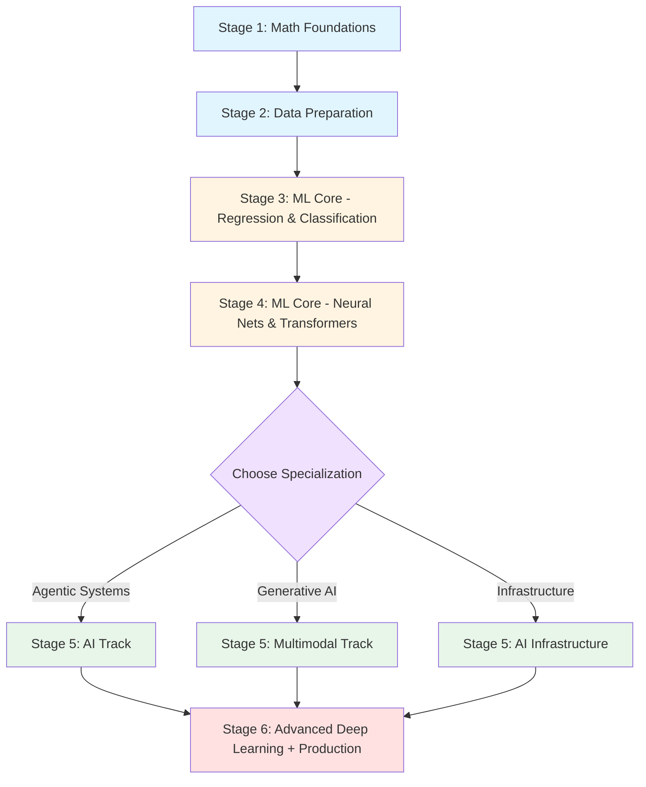

# ai-portfolio

A personal portfolio combining structured AI/ML study notes and hands-on engineering projects.

---

## Structure

```
ai-portfolio/
├── notes/       ← Study material
├── exercises/   ← Hands-on practice
├── playground/  ← Exploration & learning implementations
├── projects/    ← Engineering projects (solo work)
└── scripts/     ← Setup automation
```

---

## Authorship

This repository contains three types of content:

### Co-Authored with AI
- **notes/** - Theory and learning content (GitHub Copilot, Claude)
- **exercises/** - Hands-on coding exercises (mirrors notes/ structure)

### Solo Work
- **projects/** - Capstone engineering projects (fully designed and implemented by me)

### Playground
- **playground/** - Exploratory implementations for hands-on learning and experimentation
  - Self-contained implementations
  - Security-hardened (no credentials, proper .gitignore)
  - Fully documented

---

## `notes/` — Study Material

All learning content lives here: a **19-chapter ML curriculum**, a math foundations track, four AI tracks (Agentic, Multi-Agent, Multimodal, AI Infrastructure), a consolidated interview guide, and runnable Jupyter notebooks throughout.

→ See [notes/README.md](notes/README.md) for the full index.

---

## `exercises/` — Hands-On Practice

Complementary exercises that mirror the notes/ structure. Implement algorithms and concepts learned in theory.

→ See [exercises/README.md](exercises/README.md) for the full index.

---

## `playground/` — Exploration Notebooks

Exploratory implementations for hands-on learning and experimentation.

- **[playground/rag-agents/](playground/rag-agents/README.md)** — LangChain, RAG, and Agentic AI patterns
- **[playground/feature-engineering/](playground/feature-engineering/README.md)** — Classical ML feature engineering techniques

---

## `projects/` — Engineering Projects

Standalone, runnable projects built with the concepts covered in the notes.

| Path | What it is |
|---|---|
| `projects/ml/linear-regression/` | End-to-end linear regression project on real data |
| `projects/ai/rag-pipeline/` | RAG pipeline implementation |

More projects added as the curriculum progresses.

---

## Accredited courses this material best supports

This repo is **not accredited** — it's self-authored study material. It is, however, a rigorous companion to paid certifications. Courses below are sorted by how tightly the `notes/` tracks align with the certification's syllabus (tightest fit first).

| Rank | Certification | Tracks that support it | Gap this repo closes |
|---|---|---|---|
| 1 | **DeepLearning.AI — *Deep Learning Specialization* (Coursera, Andrew Ng)** | [00-MathUnderTheHood](notes/00-math-under-the-hood), [01-ML](notes/01-ml) Ch.1–8 · Ch.15 · Ch.17–18 | Derives the math Coursera states as given; adds production depth Coursera skips. |
| 2 | **DeepLearning.AI — *Machine Learning Specialization* (Coursera)** | [01-ML](notes/01-ml) Ch.1–6 · Ch.9–14 · Ch.19 | California Housing continuity forces real code understanding vs scaffolded notebooks. |
| 3 | **HuggingFace — *NLP Course* + *LLM Course*** | [AI](notes/03-ai) (all), [01-ML](notes/01-ml) Ch.17–18, [MultiAgentAI](notes/06-multi-agent-ai) | Supplies the "why" behind every HF snippet — tokenisation, RAG, fine-tuning, evaluation. |
| 4 | **NVIDIA Deep Learning Institute — *LLMs* / *Inference Optimization* / *Fundamentals of Deep Learning*** | [AIInfrastructure](notes/07-ai-infrastructure) (all), [01-ML](notes/01-ml) Ch.4–8 | Vendor-neutral grounding for GPU architecture, quantisation, vLLM, serving. |
| 5 | **Azure AI Engineer Associate (AI-102)** / **AWS Certified Machine Learning – Specialty (MLS-C01)** | [AI](notes/03-ai), [AIInfrastructure](notes/07-ai-infrastructure), [MultiAgentAI](notes/06-multi-agent-ai) | Cloud exams test services; this repo teaches what the services actually do underneath. |
| 6 | **Stanford Online — *XCS229 / CS229 Machine Learning* (paid professional track)** | [00-MathUnderTheHood](notes/00-math-under-the-hood) Ch.5–7, [01-ML](notes/01-ml) Ch.5 · Ch.6 · Ch.9 · Ch.11 · Ch.15 | Practical production framing alongside CS229's academic rigor. |
| 7 | **DeepLearning.AI — *Generative AI with LLMs* (Coursera)** | [AI](notes/03-ai), [01-ML](notes/01-ml) Ch.18, [MultimodalAI](notes/04-multimodal-ai) | Adds agent orchestration, multi-agent protocols, and local-inference economics. |
| 8 | **MIT / edX — *MicroMasters in Statistics and Data Science*** | [00-MathUnderTheHood](notes/00-math-under-the-hood) Ch.7, [01-ML](notes/01-ml) Ch.9 · Ch.14 · Ch.15 | Use as warm-up, not substitute — MicroMasters is heavier on pure statistics. |

**Recommended primary pairing:** *DeepLearning.AI Deep Learning Specialization + HuggingFace LLM Course*, using [notes/00-MathUnderTheHood/](notes/00-math-under-the-hood) to build mathematical intuition and [notes/03-ai/](notes/03-ai) + [notes/07-ai-infrastructure/](notes/07-ai-infrastructure) as the production layer those courses intentionally skip.

---

## How the tracks fit together — the historical arc

Every track in this repo is the response to a specific historical bottleneck. Reading them in roughly the order the field discovered them makes the curriculum feel inevitable instead of arbitrary. This is a one-paragraph teaser; each track has its own deep timeline (linked at the end of each row).

| Era | The bottleneck that defined it | Where it shows up in this repo |
|---|---|---|
| **Pre-1900s** — *math foundations* | Curves, gradients, and probability had to be invented before "fitting a model" was a coherent idea (Newton/Leibniz → Gauss → Pearson). | [notes/00-MathUnderTheHood/](notes/00-math-under-the-hood#historical-and-chronological-evolution) — Euclid through Rumelhart, mapped to chapters |
| **1805 → 2017** — *classical & deep ML* | Least squares → MLE → perceptrons → AI winter → backprop → CNNs → LSTMs → attention → Transformer. Every chapter exists because an earlier model failed at a specific problem. | [notes/README.md (ML history)](notes/README.md#how-we-got-here--a-short-history-of-machine-learning) — full 30-row timeline aligned to ML Ch.1–19 |
| **2017 → today** — *agentic AI* | Once Transformers existed, the next bottleneck moved up the stack: prompting → CoT reasoning → retrieval → tool use → ReAct → multi-agent orchestration. | [notes/03-ai/AIPrimer.md](notes/03-ai/ai-primer.md#how-we-got-here--a-short-history-of-agentic-ai) |
| **2020 → today** — *multi-agent protocols* | Single agents hit context-window and trust ceilings. The fix was protocol-level: MCP, A2A, event buses, sandboxing. | [notes/06-MultiAgentAI/README.md](notes/06-multi-agent-ai/README.md#how-we-got-here--a-short-history-of-multi-agent-ai) |
| **2014 → today** — *multimodal & generative* | GANs → VAEs → CLIP → DDPM → Latent Diffusion → ControlNet → multimodal LLMs. Each step solved a stability or controllability gap in the previous one. | [notes/04-MultimodalAI/README.md](notes/04-multimodal-ai/README.md#how-we-got-here--a-short-history-of-multimodal--generative-ai) |
| **1999 → today** — *AI infrastructure* | GPU as graphics card → CUDA → tensor cores → HBM → ZeRO → Flash Attention → PagedAttention → 4-bit quantisation. Every chapter exists because the previous bottleneck moved (compute → memory → throughput → cost). | [notes/07-ai-infrastructure/README.md](notes/07-ai-infrastructure/README.md#how-we-got-here--a-short-history-of-ai-infrastructure) |

**The through-line:** math made fitting models possible → classical ML made fitting useful → deep learning made fitting scalable → infrastructure made deep learning affordable → agents made deep learning *act* → multi-agent protocols made agents compose → multimodal made everything see and generate. Read the per-track histories above whenever a chapter feels like it appeared from nowhere.

---

## Zero to Hireable AI Engineer — Learning Path

This repo takes you from "I can code but I've never trained a model" to "I can build, deploy, and maintain production AI systems." Work through it at your own pace — the stages below are ordered by dependency, not by deadline.

### Prerequisites Check

Before starting, confirm you have:
- **Python fluency**: Can write functions, classes, work with lists/dicts
- **Basic linear algebra**: Know what matrix multiplication is (high-school level sufficient)
- **Command-line basics**: Can navigate directories, run scripts, activate virtual environments
**You do not need**: Prior ML experience, a GPU, a math degree, or existing PyTorch/TensorFlow knowledge.

### The Recommended Path



#### Stage 1: Math Foundations
**Goal**: Build mathematical intuition for gradient descent, backpropagation, and loss functions.

**Path**:
- [notes/00-math-under-the-hood/](notes/00-math-under-the-hood) — all 7 chapters
- Focus: Linear algebra (Ch.1), derivatives (Ch.3-4), gradients (Ch.6), chain rule (Ch.6)
- **Outcome**: Can derive `∂L/∂w` by hand, understand why gradient descent works

#### Stage 2: Data Preparation
**Goal**: Master real-world data cleaning, validation, and quality checks.

**Path**:
- [notes/01-ml/00_data_fundamentals/](notes/01-ml/00_data_fundamentals) — 3 chapters (planned in v1.1)
  - Ch.1: Pandas & EDA
  - Ch.2: Class Imbalance
  - Ch.3: Data Validation & Drift Detection
- **Outcome**: Can detect outliers, handle missing data, implement drift monitoring

**Note**: If this track isn't published yet, substitute with external resources (see [What This Repo Does NOT Cover](#what-this-repo-does-not-cover)) and proceed to Stage 3.

#### Stage 3: ML Core — Regression & Classification
**Goal**: Train classical ML models, understand evaluation metrics, tune hyperparameters.

**Path**:
- [notes/01-ml/01_regression/](notes/01-ml/01_regression) — Ch.1-5 (Linear → Multiple → Polynomial → Regularization → Metrics)
- [notes/01-ml/02_classification/](notes/01-ml/02_classification) — Ch.1-3 (Logistic Regression → Classifiers → Metrics)
- **Outcome**: Can build end-to-end regression/classification pipelines, interpret precision/recall, tune learning rates

#### Stage 4: ML Core — Neural Networks & Transformers
**Goal**: Understand deep learning from perceptrons to attention mechanisms.

**Path**:
- [notes/01-ml/03_neural_networks/](notes/01-ml/03_neural_networks) — Ch.1-10 (XOR → Dense → Backprop → CNNs → RNNs → Attention → Transformers)
- **Milestone**: After Ch.10 (Transformers), you're ready to start the AI track in parallel
- **Outcome**: Can implement a Transformer from scratch, understand self-attention, know when CNNs vs RNNs apply

#### Stage 5: Specialization Track
**Goal**: Choose one specialization path based on career target. You can revisit the others later.

**Option A — Agentic AI** (for AI product engineers):
- [notes/03-ai/](notes/03-ai) — LLM Fundamentals → Prompt Engineering → Chain-of-Thought → RAG → Vector DBs → ReAct → Evaluation → Fine-Tuning
- **Outcome**: Can build RAG pipelines, orchestrate tool-using agents, evaluate hallucination rates

**Option B — Multimodal AI** (for generative AI engineers):
- [notes/04-multimodal-ai/](notes/04-multimodal-ai) — Vision Transformers → CLIP → Diffusion → Latent Diffusion → Text-to-Image → Local Deployment
- **Outcome**: Can run Stable Diffusion locally, understand CLIP embeddings, implement ControlNet conditioning

**Option C — AI Infrastructure** (for ML platform engineers):
- [notes/07-ai-infrastructure/](notes/07-ai-infrastructure) — GPU Architecture → Memory Budgets → Quantization → Distributed Training → Inference Optimization
- **Outcome**: Can estimate VRAM requirements, implement 4-bit quantization, optimize inference with Flash Attention

#### Stage 6: Advanced Deep Learning + Production
**Goal**: Production computer vision and end-to-end deployment.

**Path**:
- [notes/02-advanced_deep_learning/](notes/02-advanced_deep_learning) — ResNets → Efficient Architectures → Object Detection → Segmentation → Pruning → Mixed Precision
- [notes/07-ai-infrastructure/](notes/07-ai-infrastructure) — (if not already completed) Serving, Production Deployment
- [notes/08-devops-fundamentals/](notes/08-devops-fundamentals) — Docker → Kubernetes → CI/CD → Monitoring
- **Outcome**: Can deploy a compressed YOLOv5 model to Kubernetes, monitor latency with Prometheus, achieve 99% uptime

### Why This Sequence?

**Math first** (Stage 1): You'll see `∂L/∂w` hundreds of times. Derive it once by hand now, internalize it forever.

**Data prep before modeling** (Stage 2): 80% of ML failure is bad data. Learn to detect it before you waste time tuning models.

**Classical ML before deep learning** (Stage 3): Linear/logistic regression teach loss minimization and gradient descent without the complexity of backprop through 10 layers.

**Transformers before specializations** (Stage 4): Transformers are the foundation for AI (GPT), Multimodal (CLIP, Stable Diffusion), and Advanced Deep Learning (Vision Transformers). Nail this first.

**Advanced Deep Learning last** (Stage 6): ResNets, object detection, and segmentation assume you already understand CNNs, loss functions, and hyperparameter tuning. Don't start here.

### Track Overview

| Track | What it covers |
|-------|---------------|
| **00-math-under-the-hood** | Linear algebra, calculus, gradients, chain rule |
| **01-ml/00_data_fundamentals** | Pandas, EDA, class imbalance, drift detection |
| **01-ml (Topics 1-8)** | Regression, classification, neural nets, clustering, ensembles |
| **03-ai** | LLMs, RAG, embeddings, tool use, evaluation |
| **06-multi-agent-ai** | MCP, A2A, event-driven patterns, sandboxing |
| **04-multimodal-ai** | Vision Transformers, CLIP, diffusion, Stable Diffusion |
| **07-ai-infrastructure** | GPU architecture, quantization, distributed training, serving |
| **08-devops-fundamentals** | Docker, Kubernetes, CI/CD, monitoring |
| **02-advanced_deep_learning** | ResNets, detection, segmentation, pruning |

### Interview Readiness Checkpoints

| After completing | Interview Checkpoint |
|-----------------|---------------------|
| **Stage 3** | Can explain gradient descent, loss functions, precision vs recall, overfitting/underfitting. Ready for: Junior ML Engineer (IC1) interviews. |
| **Stage 4** | Can explain backpropagation, self-attention, when to use CNNs vs RNNs. Ready for: Mid-level ML Engineer (IC2) technical screens. |
| **Stage 5** | Can architect a RAG pipeline OR explain latent diffusion OR estimate VRAM for distributed training. Ready for: Specialized AI roles (ML Platform, AI Engineering, Generative AI). |
| **Stage 6** | Can design end-to-end production systems, compress models 14×, deploy to Kubernetes. Ready for: Senior ML Engineer (IC3), Staff-level design interviews. |

### What Comes Next?

After completing the path, you have:
- ✅ Mathematical foundations to read papers
- ✅ Classical ML + deep learning fundamentals
- ✅ One specialization (Agentic AI, Multimodal, or Infrastructure)
- ✅ Production deployment experience

**To continue advancing**:
1. **Finish the other specializations** — all three tracks are load-bearing for senior roles
2. **Add time series forecasting** (planned v1.1) — ARIMA, Prophet, LSTMs for sequential data
3. **Contribute to open source** — fix a PyTorch bug, contribute to HuggingFace Transformers
4. **Build a portfolio project** — end-to-end system showcasing your specialization
5. **Study distributed systems** — Ray, Spark, Dask for large-scale ML

See [What This Repo Does NOT Cover](#what-this-repo-does-not-cover) for topics intentionally excluded and recommended external resources.

---

## Quick start

**Set up the full dev environment (Windows):**
```powershell
.\scripts\setup.ps1
# Optional: add --enable-slm-assistant to install Kilo Code + Ollama wiring
# Optional: add --enable-mkdocs-server to launch the local MkDocs docs server
# Optional: add --enable-gpu-notebook-stack to install the GPU notebook deps
```

**Set up the full dev environment (macOS / Linux):**
```bash
bash scripts/setup.sh
# Optional: add --enable-slm-assistant to install Kilo Code + Ollama wiring
# Optional: add --enable-mkdocs-server to launch the local MkDocs docs server
# Optional: add --enable-gpu-notebook-stack to install the GPU notebook deps
```

One script installs Python, the full AI/ML package stack (covering every track under `notes/`), registers all Jupyter kernels, and launches Jupyter Lab at a fixed local port so you can start studying immediately. Pass `--enable-slm-assistant` only if you also want VS Code + the **Kilo Code** extension, Ollama, and the local DeepSeek-R1 wiring. Pass `--enable-mkdocs-server` only if you want the local MkDocs docs server too. Pass `--enable-gpu-notebook-stack` only if you want the CUDA PyTorch and fine-tuning dependencies used by the GPU supplement notebooks.

**Install git hooks (secret scanning pre-commit):**
```bash
bash scripts/install-hooks.sh     # macOS / Linux
.\scripts\install-hooks.ps1       # Windows
```

---

## Code Context Engine (CCE) — Local AI Code Index

The dev environment includes [Code Context Engine](https://elara-labs.github.io/code-context-engine/), a local MCP server that gives Copilot AST-aware semantic search across the entire repo — typically saving ~94% of input tokens compared to sending raw files. `setup.ps1` / `setup.sh` install and initialise it automatically.

### How the index stays current

| Trigger | What happens |
|---------|--------------|
| `git commit` | `cce index --changed-only` runs automatically (post-commit hook) |
| `git checkout` / `git merge` | Same, via post-checkout and post-merge hooks |
| New file created | `cce index --changed-only` via file watcher (see below) |
| Notebook: ≥ 3 cells added/modified | `cce index --changed-only` via file watcher |

You never need to re-run `cce init`. For a forced full re-index (e.g. after a large rebase or bulk file import):
```powershell
cce index    # full re-index
```

### Key commands

```powershell
cce savings           # token savings stats for this project
cce index             # full re-index
cce index --changed-only   # re-index only files changed since last run
cce sessions status   # check if cross-session memory is active
cce serve             # start the memory server (enables cross-session recall)
```

### File-system watcher

The git hooks cover changes you commit. The watcher covers everything else — new notes, notebook edits mid-session — and runs in the background automatically when you open the folder in VS Code (via the `cce-watcher` workspace task):

**Windows (PowerShell — manual start):**
```powershell
.\scripts\cce-watcher.ps1
```

**macOS / Linux (manual start):**
```bash
# Requires fswatch (macOS: brew install fswatch) or inotify-tools (Linux: apt install inotify-tools)
bash scripts/cce-watcher.sh
```

### Cross-session memory

Run `cce serve` in a background terminal so Copilot can recall decisions and patterns from previous conversations:

**Windows:**
```powershell
.\.venv\Scripts\cce.exe serve
```

**macOS / Linux:**
```bash
.venv/bin/cce serve
```

---

## Study workflow — two servers, two purposes

The setup scripts start both servers on **fixed ports** so you can bookmark the URLs.

| Purpose | URL | What it serves |
|---|---|---|
| **Hands-on coding** | http://localhost:8888 | Jupyter Lab — run and edit every `notebook.ipynb_solution.ipynb` (reference) or `notebook.ipynb_exercise.ipynb` (practice) under `notes/` |
| **Reading the material** | http://localhost:8000 | MkDocs Material — browse every `README.md`, `.md`, **and `notebook.ipynb_solution.ipynb` (reference) or `notebook.ipynb_exercise.ipynb` (practice)** under `notes/` in a web browser (rendered, read-only), with search, dark mode, Mermaid diagrams, and math rendering |

### Launching the servers manually

If the servers are not already running (e.g. after a reboot), activate the venv and start them:

**Windows (PowerShell):**
```powershell
.\.venv\Scripts\Activate.ps1

# Jupyter Lab — hands-on notebooks
Start-Process python -ArgumentList '-m','jupyter','lab','--no-browser','--ServerApp.port=8888','--ServerApp.ip=127.0.0.1' -WindowStyle Hidden -PassThru | Select-Object -Expand Id | Set-Content .jupyter.pid

# MkDocs — reading site
Start-Process python -ArgumentList '-m','mkdocs','serve','-a','127.0.0.1:8000' -WindowStyle Hidden -PassThru | Select-Object -Expand Id | Set-Content .mkdocs.pid
```

**macOS / Linux:**
```bash
source .venv/bin/activate

# Jupyter Lab — hands-on notebooks
nohup python -m jupyter lab --no-browser --ServerApp.port=8888 --ServerApp.ip=127.0.0.1 > .jupyter.log 2>&1 &
echo $! > .jupyter.pid

# MkDocs — reading site
nohup python -m mkdocs serve -a 127.0.0.1:8000 > .mkdocs.log 2>&1 &
echo $! > .mkdocs.pid
```

### Stopping the servers

**Windows:**
```powershell
Get-Content .jupyter.pid,.mkdocs.pid | ForEach-Object { Stop-Process -Id ([int]$_) -Force }
```

**macOS / Linux:**
```bash
kill $(cat .jupyter.pid .mkdocs.pid 2>/dev/null)
```

> Jupyter Lab's first-run login token is printed to `.jupyter.log` — open the log and copy the `?token=…` URL into your browser.

---

## Custom VS Code Agents (No Paid Subscription Required)

This repository includes a suite of **8 local AI agents** designed for repository maintenance, validation, and documentation work. All agents run entirely locally in VS Code with GitHub Copilot — **no external APIs, no paid subscriptions, no authentication required**.

### User-Invocable Agents

| Agent | What it does | Invocation |
|-------|------------|-----------|
| **Content Auditor** | Audit `notes/` for broken links, orphaned notebooks, missing READMEs | `@Content Auditor audit all` |
| **Explore** | Fast discovery of codebase structure and patterns | `@Explore find what I'm looking for (quick\|medium\|thorough)` |
| **Notebook Supplement Guardian** | Validate GPU detection guards in MultimodalAI supplements | `@Notebook Supplement Guardian validate all` |
| **ML Animation Auditor** | Audit ML chapters for animation opportunities and consistency | `@ML Animation Auditor audit 01-Regression` |

### Internal Agents (Batch/Workflow)

- **ML Animation Coordinator** — orchestrate animation rollout across chapters
- **ML Animation Needle Builder** — build metric-movement animations
- **ML Animation Doc Sync** — sync animation documentation
- **Multimodal Animation Builder** — generate MultimodalAI flow animations

### Quick Start

1. Open **Copilot Chat** in VS Code (`Ctrl+Shift+I`)
2. Type `@` to see available agents
3. Type `@Content Auditor audit all` and press Enter

→ **Full documentation**: [AGENTS.md](AGENTS.md)

---

## What This Repo Does NOT Cover

This curriculum is intentionally scoped to **software engineers becoming AI/ML practitioners**. Topics below were consciously excluded — either because they belong in vendor-specific documentation, require a separate infrastructure specialisation, or are planned for a future version.

| Topic | Why excluded | Where to go instead |
|-------|--------------|---------------------|
| **SQL / Relational Databases** | Prerequisite skill, not an ML topic | [Mode Analytics SQL Tutorial](https://mode.com/sql-tutorial/) · [PostgreSQL Docs](https://www.postgresql.org/docs/current/) |
| **Apache Spark / Distributed Data** | Operationally heavy; tooling changes faster than curriculum can track | [Databricks Academy](https://www.databricks.com/learn/training/catalog) · [Dask Docs](https://docs.dask.org/en/stable/) |
| **Mobile / On-device ML** (CoreML, TFLite) | Platform-specific; AI Infra track covers quantization as the transferable foundation | [TFLite Docs](https://www.tensorflow.org/lite/guide) · [Apple MLX](https://ml-explore.github.io/mlx/build/html/index.html) |
| **Federated Learning** | Research-stage; laptop-first constraint makes simulation environments impractical | [TF Federated](https://www.tensorflow.org/federated) · [Flower Framework](https://flower.dev/docs/) |
| **Graph Neural Networks** | Niche in generalist roles; attention mechanisms (the conceptual overlap) are covered in ML Ch.17–18 | [PyG Docs](https://pytorch-geometric.readthedocs.io/en/latest/) · [Distill.pub GNN intro](https://distill.pub/2021/gnn-intro/) |
| **Bayesian / Probabilistic Programming** | Requires statistical background beyond prerequisites; most valuable in research roles | [Pyro](https://pyro.ai/examples/) · [Stan User Guide](https://mc-stan.org/docs/stan-users-guide/index.html) |
| **Data Engineering Pipelines** (Airflow, dbt) | Orchestration is infrastructure tooling; curriculum ends at the model-serving boundary | [Airflow Docs](https://airflow.apache.org/docs/) · [dbt Learn](https://learn.getdbt.com/) |
| **MLOps Platforms** (SageMaker, Vertex AI) | AI Infra covers client-side tracking; server-side MLOps is vendor-specific | [MLflow Docs](https://mlflow.org/docs/latest/index.html) · [AWS SageMaker Guide](https://docs.aws.amazon.com/sagemaker/latest/dg/whatis.html) |
| **CV Production Tooling** (YOLO ecosystem, MMDetection) | Advanced DL track covers the algorithms; production tooling is best learned on top of that foundation | [Ultralytics YOLO](https://docs.ultralytics.com/) · [MMDetection](https://mmdetection.readthedocs.io/en/latest/) |
| **Speech / ASR / Production TTS** | Multimodal track covers audio generation at intro level; full ASR is a specialisation | [HF Audio Course](https://huggingface.co/learn/audio-course/chapter0/introduction) · [Whisper](https://github.com/openai/whisper) |
| **Advanced RLHF** (reward model, PPO loop) | Covered at intro level in AI Ch.1; full implementation requires research-scale compute | [TRL Library](https://huggingface.co/docs/trl/index) · [Constitutional AI paper](https://arxiv.org/abs/2212.08073) |
| **A/B Testing Platforms** (Optimizely, Statsig) | Evaluation statistics covered in ML Ch.6; experimentation infrastructure is a separate specialisation | [Evan Miller's guides](https://www.evanmiller.org/ab-testing/) · [Trustworthy Online Controlled Experiments](https://www.cambridge.org/core/books/trustworthy-online-controlled-experiments/D97B26382EB0EB2DC2019A7A7B518F59) |

### Coming in future versions

| Version | Topic |
|---------|-------|
| v1.1 | Time Series Forecasting (ARIMA, Prophet, Temporal Fusion Transformer) |
| v1.2 | SQL for ML (feature engineering, window functions, DuckDB) |
| v2.0 | Distributed Training Labs (multi-GPU, FSDP, DeepSpeed) |
| v2.0 | Serving Frameworks Deep Dive (vLLM, TensorRT-LLM, TGI) |

To request coverage for a gap, open a GitHub Issue describing your use case. See [CONTRIBUTING.md](CONTRIBUTING.md) if you'd like to contribute a draft chapter.

---

