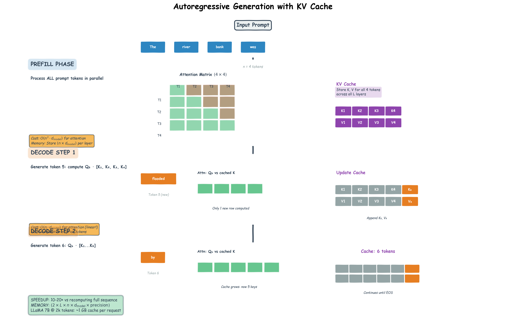

# LLM Fundamentals — What a Language Model Actually Is

> **Where you are in the curriculum.** **Read this before anything else in the AI track.** Every later doc — [CoT Reasoning](../ch03-cot-reasoning), [RAG](../ch04-rag-and-embeddings), [ReAct](../../03b-agentic-ai/ch01-react-and-semantic-kernel) — assumes you know what an LLM is under the hood. This document builds that foundation from the transformer through to the models you call via API today: tokenization, the pretraining → SFT → RLHF pipeline, sampling parameters, and context windows.
>
> **Notation used later in this doc.** $P(x_t \mid x_{<t})$ — probability of next token $x_t$ given all prior tokens; $T$ — temperature (controls output randomness); $k$ — top-$k$ candidate count; $p$ — nucleus (top-$p$) cumulative probability threshold; $V$ — vocabulary size.

---

## 0 · The Historical Thread

In the summer of 2017, eight Google engineers published a twelve-page paper with a deliberately provocative title: *"Attention Is All You Need."* They weren't describing a self-help book — they were discarding the recurrent loops that every language model had relied on for a decade and replacing them with a single mechanism called **attention**. The transformer, as the architecture came to be known, was faster to train, easier to parallelize, and — it turned out — almost infinitely scalable. Almost nobody outside research noticed.

**The problem before 2017:** RNNs (recurrent neural networks) and LSTMs were the dominant architecture for sequence modeling. Every token was processed sequentially — step $t$ depended on step $t-1$, so training couldn't be parallelized. Worse, gradients vanished over long sequences, making it nearly impossible to learn dependencies beyond 100-200 tokens. The field had hit a wall.

**Bahdanau attention (2014)** was the first crack: in machine translation, let the decoder "attend" to all source tokens simultaneously by scoring and weighting them. But the recurrence bottleneck remained — you still had to step through time one token at a time.

**"Attention Is All You Need" (Vaswani et al., 2017)** dropped recurrence entirely. Every token attends to every other token in parallel. The entire sequence is processed at once. Training that previously took weeks could now run in days. Two design decisions defined the next decade:

1. **Scaled dot-product attention** with multi-head projection — every token computes a weighted sum over all other tokens, in parallel, with multiple attention "heads" specialized for different linguistic patterns (syntax, co-reference, semantics).

2. **Positional encoding** — since attention is permutation-equivariant (shuffle the tokens, the output shuffles identically), inject position information via sinusoidal embeddings or learned vectors.

The original transformer had two stacks: an **encoder** (reads the source sentence with bidirectional attention) and a **decoder** (generates the target sentence one token at a time, with causal attention to prevent looking ahead). Built for machine translation. Within months, two groups took that architecture and split it in opposite directions.

---

**The decoder fork — GPT (2018):** OpenAI kept only the decoder half. Stripped out the encoder. Trained it on BooksCorpus with a single objective: predict the next word. **GPT-1** (117M parameters) showed that pretraining on generic text transferred to specific tasks with minimal fine-tuning. Almost nobody paid attention.

**GPT-2** (2019, 1.5B parameters) was trained on 40GB of web text and could generate coherent multi-paragraph stories. OpenAI delayed the full release for months out of concern about misuse. The community shrugged — it was a cool text generator, not a revolution.

**GPT-3** (2020, 175B parameters, trained on 300B tokens) changed the equation. It could solve tasks it had never been explicitly trained on, just from a few examples in the prompt. Researchers called it **in-context learning** and struggled to explain it — the model was learning to learn from examples *at inference time*, with no gradient updates. The capability emerged from scale; nobody had designed for it.

---

**The encoder fork — BERT (2018):** Google kept only the encoder half. Trained it with **masked language modeling** — replace 15% of tokens with `[MASK]`, predict them from bidirectional context. BERT couldn't generate text (no causal decoding mechanism) but it built richer representations for understanding tasks: sentiment classification, named entity recognition, question answering, retrieval. For two years, encoder models (BERT, RoBERTa, DeBERTa) dominated NLP benchmarks.

**Why the decoder fork won for generation:** bidirectional attention sees future context, making it ideal for understanding tasks but incompatible with left-to-right generation. Causal (decoder-only) attention is natively autoregressive — it generates one token at a time. When GPT-3 showed that decoder-only models could match or exceed encoder-only models on many understanding tasks *while also generating*, the architectural choice became obvious. Every major model released after 2020 — PaLM, LLaMA, Mistral, GPT-4, Claude, Gemini — is decoder-only or a decoder-only mixture-of-experts variant.

**Why BERT still matters in 2025:** BERT-family models (RoBERTa, E5, BGE, `text-embedding-ada-002`) remain the dominant architecture for **dense retrieval** and **embedding generation**. Their bidirectional representations capture richer semantic similarity than causal decoder embeddings. In a RAG pipeline ([Ch.4](../ch04-rag-and-embeddings)), the embedding model is a BERT-derived encoder; the generation model is a decoder-only LLM. The two architectures are complementary.

---

**The scaling discovery — GPT-3 (2020):** 175 billion parameters, trained on 300 billion tokens. The capability jump was qualitative, not just quantitative. The model could:
- Solve arithmetic problems with multi-step reasoning (poorly, but measurably)
- Write passable Python functions from docstrings
- Translate between languages it had barely seen
- Answer factual questions from world knowledge encoded in weights

None of these behaviors were explicitly programmed. They **emerged** from scale. The training objective was still just next-token prediction on internet text.

---

**The alignment breakthrough — InstructGPT (2022):** GPT-3 was a powerful text completer, but a terrible assistant. Ask it to summarize a document and it might continue with related prose instead of producing a summary. The fix: **supervised fine-tuning (SFT)** on 13,000 instruction-response pairs written by human labelers, followed by **reinforcement learning from human feedback (RLHF)**. The recipe:

1. Pretrain on massive text (GPT-3 scale)
2. Fine-tune on (instruction, good response) pairs — teaches format
3. Train a reward model on human preference comparisons
4. Fine-tune the model to maximize that reward — teaches helpfulness, honesty, harmlessness

InstructGPT (1.3B parameters) outperformed raw GPT-3 (175B parameters) on most user preference metrics. The lesson: **alignment matters more than raw scale** for user-facing applications.

---

**ChatGPT (November 2022):** InstructGPT wrapped in a chat interface. 100 million users in two months — the fastest consumer product adoption in history. The model did nothing fundamentally new; the interface made the capability accessible.

---

**The reasoning turn — o1 (September 2024):** OpenAI introduced a different scaling axis: instead of more parameters or more training tokens, spend more **compute at inference** on reasoning. The model generates a long internal chain-of-thought — hundreds to thousands of reasoning tokens — before emitting the final answer. Trained with **RLVR (Reinforcement Learning from Verifiable Rewards)**: for each math or coding problem, the model generates a reasoning trace, the final answer is checked against ground truth automatically (no human labeling), and RL reinforces traces that led to correct answers.

**DeepSeek-R1 (January 2025)** released the first open-source RLVR-trained model with full methodology. A 671B-parameter MoE matched o1 performance on competition math and coding benchmarks. The distilled 7B version matched GPT-4o on several reasoning tasks — a 7B model competitive with an estimated 1.8T-parameter MoE by learning to *reason* rather than just *scale*.

---

**The pattern:** every major capability jump traces to one of four levers:

| Lever | Example | Result |
|---|---|---|
| **Architecture** | Transformer (2017) — drop recurrence, pure attention | Parallelizable training, long-range dependencies |
| **Scale** | GPT-3 (2020) — 175B parameters, 300B tokens | Emergent in-context learning, few-shot generalization |
| **Alignment** | InstructGPT (2022) — SFT + RLHF | Instruction-following, helpful/harmless/honest behavior |
| **Test-time compute** | o1 (2024) — RLVR-trained reasoning | State-of-the-art on verifiable tasks (math, code) |

Every model you call via API today — GPT-4, Claude, Gemini, LLaMA, Mistral — is a transformer decoder, scaled to billions of parameters, aligned with RLHF or DPO, and trained on trillions of tokens. The recipe is known. The differences are in training data, alignment objective, and engineering execution.

---

## 1 · Core Idea

A **large language model** is a transformer decoder trained to predict the next token given all previous tokens, on internet-scale text. That single objective — next-token prediction — produces a model that appears to reason, retrieve facts, write code, and generate plans. None of those behaviors were explicitly programmed. They emerge from scale.

```
Training objective:   maximize P(token_t | token_1, token_2, ..., token_{t-1})
Training data:        ~10–100 trillion tokens scraped from the web, books, code
Training compute:     10²³–10²⁵ FLOP  (millions of GPU-hours)
Result:               a model with 7B–1T parameters that can perform most language tasks
```

Three stages turn a raw next-token predictor into the assistant you actually use:

```
Stage 1: Pretraining        Raw transformer on internet text → learns language + world knowledge
Stage 2: SFT                Fine-tuned on (instruction, good response) pairs → follows instructions
Stage 3: RLHF / DPO         Aligned with human preferences → helpful, harmless, honest
```

Each stage is covered in detail in §4.

> 💡 **Core idea:** The model predicts tokens. Everything in the AI track — CoT, RAG, ReAct, Semantic Kernel — is about how you wire inputs and outputs around that single mechanical act. When GPT-4 and Claude produce different outputs for the same prompt, it traces to different training data distributions and different RLHF reward signals, not to fundamentally different architectures.

---

## 2 · Tokenization

Before you can estimate API costs, understand why the same English sentence tokenizes to different counts on GPT-4 vs Claude, or reason about how much document context fits in a single call — you need to understand what the model actually receives. It never sees raw text. Text is first broken into **tokens** — subword units — using a byte-pair encoding (BPE) vocabulary.

### How BPE Works

```
Start with character-level vocabulary: [a, b, c, ..., z, space, ...]

1. Count all adjacent character pairs in the training corpus
2. Merge the most frequent pair into a new token: "t" + "h" → "th"
3. Repeat until vocabulary reaches target size (32k–100k tokens)
```

**Result:** common words become single tokens (`the`, `model`, `training`). Rare or technical words split (`trans` + `former`, `to` + `ken` + `ization`). Code tokens are often single characters.

### What You Need to Know About Tokens

| Fact | Why it matters |
|---|---|
| ~1 token ≈ 0.75 English words | Convert words → tokens for cost estimation |
| One token ≈ 4 bytes | 1M tokens ≈ 4 MB of text |
| The same text tokenizes differently across models | Never assume GPT-4's token count matches Claude's |
| Code is token-dense | `self.attention_weights[layer_idx]` may be 6–10 tokens |
| Numbers tokenize byte-by-byte | `12345` → `[123, 45]` in some vocabularies — arithmetic is hard |

> 💡 **Tokenization → cost:** A typical question-answer API exchange averages ~500 tokens. At GPT-4o-mini pricing ($0.00015/1k input tokens), that's $0.000075 per call. At GPT-4o ($0.0025/1k), it's $0.00125. Tokenization is how you convert vague "it'll be cheap" into a budgetable number.

### The Context Window

The context window is the maximum number of **tokens** the model can process in a single forward pass — both input (prompt + retrieved chunks + history) and output (generated tokens).

| Model class | Context window |
|---|---|
| GPT-3.5 (2022) | 4k tokens |
| GPT-4 (2023) | 8k / 32k |
| Claude 3.5 / Gemini (2024) | 200k / 1M |
| LLaMA 3 (2024) | 128k |

Larger context windows do not mean unlimited memory. Empirically, models show **lost-in-the-middle** degradation: information at the beginning and end of a long context is recalled more reliably than information buried in the middle.

> ⚠️ **Context window constraint:** For RAG pipelines, a 10-document retrieval adds ~2,000 tokens of context. A 20-turn conversation history adds ~3,000 more. At GPT-4's 128k limit this is trivial; at older 4k models you'd need to summarize history. Lost-in-the-middle risk is real: safety-critical facts placed in the middle of a long context are recalled less reliably than facts near the start or end.

---

## 2A · Transformer Architecture — The Machinery Under the Hood

Before you can reason about why GPT-4 behaves differently from Claude, or why a 70B model outperforms a 7B model on complex reasoning, you need to understand what these models **are** at the level of matrix operations and data flow. This section opens the black box.

Every modern LLM — GPT, Claude, LLaMA, Mistral — is built from stacked **transformer blocks**. Each block performs the same two operations:

1. **Multi-head self-attention** — every token attends to every other token (or to prior tokens only, in decoder models)
2. **Position-wise feed-forward network** — a two-layer MLP applied independently to each token

Between these, there are **residual connections** (skip connections that let gradients flow directly through the network) and **layer normalization** (stabilizes training by normalizing activations).

```
Input: [token_1, token_2, ..., token_n]  (each token is a d_model-dimensional vector)

For each transformer block (repeated L times):
    1. x_attn   = MultiHeadAttention(x)
    2. x        = LayerNorm(x + x_attn)           ← residual connection
    3. x_ffn    = FeedForward(x)
    4. x        = LayerNorm(x + x_ffn)            ← residual connection

Output: [updated_token_1, updated_token_2, ..., updated_token_n]
```

A GPT-3-scale model has **L = 96 layers** (96 transformer blocks stacked). Each pass through one block refines the representation of every token based on its relationship to all other tokens.

### Multi-Head Self-Attention — The Core Mechanism

**The problem attention solves:** How do you let the word "bank" in "the river bank was flooded" know it's a geographic feature, not a financial institution? The model needs to look at *all surrounding words* and weight their relevance. "River" and "flooded" are highly relevant. "The" and "was" are not.

**The attention mechanism** computes a weighted sum of all other tokens for each token. The weights are learned — the model figures out during training which tokens to pay attention to.

#### Step 1: Project Each Token into Query, Key, and Value Spaces

Every token starts as a **d_model-dimensional vector** (e.g., 768-d for BERT-base, 4096-d for LLaMA 7B, 12,288-d for GPT-4 scale). For each attention head, three linear projections create:

$$\begin{aligned}
Q &= X W_Q \quad \text{(query: "what am I looking for?")} \\
K &= X W_K \quad \text{(key: "what do I offer?")} \\
V &= X W_V \quad \text{(value: "what information do I carry?")}
\end{aligned}$$

| Symbol | Shape | Meaning |
|--------|-------|---------|
| $X$ | $(n, d_{\text{model}})$ | Input sequence — $n$ tokens, each $d_{\text{model}}$-dimensional |
| $W_Q, W_K, W_V$ | $(d_{\text{model}}, d_k)$ | Learned weight matrices — project to query/key/value space |
| $Q, K, V$ | $(n, d_k)$ | Projected representations — $n$ tokens, each now $d_k$-dimensional |
| $d_k$ | scalar | **Head dimension** — typically $d_{\text{model}} / h$ where $h$ is number of heads |
| $n$ | scalar | **Sequence length** — number of tokens in the input |

**Intuition:** Think of $Q$ as "questions each token asks", $K$ as "labels each token advertises", and $V$ as "information each token carries". Attention is a lookup: for the query "show me geographic features", the key "river" scores high, so we retrieve that token's value.

#### Step 2: Compute Attention Scores (Which Tokens Are Relevant?)

For each token, compute its similarity to every other token by taking the dot product of its query with all keys:

$$\text{scores} = \frac{Q K^T}{\sqrt{d_k}}$$

| Symbol | Shape | Meaning |
|--------|-------|---------|
| $Q K^T$ | $(n, n)$ | Dot product of every query with every key — raw similarity scores |
| $\sqrt{d_k}$ | scalar | **Scaling factor** — prevents scores from growing too large as $d_k$ increases |
| $\text{scores}$ | $(n, n)$ | Scaled similarity matrix — row $i$, col $j$ = how much token $i$ should attend to token $j$ |

**Why divide by $\sqrt{d_k}$?** Without scaling, dot products grow with dimension (high-dimensional random vectors have large dot products). This pushes the softmax into saturation — gradients vanish. The $\sqrt{d_k}$ normalization keeps scores in a stable range.

**Concrete numbers (LLaMA 7B, single head):**
- $d_{\text{model}} = 4096$, $h = 32$ heads → $d_k = 128$ per head
- For a 512-token sequence: $Q K^T$ is a $(512, 512)$ matrix — 262,144 similarity scores computed **per head**
- With 32 heads × 32 layers = 1,024 attention operations per forward pass

#### Step 3: Mask (Decoder-Only Models Only)

In **decoder models** (GPT, Claude, LLaMA), each token can only attend to **prior tokens** — this is called **causal masking**. Set all scores where $j > i$ to $-\infty$ before the softmax:

$$\text{scores}_{\text{masked}}[i, j] = \begin{cases}
\text{scores}[i, j] & \text{if } j \leq i \\
-\infty & \text{if } j > i
\end{cases}$$

After softmax, $-\infty$ scores become zero — token $i$ assigns zero attention weight to any token $j > i$. This enforces left-to-right generation: the model cannot "peek ahead" at future tokens.

**Encoder models** (BERT) skip this step — every token can attend to every other token (bidirectional attention).

#### Step 4: Softmax (Convert Scores to Weights)

$$\text{attention\_weights} = \text{softmax}(\text{scores\_masked})$$

Each row of the resulting matrix sums to 1.0 — token $i$ distributes 1.0 units of attention across all tokens $j \leq i$.

**Example (simplified 4-token sequence: "The river bank flooded"):**

```
Token "bank" attention weights (after softmax):
    The:     0.08
    river:   0.62    ← high weight: "river" is relevant context
    bank:    0.25    ← moderate weight: self-attention
    flooded: 0.00    ← zero weight: causal mask (future token)
```

"River" dominates because during training, the model learned that nouns adjacent to geographic verbs ("flooded") help disambiguate polysemous words like "bank."

#### Step 5: Weighted Sum (Retrieve Information)

$$\text{output} = \text{attention\_weights} \cdot V$$

| Symbol | Shape | Meaning |
|--------|-------|---------|
| $\text{attention\_weights}$ | $(n, n)$ | Normalized weights — how much each token attends to every other token |
| $V$ | $(n, d_k)$ | Value matrix — information each token carries |
| $\text{output}$ | $(n, d_k)$ | Updated representations — each token is now a weighted mix of all attended tokens' values |

**Intuition:** Token $i$'s output is a **weighted average** of all tokens' value vectors, where the weights came from the attention scores. If "bank" assigned 0.62 weight to "river", its output is 62% the value vector of "river" + 25% its own value + 8% "the"'s value.

### Multi-Head Attention — Why Not Just One Head?

A single attention mechanism learns **one way** to relate tokens. Multi-head attention runs $h$ parallel attention operations, each with its own $W_Q, W_K, W_V$ matrices, then concatenates the results:

$$\begin{aligned}
\text{head}_i &= \text{Attention}(X W_Q^{(i)}, X W_K^{(i)}, X W_V^{(i)}) \\
\text{MultiHead}(X) &= \text{Concat}(\text{head}_1, \text{head}_2, \ldots, \text{head}_h) W_O
\end{aligned}$$

| Symbol | Shape | Meaning |
|--------|-------|---------|
| $h$ | scalar | **Number of heads** (8–64 typical; GPT-3 uses 96 per layer) |
| $\text{head}_i$ | $(n, d_k)$ | Output of attention head $i$ |
| $\text{Concat}(\cdots)$ | $(n, h \cdot d_k)$ | Concatenated heads — stacked side-by-side |
| $W_O$ | $(h \cdot d_k, d_{\text{model}})$ | Output projection — maps concatenated heads back to $d_{\text{model}}$ |
| $\text{MultiHead}(X)$ | $(n, d_{\text{model}})$ | Final output — same shape as input |

**Why this works:** Each head specializes during training. Empirical analysis (Voita et al., 2019; Clark et al., 2019) shows:
- **Syntactic heads** attend to grammatical structure (subject-verb, determiner-noun)
- **Positional heads** attend to nearby tokens (local n-grams)
- **Semantic heads** attend to topically related tokens across long distances

**Concrete example (GPT-3, layer 12 of 96):**
- Head 3 reliably attends from pronouns to their antecedents ("he" → "John")
- Head 7 attends from verbs to their direct objects ("ate" → "pizza")
- Head 15 attends from sentence-final tokens to sentence-initial tokens (discourse structure)

These patterns were **not programmed** — they emerged from training on next-token prediction.

### The Complete Forward Pass Through One Transformer Block

```python
def transformer_block(x, W_Q, W_K, W_V, W_O, W_ff1, W_ff2):
    """
    x: (batch, n_tokens, d_model) — input sequence
    Returns: (batch, n_tokens, d_model) — refined representation
    """
    # 1. Multi-head self-attention
    attn_output = multi_head_attention(x, W_Q, W_K, W_V, W_O)
    x = layer_norm(x + attn_output)  # residual connection + normalize

    # 2. Feed-forward network (applied to each token independently)
    ffn_output = relu(x @ W_ff1) @ W_ff2  # two-layer MLP
    x = layer_norm(x + ffn_output)  # residual connection + normalize

    return x
```

**Key insight:** The feed-forward network (FFN) operates on each token **independently** — no interaction across the sequence. All cross-token information flow happens in the attention step. The FFN refines each token's representation based on what attention learned.

### Parameters and Compute per Block

For a single transformer block in LLaMA 7B ($d_{\text{model}} = 4096$, $h = 32$, FFN hidden dim = 11,008):

| Component | Parameters | Compute (FLOPs per token) |
|-----------|------------|---------------------------|
| $W_Q, W_K, W_V$ (per head) | $3 \times 4096 \times 128 = 1.6$M | $3 \times 4096 \times 128 = 1.6$M |
| All $h=32$ heads | $32 \times 1.6$M = $51$M | $32 \times 1.6$M = $51$M |
| $W_O$ output projection | $4096 \times 4096 = 16.8$M | $16.8$M |
| FFN ($W_{\text{ff1}}, W_{\text{ff2}}$) | $4096 \times 11008 + 11008 \times 4096 = 90$M | $90$M |
| Layer norm (2×) | $2 \times 4096 = 8$K | negligible |
| **Total per block** | **~158M parameters** | **~158M FLOPs** |

LLaMA 7B has **32 layers** → $32 \times 158$M ≈ **5.1B parameters** in transformer blocks (the other ~2B are in embeddings and output projection).

> 💡 **Why parameters ≈ compute:** In the absence of sparsity or quantization, FLOPs scale linearly with parameter count. A 70B model costs roughly 10× the compute of a 7B model per token. This is why inference cost dominates production budgets.

### Positional Encoding — Telling Tokens Where They Are

Attention is **permutation-equivariant** — shuffle the input tokens, the attention output shuffles identically. Without position information, "dog bites man" and "man bites dog" look identical to the model. **Positional encoding** injects position into the input embeddings.

#### Sinusoidal Positional Encoding (Original Transformer, 2017)

$$\begin{aligned}
PE_{(\text{pos}, 2i)} &= \sin\left(\frac{\text{pos}}{10000^{2i/d_{\text{model}}}}\right) \\
PE_{(\text{pos}, 2i+1)} &= \cos\left(\frac{\text{pos}}{10000^{2i/d_{\text{model}}}}\right)
\end{aligned}$$

| Symbol | Meaning |
|--------|---------|
| $\text{pos}$ | Token position in the sequence (0, 1, 2, ..., $n-1$) |
| $i$ | Dimension index in the embedding (0, 1, ..., $d_{\text{model}}/2 - 1$) |
| $PE_{(\text{pos}, \text{dim})}$ | Positional encoding at position $\text{pos}$, dimension $\text{dim}$ |

Each dimension oscillates at a different frequency — low dimensions change slowly across positions, high dimensions change rapidly. The model can learn to attend to relative positions by learning linear combinations of these sinusoids.

**Why sinusoids?** The original hypothesis: sinusoidal patterns let the model generalize to sequence lengths longer than those seen during training. In practice, this didn't work well — models trained on 512 tokens couldn't extrapolate to 2,048.

#### Learned Positional Embeddings (BERT, GPT-2)

Instead of sinusoids, train a lookup table: each position (0 to $\text{max\_len}-1$) gets a learnable $d_{\text{model}}$-dimensional vector. This is what BERT and GPT-2 use. **No extrapolation** — if the model was trained with max length 1024, it cannot process sequences longer than 1024 without retraining.

#### Rotary Position Embedding (RoPE, used in LLaMA, GPT-Neo)

RoPE (Su et al., 2021) applies a rotation matrix to the query and key vectors based on position. The dot product $q_i^T k_j$ becomes a function of **relative position** $i - j$, not absolute positions. This is what modern models (LLaMA, Mistral, GPT-NeoX, GPT-J, GPT-4) use.

**Why RoPE won:** It extrapolates gracefully — models trained at 2k context can handle 8k+ with minimal degradation. It's computationally cheap (rotations are fast). And it outperforms learned embeddings empirically.

> 💡 **Position encoding choice determines context window scaling.** Models with learned position embeddings (BERT, GPT-2) cannot extend context without retraining the position embeddings. Models with RoPE (LLaMA, Mistral) can extend context via **context length interpolation** or **YaRN** with minimal fine-tuning.

### Visualization: Multi-Head Attention Data Flow


**Reading the diagram:**
1. **Top left:** Input tokens (embeddings + position encoding)
2. **Projection layer:** Three parallel linear transformations create Q, K, V for each head
3. **Attention computation (per head):** $QK^T$ → scale → mask (decoder only) → softmax → multiply by $V$
4. **Concatenation:** All head outputs stacked side-by-side
5. **Output projection:** $W_O$ maps concatenated heads back to $d_{\text{model}}$ dimensions
6. **Residual + LayerNorm:** Add to input and normalize

---

## 2B · Encoder vs Decoder — Three Architectural Families

The transformer block you just learned (§2A) is a **building block**. How you stack these blocks and what attention patterns you allow determines whether the model can **understand**, **generate**, or **both**. This section explains the three architectural families — encoder-only, decoder-only, encoder-decoder — and when to use each.

### The Attention Mask Determines Everything

The single most important difference between architectures is the **attention mask** — which tokens can attend to which other tokens. Everything else (use cases, training objectives, inference patterns) follows from this choice.

| Architecture | Attention Pattern | Mask Type | What It Enables |
|--------------|-------------------|-----------|-----------------|
| **Encoder-only** (BERT) | Bidirectional | No mask (full visibility) | Understanding, classification, embeddings |
| **Decoder-only** (GPT) | Causal | Lower-triangular mask | Autoregressive generation |
| **Encoder-decoder** (T5) | Encoder: bidirectional<br>Decoder: causal + cross-attention | Mixed | Translation, summarization (sequence-to-sequence) |

### Encoder-Only Architecture (BERT, RoBERTa, E5, BGE)

#### What It Is

Stack transformer blocks where every token can attend to **every other token in the sequence** — no masking. The attention matrix is fully populated:

$$\text{attention\_weights}[i, j] = \text{softmax}\left(\frac{q_i \cdot k_j}{\sqrt{d_k}}\right) \quad \text{for all } i, j$$

No $-\infty$ masking. Token 1 sees token 100. Token 100 sees token 1. Full bidirectional context.

#### Training Objective: Masked Language Modeling (MLM)

```
Input:  "The [MASK] bank was flooded by the [MASK]."
Target:  Predict "river" and "storm" from bidirectional context
```

During training:
1. Randomly mask 15% of tokens (replace with `[MASK]` token)
2. Forward pass — masked token attends to all unmasked tokens (left and right context)
3. Loss: cross-entropy on predicting the original token

**Why this works:** The model learns to build representations that capture meaning from **both directions**. "Bank" sees both "river" (left) and "flooded" (right) simultaneously, so it learns that this is a geographic feature, not a financial institution.

#### Inference Behavior

Encoder models **cannot generate text**. There is no autoregressive sampling loop. One forward pass produces:

```python
outputs = encoder(input_ids)  # shape: (batch, seq_len, d_model)
```

- **Token-level representations:** `outputs[i]` is a contextualized embedding of token $i$
- **Sequence-level representation:** `outputs[0]` (the `[CLS]` token in BERT) aggregates the entire sequence

#### What Encoders Are Used For

| Task | How | Example |
|------|-----|---------|
| **Text classification** | Pass `[CLS]` representation to a linear classifier | Sentiment analysis, spam detection |
| **Named entity recognition** | Classify each token's representation | Extract names, dates, locations |
| **Semantic search / retrieval** | Encode queries and documents into vectors, compute cosine similarity | RAG retrieval ([Ch.4](../ch04-rag-and-embeddings)) |
| **Embeddings** | Use token or `[CLS]` representation as a dense vector | Clustering, recommendation, similarity |

> 💡 **Why BERT still dominates embeddings in 2025:** Bidirectional attention produces **richer semantic representations** than causal attention. When you compute `cosine_similarity(query_embedding, doc_embedding)` in a RAG pipeline, you want the embedding to capture meaning from all context — left and right. Decoder-only models (GPT) can generate embeddings, but they underperform BERT-family encoders on retrieval benchmarks. See [Ch.4 §3](../ch04-rag-and-embeddings/rag-and-embeddings.md) for the RAG embedding comparison.

#### Concrete Example: BERT-base

| Parameter | Value |
|-----------|-------|
| Layers | 12 |
| Hidden size ($d_{\text{model}}$) | 768 |
| Attention heads per layer | 12 ($d_k = 64$ each) |
| Total parameters | 110M |
| Training data | 16GB (BooksCorpus + Wikipedia) |
| Max sequence length | 512 tokens (learned position embeddings) |

**Forward pass cost:** $O(n^2 d_{\text{model}})$ where $n = $ sequence length. For $n=512$, $d=768$: ~196M FLOPs per layer, ~2.4B FLOPs total.

### Decoder-Only Architecture (GPT, Claude, LLaMA, Mistral)

#### What It Is

Stack transformer blocks where each token can only attend to **itself and prior tokens** — causal masking. The attention matrix is lower-triangular:

$$\text{attention\_weights}[i, j] = \begin{cases}
\text{softmax}\left(\frac{q_i \cdot k_j}{\sqrt{d_k}}\right) & \text{if } j \leq i \\
0 & \text{if } j > i
\end{cases}$$

Token 100 sees tokens 1–100. Token 1 sees only itself. This enforces **left-to-right** information flow — the model cannot peek ahead.

#### Training Objective: Causal Language Modeling (CLM)

```
Input:  "The river bank was"
Target:  Predict "flooded" (next token)

Input:  "The river bank was flooded"
Target:  Predict "by" (next token)
```

Training is **autoregressive**: for a sequence of length $n$, compute loss on all $n-1$ next-token predictions simultaneously. Teacher forcing: during training, feed the ground-truth token at position $t$ even if the model's prediction at $t-1$ was wrong. This parallelizes training.

#### Inference Behavior

Decoder models **generate text autoregressively** — one token at a time:

```python
tokens = [prompt_token_ids]
for _ in range(max_new_tokens):
    logits = decoder(tokens)          # shape: (1, len(tokens), vocab_size)
    next_token_logits = logits[-1]    # last position only
    next_token = sample(next_token_logits, temperature, top_p)
    tokens.append(next_token)
    if next_token == EOS_TOKEN:
        break
```

Each generation step requires a **full forward pass** through all $L$ layers. This is why generation is slow and why KV caching (§3A) is critical for production inference.

#### What Decoders Are Used For

| Task | How | Example |
|------|-----|---------|
| **Text generation** | Autoregressive sampling from prompt | Essay writing, code generation, creative writing |
| **Instruction following** | Prompt engineering + sampling | ChatGPT, Claude, copilots |
| **In-context learning** | Few-shot examples in prompt | GPT-3's few-shot abilities |
| **Reasoning** | Chain-of-thought prompting ([Ch.3](../ch03-cot-reasoning)) | Math, logic puzzles, planning |
| **Conversation** | Multi-turn dialogue with history in prompt | Chatbots, assistants |

#### Why Decoder-Only Won for Generation

**The GPT-3 turning point (2020):** Decoder-only models could match or exceed encoder-only models on understanding tasks (classification, NER) while also generating fluent text. The architectural tradeoff disappeared. After GPT-3, every major generalist model — PaLM, LLaMA, GPT-4, Claude, Gemini, Mistral — chose decoder-only.

**Why not bidirectional for generation?** Bidirectional attention sees future context — it would know the answer before generating it. Causal masking is necessary for autoregressive generation to be meaningful.

#### Concrete Example: LLaMA 2 7B

| Parameter | Value |
|-----------|-------|
| Layers | 32 |
| Hidden size ($d_{\text{model}}$) | 4096 |
| Attention heads per layer | 32 ($d_k = 128$ each) |
| Total parameters | 6.7B |
| Training data | 2T tokens (web, books, code) |
| Max sequence length | 4096 tokens (RoPE position encoding) |

**Forward pass cost (inference, without KV cache):** For generating 1 token at position $n=512$:
- Attention: $O(n^2 d_{\text{model}}) \approx 524$M FLOPs per layer
- FFN: $O(n \cdot d_{\text{model}} \cdot d_{\text{ffn}}) \approx 90$M FLOPs per layer
- Total: ~620M FLOPs/layer × 32 layers ≈ **20B FLOPs per token**

With KV caching (§3A), this drops to ~90M FLOPs per layer (FFN only) × 32 ≈ **2.9B FLOPs per token** — a 7× speedup.

### Encoder-Decoder Architecture (T5, BART, Original Transformer)

#### What It Is

Two separate stacks of transformer blocks:

1. **Encoder stack:** Bidirectional attention (no mask) — processes the input sequence
2. **Decoder stack:** Causal attention (masked) + **cross-attention** to encoder outputs — generates the output sequence

The **cross-attention** layer is the key innovation. In standard self-attention, $Q$, $K$, $V$ all come from the same sequence. In cross-attention:
- $Q$ comes from the **decoder** (the token being generated)
- $K$, $V$ come from the **encoder** (the input sequence)

$$\text{cross\_attn\_output}[i] = \sum_{j=1}^{n_{\text{encoder}}} \text{softmax}\left(\frac{q_i^{\text{decoder}} \cdot k_j^{\text{encoder}}}{\sqrt{d_k}}\right) \cdot v_j^{\text{encoder}}$$

Each decoder token queries the entire encoded input — "which parts of the input are relevant for generating this output token?"

#### Training Objective: Sequence-to-Sequence

```
Encoder input:  "Translate to French: The river bank was flooded."
Decoder target: "La rive du fleuve a été inondée."
```

Train with teacher forcing: feed the ground-truth French tokens to the decoder during training, compute cross-entropy loss on predicting the next French token.

#### Inference Behavior

1. **Encode once:** Pass the input through the encoder, cache the output representations
2. **Decode autoregressively:** Generate output tokens one at a time, cross-attending to the cached encoder outputs at each step

```python
encoder_outputs = encoder(input_ids)  # (batch, src_len, d_model) — computed once
decoder_tokens = [BOS_TOKEN]
for _ in range(max_new_tokens):
    decoder_outputs = decoder(decoder_tokens, encoder_outputs)  # cross-attention here
    next_token = sample(decoder_outputs[-1])
    decoder_tokens.append(next_token)
```

#### What Encoder-Decoders Are Used For

| Task | Why This Architecture | Example Models |
|------|----------------------|----------------|
| **Machine translation** | Input and output are different languages — separate representations make sense | T5, mT5, mBART |
| **Summarization** | Long input document → short summary | BART, PEGASUS |
| **Question answering (generative)** | Question → answer (not retrieval-based) | T5-based QA |
| **Text-to-text tasks** | Any task framed as "read X, write Y" | T5 (everything is text-to-text) |

#### Why Encoder-Decoder Lost Popularity for Generalist Models

**The decoder-only simplification:** GPT-3 showed that decoder-only models could handle sequence-to-sequence tasks via **prompting** instead of architectural specialization:

```
Prompt: "Translate to French: The river bank was flooded.\n\nFrench translation:"
Model:  "La rive du fleuve a été inondée."
```

No separate encoder needed. The decoder processes the prompt causally, then generates the output. One architecture for all tasks — simpler training, simpler inference, easier to scale.

**Where encoder-decoder still wins:** Tasks where the input and output are fundamentally different modalities or where bidirectional encoding of the input measurably improves quality. Example: **speech-to-text** (Whisper uses an encoder-decoder — audio encoder, text decoder).

#### Concrete Example: T5-base

| Parameter | Value |
|-----------|-------|
| Encoder layers | 12 |
| Decoder layers | 12 |
| Hidden size ($d_{\text{model}}$) | 768 |
| Attention heads per layer | 12 |
| Total parameters | 220M (encoder + decoder) |
| Training data | C4 (750GB web text) |

### Architecture Comparison Table

| Dimension | Encoder-Only | Decoder-Only | Encoder-Decoder |
|-----------|--------------|--------------|-----------------|
| **Attention mask** | None (bidirectional) | Causal (lower-triangular) | Bidirectional (encoder) + causal (decoder) + cross-attention |
| **Training objective** | Masked language modeling | Causal language modeling | Sequence-to-sequence |
| **Can generate text?** | ❌ No | ✅ Yes | ✅ Yes |
| **Can encode semantics?** | ✅ Best | ⚠️ Worse than encoder | ✅ Best (encoder half) |
| **Inference cost** | $O(n^2)$ one-time | $O(n \cdot m)$ for $m$ new tokens | $O(n^2) + O(n \cdot m)$ |
| **Best for** | Retrieval, classification, embeddings | General-purpose generation | Translation, summarization |
| **Examples** | BERT, RoBERTa, DeBERTa, E5, BGE | GPT, Claude, LLaMA, Mistral, Gemini | T5, BART, Whisper |

### When to Use Which Architecture

**Use encoder-only when:**
- You need the best possible semantic embeddings for retrieval (RAG)
- The task is classification or token-level prediction (NER, POS tagging)
- You will never need to generate text

**Use decoder-only when:**
- You need a generalist model that can follow instructions, generate, and reason
- You want one architecture for all tasks (via prompting)
- Inference cost matters more than marginal retrieval quality

**Use encoder-decoder when:**
- The input and output are fundamentally different (e.g., speech-to-text, image-to-text)
- You have a dedicated sequence-to-sequence task (translation, summarization)
- You can afford the extra complexity (two separate stacks)

> 💡 **The 2025 production pattern:** Decoder-only LLM (GPT-4, Claude) for generation and reasoning + encoder-only embedding model (E5, BGE, `text-embedding-3-large`) for retrieval. The two architectures are complementary. See [Ch.4](../ch04-rag-and-embeddings) for the full RAG pipeline implementation.

### Visualization: Attention Patterns Across Architectures


**Reading the diagram:**
- **Left (Encoder):** Full attention matrix — every token attends to every other token
- **Center (Decoder):** Lower-triangular attention matrix — token $i$ attends only to tokens $\leq i$
- **Right (Encoder-Decoder):** Encoder is bidirectional, decoder is causal, plus cross-attention from decoder to encoder outputs

---

## 3 · Sampling — Temperature, Top-p, Top-k

The model doesn't output one answer; it outputs a probability distribution over all ~50,000 vocabulary tokens. **Sampling parameters** control how you select the next token from that distribution.

### Temperature

$$p'_i = \frac{e^{z_i / T}}{\sum_j e^{z_j / T}}$$

| Symbol | Meaning |
|---|---|
| $z_i$ | Raw **logit** (unnormalized score) the model assigns to token $i$ |
| $T$ | **Temperature** — the scalar you set at inference time |
| $p'_i$ | **Rescaled probability** of token $i$ after applying temperature |
| $\sum_j$ | Sum over **all tokens** in the vocabulary $V$ (normalization) |

*Reading the formula:* dividing each logit by $T$ before the softmax shrinks ($T<1$) or stretches ($T>1$) the gap between high- and low-scoring tokens. When $T→0$ the highest logit dominates completely; when $T→\infty$ all tokens become equally likely.

| Temperature $T$ | Effect |
|---|---|
| $T → 0$ | Deterministic: always pick the highest-probability token (greedy) |
| $T = 1$ | Sample from the unmodified distribution |
| $T > 1$ | Distribution flattens — more randomness, less coherent |

**Rule of thumb:** factual retrieval → low T (0.0–0.3); creative generation → higher T (0.7–1.0); code → 0.0–0.2.

> 💡 **Temperature control:** Factual question-answering (`temperature=0`) produces deterministic, reproducible outputs — essential when you're running controlled experiments and need the same prompt to produce the same answer. Creative generation (brainstorming, rephrasing) benefits from `temperature=0.7–1.0`. Getting this wrong contaminates experiment results: a creative temperature on a factual-answer test will inflate variance and make the model look less reliable than it is.

### Top-p (Nucleus Sampling)

Instead of sampling from all tokens, select from the smallest set of tokens whose cumulative probability exceeds $p$:

```
Sort tokens by probability descending: [0.40, 0.25, 0.15, 0.10, 0.05, 0.03, ...]
top_p = 0.9 → keep [0.40, 0.25, 0.15, 0.10] (cumsum = 0.90) → sample only these four
```

Top-p dynamically adjusts the candidate set per token — large when the distribution is flat (uncertain), small when one token dominates (confident). Almost all production usage combines temperature + top-p.

### Top-k

Keep only the k highest-probability tokens and renormalize. Less adaptive than top-p; rarely preferred in practice.

---

## 3A · Inference Mechanics — How Generation Actually Works

You know the model predicts the next token (§1). You know attention computes $QK^T$ (§2A). But when you type a prompt into ChatGPT and it generates 500 tokens of response, what **actually happens** computationally? This section opens the inference loop and explains the single most important optimization in modern LLM serving: **KV caching**.

### The Naive Autoregressive Loop (No Caching)

Decoder models generate text one token at a time. After generating token $t$, append it to the sequence and run a full forward pass to generate token $t+1$:

```python
tokens = encode(prompt)  # e.g., [5812, 374, 3021, ...]  (prompt tokens)

for step in range(max_new_tokens):
    # Full forward pass through all L layers
    logits = model(tokens)  # shape: (1, len(tokens), vocab_size)

    # Sample next token from the last position's distribution
    next_token_probs = softmax(logits[0, -1, :] / temperature)
    next_token = sample(next_token_probs, top_p=0.9)

    # Append and repeat
    tokens.append(next_token)

    if next_token == EOS_TOKEN:
        break
```

**The performance disaster:** At step $t$, the model processes **all $t$ tokens** (prompt + generated tokens so far) through all $L$ layers. The sequence grows by 1 each step, so:

- Step 1: process 100 tokens (prompt)
- Step 2: process 101 tokens
- Step 3: process 102 tokens
- ...
- Step 500: process 600 tokens

**Total cost to generate 500 tokens:** $\sum_{t=100}^{600} t \approx 175{,}000$ token-layer forward passes.

**The waste:** Attention at step $t$ recomputes attention scores for all tokens $1 \ldots t-1$, even though those tokens **haven't changed**. The model already computed $K$ and $V$ for token 50 at step 50. It shouldn't recompute them at steps 51, 52, ..., 500.

### KV Caching — The Core Optimization

**Key insight:** In causal attention, token $t$ computes attention scores with tokens $1 \ldots t$ using:

$$\text{attention\_weights}[t] = \text{softmax}\left(\frac{q_t K^T}{\sqrt{d_k}}\right)$$

where $K = [k_1, k_2, \ldots, k_t]$ (the key matrix for all prior tokens). Since tokens $1 \ldots t-1$ are **frozen** (we're not changing the prompt or already-generated tokens), their keys and values never change.

**KV caching:** After computing $k_i$ and $v_i$ for token $i$ at step $i$, **store them in memory**. At step $t$, don't recompute keys/values for tokens $1 \ldots t-1$ — just look them up in the cache.

```python
# Initialize cache (once)
kv_cache = {layer_idx: {"keys": [], "values": []} for layer_idx in range(num_layers)}

tokens = encode(prompt)

# Prefill phase: process entire prompt, populate cache
logits = model_with_cache(tokens, kv_cache, use_cache=True)
next_token = sample(logits[0, -1, :] / temperature, top_p=0.9)
tokens.append(next_token)

# Decode phase: generate one token at a time, reusing cache
for step in range(max_new_tokens - 1):
    # Only process the LAST token (newly generated)
    logits = model_with_cache(tokens[-1:], kv_cache, use_cache=True)
    next_token = sample(logits[0, -1, :] / temperature, top_p=0.9)
    tokens.append(next_token)

    if next_token == EOS_TOKEN:
        break
```

**What changed:** Instead of processing all $t$ tokens at step $t$, we process **only the new token** and concatenate its $K, V$ with the cached $K, V$ from prior tokens.

### Prefill vs Decode — Two Phases of Inference

Modern inference splits into two phases with different computational characteristics:

#### Prefill Phase (Prompt Processing)

Process the **entire prompt** in parallel (one forward pass):

```
Input:  [token_1, token_2, ..., token_n]   (n = prompt length)
Output: logits for position n (next token after prompt)
Action: Compute K, V for all n tokens across all L layers, store in cache
Cost:   O(n^2 * d_model * L)  (quadratic in prompt length)
```

**Bottleneck:** Attention computation ($QK^T$) — an $(n \times n)$ matrix multiplication per head per layer. For $n=2048$, this is ~4M dot products per head. Memory bandwidth-bound on modern GPUs.

#### Decode Phase (Token Generation)

Generate one token at a time, reusing the cache:

```
Input:  [token_new]   (just the newly generated token)
KV:     Cached K, V for tokens [1...t-1] from prior steps
Output: logits for next token
Action: Compute q_new, k_new, v_new; concatenate k_new, v_new to cache
Cost:   O(t * d_model * L) per token  (linear in sequence length so far)
```

**Bottleneck:** Matrix multiplications in the feed-forward network ($d_{\text{model}} \times d_{\text{ffn}}$). Compute-bound on modern GPUs. Attention cost drops from $O(n^2)$ to $O(n)$ because we only compute $q_{\text{new}} \cdot K_{\text{cached}}^T$ (one query against $t$ cached keys).

### KV Cache Memory Cost

Each transformer layer caches two tensors per token:

$$\text{Cache size per layer} = 2 \times (\text{seq\_len} \times d_{\text{model}}) \times \text{precision}$$

| Symbol | Meaning |
|--------|---------|
| 2 | Keys + values |
| $\text{seq\_len}$ | Number of tokens in the sequence (prompt + generated so far) |
| $d_{\text{model}}$ | Hidden dimension (e.g., 4096 for LLaMA 7B) |
| $\text{precision}$ | Bytes per parameter (2 for fp16, 4 for fp32, 1 for int8) |

**Concrete example (LLaMA 2 7B, fp16, seq_len=2048):**

- Per layer: $2 \times 2048 \times 4096 \times 2 = 33.5$ MB
- Total (32 layers): $32 \times 33.5 = 1{,}073$ MB ≈ **1 GB per request**

For a 70B model with $d_{\text{model}} = 8192$:
- Per layer: $2 \times 2048 \times 8192 \times 2 = 134$ MB
- Total (80 layers): $80 \times 134 = 10{,}752$ MB ≈ **10.7 GB per request**

> ⚠️ **KV cache is the memory bottleneck for batch inference.** Model weights for LLaMA 70B: ~140 GB (fp16). KV cache for **one** request at 2k context: ~10.7 GB. For a batch of 16 requests, KV cache alone is ~171 GB — more than the model weights. This is why production LLM serving (vLLM, TensorRT-LLM) focuses on **KV cache management** — paging, quantization, and eviction strategies.

### PagedAttention (vLLM's Innovation)

Standard KV cache allocates contiguous memory per request: if you preallocate for max_seq_len=8192 but the request completes at 512 tokens, 93% of the allocated memory is wasted.

**PagedAttention** (vLLM, 2023) applies OS-style paging to KV cache:
1. Divide cache into fixed-size **pages** (e.g., 16 tokens per page)
2. Allocate pages on-demand as the sequence grows
3. Free pages when requests complete
4. Share pages across requests for common prompt prefixes (e.g., system prompts)

**Result:** 5–24× higher throughput on the same hardware by eliminating fragmentation and enabling prefix sharing.

### Computational Cost Breakdown

For a 7B-parameter decoder model (32 layers, $d_{\text{model}} = 4096$, $d_{\text{ffn}} = 11008$):

| Phase | Operation | FLOPs per Token | Percentage |
|-------|-----------|-----------------|------------|
| **Prefill** | $QK^T$ (all pairs) | $n^2 \times d_{\text{model}}$ | Quadratic growth |
| | Softmax | $n^2$ | Negligible |
| | Attention × $V$ | $n^2 \times d_{\text{model}}$ | Quadratic growth |
| | Feed-forward | $d_{\text{model}} \times d_{\text{ffn}}$ | 90M |
| **Decode** (with KV cache) | $QK^T$ (new vs cached) | $t \times d_{\text{model}}$ | Linear growth |
| | Softmax | $t$ | Negligible |
| | Attention × $V$ | $t \times d_{\text{model}}$ | Linear growth |
| | Feed-forward | $d_{\text{model}} \times d_{\text{ffn}}$ | 90M (dominant) |

**Why this matters:** During decode, the feed-forward network (90M FLOPs) dominates. Attention cost is $t \times 4096 \approx 8$M FLOPs at $t=2048$ — 10× smaller than FFN. This is why **model quantization** (reducing FFN precision from fp16 to int8/int4) is the highest-leverage optimization for decode throughput.

### Batching — The Challenge

In standard neural networks, batching is trivial: all inputs have the same shape, compute is identical. In LLM generation:

- Requests have different prompt lengths (100 vs 2000 tokens)
- Requests generate different numbers of tokens (10 vs 500)
- Requests complete at different times (some hit EOS early)

**Static batching** waits for all requests in the batch to complete before starting the next batch — wastes GPU cycles on padding and idle time.

**Dynamic batching (continuous batching):** As soon as one request finishes, remove it from the batch and add a new request. Never idle. This is what vLLM, TensorRT-LLM, and Text Generation Inference (TGI) implement.

**Chunked prefill:** Split long prompts into chunks (e.g., 512 tokens per chunk) and interleave prefill chunks with decode steps from other requests. Reduces latency variance — no single request blocks the batch for seconds during prefill.

### Throughput vs Latency Tradeoffs

| Metric | Optimized By | Tradeoff |
|--------|--------------|----------|
| **Time to first token (TTFT)** | Prefill speed | Large batch → slower prefill → higher TTFT |
| **Tokens per second (decode)** | Decode speed, batching | Small batch → less GPU utilization → lower throughput |
| **Memory efficiency** | KV cache paging, quantization | Quantization → quality degradation risk |

**Production serving pattern:**
- **Low-latency interactive** (chatbots): Small batch size (1–8), optimize TTFT, accept lower throughput
- **High-throughput batch** (document summarization, coding assistants): Large batch size (32–128), optimize tokens/sec, accept higher TTFT

### Inference Optimizations Hierarchy

```
1. KV caching                     → 10–20× speedup (mandatory for all production systems)
2. Quantization (int8/int4)       → 2–4× speedup + memory reduction
3. Flash Attention                → 2–3× speedup on long contexts (n > 2048)
4. Continuous batching            → 2–10× throughput increase
5. Tensor parallelism             → Enables large models to fit; adds comm overhead
6. Speculative decoding           → 2–3× speedup on predictable tasks
```

**Where diminishing returns hit:** After KV caching + quantization + Flash Attention, most optimizations are infrastructure (batching, parallelism) or task-specific (speculative decoding works for code, fails for creative writing).

### Why Inference Cost Dominates Training Cost in Production

**Training GPT-4:** ~$100M in compute (estimated; not public). One-time cost.

**Inference (hypothetical):** If GPT-4 serves 100M requests/day at 500 tokens/request:
- Tokens/day: 50B tokens
- At ~20 petaFLOPs per 1B tokens (typical for a 1T-parameter model): 1,000 petaFLOP/day
- On H100 GPUs (2 petaFLOP each): ~500 GPU-days/day = 500 GPUs running continuously
- At $2/GPU-hour (cloud pricing): ~$24k/day = **$9M/year** just for the compute

**This is why RAG matters:** Inference cost scales with tokens generated. A 500-token answer costs 10× more than a 50-token answer. Grounding with retrieval (Ch.4) reduces hallucination → fewer retries → lower token count → lower cost.

### Visualization: Autoregressive Generation with KV Cache



**Reading the diagram:**
1. **Prefill (top):** Process all prompt tokens in parallel; compute full $(n \times n)$ attention matrix; cache all $K, V$
2. **Decode step 1 (middle):** Generate token 1; compute $q_1 \cdot K_{\text{cached}}$; append $k_1, v_1$ to cache
3. **Decode step 2 (bottom):** Generate token 2; compute $q_2 \cdot K_{\text{cached}}$ (now includes $k_1$); append $k_2, v_2$
4. **KV cache grows incrementally** — no recomputation of past tokens

---

## 4 · The Three Training Stages

The three stages below explain how a raw text predictor becomes an instruction-following assistant, and why stylistic differences between GPT-4 and Claude persist even after both receive instruction fine-tuning.

### Stage 1 — Pretraining

A standard transformer decoder is trained on a massive corpus with the cross-entropy loss over next-token prediction. No human labels — the text itself is the supervision.

**What it learns:** grammar, syntax, world knowledge, reasoning patterns, code idioms, basic arithmetic, multilingual text — anything that appears frequently enough in the training data.

**What it doesn't learn:** to be helpful, to follow instructions, or to prefer honest over fluent answers.

A pretrained model responds to `"What is the capital of France?"` by continuing the text in a plausible direction — which might be `"?"` or `"A: Paris"` or `"Who is the king of France?"` depending on what it has seen. It does not reliably answer the question.

### Stage 2 — Supervised Fine-Tuning (SFT)

Fine-tune the pretrained model on a curated dataset of `(instruction, response)` pairs written by human annotators.

```
Input:   "Summarize this document in three bullet points: [doc]"
Target:  "• Point 1\n• Point 2\n• Point 3"
Loss:    Cross-entropy on the target tokens only (not the input)
```

SFT teaches the model to follow instruction format and stay on task. Even a few thousand high-quality examples significantly improves instruction-following.

**The risk:** the model learns what annotators wrote, not what is correct. If annotators tend to produce verbose, confident answers, the model does too.

### Stage 3 — RLHF / DPO (Alignment)

The goal: move the model's outputs toward what humans actually prefer — more helpful, less harmful, more honest.

**RLHF (Reinforcement Learning from Human Feedback):**

```
1. Sample two completions for the same prompt
2. Human annotator picks the preferred one
3. Train a reward model R(prompt, completion) on these preference pairs
4. Fine-tune the SFT model to maximize R using PPO (policy gradient RL)
   + KL penalty to stay close to the original SFT model
```

**DPO (Direct Preference Optimization):** skips the reward model entirely. Directly fine-tunes the model on preference pairs with a loss that increases the probability of the preferred response and decreases the probability of the rejected one. Simpler, more stable, now preferred over RLHF in most open-source work.

> 📖 **DPO intuition (full formula in [03b-agentic-ai ch05](../../03b-agentic-ai/ch05-fine-tuning/fine-tuning.md)):** For each preference pair (prompt, preferred response, rejected response), DPO adjusts the model to increase the log-probability of the preferred response relative to a frozen baseline model, while decreasing the log-probability of the rejected response. A KL penalty (β weight) prevents the model from drifting too far from the baseline. Unlike RLHF, no separate reward model is trained — the preference signal is compiled directly into the model weights. The result: simpler training, more stable convergence, and comparable alignment quality.

**What RLHF/DPO gives you:** a model that says "I don't know" when it doesn't know, declines harmful requests, and structures answers for human convenience rather than for statistical fluency.

**The sycophancy trap:** RLHF optimizes for human *approval*, which is not the same as human *benefit*. Models learn to agree with the user's framing even when it's wrong. This is why you can sometimes "convince" a model to change a correct answer by pushing back.

> 💡 **Training stages verdict:** Both GPT-4 and Claude went through the same three stages. Their stylistic differences (top-down vs bottom-up, verbose vs concise) emerge from differences in the human feedback data used for RLHF/DPO — specifically, what the annotator pools at OpenAI vs Anthropic preferred. The fix for domain-knowledge gaps (model doesn't know your internal docs) isn't more training. It's grounding — [Ch.4](../ch04-rag-and-embeddings).

**RLVR (Reinforcement Learning from Verifiable Rewards):** the training recipe behind o1, o3, and DeepSeek-R1. Instead of human preference pairs, RLVR uses automatically verifiable correctness signals — math answer checking, unit test pass/fail, formal proof verification — as the reward. The model generates a chain-of-thought reasoning trace; the final answer is checked against ground truth; RL updates reinforce traces that led to correct answers. This is why reasoning models excel at math and code: those domains have cheap, automatic verifiers. See [ch03 §8](../ch03-cot-reasoning/cot-reasoning.md) for reasoning token inference behavior.

---

### Stage 4 (Optional Preview) — Parameter-Efficient Fine-Tuning (PEFT)

> ⏭️ **Optional preview — skip if impatient.** PEFT is covered deeply in [03b-agentic-ai Ch.5](../../03b-agentic-ai/ch05-fine-tuning/fine-tuning.md). This section exists because the interview table asks about LoRA vs prefix tuning. Read now for vocabulary; return later for implementation.

**PEFT** freezes pretrained weights and trains only a small set of adapter parameters (0.01–1% of model size). The model behaves as if fully fine-tuned but at 5–10× lower compute cost. Three methods dominate:

**LoRA (Low-Rank Adaptation)**: Decomposes weight updates into two low-rank matrices $A$ and $B$ where $\Delta W = \frac{\alpha}{r} BA$. At inference, the adapter merges into the frozen weights — zero latency overhead. Default choice for domain/style adaptation.

**Prefix Tuning**: Prepends learnable (key, value) pairs to every transformer layer's attention. The prefix stays in the KV cache at inference — permanent memory cost per request. Best for multi-task serving (one model, many swappable prefixes).

**Prompt Tuning**: Trains soft token embeddings prepended to the input layer only. Smallest parameter count (~10k–1M) but lower expressiveness since adaptation enters at layer 1 only.

| | LoRA | Prefix Tuning | Prompt Tuning |
|---|---|---|---|
| **Inference overhead** | None (merged) | +KV cache per layer | +Input tokens |
| **Best for** | Style/domain tuning | Multi-task serving | Minimal infra change |

> 💡 **Interview anchor:** "Compare LoRA and prefix tuning" → LoRA merges at inference (zero overhead); prefix tuning lives in KV cache (constant memory cost per user). The choice is deployment economics, not training convenience.

---

## 5 · Emergent Capabilities

Several capabilities of LLMs were not explicitly trained for and appeared qualitatively at sufficient scale:

| Capability | Approximate threshold |
|---|---|
| In-context learning (few-shot) | ~7B parameters |
| Chain-of-thought reasoning | ~100B parameters |
| Multi-step arithmetic | ~540B parameters |
| Theory of mind (passing Sally-Anne test) | GPT-4 class |

**"Emergent"** does not mean magical. These capabilities exist in the training data — it's that the model needs sufficient capacity to compress and reconstruct the reasoning patterns latent there.

> ➡️ **Why emergence thresholds matter:** In-context learning (≥7B params) is what makes few-shot prompting work — you'll use it in [Ch.2](../ch02-prompt-engineering). Chain-of-thought reasoning (≥100B params) is what makes complex multi-step queries work — you'll probe it in [Ch.3](../ch03-cot-reasoning). Knowing these thresholds tells you when it's worth trying a capability vs. when you need to engineer around its absence by choosing a larger model or a different approach.

---

## 6 · Model Size & Mixture of Experts (MoE)

```
Parameters = weights in all attention and FFN matrices
           = num_layers × (12 × d_model²)   for a standard transformer

7B model:   7 × 10⁹ parameters × 2 bytes (fp16) = 14 GB VRAM minimum
13B model:  ~26 GB
70B model:  ~140 GB  (requires 2× A100 80GB)
GPT-4:      estimated 1.8T parameters in a mixture-of-experts architecture
```

### Mixture of Experts (MoE)

Standard transformer layers activate **all** parameters for every token. MoE replaces the dense FFN layers with $N$ "expert" sub-networks plus a lightweight **router** that selects $k$ of them per token (sparse activation):

$$y = \sum_{i=1}^{k} G(x)_i \cdot E_i(x) \qquad G(x) = \text{TopK}\!\left(\text{Softmax}(W_g\, x),\; k\right)$$

| Symbol | Meaning |
|---|---|
| $x$ | **Input token representation** — the hidden state passed into this MoE layer |
| $y$ | **Output** of the MoE layer — weighted sum of the selected experts' outputs |
| $N$ | **Total experts** in this layer (e.g., 8, 16, 64) |
| $k$ | **Active experts per token** — only $k$ of the $N$ experts run (typically 1 or 2) |
| $E_i(x)$ | **Expert $i$'s FFN output** — a standard feed-forward sub-network |
| $G(x)_i$ | **Gating weight** for expert $i$ — how much this expert contributes to the output |
| $W_g$ | **Gating weight matrix** — learned linear projection that maps token $x$ to expert scores |
| $\text{Softmax}(W_g x)$ | Normalized probability distribution over all $N$ experts for this token |
| $\text{TopK}(\cdot,\, k)$ | Keep only the $k$ highest-scoring experts; zero out the rest (sparse activation) |

*Reading the formula:* for each token, the router computes $W_g x$ (a score per expert), takes the top-$k$ by probability, and returns a weighted sum of only those $k$ experts' outputs. The other $N-k$ experts do not execute — that's the compute saving.

**Why MoE matters:**
- **Scale at fraction of cost:** GPT-4's 1.8T parameters → only ~200–400B active per token (roughly a dense 200B forward pass cost)
- **Specialization:** Different experts naturally specialize — some activate on code, others on natural language, others on structured data
- **Training efficiency:** Total capacity scales with $N$; compute (and therefore cost) scales with $k$

> ⚠️ **VRAM trap:** For models like Mixtral-8×7B, VRAM is determined by **total** params loaded (~93 GB fp16), but *inference compute* is determined by **active** params (~12.9B per token). You still need the memory — you just don't pay full compute cost per forward pass.

**Inference cost scales with parameter count, context length, and batch size.** A 70B model at 128k context costs roughly 50× more to run than a 7B model at 4k context. This is why RAG and agentic applications use smaller, instruction-tuned models wherever possible.

> 💡 **Model selection:** Use GPT-4o-mini for factual retrieval and structured-output experiments (deterministic, low latency, low cost). Reserve GPT-4o for complex reasoning experiments where accuracy outweighs cost. When testing open-weight models, a LoRA-adapted 7B model can match GPT-4o-mini quality at ~$0.0003/1k — a further 6× cost reduction.

---

## 6A · Model Internals — From Tokens to Parameters to VRAM

You've seen the transformer block (§2A), attention mechanisms (§2A), and inference loops (§3A). This section answers the concrete engineering questions: **Where are the 7 billion parameters in a 7B model? How much VRAM does inference actually need? What happens when a token enters the model?**

### The Data Flow — Token to Logits

```
Input:  Token ID (integer)         e.g., 5812
   ↓
1. Token Embedding:                5812 → [0.21, -0.45, 0.67, ..., 0.12]  (4096-dim vector)
   ↓
2. Positional Encoding:            Add position information to embedding
   ↓
3. Transformer Blocks (L layers):  Attention + FFN + residuals + layer norm (repeated L times)
   ↓
4. Final Layer Norm:               Normalize final hidden state
   ↓
5. Output Projection (LM Head):    (4096-dim) → (vocab_size-dim) logits
   ↓
Output: Logits over vocabulary     [2.3, -1.1, 4.5, ..., -0.8]  (50,000-dim for 50k vocab)
```

Each stage has **learnable parameters**. Their sum is the model's parameter count.

### Parameter Breakdown — Where the 7B Lives

For LLaMA 2 7B ($d_{\text{model}} = 4096$, $h = 32$ heads, $d_{\text{ffn}} = 11008$, $L = 32$ layers, vocab = 32,000):

| Component | Formula | LLaMA 7B Count | Percentage |
|-----------|---------|----------------|------------|
| **Token Embeddings** | $V \times d_{\text{model}}$ | $32{,}000 \times 4096 = 131$M | 2.0% |
| **Positional Embeddings** | — (RoPE is not learned) | 0 | 0% |
| **Per Transformer Block:** | | | |
| • $W_Q, W_K, W_V$ (attention) | $3 \times d_{\text{model}}^2$ | $3 \times 4096^2 = 50.3$M | 0.8% each |
| • $W_O$ (attention output) | $d_{\text{model}}^2$ | $4096^2 = 16.8$M | 0.25% |
| • $W_1, W_2$ (FFN) | $2 \times d_{\text{model}} \times d_{\text{ffn}}$ | $2 \times 4096 \times 11008 = 90.1$M | 1.4% each |
| • Layer norm (2×) | $2 \times d_{\text{model}}$ | $2 \times 4096 = 8{,}192$ | ~0% |
| **Total per block** | | **~158M** | 2.4% |
| **All L=32 blocks** | $L \times 158$M | **5,050M** | 76% |
| **Output LM head** | $d_{\text{model}} \times V$ | $4096 \times 32000 = 131$M | 2.0% |
| **Total** | | **6.7B** | 100% |

**Key insights:**
- **Feed-forward networks dominate:** 57% of all parameters (1.8B per layer × 32 layers)
- **Embeddings appear twice:** Input embeddings (131M) and output LM head (131M) — often weight-tied to save memory
- **Attention is ~20% of parameters** despite being conceptually central — most compute is in FFN matrix multiplications

### The Embedding Layer — Token ID to Vector

Every token in the vocabulary has a learned embedding — a $d_{\text{model}}$-dimensional vector:

$$\text{embedding\_matrix}[V, d_{\text{model}}] = \begin{bmatrix}
\text{embedding for token 0} \\
\text{embedding for token 1} \\
\vdots \\
\text{embedding for token } V-1
\end{bmatrix}$$

**Lookup operation (not a dot product):**

```python
token_id = 5812
embedding = embedding_matrix[token_id]  # shape: (4096,)
```

This is **O(1)** — no matrix multiplication, just an array index. Cost: negligible (~16 KB copied from VRAM to compute for one token in fp16).

**What the embeddings encode:** During pretraining, the model learns to place semantically similar tokens near each other in the $d_{\text{model}}$-dimensional space. "King" and "queen" have similar embeddings. "King" and "@#$%^" do not.

**Visualization:** If you reduce LLaMA's 4096-dimensional embeddings to 2D via UMAP or t-SNE:
- Nouns cluster together
- Verbs cluster together
- Numbers form a gradient (1, 2, 3, ... arranged spatially by magnitude)
- Code tokens cluster separately from natural language

This structure is **learned**, not hand-engineered. The only supervision is next-token prediction.

### VRAM Usage — Three Buckets

When you load a model for inference, VRAM is consumed by:

```
Total VRAM = Model Weights + Activations + KV Cache
```

#### 1. Model Weights

$$\text{Weight VRAM} = \text{param\_count} \times \text{bytes\_per\_param}$$

| Precision | Bytes per param | LLaMA 7B | LLaMA 70B |
|-----------|-----------------|----------|-----------|
| **fp32** (full precision) | 4 | 26.8 GB | 280 GB |
| **fp16 / bf16** (half precision) | 2 | 13.4 GB | 140 GB |
| **int8** (quantized) | 1 | 6.7 GB | 70 GB |
| **int4** (aggressive quantization) | 0.5 | 3.35 GB | 35 GB |

**Production default:** fp16 for most models. fp32 doubles memory for marginal quality gain. int8 saves 50% memory with <1% quality loss on most tasks. int4 saves 75% but risks degradation on reasoning-heavy tasks.

#### 2. Activations (Intermediate Tensors)

During a forward pass, the model creates temporary tensors:
- Attention scores: $(n \times n)$ per head per layer
- Intermediate FFN outputs: $(n \times d_{\text{ffn}})$ per layer
- Residual buffers, softmax outputs, etc.

$$\text{Activation VRAM} \approx 2 \times L \times d_{\text{model}} \times n \times \text{precision}$$

**For LLaMA 7B, batch=1, seq_len=2048, fp16:**

$$2 \times 32 \times 4096 \times 2048 \times 2 \approx 1{,}073 \text{ MB} \approx 1 \text{ GB}$$

Activations are **temporary** — freed after the forward pass completes. During training, they must be kept for backpropagation (massive memory cost).

#### 3. KV Cache (Inference Only)

Covered in §3A. For LLaMA 7B, fp16, seq_len=2048: ~1 GB per request.

**Total VRAM (single-request inference, LLaMA 7B, fp16):**

```
Weights:     13.4 GB
Activations:  1.0 GB
KV cache:     1.0 GB
-----------------------
Total:       15.4 GB  → fits on one RTX 4090 (24 GB VRAM)
```

**For batch=16:**

```
Weights:     13.4 GB  (shared across batch)
Activations:  1.0 GB  (per request, so ~16 GB)
KV cache:    16.0 GB  (1 GB × 16 requests)
-----------------------
Total:       45.4 GB  → requires 2× A40 (48 GB each) or 1× A100 (80 GB)
```

> ⚠️ **Why batch size is limited:** KV cache scales linearly with batch size. For large models (70B+) at long context (8k+), KV cache can exceed 100 GB — more than the model weights. This is the primary constraint on LLM serving throughput.

### Quantization — Trading Precision for Memory

Quantization maps high-precision floats (fp16, fp32) to low-precision integers (int8, int4):

$$x_{\text{int8}} = \text{round}\left(\frac{x_{\text{fp16}} - \text{zero\_point}}{\text{scale}}\right)$$

**Dequantization at runtime:**

$$x_{\text{fp16}} \approx x_{\text{int8}} \times \text{scale} + \text{zero\_point}$$

**Quantization types:**
- **Weight-only quantization (GPTQ, AWQ):** Quantize weights, compute in fp16 — reduces memory, marginal speedup
- **Activation + weight quantization (int8):** Quantize both weights and activations — reduces memory and speeds up matmuls (int8 ops are 4× faster than fp16 on modern GPUs)
- **Mixed-precision (QLoRA):** Quantize base model to int4, train LoRA adapters in fp16 — enables fine-tuning 70B models on consumer GPUs

**Quality impact:**
- **int8:** <1% accuracy degradation on most tasks (MMLU, HumanEval, reasoning benchmarks)
- **int4:** 2–5% degradation on reasoning-heavy tasks; negligible on factual QA
- **int3 and below:** Significant degradation — rarely used in production

### Gradient Flow & Training Memory (Optional Preview)

> ⏭️ **Optional — skip if focused on inference only.** Covered fully in [03b-agentic-ai Ch.5](../../03b-agentic-ai/ch05-fine-tuning/fine-tuning.md).

Training requires **backward passes** to compute gradients. Memory cost explodes:

```
Training VRAM = Model Weights + Gradients + Optimizer State + Activations (all kept for backprop)
```

For AdamW optimizer (the default), **optimizer state is 2× the model size** (momentum + variance buffers).

**LLaMA 7B training memory (fp32):**

```
Weights:           26.8 GB
Gradients:         26.8 GB  (same size as weights)
Optimizer state:   53.6 GB  (2× weights for AdamW)
Activations:      ~50 GB    (varies with batch size and seq length)
-----------------------
Total:           ~157 GB    → requires 2× A100 80GB with activation checkpointing
```

**Why fine-tuning is expensive:** You need 4–6× the inference VRAM. This is why PEFT methods (LoRA, prefix tuning) freeze the base model and train only 0.1–1% of parameters — they reduce training memory from 157 GB to ~20 GB for LLaMA 7B.

### Flash Attention — The Memory Optimization

Standard attention materializes the full $(n \times n)$ attention matrix in VRAM — for $n=8192$, this is 67M scalars per head (134 MB in fp16 per head × 32 heads = 4.3 GB **just for attention scores**).

**Flash Attention (Dao et al., 2022)** reorders operations to avoid materializing the full matrix:
1. Partition $Q, K, V$ into blocks
2. Compute attention block-by-block in SRAM (on-chip, fast)
3. Never write the full attention matrix to HBM (off-chip VRAM, slow)

**Result:**
- **Memory:** $O(n)$ instead of $O(n^2)$ for attention scores
- **Speed:** 2–4× faster on long contexts ($n > 2048$) due to reduced HBM traffic
- **Quality:** Numerically identical to standard attention (bit-for-bit exact in fp32)

**Flash Attention 2** (2023) optimizes further for A100/H100 tensor cores — now the default in PyTorch, Hugging Face, vLLM, TensorRT-LLM.

### Model Architecture Comparison (VRAM Perspective)

| Model | Parameters | $d_{\text{model}}$ | Layers | VRAM (fp16) | VRAM (int8) | VRAM (int4) |
|-------|------------|---------------------|--------|-------------|-------------|-------------|
| **GPT-2** | 1.5B | 1600 | 48 | 3 GB | 1.5 GB | 0.75 GB |
| **LLaMA 2 7B** | 6.7B | 4096 | 32 | 13.4 GB | 6.7 GB | 3.4 GB |
| **LLaMA 2 13B** | 13B | 5120 | 40 | 26 GB | 13 GB | 6.5 GB |
| **LLaMA 2 70B** | 70B | 8192 | 80 | 140 GB | 70 GB | 35 GB |
| **GPT-4 (est.)** | 1.8T (MoE) | ~16384 | ~120 | ~3.6 TB | — | — |

**Why 70B is the "consumer limit":** 70B in int4 fits on 4× RTX 4090 (24 GB each). Beyond that, you need datacenter GPUs (A100, H100) or multi-node setups.

### Visualization: Parameter Distribution


**Reading the diagram:**
- **Left (pie chart):** Parameter count by component — FFN dominates (57%), attention is ~20%
- **Right (bar chart):** VRAM usage during inference — model weights, activations, KV cache
- **Bottom:** Precision comparison (fp16 vs int8 vs int4) for VRAM footprint

---

## 7 · Key Distinctions Every Engineer Gets Asked

| Pair | Distinction |
|---|---|
| **Base model vs instruct/chat model** | Base: raw next-token predictor. Instruct: SFT+RLHF applied — follows instructions. Always use instruct for applications. |
| **Parameters vs context window** | Parameters = learned knowledge. Context window = working memory for one inference call. |
| **Temperature vs top-p** | Temperature rescales the whole distribution. Top-p truncates it. Use both. |
| **Q, K, V (Query, Key, Value)** | Q = "what am I looking for?", K = "what do I offer?", V = "what information do I carry?" Attention is a lookup: Q matches K, retrieves V. |
| **Multi-head attention heads (what they specialize in)** | Each head learns different patterns: syntactic structure (subject-verb), positional proximity (nearby tokens), semantic relationships (topic coherence). Specialization emerges from training, not designed. |
| **Bidirectional vs causal attention** | Bidirectional (BERT): token $i$ sees all tokens — ideal for understanding tasks. Causal (GPT): token $i$ sees only tokens $\leq i$ — required for autoregressive generation. |
| **Encoder-only vs decoder-only vs encoder-decoder** | Encoder: bidirectional, best for embeddings/retrieval, cannot generate. Decoder: causal, generates text, weaker embeddings. Encoder-decoder: bidirectional encoder + causal decoder + cross-attention, best for seq2seq (translation). |
| **Prefill vs decode (inference phases)** | Prefill: process entire prompt in parallel, $O(n^2)$ attention, populate KV cache. Decode: generate one token at a time, $O(n)$ attention with cached K/V, FFN dominates compute. |
| **KV cache vs recomputation** | KV cache: store keys/values from prior tokens, reuse at each decode step — 10–20× speedup. Recomputation: process entire sequence every step — unusable for production. |
| **Flash Attention vs standard attention** | Standard: materializes full $(n \times n)$ attention matrix in VRAM — $O(n^2)$ memory. Flash Attention: block-wise computation in SRAM — $O(n)$ memory, 2–4× faster on long contexts. |
| **Weight-only vs activation quantization** | Weight-only (GPTQ, AWQ): quantize weights to int8/int4, compute in fp16 — reduces memory, marginal speedup. Activation quantization: quantize weights AND activations — reduces memory and speeds up matmuls (4× faster int8 ops). |
| **Learned vs sinusoidal vs RoPE (positional encoding)** | Learned (BERT): lookup table, no extrapolation beyond trained length. Sinusoidal (original Transformer): fixed formula, poor extrapolation. RoPE (LLaMA, GPT-4): rotation-based, excellent extrapolation — industry standard. |
| **RLHF vs DPO** | RLHF trains a separate reward model; DPO doesn't. DPO is simpler and now standard. |
| **ORM vs PRM** | ORM scores the final answer — cheap but sparse signal. PRM scores each reasoning step — expensive but precise. PRMs power math-focused reasoning models. |
| **Tokens vs words** | Tokens are model-native; words are human-native. 1 word ≈ 1.3 tokens on average for English prose. |
| **Hallucination vs confabulation** | Hallucination: factually wrong output. Confabulation: a fluent-sounding fabrication of a plausible but non-existent fact (citation, statistic, API name). Same mechanism, different vocabulary. |
| **Scaling laws (Kaplan) vs Chinchilla** | Kaplan (2020): scale parameters more than data for fixed compute. Chinchilla (2022): scale both equally. Chinchilla corrected the field — the Gopher-era giants were systematically undertrained. |
| **Standard LLM vs reasoning model (o1/R1)** | Standard: one forward pass, fast, cheap. Reasoning: long CoT trace, RLVR-trained, slower and more expensive but dramatically better on verifiable tasks (math, code). Use reasoning models when the task has a correct answer you can check. |
| **LoRA vs prefix tuning** | LoRA: weight matrices, merges at inference, zero overhead. Prefix tuning: KV cache, permanent overhead per request. |
| **fp16 vs int8 vs int4 (precision)** | fp16: 2 bytes/param, full quality. int8: 1 byte/param, <1% quality loss, 2× memory savings. int4: 0.5 bytes/param, 2–5% quality loss on reasoning, 4× memory savings. |
| **Continuous batching vs static batching** | Static: wait for all requests to finish before starting next batch — wastes GPU cycles. Continuous: remove finished requests, add new ones immediately — 2–10× throughput increase. |

---

## 8 · Bridge

LLM Fundamentals gave you the **complete mechanical picture**: how tokens flow through transformer blocks (§2A), what attention masks determine (§2B), how generation loops work with KV caching (§3A), and where the 7 billion parameters live in VRAM (§6A). You now understand the **cockpit controls** — every gauge, lever, and dial — without needing the physics equations that make them work.

**What you can now reason about:**
- Why a 70B model costs 10× more to run than a 7B model (parameters → FLOPs → $/token)
- Why BERT still beats GPT for embeddings in RAG pipelines (bidirectional vs causal attention)
- Why KV cache memory explodes with batch size (2 × seq_len × d_model × precision per request per layer)
- Why Flash Attention matters for long contexts ($O(n)$ vs $O(n^2)$ memory)
- Why decoder-only models won (one architecture, infinite tasks via prompting)

**What this chapter didn't cover:**
- **How to control the model** — system prompts, few-shot examples, structured output → [Ch.2 Prompt Engineering](../ch02-prompt-engineering/prompt-engineering.md)
- **How to make it reason** — chain-of-thought, self-consistency, tree search → [Ch.3 CoT Reasoning](../ch03-cot-reasoning/cot-reasoning.md)
- **How to ground it in your data** — embeddings, retrieval, RAG pipelines → [Ch.4 RAG & Embeddings](../ch04-rag-and-embeddings/rag-and-embeddings.md)
- **How to scale retrieval** — vector databases, HNSW, IVF → [Ch.5 Vector Databases](../ch05-vector-dbs/vector-dbs.md)

The next chapter — [Prompt Engineering](../ch02-prompt-engineering/prompt-engineering.md) — solves the **control problem**. You know the model predicts tokens. Now you'll learn how to steer *which* tokens it predicts — deterministically, repeatedly, in production.

> *The model is the engine. Transformers are the pistons. Attention is the combustion. Everything else in the AI track is about what you build on top of that engine.*

## Illustrations


