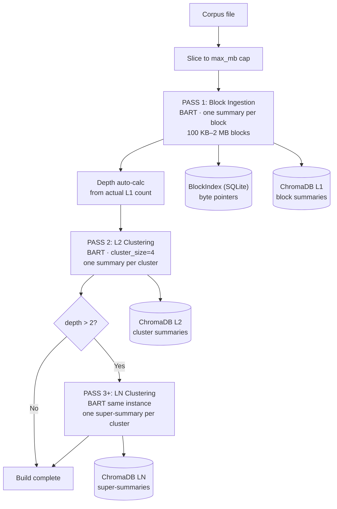
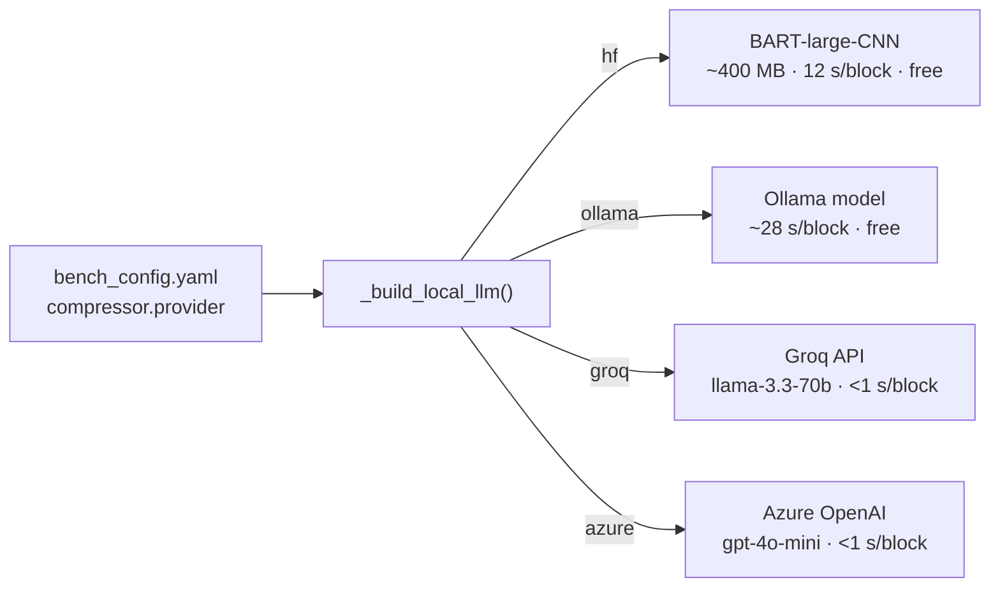
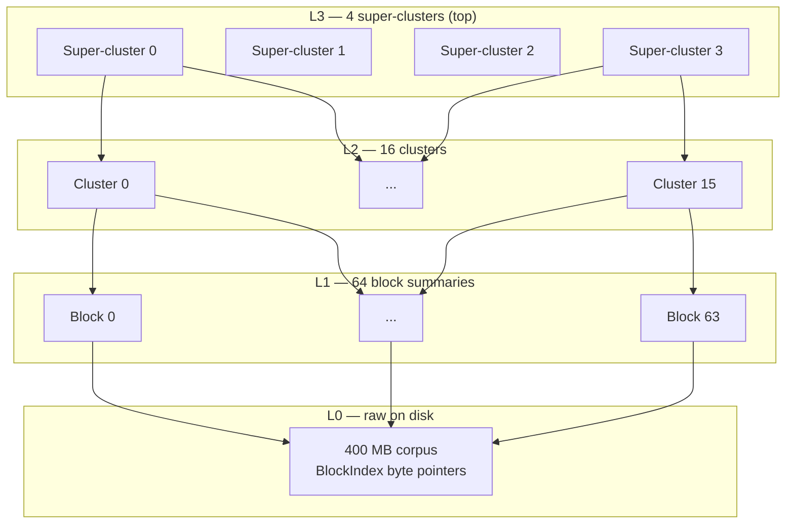
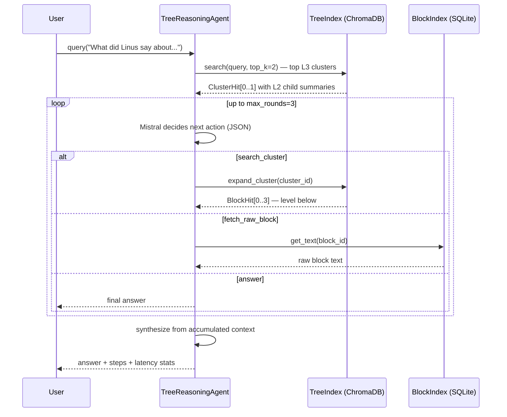
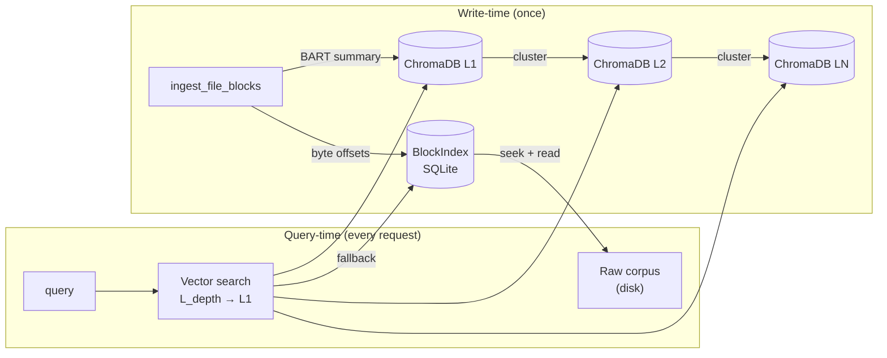

so the# Context Optimizer: Architecture & Design

> **Canonical reference** for the Context Optimizer system.
> Related: [Benchmark results](../benchmarks/experiment_results.md)

---

## Table of Contents

- [Table of Contents](#table-of-contents)
- [1. System Overview](#1-system-overview)
  - [Key results (July 2026, 400 MB corpus)](#key-results-july-2026-400-mb-corpus)
- [2. Production Readiness Assessment](#2-production-readiness-assessment)
  - [Ready](#ready)
  - [Not yet production-ready](#not-yet-production-ready)
- [3. Design Decisions and Trade-offs](#3-design-decisions-and-trade-offs)
  - [D1 — BART vs Ollama for compression](#d1--bart-vs-ollama-for-compression)
  - [D2 — Fixed-size byte blocks vs AST-aware chunking](#d2--fixed-size-byte-blocks-vs-ast-aware-chunking)
  - [D3 — `cluster_size=4` as the accuracy knob](#d3--cluster_size4-as-the-accuracy-knob)
  - [D4 — Depth auto-calculated after Pass 1](#d4--depth-auto-calculated-after-pass-1)
  - [D5 — Single model instance for all passes](#d5--single-model-instance-for-all-passes)
- [4. Ingestion Pipeline](#4-ingestion-pipeline)
- [5. Compressor Models](#5-compressor-models)
- [6. Tree-of-Summaries Index](#6-tree-of-summaries-index)
- [7. Auto-Depth Formula](#7-auto-depth-formula)
- [8. Query and Reasoning Flow](#8-query-and-reasoning-flow)
  - [Reasoning gap (400 MB run)](#reasoning-gap-400-mb-run)
- [9. Storage Architecture](#9-storage-architecture)
- [10. Benchmark Results](#10-benchmark-results)
  - [July 8, 2026 — 400 MB enwik9 (primary production-scale test)](#july-8-2026--400-mb-enwik9-primary-production-scale-test)
  - [June 23, 2026 — Compressed architecture (Pride \& Prejudice)](#june-23-2026--compressed-architecture-pride--prejudice)
- [11. Implementation Map](#11-implementation-map)

---

## 1. System Overview

Context Optimizer is a **token-efficient hierarchical RAG pipeline** built for
large-corpus retrieval on CPU-only hardware with no cloud API dependency.

**Core insight:** compress a corpus *once at write-time* into a multi-level tree of
summaries, then answer queries by having an LLM reasoning agent navigate the tree
rather than doing brute-force cosine search over every chunk.

### Key results (July 2026, 400 MB corpus)

| Metric | Vanilla RAG | Tree-of-Summaries | Delta |
|---|---|---|---|
| Retrieval recall | 53.4% | **58.3%** | +4.9 pp |
| Tokens / query | 2,594 | **404** | -84% |
| Index size | 258 MB | **3.0 MB** | -98.8% |
| GPU required | No | No | CPU-only |

---

## 2. Production Readiness Assessment

### Ready

| Component | Evidence |
|---|---|
| Core algorithm | Beats vanilla RAG recall at 400 MB scale |
| Persistent index | `--index-dir` caches across eval runs |
| Swappable models | HF / Ollama / Groq / Azure via `bench_config.yaml` |
| CPU-only operation | AMD Zen 3, 8-core, 64 GB RAM, no GPU |

### Not yet production-ready

| Gap | Impact | Path |
|---|---|---|
| Single-threaded ingestion | ~12 s/block on CPU | Thread pool per format (see PLAN.md) |
| Embedded ChromaDB | No horizontal scaling | Migrate to ChromaDB Cloud or Qdrant |
| No API layer | CLI only | FastAPI wrapper |
| No auth/authz | Unprotected | Bearer-token middleware |
| No observability | No metrics/traces | OpenTelemetry |
| `.txt` only | Blocks enterprise adoption | Multi-format plan in PLAN.md |
| Local Ollama for reasoning | Not cloud-native | Groq/Azure already wired in config |

**Verdict:** Algorithm is production-validated. Infrastructure needs ~3-6 weeks of
hardening for enterprise adoption.

---

## 3. Design Decisions and Trade-offs

### D1 — BART vs Ollama for compression

| | BART-large-CNN (chosen) | Ollama llama3.2 |
|---|---|---|
| CPU speed | ~12 s/block | ~28 s/block |
| Memory | ~400 MB | 4-7 GB |
| Portability | No daemon required | Requires Ollama |
| Summary quality | Fluent prose | More structured |

**Decision:** BART for ingestion (fast, low-memory, offline). Mistral/Ollama only at
query time for tree navigation (better instruction following, ~30s latency acceptable).

### D2 — Fixed-size byte blocks vs AST-aware chunking

Fixed-size blocks work universally without a parser. `overlap_pct=10%` compensates
for mid-sentence splits. AST-aware chunking is planned for code and structured data
(see PLAN.md).

### D3 — `cluster_size=4` as the accuracy knob

Smaller cluster_size = more specific summaries = better recall.
Larger cluster_size = shallower tree = fewer build LLM calls.

`cluster_size=4` keeps every tree level uniformly navigable: the top level always
has ~4 entries regardless of corpus size, because depth is derived from the formula:

    depth = ceil(log(n_blocks / cluster_size) / log(cluster_size)) + 1

| cluster_size | 200 blocks | Depth | Total build calls | Top entries |
|---|---|---|---|---|
| 4 | 200 | 4 | 267 | 4 |
| 10 | 200 | 3 | 222 | 2 |

### D4 — Depth auto-calculated after Pass 1

Depth is derived from the **actual** L1 node count after ingestion, not a pre-run
estimate. The tree structure adapts to real corpus density automatically.

### D5 — Single model instance for all passes

The same BART instance runs Pass 1 (L1 blocks), Pass 2 (L2 clusters), and Pass 3+
(LN super-clusters). Avoids reloading ~400 MB across passes and ensures consistent
embedding vocabulary at all tree levels.

---

## 4. Ingestion Pipeline



**Block overlap:** the last 10% of each block is prepended to the next block's input,
so concepts at boundaries appear in both adjacent summaries.

---

## 5. Compressor Models



All providers implement `.invoke(prompt) → response`. Switching requires only a
one-line config change — no code changes.

---

## 6. Tree-of-Summaries Index



Each level is a separate ChromaDB collection. The reasoning agent starts at the top
and navigates down, one level per tool call.

---

## 7. Auto-Depth Formula

Given `n` L1 blocks and `k` = `cluster_size`:

```
depth = max(2, min( ceil(log(n/k) / log(k)) + 1,  4 ))
```

The top level always holds approximately `k` entries — the same branching factor as
every other level, making the tree uniformly navigable.

| Corpus | Blocks | k=4 | Depth | Top entries |
|---|---|---|---|---|
| 18 MB | 37 | 4 | 3 | 3 |
| 100 MB | 200 | 4 | 4 | 4 |
| 400 MB | 800 | 4 | 4 | 13 |
| 1 GB | 2,000 | 4 | 4 | 32 |

`depth=4` cap limits the agent to at most 4 navigation steps to reach a leaf block.

---

## 8. Query and Reasoning Flow



### Reasoning gap (400 MB run)

| Strategy | Retrieval | Reasoning | Gap | Interpretation |
|---|---|---|---|---|
| Flat optimized RAG | 5.2% | 56.4% | -51.2% | Hallucinating — zero context |
| **Tree-of-Summaries** | **58.3%** | **58.3%** | **0%** | Grounded — answers from evidence |

Zero reasoning gap means Mistral answers *exactly* from what the navigator retrieved.

---

## 9. Storage Architecture



The raw corpus is **never duplicated**. Only byte offsets are stored. A 400 MB corpus
produces a 3 MB index. Raw text is read on demand via a single `fseek`.

---

## 10. Benchmark Results

### July 8, 2026 — 400 MB enwik9 (primary production-scale test)

- **Hardware:** AMD Zen 3 8-core / 64 GB RAM / CPU-only
- **Corpus:** enwik9 Wikipedia dump, cleaned — capped at 400 MB
- **Config:** block=2 MB, cluster_size=4, depth=auto (→4), 43 questions
- **Compressor:** BART-large-CNN · **Reasoner:** mistral:7b (Ollama)

| Strategy | Recall | Tokens/q | Latency/q | Index size | Ingestion |
|---|---|---|---|---|---|
| Vanilla RAG (Jul 6) | 53.4% | 2,594 | 18 ms | 258 MB | 224 s |
| Flat optimized RAG | 5.2% | 396 | 9.9 s | 3.5 MB | cached |
| **Tree-of-Summaries** | **58.3%** | **404** | **30.6 s** | **3.0 MB** | 3,784 s |

**Key observations:**
- Tree beats vanilla RAG recall (+4.9 pp) with 84% fewer tokens
- Flat RAG is unusable at 2 MB blocks (5.2%) — too coarse for cosine similarity
- Tree navigation overcomes block coarseness: recall scales independently of block size
- Index is 86x smaller than vanilla ChromaDB
- Ingestion is one-time; eval-only reruns load in seconds

### June 23, 2026 — Compressed architecture (Pride & Prejudice)

91.3% token reduction, 0% quality drop, 49% latency reduction.
Full detail in [experiment_results.md](../benchmarks/experiment_results.md).

---

## 11. Implementation Map

```
src/
  compressor.py       ingest_file_blocks · _build_local_llm · rolling-window compression
  tree_index.py       TreeIndex (N-level) · _auto_tree_depth · build_from_chunks · expand_cluster
  tree_reasoner.py    TreeReasoningAgent · tool-calling loop (search_cluster / fetch_raw_block)
  raw_index.py        BlockIndex (SQLite) · byte-offset file pointers
  cached_retriever.py CachedChromaRetriever · semantic cache · parent-child retrieval
  providers/
    hf_summarizer.py  HFSummarizerLLM — BART/T5 via transformers 5.x (no pipeline API)

benchmarks/
  corpus_benchmark.py  Main runner: build indexes + evaluate + write report
  bench_config.yaml    All config: compressor/reasoning model, paths, block params
  data/index/          Persistent indexes (skip rebuild on re-run via --eval-only)

docs/
  design/ARCHITECTURE.md         This file
  benchmarks/experiment_results.md  Detailed experiment log
  PLAN.md                        Roadmap: multi-format ingestion + codebase search
```
