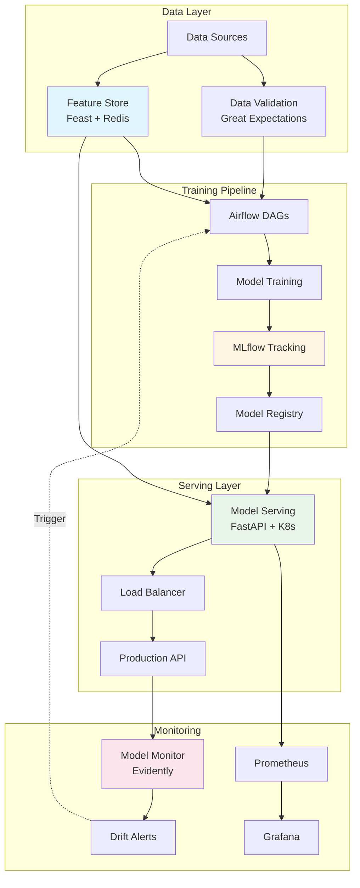

# Exercise 06: MLOps Infrastructure — Production ML Deployment Platform

> **Grand Challenge:** Build a production-grade ML infrastructure demonstrating MLOps patterns: experiment tracking, feature store, model registry, automated pipelines, monitoring, and scalable serving.

**Scaffolding Level:** 🟡 Medium (infrastructure patterns provided)

---

## Objective

Implement a complete AI infrastructure platform with production deployment patterns:
- MLflow for experiment tracking and model registry
- Feast for online/offline feature store
- Airflow for workflow orchestration
- Great Expectations for data validation
- Evidently for model monitoring and drift detection
- Kubernetes for scalable serving
- CI/CD pipelines (GitHub Actions, Jenkins)
- Terraform for infrastructure as code

---

## What You'll Learn

- **MLOps Architecture**: Complete production ML infrastructure design
- **Experiment Tracking**: MLflow tracking server, artifact storage, model registry
- **Feature Engineering**: Online/offline feature store with Feast
- **Data Quality**: Validation pipelines with Great Expectations
- **Model Monitoring**: Drift detection and alerting with Evidently
- **Container Orchestration**: Kubernetes deployments, services, autoscaling
- **Infrastructure as Code**: Terraform for cloud resources
- **CI/CD**: Automated testing, building, and deployment pipelines
- **Observability**: Prometheus metrics, Grafana dashboards, alerting

---

## Infrastructure Architecture



---

## Component Overview

### 1. **MLflow** - Experiment Tracking & Model Registry
- Centralized experiment tracking
- Artifact storage (models, plots, metrics)
- Model versioning and lifecycle management
- Staging → Production promotion workflow

### 2. **Feast** - Feature Store
- Online serving (Redis) for low-latency prediction
- Offline storage (Parquet) for training
- Point-in-time correctness for temporal features
- Feature materialization pipelines

### 3. **Airflow** - Workflow Orchestration
- Training pipeline DAG (daily scheduled)
- Drift monitoring DAG (every 6 hours)
- Automated retraining on drift detection
- Data validation checkpoints

### 4. **Great Expectations** - Data Validation
- Expectation suites for input data
- Automated validation checkpoints
- Data quality reports
- Fail-fast on anomalies

### 5. **Evidently** - Model Monitoring
- Data drift detection
- Target/prediction drift
- Model performance degradation
- Automated alerting

### 6. **Kubernetes** - Container Orchestration
- Horizontal pod autoscaling (HPA)
- Rolling updates with zero downtime
- Resource limits and quotas
- Service mesh integration

### 7. **Terraform** - Infrastructure as Code
- EKS cluster provisioning
- S3 artifact storage
- RDS for metadata
- ElastiCache for feature store

---

## Setup

**Unix/macOS/WSL:**
```bash
chmod +x setup.sh
./setup.sh
source venv/bin/activate
```

**Windows PowerShell:**
```powershell
Set-ExecutionPolicy -Scope Process -ExecutionPolicy RemoteSigned
.\setup.ps1
.\venv\Scripts\Activate.ps1
```

### Quick Start with Docker Compose

```bash
# Start all infrastructure services
make docker-compose-up

# Wait for services to initialize (~2 minutes)
# Access services:
# - MLflow UI: http://localhost:5000
# - Airflow UI: http://localhost:8080 (admin/admin)
# - Model API: http://localhost:8000
# - Prometheus: http://localhost:9090
# - Grafana: http://localhost:3000 (admin/admin)

# Check service health
make health-check

# Run example training pipeline
python -c "from src.mlflow_setup import MLflowManager; m = MLflowManager(); print('MLflow ready')"

# Stop all services
make docker-compose-down
```

---

## Deployment Guide

### Stage 1: Local Docker Development

```bash
# 1. Start infrastructure
docker-compose up -d

# 2. Initialize Airflow
make airflow-init

# 3. Trigger training pipeline
# Visit http://localhost:8080, enable and trigger 'ml_training_pipeline' DAG

# 4. Test model serving
curl -X POST http://localhost:8000/predict \
  -H "Content-Type: application/json" \
  -d '{"features": [[1.0, 2.0, 3.0, 4.0, 5.0, 6.0, 7.0, 8.0]]}'

# 5. Monitor drift
# Trigger 'drift_monitoring' DAG in Airflow UI
```

### Stage 2: Kubernetes Deployment

```bash
# 1. Create namespace
kubectl create namespace ml-production

# 2. Apply configuration
kubectl apply -f k8s/configmap.yaml
kubectl apply -f k8s/secret.yaml  # Update with real secrets first!

# 3. Deploy application
kubectl apply -f k8s/deployment.yaml
kubectl apply -f k8s/service.yaml
kubectl apply -f k8s/hpa.yaml

# 4. Verify deployment
kubectl get pods -n ml-production
kubectl get svc -n ml-production

# 5. Test autoscaling
make load-test  # Trigger HPA scaling
kubectl get hpa -n ml-production -w
```

### Stage 3: Cloud Deployment (AWS)

```bash
# 1. Configure AWS credentials
export AWS_ACCESS_KEY_ID=your_key
export AWS_SECRET_ACCESS_KEY=your_secret
export TF_VAR_account_id=your_account_id
export TF_VAR_db_password=secure_password

# 2. Initialize Terraform
make terraform-init

# 3. Review infrastructure plan
make terraform-plan

# 4. Provision infrastructure
make terraform-apply

# 5. Configure kubectl
aws eks update-kubeconfig --region us-west-2 --name production-ml-cluster

# 6. Deploy to EKS
kubectl apply -f k8s/ --namespace=ml-production
```

---

## CI/CD Pipeline

### GitHub Actions Workflow

```yaml
# Automated on every push to main/develop:
1. Run tests with coverage (pytest)
2. Lint code (black, flake8)
3. Build Docker image
4. Push to registry
5. Deploy to staging (develop branch)
6. Deploy to production (main branch, with approval)
7. Run smoke tests
8. Run load tests
```

### Jenkins Pipeline

```groovy
# Alternative CI/CD with Jenkins:
1. Checkout code
2. Setup Python environment
3. Run linting and tests
4. Build Docker image
5. Deploy to staging (automatic)
6. Deploy to production (manual approval)
7. Smoke tests
```

**Trigger Pipeline:**
```bash
# Push to main for production
git push origin main

# Push to develop for staging
git push origin develop
```

---

## Component Usage

### MLflow: Track Experiments

```python
from src.mlflow_setup import MLflowManager

manager = MLflowManager()

# Log a training run
run_id = manager.log_model_run(
    model=trained_model,
    params={"n_estimators": 100},
    metrics={"test_r2": 0.92},
    model_name="production_model"
)

# Register model
version = manager.register_model(
    model_uri=f"runs:/{run_id}/production_model",
    model_name="production_model"
)

# Promote to production
manager.promote_model_to_production("production_model", version)
```

### Feast: Feature Store

```python
from src.feature_store import FeatureStoreManager

fs = FeatureStoreManager()

# Materialize features
fs.materialize_features(
    start_date="2024-01-01",
    end_date="2024-04-28"
)

# Get online features for prediction
features = fs.get_online_features(
    entity_rows=[{"property_id": 123}],
    feature_refs=["property_features:square_feet", "property_features:location_score"]
)
```

### Great Expectations: Data Validation

```python
from src.data_validation import DataValidator

validator = DataValidator()

# Create validation suite
validator.create_default_suite("production_suite")

# Validate incoming data
results = validator.validate_dataframe(df, "production_suite")

if not results['success']:
    raise ValueError("Data validation failed!")
```

### Evidently: Drift Detection

```python
from src.model_monitoring import ModelMonitor

monitor = ModelMonitor()

# Detect data drift
drift_results = monitor.detect_data_drift(
    reference_data=training_data,
    current_data=production_data
)

if drift_results['drift_detected']:
    print("⚠️ Drift detected! Triggering retraining...")
```

### Model Serving API

```bash
# Health check
curl http://localhost:8000/health

# Prediction
curl -X POST http://localhost:8000/predict \
  -H "Content-Type: application/json" \
  -d '{
    "features": [[1.0, 2.0, 3.0, 4.0, 5.0, 6.0, 7.0, 8.0]],
    "model_version": "latest"
  }'

# Model info
curl http://localhost:8000/model/info

# Prometheus metrics
curl http://localhost:8000/metrics
```

---

## Monitoring & Observability

### Prometheus Metrics

- `model_predictions_total`: Total prediction count
- `model_prediction_latency_seconds`: Prediction latency histogram
- `model_errors_total`: Error count
- `system_cpu_usage_percent`: System CPU usage
- `system_memory_usage_percent`: Memory usage

### Grafana Dashboards

```bash
# Access Grafana
open http://localhost:3000  # admin/admin

# Import dashboards:
1. Model Serving Dashboard (prediction rate, latency, errors)
2. Infrastructure Dashboard (CPU, memory, pod count)
3. Drift Monitoring Dashboard (drift scores, alert history)
```

### Alerting Rules

```yaml
# Drift detection alert
- Alert if drift_detected == true
- Severity: Warning
- Action: Trigger retraining pipeline

# High error rate alert
- Alert if error_rate > 5%
- Severity: Critical
- Action: Notify on-call engineer

# High latency alert
- Alert if p99_latency > 100ms
- Severity: Warning
- Action: Scale up pods
```

---

## Testing

```bash
# Run all tests
make test

# Run specific test module
pytest tests/test_serving.py -v

# Run with coverage report
pytest tests/ --cov=src --cov-report=html
open htmlcov/index.html

# Run load tests
make load-test
```

---

## Success Criteria

✅ **Infrastructure Components:**
- [ ] MLflow server running and tracking experiments
- [ ] Airflow DAGs executing successfully
- [ ] Feature store materializing features
- [ ] Data validation passing on test data
- [ ] Drift detection identifying distribution changes

✅ **Deployment:**
- [ ] Docker Compose brings up all services
- [ ] Kubernetes deployment successful with 3 replicas
- [ ] Horizontal pod autoscaler responding to load
- [ ] Rolling updates complete without downtime

✅ **CI/CD:**
- [ ] GitHub Actions pipeline passing all stages
- [ ] Docker image building and pushing to registry
- [ ] Automated deployment to staging on develop branch
- [ ] Manual approval gate for production deployment

✅ **Monitoring:**
- [ ] Prometheus scraping metrics from all services
- [ ] Grafana dashboards displaying real-time metrics
- [ ] Drift alerts triggering on anomalous data
- [ ] Load tests showing <100ms p99 latency

✅ **Operational:**
- [ ] Health checks responding correctly
- [ ] Logs aggregated and searchable
- [ ] Secrets managed securely (not in code)
- [ ] Infrastructure reproducible via Terraform

---

## Troubleshooting

### MLflow not starting
```bash
# Check database connection
docker-compose logs mlflow postgres

# Reset database
docker-compose down -v
docker-compose up -d
```

### Airflow DAGs not appearing
```bash
# Check DAG folder
docker-compose exec airflow ls /opt/airflow/dags

# Check Airflow logs
docker-compose logs airflow
```

### Kubernetes pod not starting
```bash
# Check pod status
kubectl describe pod <pod-name> -n ml-production

# Check logs
kubectl logs <pod-name> -n ml-production

# Check events
kubectl get events -n ml-production --sort-by='.lastTimestamp'
```

### Load tests failing
```bash
# Verify model serving is ready
curl http://localhost:8000/ready

# Check resource limits
kubectl top pods -n ml-production

# Scale manually if needed
kubectl scale deployment ml-model-serving --replicas=5 -n ml-production
```

---

## Project Structure

```
06-ai_infrastructure/
├── src/
│   ├── __init__.py           # Package initialization
│   ├── utils.py              # Logging, config, helpers
│   ├── mlflow_setup.py       # MLflow manager
│   ├── feature_store.py      # Feast feature store
│   ├── data_validation.py    # Great Expectations
│   ├── model_monitoring.py   # Evidently drift detection
│   ├── serving.py            # FastAPI model serving
│   ├── load_test.py          # Locust load testing
│   ├── api.py                # Infrastructure API
│   └── dags/                 # Airflow DAGs
│       ├── training_pipeline.py
│       ├── drift_monitoring.py
│       └── retraining_pipeline.py
├── tests/
│   ├── conftest.py           # Pytest configuration
│   ├── test_feature_store.py
│   ├── test_data_validation.py
│   ├── test_model_monitoring.py
│   └── test_serving.py
├── k8s/
│   ├── deployment.yaml       # Kubernetes deployment
│   ├── service.yaml          # Load balancer service
│   ├── hpa.yaml              # Horizontal pod autoscaler
│   ├── configmap.yaml        # Configuration
│   ├── secret.yaml           # Secrets template
│   └── prometheus.yaml       # ServiceMonitor
├── terraform/
│   ├── main.tf               # Infrastructure definition
│   ├── variables.tf          # Input variables
│   └── outputs.tf            # Output values
├── ci/
│   ├── .github/workflows/ci.yml  # GitHub Actions
│   ├── Jenkinsfile           # Jenkins pipeline
│   └── test-and-deploy.sh    # Deployment script
├── monitoring/
│   └── prometheus.yml        # Prometheus configuration
├── docs/
│   └── README.md             # Additional documentation
├── config.yaml               # Application configuration
├── requirements.txt          # Python dependencies
├── Dockerfile                # Production container
├── docker-compose.yml        # Local development stack
├── Makefile                  # Build automation
├── setup.sh / setup.ps1      # Environment setup
└── README.md                 # This file
```

---

## Additional Resources

- [MLflow Documentation](https://mlflow.org/docs/latest/index.html)
- [Feast Documentation](https://docs.feast.dev/)
- [Great Expectations](https://docs.greatexpectations.io/)
- [Evidently AI](https://docs.evidentlyai.com/)
- [Kubernetes Best Practices](https://kubernetes.io/docs/concepts/)
- [Terraform AWS Provider](https://registry.terraform.io/providers/hashicorp/aws/latest/docs)

---

## Next Steps

1. **Extend Feature Store**: Add more feature sets (customer, product, etc.)
2. **Advanced Monitoring**: Implement custom metrics and dashboards
3. **Multi-Model Serving**: Support A/B testing and shadow deployments
4. **Cost Optimization**: Implement spot instances and autoscaling policies
5. **Security Hardening**: Add RBAC, network policies, secrets rotation
6. **Disaster Recovery**: Implement backup/restore procedures
7. **Multi-Region**: Deploy across multiple availability zones
8. **Observability**: Integrate distributed tracing (Jaeger/Zipkin)

---

## Resources

**Concept Review:**
- [notes/06-ai_infrastructure/](../../notes/06-ai_infrastructure/)

**Infrastructure Components:**
- MLflow: Experiment tracking and model registry
- Airflow: Workflow orchestration and automation
- Feast: Feature store for online/offline serving
- Great Expectations: Data validation and quality
- Evidently: Model monitoring and drift detection
- Kubernetes: Container orchestration and scaling
- Terraform: Infrastructure as code

---

**Status:** Phase 3 - Production Infrastructure Complete  
**Last Updated:** April 28, 2026

**Built with production-grade MLOps patterns for scalable, observable, and maintainable ML systems.**
