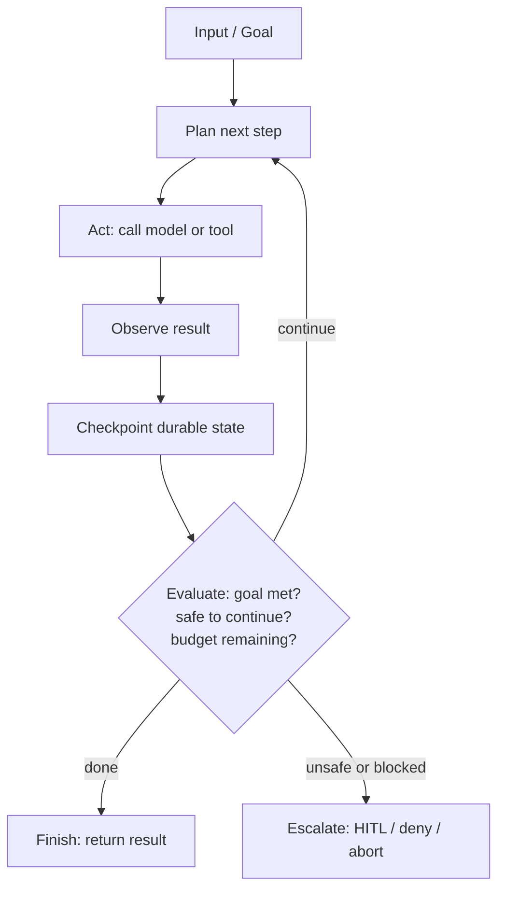
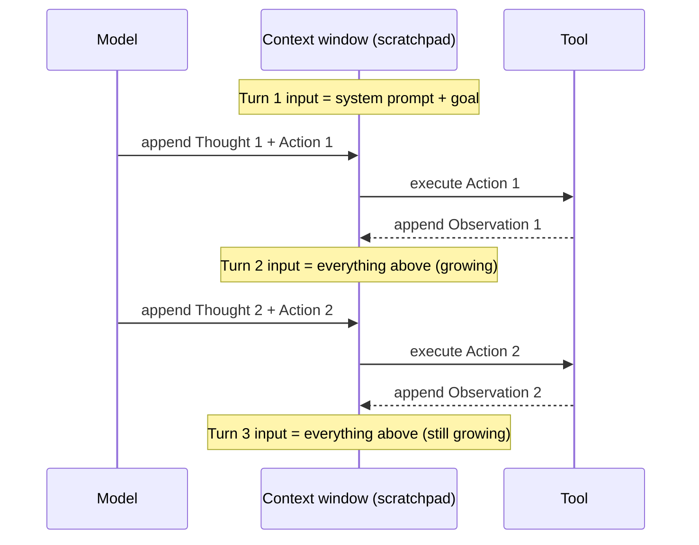
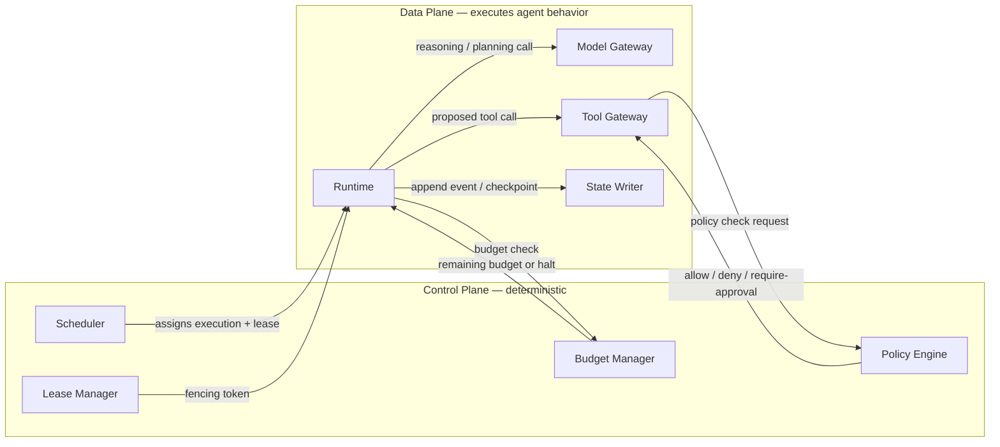

# Foundations of Agentic Systems

> Part of the [Agentic AI Platform — System Design](system-design.md) track. This doc answers
> the "what actually *is* different here?" question before any of the sibling docs get into
> specific planes. Read this first if you haven't read the uber doc yet — the plane
> terminology (Ingress / Admission / Control / Runtime / Model Gateway / Tool Gateway / State /
> Memory / Observability / Evaluation / Recovery / Governance) is defined there.

## 1 · Problem statement

Production agentic infrastructure is hard for one specific reason: it combines **probabilistic
model behavior** with **deterministic distributed-systems guarantees**, and most teams already
know how to build the second half and have no established playbook for the first.

A normal backend service is built on a contract: given input `X`, the service returns `Y`, and
if it doesn't, that's a bug you can reproduce and fix. An agent is built on a model that reasons
about what to do next, and that reasoning is not guaranteed to be the same twice, not guaranteed
to be safe, and not guaranteed to terminate. Yao et al.'s **ReAct** paper
(<https://arxiv.org/abs/2210.03629>) is the paper most interviewers implicitly expect you to
know here — it demonstrated that an LLM can interleave *reasoning traces* ("I should check the
user's order status") with *task-specific actions* ("call `get_order(id)`"), and use the
observation from that action to revise the next reasoning step. That single idea — reasoning
and acting in the same loop, grounded by real tool observations — is what turned the LLM from
"a thing that generates text" into **a decision participant embedded inside your distributed
system**. Once the model is a decision participant, every downstream design question in this
track follows from one tension:

> The model is the only component in the system that can decide *what* to do next — but it
> must never be the component that decides *whether* it's allowed to do it.

Everything in this document, and this whole track, exists to resolve that tension without
re-explaining queues, replication, or consensus — assume you already know those. What you don't
already have a playbook for is: how do you put a non-deterministic planner in the middle of a
system that still needs bounded cost, bounded latency, auditability, and safety?

## 2 · What makes a system "agentic" (vs. a workflow)

This is the single most common opening interview question in this track, and it's worth being
precise about it.

A **workflow engine** (Step Functions, Temporal-as-DAG, Airflow, a BPMN engine) executes a
**predefined graph of nodes**. The transition table is fixed at design time: node A always goes
to node B on success and node C on failure. The engine's job is to execute that fixed table
reliably — retries, timeouts, compensation — but it never has to decide *which* edge to take
based on the meaning of the data flowing through it.

An **agent** does not have a fixed transition table. At each step it may:

- **Plan** — decide what sub-goal to pursue next, given the current state and conversation.
- **Call a tool** — invoke a registered capability whose result is not knowable in advance.
- **Observe** — read back a tool result or new context and let it change the plan.
- **Revise the plan** — abandon or reorder previously chosen steps.
- **Ask for approval** — pause and require a human or policy decision before continuing.
- **Terminate** — decide the goal is met, unreachable, or unsafe to continue.

The defining property is: **the next step is chosen by a model at runtime, not by a fixed graph
authored at design time.** A workflow's control flow is data (a DAG you can diff in version
control). An agent's control flow is an emergent property of a model's output on that specific
run. This is exactly why every other doc in this track exists — you cannot apply "just retry the
node" thinking to a system whose next node is decided by an LLM.

| | Workflow engine | Agent |
|---|---|---|
| Control flow | Fixed graph, authored at design time | Chosen at runtime by the model |
| Reproducibility | Same input → same path | Same input → *plausibly* different path |
| Failure mode | Node failure, timeout | Hallucinated step, infinite loop, unsafe tool call |
| Where authority lives | Implicit in the graph | Must be added explicitly (policy engine, tool gateway) |
| What you review pre-prod | The graph definition | The graph *and* the model's behavior across many samples |

## 3 · The Determinism Spectrum

Every system you'll be asked to compare against an agent sits somewhere on a spectrum from
"fully deterministic" to "fully emergent." Knowing where a design sits — and naming the failure
mode that dominates at that point on the spectrum — is a fast way to demonstrate judgment.

| System | Determinism | Typical dominant failure mode |
|---|---|---|
| RPC service | High | Contract mismatch (schema drift, breaking change) |
| Workflow engine | High–medium | Failed step, retry storm, poison message |
| Rules automation (business rules engine) | Medium | Rule explosion, rule conflict, unmaintainable rule graph |
| Single LLM agent | Medium–low | Hallucination, infinite tool loop, unsafe/unauthorized tool call |
| Multi-agent system | Low | Emergent coordination failure (deadlock, contradicting plans, runaway delegation) |

Notice the shape of the failure mode *changes character*, not just severity, as you move down
the table. An RPC service fails at the edges of a contract. An agent fails in the *meaning* of
what it decided to do. A multi-agent system fails in the *interaction* between two reasoning
processes that each behaved "reasonably" in isolation. See
[09 — Multi-Agent Communication Patterns](09-multi-agent-communication-patterns.md) for the
coordination-failure modes specifically, and
[06 — Non-Determinism, Loops & Termination](06-non-determinism-loops-and-termination.md) for how
you bound the single-agent failure modes.

#### How It Actually Works: Sampling, Constrained Decoding, and the Open-Ended Loop

"Non-deterministic" isn't a vibe — at each point on the spectrum above, a different concrete
mechanism is doing the narrowing (or widening) of what the system can produce next:

- **Fixed pipeline / workflow (high determinism):** the next node is a lookup in a transition
  table. No model call decides control flow — the DAG *is* the control flow, so the same input
  walks the same edges every time. There's no sampling involved in choosing *what happens next*
  at all.
- **Sampling temperature / top-p (the dial underneath every model call):** at each decode step
  the model produces a probability distribution over the next token. **Temperature** rescales the
  logits before the softmax — temperature → 0 collapses the distribution toward greedy/argmax
  (always the single highest-probability token), while temperature > 1 flattens the distribution,
  making lower-probability tokens more likely to be sampled. **Top-p (nucleus sampling)**
  truncates the distribution to the smallest set of tokens whose cumulative probability exceeds
  `p`, then samples only from that reduced set — see Holtzman et al. (Further Reading) for why
  this beats plain top-k. These two knobs govern token-level randomness regardless of what's
  built on top of them.
- **Constrained / grammar-guided decoding (narrows the distribution, doesn't eliminate
  choice):** for JSON-schema-constrained function calling, the decoder intersects the model's
  candidate token list with "tokens that keep the output grammatically valid against the schema"
  at every step — so a malformed function-call payload becomes structurally impossible. This
  eliminates a whole class of parsing failures, but it does **not** make the *content*
  deterministic: the model still freely chooses which tool to call and what values to fill in, it
  just can't produce syntactically invalid JSON while doing it.
- **Full agentic (ReAct-style) loop (low determinism):** none of the above bound *which tool gets
  called, how many times, or in what order*. The model decides at each iteration whether to call
  a tool at all, which one, and whether the goal is met — that decision sequence is not fixed at
  authoring time the way a workflow's edges are. This is the actual mechanical reason "the next
  step is chosen by the model" (Section 2) is true here and not for constrained decoding alone —
  constraining the *shape* of one call is a different thing from constraining the *sequence* of
  calls.

## 4 · The basic agent lifecycle

Every agent — regardless of framework — traces some version of this loop. Memorize this shape;
it's the skeleton every other diagram in this track builds on.

Three details in this diagram are easy to skip past and are exactly what interviewers probe on:

1. **`Checkpoint` happens every iteration, not just at the end.** If the runtime process dies
   between `Observe` and the next `Plan`, durable state must already reflect what happened — see
   [05 — State Management & Memory](05-state-management-and-memory.md).
2. **`Evaluate` is a gate, not an afterthought.** It's where budget checks (time/token/step/cost),
   safety checks, and goal-completion checks all live *before* the loop is allowed to continue.
3. **`Escalate` is a first-class exit, not an error path.** A system that can only "succeed" or
   "crash" will eventually let an agent do something unsafe because there was no bounded way to
   pause and ask.

#### Internals: How Thought → Action → Observation Actually Gets Encoded

A ReAct-style loop doesn't give the model a separate persistent "memory" of its own reasoning —
the context window *is* the memory across iterations. Concretely, on iteration *k* the prompt
sent to the model contains the system prompt, the original goal, and the full transcript of every
prior `Thought / Action / Observation` block from iterations `1..k-1`, appended as plain text (a
"scratchpad"). The model conditions on that entire growing transcript to produce iteration *k*'s
`Thought` (free-text reasoning) and `Action` (the tool call, historically also free text that a
parser then has to extract a tool name and arguments from). The tool executes, and its result is
appended back into the transcript as `Observation`, which becomes part of the input for iteration
*k+1*.

The direct consequence: **every iteration re-sends the entire prior transcript as input tokens**,
so per-step latency and cost grow with the number of steps already taken, not just with the size
of the current step — a 10-step run's final iteration pays for re-processing roughly all 9 prior
Thought/Action/Observation blocks as input, every single turn. This is the mechanical reason step
budgets (see [06 — Non-Determinism, Loops & Termination](06-non-determinism-loops-and-termination.md))
are a cost control, not just a safety control.

**The alternative is a function-calling API**, where instead of emitting free-text that a parser
must extract a tool name and arguments from, the model emits a structured call (name + JSON
arguments) directly, validated against the constrained decoding described above. **Pros:** no
brittle free-text parsing, so a large class of "the model almost called the right tool but the
parser choked on it" failures disappears. **Cons:** the natural-language reasoning that would
have appeared in a `Thought` block is no longer necessarily present in the model's output — you
lose the visible "why did it decide this" trace unless you explicitly ask the model to also emit
a reasoning/rationale field alongside the structured call, which makes debugging a wrong tool
choice harder than with a transcript you can just read.

> **Trade-offs — workflow/DAG vs. bounded agentic loop vs. fully open-ended agent**
>
> | | Workflow / DAG | Bounded agentic loop (fixed step budget) | Fully open-ended agent |
> |---|---|---|---|
> | Handles unanticipated branches | No — only pre-authored edges | Yes, within the step budget | Yes, unconstrained |
> | Cheap to test exhaustively | Yes — finite graph, enumerable paths | No — needs representative sampling + eval gates ([07](07-agent-evaluation-frameworks.md)) | No — effectively untestable exhaustively |
> | Needs runtime guardrails | Minimal (retries/timeouts) | Yes — loop/budget/safety guardrails ([06](06-non-determinism-loops-and-termination.md), [11](11-governance-guardrails-and-security.md)) | Yes, and more of them, with less certainty they're sufficient |
> | Production justification | Default whenever the task is enumerable | Justified when branches are genuinely unpredictable but must stay bounded | Rarely justified — least predictable, least auditable, hardest to bound cost/safety |

## 5 · Control plane vs. data plane

The uber doc's master architecture diagram spells out every plane; this is the compressed
two-bucket view that matters specifically for *this* doc's argument — deterministic
infrastructure (control) governs non-deterministic execution (data).

Read the arrows as a rule, not just a picture: **the data plane never grants itself authority.**
`Runtime` cannot decide a tool call is allowed — it must ask `ToolGateway`, which asks
`PolicyEngine`. `Runtime` cannot decide it has budget left — it must ask `BudgetManager`.
`Runtime` cannot decide it owns the execution — it must hold a valid lease + fencing token from
`LeaseManager` (mechanics covered in
[02 — Agent Lifecycle & Runtime](02-agent-lifecycle-and-runtime.md)). Every one of those arrows
is a place where, if you removed it, the model would be making a decision it should never be
trusted to make alone.

> **Naming note:** this diagram draws `BudgetManager` as its own box for clarity in a
> control-vs-data-plane argument. The [uber doc's master architecture](system-design.md#2--master-architecture)
> folds the same responsibility into the `PolicyEngine + Budget Manager` node — they're the same
> control-plane responsibility, split apart here only to make "the data plane asks two different
> questions (allowed? affordable?)" visually explicit; don't read this as two competing designs.

## 6 · Core invariants

These four sentences are the ones to say out loud in an interview, in order, before you start
drawing boxes:

1. **The model proposes intent; deterministic infrastructure grants authority.** No tool call,
   write, or side effect executes because the model said so — it executes because a policy
   engine said so.
2. **Every mutating operation must be policy-checked.** "Mutating" includes anything that
   changes state outside the agent's own scratchpad: writes, sends, deletes, financial
   transactions, external API calls with side effects.
3. **Every meaningful transition must be observable and replayable.** If you can't reconstruct
   *why* the agent did something after the fact, you cannot debug it, audit it, or trust it in a
   regulated environment. See [08 — Observability, Tracing & Health](08-observability-tracing-and-health.md).
4. **Progress must be externally bounded.** Time, token, step, and cost budgets are enforced by
   infrastructure outside the model's control — never "the model should know when to stop." See
   [06 — Non-Determinism, Loops & Termination](06-non-determinism-loops-and-termination.md).

## 7 · Failure modes unique to agentic systems

This is the list to have ready when asked "what can go wrong that wouldn't go wrong in a normal
service?" — each one is a direct consequence of putting a probabilistic planner in the loop.

| Failure mode | Why it's agent-specific | Where it's solved |
|---|---|---|
| Tool over-permission | A tool registered with broader scope than the agent's task needs, exploited by an unexpected plan | [03 — Tool, MCP & Skill Registry](03-tool-mcp-and-skill-registry.md), [11 — Governance, Guardrails & Security](11-governance-guardrails-and-security.md) |
| Prompt injection through retrieved content | Untrusted tool/document content re-enters the model's context and is treated as instructions | [11 — Governance, Guardrails & Security](11-governance-guardrails-and-security.md) |
| State loss after runtime crash | Runtime process memory mistaken for the source of truth | [05 — State Management & Memory](05-state-management-and-memory.md) |
| Infinite tool loop | No structural/semantic loop detection, only "the model should notice" | [06 — Non-Determinism, Loops & Termination](06-non-determinism-loops-and-termination.md) |
| Unbounded cost | No token/time/cost budget enforced independently of the model | [06 — Non-Determinism, Loops & Termination](06-non-determinism-loops-and-termination.md) |
| Missing audit evidence | Model decisions not correlated to policy decisions and tool outcomes | [11 — Governance, Guardrails & Security](11-governance-guardrails-and-security.md) |
| Cross-tenant memory leakage | Shared vector store / long-term memory without tenant partitioning | [05 — State Management & Memory](05-state-management-and-memory.md), [12 — Production Scale & Capacity](12-production-scale-and-capacity.md) |

## 8 · Enterprise vs. startup recommendation

**Enterprise recommendation:** build the full control-plane split from Section 5 — dedicated
scheduler, lease manager with fencing tokens, policy engine independent of the runtime, budget
manager enforced pre- and mid-execution, immutable audit store, and continuous evaluation gates
on every agent version. This is justified when you have multiple tenants, regulated data, or
tool calls with real financial/operational consequences.

**Startup recommendation:** don't build the full control plane on day one — build the smallest
thing that still respects the invariants in Section 6. Concretely: **one API service, one
queue, one worker pool, one database, structured logs (not full distributed tracing yet), hard
step limits (e.g. max 10 steps), and manual approval required for every write tool.** You are
still enforcing "model proposes, infrastructure decides" — you're just doing it with a
config flag and an `if` statement instead of a standalone policy engine. Reach for the
enterprise version once you have evidence you need it (multiple tenants, audit requirements,
tool calls with real consequences at volume) — not before. Naming this tradeoff explicitly in an
interview signals judgment more than reciting the full enterprise diagram does.

## 9 · Interview questions

1. **How is an agent different from a workflow?** — A workflow executes a fixed transition
   table authored at design time; an agent's next step is chosen by a model at runtime based on
   the meaning of the current state, which is why it needs external bounding (budgets, policy,
   loop detection) that a workflow doesn't.
2. **Why is a control plane necessary at all — why not let the runtime handle everything?**
   — Because the runtime executes agent behavior, and agent behavior is driven by a
   non-deterministic model. If the same component both executes and authorizes, there's nothing
   stopping a bad plan from becoming a bad side effect. The control plane is the deterministic
   layer that can say no.
3. **What should be deterministic in an agent platform, and what's allowed to be
   non-deterministic?** — The model's reasoning/planning is allowed to be non-deterministic.
   Scheduling, leasing, policy decisions, budget enforcement, state persistence, and audit
   logging must all be deterministic and reproducible.
4. **What state must be persisted to allow replay of an agent run?** — At minimum: the input,
   every plan/reasoning step, every tool call and its result, every policy decision, every
   checkpoint, the model/prompt/tool versions in effect, and the final output. See
   [05 — State Management & Memory](05-state-management-and-memory.md) for the full model.
5. **Where do you enforce safety — in the prompt, the runtime, or the tool gateway?** — All
   three, but only one of them is trustworthy on its own: the tool gateway. Prompt-level
   instructions ("don't do X") are best-effort and bypassable by injection; the runtime enforces
   structural bounds (steps/budget); the tool gateway is the only place with the authority and
   context to make an allow/deny decision that actually blocks a side effect.

## Quick Revision Notes

- Agentic ≠ workflow: the *next step* is chosen by a model, not a fixed transition table.
- ReAct (Yao et al., <https://arxiv.org/abs/2210.03629>) is the paper reference for "reasoning +
  acting in one loop, grounded by observations."
- Determinism Spectrum: RPC (high) → Workflow (high-med) → Rules engine (med) → Single agent
  (med-low) → Multi-agent (low). Failure mode *character* changes as determinism drops.
- Agent lifecycle skeleton: Input → Plan → Act → Observe → Checkpoint → Evaluate → (loop | Finish
  | Escalate).
- Control plane (Scheduler, LeaseManager, PolicyEngine, BudgetManager) is deterministic and
  governs the data plane (Runtime, ModelGateway, ToolGateway, StateWriter).
- Four invariants: model proposes / infra authorizes; every mutation is policy-checked; every
  transition is observable + replayable; progress is externally bounded.
- Agent-specific failure modes: tool over-permission, prompt injection via retrieved content,
  state loss on crash, infinite tool loop, unbounded cost, missing audit evidence, cross-tenant
  memory leakage.
- Startup version: one API + one queue + one worker pool + one DB + structured logs + hard step
  limits + manual write approval. Enterprise version adds the full control-plane split.
- Determinism mechanism, concretely: temperature/top-p reshape the token-level probability
  distribution; constrained/grammar-guided decoding (JSON-schema function calling) narrows that
  distribution to structurally valid outputs without fixing *what* is chosen; a full ReAct-style
  loop leaves the *sequence of tool calls* itself undetermined at authoring time.
- Each ReAct iteration re-sends the full prior Thought/Action/Observation transcript as input —
  the context window is the memory, so per-step cost/latency grows with steps already taken.
- Function-calling APIs trade away visible free-text reasoning (harder to debug) for structured,
  parser-free tool calls (fewer malformed-call failures).
- Workflow/DAG (deterministic, cheap to test) vs. bounded agentic loop (handles novel branches,
  needs guardrails) vs. fully open-ended agent (most flexible, least auditable, rarely justified
  in production) is the three-way call to make explicitly, not by default.

## Further Reading

- ReAct: Synergizing Reasoning and Acting in Language Models — <https://arxiv.org/abs/2210.03629>
- Semantic Kernel agent orchestration patterns — <https://learn.microsoft.com/en-us/semantic-kernel/frameworks/agent/agent-orchestration/>
- AutoGen Core user guide — <https://microsoft.github.io/autogen/stable/user-guide/core-user-guide/index.html>
- Holtzman et al., "The Curious Case of Neural Text Degeneration" (nucleus/top-p sampling) — <https://arxiv.org/abs/1904.09751>
- OpenAI function calling guide (structured tool calls vs. free-text parsing) — <https://platform.openai.com/docs/guides/function-calling>
- JSON Schema specification (what grammar-constrained decoding is typically validated against) — <https://json-schema.org/>
- Back to the [Agentic AI Platform — System Design](system-design.md) uber doc
- Next: [02 — Agent Lifecycle & Runtime](02-agent-lifecycle-and-runtime.md)
