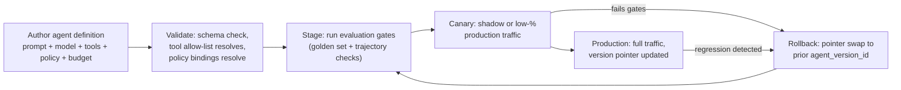
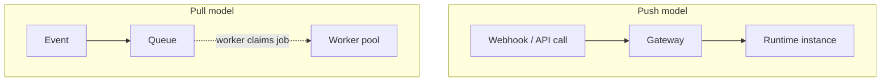
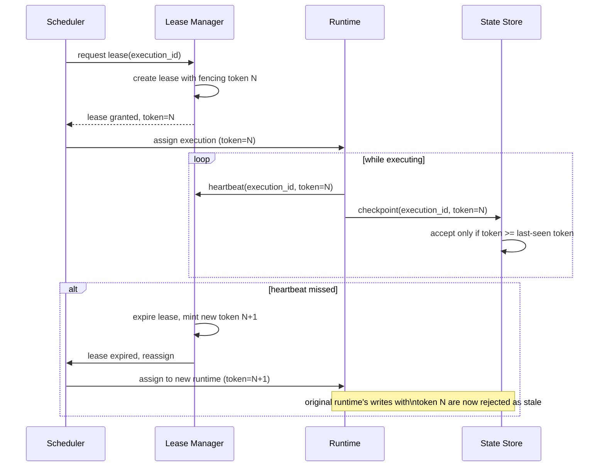

# Agent Lifecycle & Runtime

> Part of the [Agentic AI Platform — System Design](system-design.md) track. Builds on
> [01 — Foundations of Agentic Systems](01-foundations-of-agentic-systems.md) — read that first
> for the workflow-vs-agent distinction and the control/data plane split this doc assumes.
> This doc answers the platform's headline capability: **"create and deploy agents."**

## 1 · Problem statement

Runtime design is where every other plane's guarantees either hold up or fall apart under load.
The scheduler can hand out perfectly correct leases, the policy engine can make perfectly
correct decisions, and the state plane can define a perfectly correct checkpoint schema — but if
the runtime that actually executes an agent's steps can't survive a process crash mid-reasoning,
can't recover from a slow or failed tool call, and can't be interrupted safely by a policy
decision, none of that matters. Runtime design determines four things directly: **latency**
(how fast can a step execute), **cost** (how much idle/compute capacity you're paying for),
**concurrency** (how many executions run safely at once), and **recovery** (what happens when
something crashes mid-run). Agent runtimes are harder than typical stateless-service runtimes
because they must support **long-running, stateful reasoning** — a single execution can span
multiple model calls, multiple tool calls, and real wall-clock time waiting on external systems
— while surviving process crashes, model latency spikes, tool failures, and mid-execution policy
interruptions (an approval request, a budget cutoff, a cancellation).

## 2 · The agent definition & creation lifecycle

"Creating an agent" is not writing a system prompt in a text box and calling it done — on a
production platform, an **agent definition is a versioned artifact**, treated with the same
rigor as a deployable service. Concretely, an agent definition bundles:

| Component | What it is | Owned in |
|---|---|---|
| System prompt / instructions template | The agent's role, constraints, and reasoning guidance, parameterized (not a single static string) | This doc |
| Model selection | Model + provider + generation params (temperature, max tokens, etc.) | [04 — Model Gateway & LLM Providers](04-model-gateway-and-llm-providers.md) |
| Tool allow-list | The specific registered tools/MCP servers/skills this agent version may call — never "all tools" | [03 — Tool, MCP & Skill Registry](03-tool-mcp-and-skill-registry.md) |
| Policy bindings | Which policies (approval rules, rate limits, data-access rules) apply to this agent's actions | [11 — Governance, Guardrails & Security](11-governance-guardrails-and-security.md) |
| Budget defaults | Default token / time / cost / step limits for a run of this agent | [06 — Non-Determinism, Loops & Termination](06-non-determinism-loops-and-termination.md) |
| Evaluation gates | The golden-set / trajectory checks this version must pass before promotion | [07 — Agent Evaluation Frameworks](07-agent-evaluation-frameworks.md) |

Treating this bundle as a single versioned artifact (call it `agent_version_id`) is the key
design decision in this section: it means every run of an agent can point at an exact,
immutable, auditable configuration, and "what changed between the version that worked and the
version that broke" is a diff, not an investigation.

Treat this exactly like a deployment pipeline for a versioned config artifact, because that's
what it is. The single most important consequence of this framing: **rolling back a bad agent
version is a pointer swap, not a data migration.** The registry holds an `agent_name ->
active_agent_version_id` mapping; rollback overwrites that pointer to the last-known-good
version. The two things you must not forget to do alongside the pointer swap:

- **Invalidate caches** that may have memoized the old version's config (prompt templates,
  resolved tool schemas, policy bindings).
- **Invalidate or re-key in-flight sessions** that were created under the old version, so a
  long-running conversation doesn't silently continue executing against a version that was just
  pulled for a regression.

## 3 · Deployment and versioning

Because an agent definition is just a versioned config artifact, standard progressive-delivery
techniques apply almost unmodified — the only agent-specific addition is that "correctness" for
an agent version isn't just "does it start" but "does it behave acceptably across a
representative sample of inputs," which is why **shadow-mode evaluation** matters more here than
for a typical service rollout.

- **Blue-green or canary rollout:** run the new `agent_version_id` alongside the current
  production version, routing a small percentage of real traffic (or a duplicated shadow copy of
  it) to the new version before full cutover.
- **Shadow-mode evaluation:** replay real production inputs against the candidate version
  *without* letting its tool calls actually execute side effects (or executing them against a
  sandboxed/staging tool environment), and compare its trajectories/outputs against golden-set
  expectations and against the current production version's behavior. This is how you catch
  "the new prompt made the agent call the refund tool more often" before it happens for real.
- **Instant rollback of the agent version pointer** — as covered above — is deliberately kept
  separate from rolling back an in-flight *action*. Rolling back a deployment means "stop running
  the new config." Rolling back an action means "undo or compensate for a specific side effect a
  specific execution already committed" (a sent email, a charged payment, a modified record).
  Those are different problems solved by different mechanisms — see
  [10 — Recoverability, Rollbacks & Saga](10-recoverability-rollbacks-and-saga.md) for
  action-level rollback and compensation. Conflating the two is a common design mistake: an
  instant version-pointer rollback does **not** retroactively undo anything a prior execution
  already did in the real world.

## 4 · Push vs. pull execution

How work reaches a runtime instance shapes latency and overload behavior differently:

- **Push (Webhook → Gateway → Runtime):** minimizes routing delay — the gateway hands work
  straight to a runtime instance. The cost is that a traffic burst can overload runtimes directly;
  there's no natural buffer absorbing spikes, so you need aggressive autoscaling or admission
  control in front of it (see the uber doc's Admission plane).
- **Pull (Event → Queue → Worker claims job):** the queue provides natural backpressure and
  fairness — workers pull at their own sustainable rate, and a burst just makes the queue longer
  rather than overloading a runtime. The cost is added queue latency, since work waits for a
  worker to become free rather than being dispatched immediately.

Most production agent platforms end up hybrid: pull-based queueing for the bulk of executions
(reliability, fairness, backpressure), with a push-based or pre-warmed **hot pool** carved out for
latency-sensitive paths (covered in the Runtime Models table below).

## 5 · Runtime leasing and fencing tokens

An execution must be owned by exactly one runtime instance at a time — otherwise two instances
can both believe they're responsible for the same execution and both write conflicting state.
Leasing with fencing tokens is the standard mechanism (this is not agent-specific distributed
systems theory, but the consequences of getting it wrong *are* agent-specific: a duplicate
runtime can mean a tool call — e.g., "send the refund" — executes twice).

The properties this buys you, stated explicitly because interviewers want to hear the reasoning,
not just the diagram:

- **A runtime may commit state only with a valid fencing token.** The state store compares the
  incoming token against the highest token it has already accepted for that execution and
  rejects anything lower/stale.
- **Lease expiry must never allow a stale worker to overwrite newer state.** If a runtime is
  paused (GC pause, network partition, slow tool call) long enough for its lease to expire, a new
  runtime takes over with a higher token. When the original runtime wakes up and tries to write,
  its write is rejected — even though *it* doesn't know it lost ownership.
- **Heartbeats are independent of model latency.** A runtime must be able to heartbeat "I'm still
  alive and making progress" on a separate channel from "the model call I'm waiting on has
  returned," or a single slow model response looks indistinguishable from a dead runtime.
- **Cancellation must be durable.** A cancellation request (from a user, a policy engine, or a
  budget manager) must be recorded in durable state, not just sent as an in-memory signal to a
  runtime process — otherwise a lease reassignment after a crash "loses" the cancellation and
  the new runtime happily resumes work that was supposed to have stopped.

## 6 · Runtime models

Different parts of a platform legitimately want different runtime shapes — this table is the one
to reproduce when asked "how would you actually host these agents?"

| Runtime model | Best for | Primary tradeoff |
|---|---|---|
| Ephemeral / serverless | Spiky, short-lived tasks | Cold-start latency; limited ability to hold large in-memory runtime state across steps |
| Long-lived worker | Sustained throughput workloads | Idle cost when underutilized; noisy-neighbor risk between executions sharing a process |
| Hot pool (pre-warmed) | Latency-sensitive interactive agents | Pool-sizing complexity — under-provisioning reintroduces cold starts, over-provisioning wastes cost |
| Actor runtime | Stateful concurrency, one actor per execution/session | Operational complexity (actor placement, rebalancing, supervision trees) |
| Queue worker | Reliable background/async execution | Added queue latency between enqueue and pickup |

No single row is "the" answer — production platforms typically mix at least three: a queue-worker
backbone for reliability, a hot pool for latency-sensitive paths, and ephemeral/serverless for
bursty low-frequency workloads.

## 7 · Failure modes

| Failure mode | Cause | Mitigation |
|---|---|---|
| Duplicate execution after lease expiry | Original runtime resumes writing after losing the lease | Fencing tokens rejected at the state store (Section 5) |
| Stale worker writes | Same root cause as above, framed from the state-store side | State store enforces monotonic token acceptance per execution |
| Worker starvation | Queue fairness not enforced across tenants/agents | Per-tenant queue partitioning or weighted fair queueing (see [12 — Production Scale & Capacity](12-production-scale-and-capacity.md)) |
| Cold-start latency | Ephemeral/serverless runtime spun up on demand | Hot pool for latency-sensitive agents; pre-warming heuristics |
| Runtime memory leaks | Long-lived worker accumulates state across many executions | Bounded worker lifetime/recycling; per-execution isolation |
| External tool timeout | Tool/MCP server slow or unresponsive | Timeout + retry policy at the tool gateway, independent of runtime heartbeat |
| Checkpoint missing after model call | Runtime crashes between receiving a model response and persisting it | Checkpoint immediately after every model/tool call, before acting on the result (see [05 — State Management & Memory](05-state-management-and-memory.md)) |

## 8 · Enterprise vs. startup recommendation

**Enterprise recommendation:** hybrid runtime strategy — queue-backed pull execution as the
reliable backbone, hot pools carved out for latency-sensitive interactive paths, ephemeral
runtimes absorbing burst/overflow, and strict lease fencing enforced everywhere so that no
runtime model is allowed to write state without a valid, current token.

**Startup recommendation:** queue + container workers, full stop. Don't build a hot pool until
you have p95 latency data proving you need one — most early-stage agent products are not
latency-critical enough to justify the operational complexity of pool sizing on day one. Add hot
pools as a targeted optimization once you can point at a specific latency-sensitive path that
the queue-worker model can't satisfy.

## 9 · Interview questions

1. **What does "creating an agent" actually mean on a production platform?** — It means
   authoring a versioned artifact bundling prompt template, model/provider/params, a tool
   allow-list, policy bindings, budget defaults, and evaluation gates — not just writing a system
   prompt. That artifact goes through validation, staging evaluation, canary, and production
   promotion like any other deployable config.
2. **How do you roll back a bad agent deployment, and how is that different from rolling back an
   agent's action?** — Deployment rollback is a pointer swap (`agent_name -> agent_version_id`)
   plus cache/session invalidation — instant and cheap. Action rollback means compensating for a
   specific side effect a specific execution already committed (e.g., refunding a charge) — see
   [10 — Recoverability, Rollbacks & Saga](10-recoverability-rollbacks-and-saga.md). The two are
   unrelated: rolling back the deployment does not undo anything already done in the real world.
3. **Push vs. pull — how do you decide?** — Push minimizes routing delay but can overload
   runtimes during bursts since there's no buffer; pull (via a queue) provides backpressure and
   fairness at the cost of queue latency. Most platforms use pull as the reliable default and add
   push/hot-pool paths only where latency data justifies it.
4. **What is a fencing token and why does a lease alone not solve the duplicate-writer
   problem?** — A lease alone can expire while a paused/slow runtime is still unaware it lost
   ownership; when it later tries to write, without a fencing token the state store has no way to
   know that write is stale. A monotonically increasing fencing token, checked at the state store
   on every write, lets the store reject writes from a runtime that no longer holds the current
   lease.
5. **Why must heartbeats be independent of model call latency?** — Because a single slow (but
   healthy) model response would otherwise be indistinguishable from a dead runtime, causing
   unnecessary lease expiry and reassignment — and potentially a duplicate execution — for a
   runtime that was never actually unhealthy.

## Quick Revision Notes

- An agent definition is a **versioned artifact**: prompt template + model/provider/params + tool
  allow-list + policy bindings + budget defaults + evaluation gates.
- Promotion pipeline: Author → Validate → Stage (eval gates) → Canary (shadow/low-%) →
  Production, with Rollback as a pointer swap back to a prior `agent_version_id`.
- Rollback of a deployment (pointer swap + cache/session invalidation) is **not** the same as
  rollback of an action (compensation for a committed side effect) — see
  [10 — Recoverability, Rollbacks & Saga](10-recoverability-rollbacks-and-saga.md).
- Push (webhook → gateway → runtime) minimizes routing delay but can overload under burst; pull
  (event → queue → worker) gives backpressure/fairness at the cost of queue latency.
- Fencing tokens: state store accepts writes only from the current lease holder's token;
  heartbeats must be independent of model latency; cancellation must be durable, not in-memory.
- Runtime models: ephemeral (cold start), long-lived worker (idle cost/noisy neighbor), hot pool
  (sizing complexity), actor runtime (operational complexity), queue worker (queue latency).
- Startup default: queue + container workers. Add hot pools only once p95 latency data demands it.

## Further Reading

- LangGraph persistence (checkpointers vs. stores) — <https://docs.langchain.com/oss/python/langgraph/persistence>
- AutoGen Core user guide — <https://microsoft.github.io/autogen/stable/user-guide/core-user-guide/index.html>
- Back to [01 — Foundations of Agentic Systems](01-foundations-of-agentic-systems.md)
- Back to the [Agentic AI Platform — System Design](system-design.md) uber doc
- Next: [03 — Tool, MCP & Skill Registry](03-tool-mcp-and-skill-registry.md)
