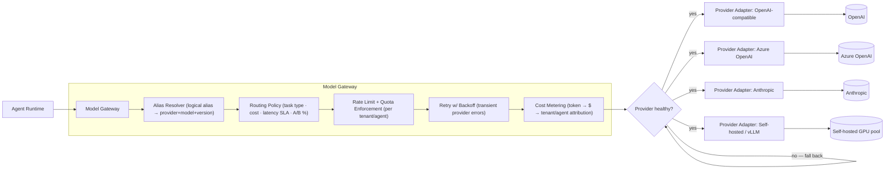
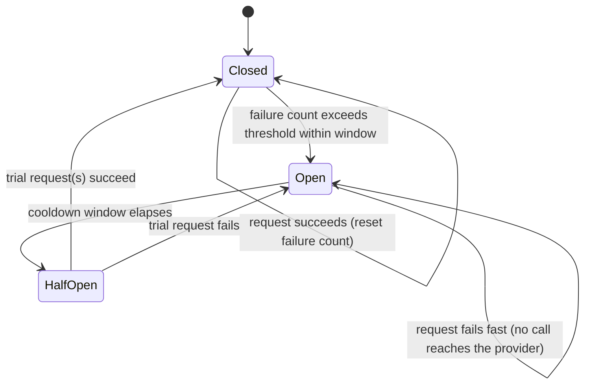
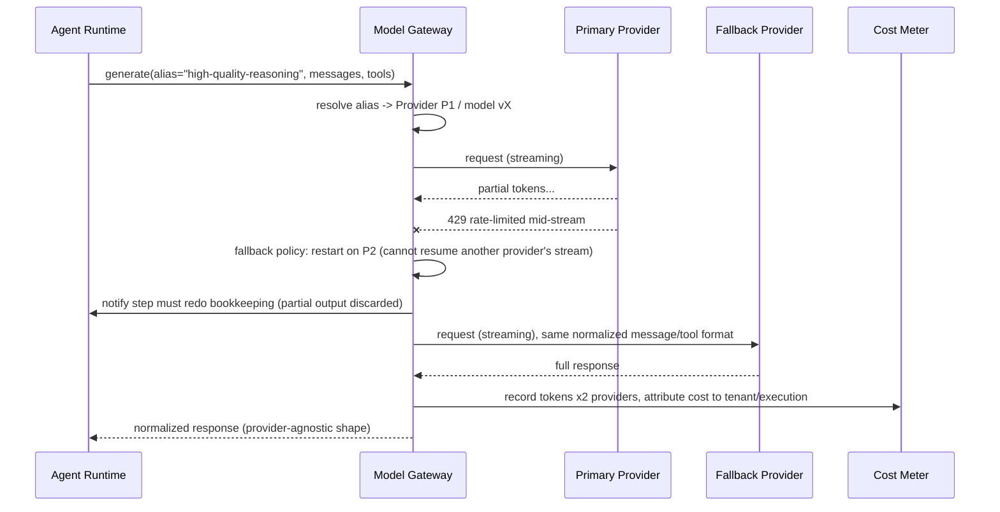

# 04 — Model Gateway & LLM Providers

> **Interview framing:** *"How do you let a platform user configure which LLM/provider an agent
> uses — per agent, per task, or per cost/latency/quality tradeoff — without every agent's
> prompt and tool logic needing to change when you swap providers or a model version moves
> underneath you?"*

[← Back to the master doc](system-design.md) · Related: [03 — Tool, MCP & Skill Registry](03-tool-mcp-and-skill-registry.md) ·
[06 — Non-Determinism, Loops & Termination](06-non-determinism-loops-and-termination.md) ·
[07 — Agent Evaluation Frameworks](07-agent-evaluation-frameworks.md) ·
[08 — Observability, Tracing & Health](08-observability-tracing-and-health.md)

Generic reverse proxies and API gateways are assumed background knowledge. What's specific to
an agent platform is that the thing being proxied is a **model**, not a stateless HTTP backend
— which means the gateway also owns tool-call format translation, streaming semantics, token/cost
accounting, and safe mid-generation fallback, none of which a plain API gateway needs to think
about.

> **Interview prep:** First pass → sections 1–3 (problem, gateway responsibilities, config model). Sections 4–5 cover routing strategies and fallback mechanics. `Internals:` subsections are deep-dive on demand. **What interviewers probe:** “Why is mid-stream fallback a restart, not a resume?” and “How does a logical alias let you swap providers without redeploying any agent?” **Opening narrative:** alias abstraction → wire format normalization → routing policy → restart-not-resume fallback semantics.

---

## 1 · Problem statement

Agents need to use different models and providers — OpenAI, Azure OpenAI, Anthropic, Google,
self-hosted/open-weight — chosen per agent, per task, or per cost/latency/quality tradeoff,
**without the agent's prompt or tool-calling logic needing to change.** That requirement is
harder than it sounds for reasons that don't exist in a generic API gateway:

- **Providers don't speak the same wire format.** Message shapes, streaming protocols, and —
  critically — **function/tool-calling formats** differ across OpenAI, Anthropic, and
  self-hosted stacks (e.g., vLLM's OpenAI-compatible mode still has edge-case differences in how
  tool calls are represented in streamed deltas). An agent that hardcodes to one provider's tool
  format cannot be silently repointed at another.
- **Models drift underneath you.** A provider can deprecate or quietly change the behavior of a
  model version you're pinned to; if every agent definition hardcodes a raw model name, you have
  no seam to intercept that change.
- **Cost, latency, and compliance are runtime routing decisions, not static config.** The "right"
  model for a task can depend on a spending cap, a latency SLA, a data-residency requirement, or
  an in-flight A/B experiment — decisions that belong in a gateway's routing policy, not
  scattered across agent definitions.

**The abstraction that solves this is a Model Gateway**: a layer the runtime always calls
instead of calling a provider SDK directly, analogous in *position* to a generic API gateway but
distinct in *purpose* — it exists to keep agent logic provider-agnostic and to make model choice
a governed, observable, swappable runtime decision.

---

## 2 · Model Gateway responsibilities

Responsibilities, mapped to the diagram:

- **Provider/model abstraction.** Each **Provider Adapter** unifies differing message formats,
  function/tool-calling schemas, and streaming protocols behind one internal representation the
  runtime always speaks — this is the seam that makes "swap providers" a config change instead of
  a code change across every agent.
- **Routing policy.** Chooses a concrete provider+model for a request based on task type (e.g.
  "classification" vs "long-form reasoning"), cost ceiling, latency SLA, data-residency/compliance
  constraints (some tenants may be contractually restricted to a specific region/provider), or an
  active A/B experiment.
- **Fallback chains.** If the primary provider errors or rate-limits, the gateway retries against
  a configured secondary — with explicit semantics about whether a partial/streamed response can
  be *resumed* against the fallback or must *restart from scratch* (most providers can't resume
  another provider's partial generation, so this is usually "restart, and tell the runtime the
  step needs to redo its own bookkeeping").
- **Rate limiting and quota enforcement per tenant/agent** — prevents one noisy tenant from
  burning another tenant's provider quota or budget.

#### Internals: Token Bucket vs Leaky Bucket Rate Limiting

Two classic algorithms achieve rate limiting differently, and the difference matters when
picking one for an LLM gateway:

- **Token bucket.** A bucket holds up to some maximum number of tokens and refills at a fixed
  rate (e.g. 100 tokens/second). Each incoming request consumes some number of tokens
  proportional to its estimated cost — for an LLM call, that's usually *estimated prompt +
  max-completion tokens*, not just "1 request = 1 token." If the bucket doesn't hold enough
  tokens, the request is throttled (rejected or queued) immediately. Bursts are allowed up to
  the bucket's capacity, which is exactly the behavior you want for bursty agent workloads — a
  reasoning loop can fire off several tool-augmented calls back-to-back, then go quiet.
- **Leaky bucket.** Requests enter a queue (the "bucket") and are drained at a strictly fixed
  outflow rate, regardless of how bursty the arrivals were. This smooths bursts into a constant
  downstream rate, but it does so by adding **queuing delay** — a request arriving mid-burst
  waits its turn rather than being processed (or rejected) immediately, which is often the wrong
  trade for a synchronous, latency-sensitive agent step waiting on a model response.

> **Trade-off:** token bucket is the better default for an LLM gateway — it tolerates natural
> burstiness in agent call patterns without adding latency to the common case, and it maps
> cleanly onto pre-request admission ("do we have budget for this call, yes/no") rather than
> forcing every call through a delay queue. Leaky bucket earns its keep when you need a
> hard-capped, perfectly smoothed outflow rate downstream — e.g. protecting a fixed-capacity
> self-hosted inference cluster from bursty traffic — and can tolerate the added latency.

**Why LLM gateways need *multi-dimensional* buckets:** providers rate-limit on at least two
independent axes — **requests per minute (RPM)** and **tokens per minute (TPM)** — and a single
request can exhaust either one independently of the other (a request with a huge prompt or
`max_tokens` can blow the TPM budget while barely touching RPM; a flood of tiny requests can
blow RPM while barely touching TPM). A gateway that tracks only one dimension will still get
429'd by the provider on the other, so production LLM gateways run **one bucket per dimension
per provider-credential** and throttle on whichever bucket empties first.

- **Retry with backoff** for transient provider errors (5xx, timeouts) — bounded and
  circuit-broken, not infinite.

#### Internals: Exponential Backoff With Jitter

Wait `base * 2^attempt` (capped) between retries. **The jitter point that matters on an LLM
gateway specifically:** a provider blip hits every tenant simultaneously, so without randomization
all callers compute identical delay schedules and arrive back in a synchronized retry wave. Adding
randomness (`delay = random_between(0, base * 2^attempt)`) spreads retries across time so the
recovering provider isn't immediately slammed again. Wrap the retry loop in a circuit breaker
(below) so a genuinely-down provider gets fail-fast instead of an infinite retry queue.

#### How It Actually Works: Circuit Breaker State Machine

"Bounded and circuit-broken, not infinite" refers to a state machine wrapped around the retry
logic — without it, retries alone can keep hammering an already-failing provider indefinitely:

- **Closed** — requests flow normally to the provider; failures are counted against a
  time-windowed threshold, and a success resets the count.
- **Open** — once the failure threshold is breached, the breaker trips: for a cooldown window,
  every request **fails fast without ever calling the provider** — no network call, no timeout
  wait, just an immediate structured failure back to the caller.
- **Half-Open** — after the cooldown elapses, a small number of trial requests are let through
  as a probe. If they succeed, the breaker closes and normal traffic resumes; if any fail, it
  reopens and restarts the cooldown.

> **Why fail-fast during Open protects both sides:** the caller (agent runtime) avoids burning a
> full timeout's worth of latency on a call that was highly likely to fail anyway — it gets an
> immediate, structured failure it can act on (fallback, surface to the model) instead of
> blocking. The struggling provider avoids **additional load piling on top of whatever is
> already causing it to fail** — every fast-failed request is one less request queued behind an
> already overloaded backend, which is precisely the condition that turns a transient blip into
> a full outage.

- **Cost metering** — token accounting per call, converted to $ using each provider's pricing,
  attributed to tenant/agent/execution ID — this is the data source [08 — Observability, Tracing
  & Health](08-observability-tracing-and-health.md) uses for cost-attribution dashboards and
  the input to per-tenant budget enforcement in [06 — Non-Determinism, Loops & Termination](06-non-determinism-loops-and-termination.md).

#### Internals: Prompt Caching

Cost metering is about *measuring* token spend after the fact; **prompt caching** is a
provider-side mechanism that *reduces* it before the meter even runs. Providers can cache the
internal state produced while processing a prompt **prefix** — for transformer models this is
the key/value (KV) cache from the attention layers — keyed by a hash of that prefix. When a
later request's prompt starts with the *exact same* prefix (same system prompt, same few-shot
examples, same leading conversation turns), the provider can skip re-running the full forward
pass over that prefix and reuse the cached state, processing only the new tokens that follow.
Both OpenAI and Anthropic expose this today, billing cached-prefix tokens at a fraction of the
normal input-token rate instead of the full rate.

Why this matters at agent-platform scale: agent prompts are usually dominated by a large,
*repeated* prefix — system instructions, tool schemas, few-shot examples, RAG context — with
only a small amount of genuinely new content (the latest user/tool turn) at the end. Every step
in a multi-step reasoning loop re-sends that entire prefix, so structuring prompts to maximize
cache hits (static content first, variable content last, consistent formatting across calls) can
cut both **cost and time-to-first-token** substantially at scale — this is a prompt-template
design constraint, not just a cost-accounting detail.

> **What invalidates the cache:** any change to the cached prefix — including whitespace,
> reordering, or a single-character edit anywhere at or before the cache boundary — produces a
> different hash and forces a full re-process on the next call. This is why prompt-template
> discipline matters operationally: injecting a timestamp, a random request ID, or even
> non-deterministic whitespace into what's supposed to be the *static* portion of a prompt
> silently kills the cache-hit rate for every agent using that template. Cache lifetimes are
> also typically short (minutes, extendable for a fee on some providers), so a prefix that isn't
> reused within that window pays full cost again regardless of how carefully it was structured.

> **Tenant isolation is not automatic.** A cache keyed purely by a hash of the prompt-prefix text
> means two different tenants who happen to share an identical system-prompt template (a common
> case for a multi-tenant platform running the same agent definition for every customer) will
> **hit the same cache entry** at the provider. For most providers this is a performance/cost
> optimization only — the cached KV-state never leaks back into a *response body* across tenants
> — but it does mean cache hit-rate metrics and any provider-side telemetry keyed by that hash are
> observable as a cross-tenant signal (tenant A's cache-warming activity measurably changes
> tenant B's latency/cost), and a platform with strict tenant-isolation requirements should
> confirm the specific provider's cache-key scoping (some support customer-scoped or
> organization-scoped cache namespaces) rather than assuming isolation by default.

**The load-bearing sentence for a whiteboard:** *the Model Gateway is the seam that turns "which
model" from a hardcoded agent-definition detail into a runtime-resolved, governed, observable
decision.*

---

## 3 · Configuration model: how a platform user "configures a provider"

Two distinct objects, at two distinct layers, resolved together at call time:

**Provider-credential/config object** (platform-admin-owned, one per registered provider
account):

| Field | Purpose |
|---|---|
| `provider_type` | `openai` \| `azure-openai` \| `anthropic` \| `google` \| `self-hosted-vllm` \| ... |
| `endpoint` | Base URL / region-specific endpoint |
| `auth_ref` | **Reference into a secrets manager** — never a raw API key stored in config or in an agent definition |
| `default_model` | Fallback model if a request doesn't specify one |
| `allowed_models` | Allow-list of model IDs/versions this credential may be used for |
| `rate_limit` | Requests/tokens per minute for this credential |
| `spending_cap` | Hard $ ceiling per period, enforced at the gateway |

**Agent-level reference** — an agent definition never names a raw provider+model. It references
a **logical model alias** — e.g. `"fast-cheap"`, `"high-quality-reasoning"`, `"long-context"` —
that the gateway resolves to a concrete provider+model+version at call time, based on the
routing policy in effect for that tenant/environment. This indirection is *the* mechanism that
lets you swap providers or promote a new model version **without redeploying every agent that
uses it** — you change what the alias resolves to in one place, and every agent referencing it
picks up the change on its next call (optionally gated by a canary percentage — see Section 4).

---

## 4 · Multi-model routing strategies

| Strategy | How it decides | Best for | Weakness |
|---|---|---|---|
| **Static per-agent binding** | Agent definition pins a specific alias → fixed provider/model mapping | Simplicity, predictable behavior, easy debugging | No adaptivity to cost/latency/outage conditions |
| **Task-classifier-based routing** | A lightweight classifier (or heuristic) inspects the request and picks a model tier suited to task complexity | Cost optimization — cheap model for easy tasks, strong model for hard ones | Classifier itself can misroute; adds a small latency/cost overhead per call |
| **Cost-ceiling-based routing** | Routes to the cheapest model that still meets a quality floor, backing off further as tenant budget is consumed | Budget-constrained tenants, high call volume | Can degrade quality silently near the ceiling if not paired with alerting |
| **Latency-SLA-based routing** | Picks the fastest provider/model currently meeting the agent's latency budget, using live health/latency telemetry | Interactive/user-facing agents with strict response-time requirements | Requires accurate, low-lag health telemetry to avoid routing into a degraded provider |
| **Canary %-based routing** | Routes a small, configurable percentage of traffic to a new model version, comparing outcomes against the incumbent | Safely rolling out a new model version | Needs the evaluation harness in [07 — Agent Evaluation Frameworks](07-agent-evaluation-frameworks.md) to actually judge whether the canary is better, not just "different" |

#### Internals: How Cost-Based, Latency-Based, and Fallback-Chain Routing Actually Decide

The table above names the strategies; here's the mechanism behind three of them that
interviewers commonly ask you to go one level deeper on:

- **Cost-based routing.** Maintain a **quality floor** for the task (a minimum acceptable score
  on an eval relevant to the task type — see [07 — Agent Evaluation Frameworks](07-agent-evaluation-frameworks.md))
  and a ranked list of models that clear it, ordered by $/token. Route to the cheapest model on
  that list; if tenant budget consumption crosses a threshold, the router can demote to a
  stricter (cheaper-only) subset of that list rather than failing requests outright.
- **Latency-based routing.** Track **P50 and P99 latency per provider/model** using a sliding
  time window (e.g. the trailing 5 minutes of completed calls), refreshed continuously from the
  gateway's own telemetry — not from a provider's advertised SLA, which doesn't reflect current
  reality. Route each request to whichever currently-healthy option has the best P99 (not P50 —
  P99 is what protects you from a provider that's only *occasionally* very slow, which P50 alone
  would mask) within the task's latency budget.
- **Fallback chains.** Not "routing" in the scoring sense — a fixed, ordered list (primary →
  secondary → tertiary) tried in sequence, falling through only on failure or timeout of the
  current entry. It optimizes for *availability*, not for picking the objectively best option
  per request, which is the key distinction from the two strategies above.

> **Trade-off table:**
>
> | Strategy | Cost | Latency | Quality consistency | Complexity |
> |---|---|---|---|---|
> | **Cost-based routing** | Optimized (cheapest passing the floor) | Not directly optimized | Bounded by the quality floor, but the floor itself needs upkeep | Medium — needs a maintained quality floor + live pricing table |
> | **Latency-based routing** | Not directly optimized | Optimized (routes to fastest healthy option) | Can vary call-to-call as the fastest option shifts | Medium-high — needs accurate, low-lag P50/P99 telemetry per provider |
> | **Fallback chains** | Secondary/tertiary cost is often incidental, not chosen for | Degrades on fallback (extra hop + possible restart, Section 5) | Trades quality for availability on fallback | Low — simplest to implement and reason about |

These aren't mutually exclusive — a mature gateway layers them: static binding as the default,
task-classifier routing within an alias's allowed model set, cost-ceiling routing as a budget
guardrail on top, and canary routing used specifically during model-version rollout windows.

---

## 5 · Fallback in action

The detail that trips people up in interviews: **a fallback triggered mid-stream is (almost
always) a restart, not a resume** — there is no standard cross-provider mechanism to hand a
partial generation from one model to another and have it continue coherently. The gateway's
contract with the runtime must say so explicitly, and the runtime's step/checkpoint logic (see
[05 — State Management & Memory](05-state-management-and-memory.md)) needs to treat "provider
fallback occurred" as a reason to discard and redo the step's in-progress output, not silently
splice two partial completions together.

---

## 6 · Failure modes

| Failure mode | Symptom | Mitigation |
|---|---|---|
| Provider outage, no fallback configured | Every agent using that alias hard-fails | Always configure at least one fallback per alias in production; alert on fallback-chain exhaustion |
| **Silent model-version drift** | Provider deprecates/changes a model version underneath a pinned alias; behavior quietly regresses | Version pinning with explicit opt-in upgrades; shadow-test new versions against a golden set before promotion |
| Token/cost budget exceeded mid-stream | Response cut off, incomplete tool call, confusing partial output | Gateway pre-checks estimated cost against remaining budget before starting a call; hard-stops and returns a structured budget-exceeded error rather than a silent truncation |
| Inconsistent tool-call schema translation between providers | Malformed tool calls after a fallback switch, agent logic breaks in provider-specific ways | Provider adapters normalize to one internal tool-call representation; contract-test each adapter against the same fixture set |
| Streaming response cut off by mid-generation fallback switch | Duplicated or garbled output if not handled as a clean restart | Treat fallback as restart-not-resume (Section 5); runtime discards partial step output on fallback |

---

## 7 · Enterprise vs. Startup recommendation

**Startup:** single provider, one configured fallback, a simple per-agent token/cost budget
enforced at the gateway, static alias-to-model binding, no canary infrastructure yet — just
manually re-test agents against a small golden set before bumping a pinned model version.

**Enterprise:** multi-provider with fallback chains per alias, per-tenant budget caps enforced
at the gateway (not just per-agent), explicit version pinning with opt-in upgrade workflows,
and shadow-testing new model versions against golden evaluation sets before promotion — wired
into the canary-routing and regression-gate machinery in [07 — Agent Evaluation Frameworks](07-agent-evaluation-frameworks.md)
so a new model version earns production traffic instead of being flipped on for everyone at once.

---

## 8 · Interview questions

1. **"How do you let a platform user swap an agent from GPT-family to Claude-family models
   without redeploying every agent?"** — Agents reference a logical model alias, never a raw
   provider+model; the gateway resolves the alias to a concrete provider/model at call time, so
   changing the alias's resolution is a config change in one place.
2. **"What happens to a streamed response if the gateway falls back to a different provider
   mid-generation?"** — There's no standard way to resume another provider's partial completion;
   the gateway restarts the call against the fallback and the runtime discards/redoes the
   in-progress step output, rather than splicing partial completions together.
3. **"How do you stop one tenant from starving another tenant's model quota?"** — Rate limiting
   and spending caps are enforced per tenant/agent at the gateway, independent of any single
   provider credential's own limits, so one noisy tenant can't exhaust shared provider capacity.
4. **"A provider quietly changes a model version's behavior — how would you have caught that
   before it hit production widely?"** — Explicit version pinning (never "always use latest"),
   plus shadow/canary testing new versions against a golden evaluation set before promoting them
   to full traffic.
5. **"Why is a Model Gateway different in purpose from a generic API gateway, even though it
   sits in a similar architectural position?"** — It additionally normalizes tool-calling/message
   formats and streaming semantics across providers, handles cost metering in $ terms per
   tenant/agent, and must define explicit restart-vs-resume semantics for mid-stream fallback —
   none of which a stateless HTTP API gateway needs to reason about.

---

## Quick Revision Notes

- Agents reference a **logical model alias**, never a raw provider+model — the gateway resolves
  the alias at call time, which is what makes provider swaps a config change, not a redeploy.
- Provider adapters normalize message format, tool-calling schema, and streaming protocol
  differences behind one internal representation the runtime always speaks.
- Routing strategies layer: static binding → task-classifier routing → cost-ceiling routing →
  canary %-based routing for new model versions — not mutually exclusive.
- **Fallback mid-stream is a restart, not a resume** — no standard way to hand a partial
  completion from one provider to another.
- Cost metering converts tokens to $ per provider pricing and attributes to tenant/agent — this
  feeds both budget enforcement (doc 06) and cost-attribution observability (doc 08).
- Silent model-version drift is a top failure mode — pin versions explicitly, shadow-test new
  versions against a golden set before promotion (doc 07), never auto-track "latest."
- Never store raw provider secrets in agent definitions or gateway config — reference a secrets
  manager.
- Rate limits and spending caps must be enforceable per tenant/agent at the gateway, independent
  of any single provider credential's own limits.
- Token bucket (burst-tolerant, refill-rate based) is the standard choice for LLM rate limiting;
  leaky bucket smooths to a fixed outflow at the cost of queuing delay — gateways need separate
  buckets per dimension (RPM *and* TPM) since providers cap both independently.
- Exponential backoff needs jitter, or synchronized retry waves from many callers turn a
  transient provider blip into a self-inflicted thundering herd; wrap retries in a circuit
  breaker (Closed → Open → Half-Open) so a failing provider gets fail-fast instead of endless
  retries piling on more load.
- Cost-based routing optimizes $/token against a quality floor; latency-based routing tracks
  P50/P99 per provider via a sliding window; fallback chains optimize availability, not
  per-request quality — layer them rather than picking just one.
- Prompt caching reuses a provider's cached KV-state for a repeated, hashed prompt prefix — any
  change to that prefix, down to whitespace, invalidates the cache and forces a full re-process.
- A prompt cache keyed only by prefix-hash is shared across tenants with an identical template —
  a cost/latency win, not a data leak, but confirm the provider's cache-key scoping if strict
  tenant isolation is a requirement.

## Further Reading

- Azure OpenAI Service documentation — <https://learn.microsoft.com/en-us/azure/ai-services/openai/overview>
- LiteLLM (multi-provider LLM gateway/proxy) — <https://docs.litellm.ai/docs/>
- OpenRouter (unified API across model providers) — <https://openrouter.ai/docs>
- Portkey (AI gateway: routing, fallbacks, observability) — <https://portkey.ai/docs>
- vLLM documentation (self-hosted, OpenAI-compatible serving) — <https://docs.vllm.ai/>
- OpenTelemetry Generative AI semantic conventions (token/cost telemetry) — <https://opentelemetry.io/docs/specs/semconv/gen-ai/>
- Stripe Engineering: Scaling your API with rate limiters (token bucket in production) — <https://stripe.com/blog/rate-limiters>
- AWS Architecture Blog: Exponential Backoff and Jitter — <https://aws.amazon.com/blogs/architecture/exponential-backoff-and-jitter/>
- Circuit Breaker pattern — Martin Fowler — <https://martinfowler.com/bliki/CircuitBreaker.html>
- Circuit Breaker pattern — Azure Architecture Center — <https://learn.microsoft.com/en-us/azure/architecture/patterns/circuit-breaker>
- Anthropic prompt caching documentation — <https://platform.claude.com/docs/en/docs/build-with-claude/prompt-caching>
- OpenAI prompt caching guide — <https://developers.openai.com/api/docs/guides/prompt-caching>
