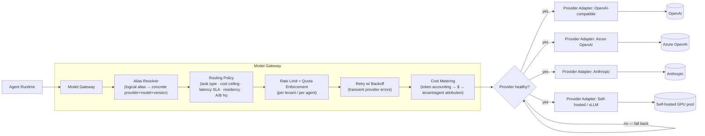
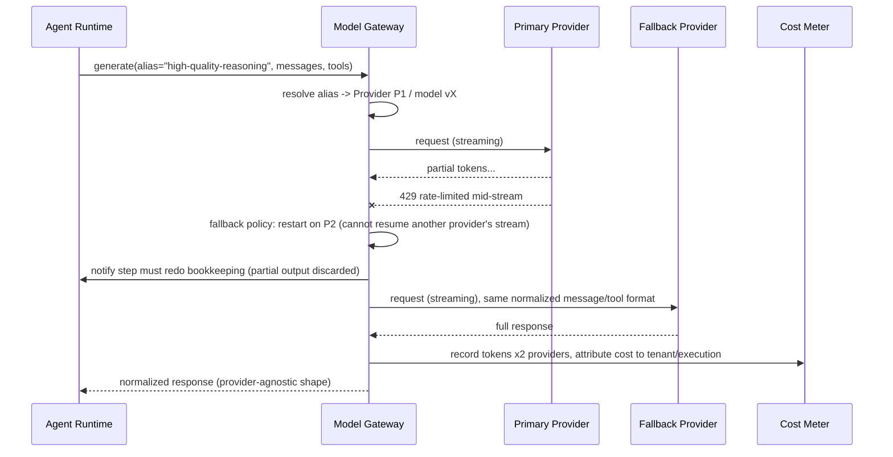

# 04 — Model Gateway & LLM Providers

> **Interview framing:** *"How do you let a platform user configure which LLM/provider an agent
> uses — per agent, per task, or per cost/latency/quality tradeoff — without every agent's
> prompt and tool logic needing to change when you swap providers or a model version moves
> underneath you?"*

[← Back to the master doc](system-design.md) · Related: [03 — Tool, MCP & Skill Registry](03-tool-mcp-and-skill-registry.md) ·
[06 — Non-Determinism, Loops & Termination](06-non-determinism-loops-and-termination.md) ·
[07 — Agent Evaluation Frameworks](07-agent-evaluation-frameworks.md) ·
[08 — Observability, Tracing & Health](08-observability-tracing-and-health.md)

Generic reverse proxies and API gateways are assumed background knowledge. What's specific to
an agent platform is that the thing being proxied is a **model**, not a stateless HTTP backend
— which means the gateway also owns tool-call format translation, streaming semantics, token/cost
accounting, and safe mid-generation fallback, none of which a plain API gateway needs to think
about.

---

## 1 · Problem statement

Agents need to use different models and providers — OpenAI, Azure OpenAI, Anthropic, Google,
self-hosted/open-weight — chosen per agent, per task, or per cost/latency/quality tradeoff,
**without the agent's prompt or tool-calling logic needing to change.** That requirement is
harder than it sounds for reasons that don't exist in a generic API gateway:

- **Providers don't speak the same wire format.** Message shapes, streaming protocols, and —
  critically — **function/tool-calling formats** differ across OpenAI, Anthropic, and
  self-hosted stacks (e.g., vLLM's OpenAI-compatible mode still has edge-case differences in how
  tool calls are represented in streamed deltas). An agent that hardcodes to one provider's tool
  format cannot be silently repointed at another.
- **Models drift underneath you.** A provider can deprecate or quietly change the behavior of a
  model version you're pinned to; if every agent definition hardcodes a raw model name, you have
  no seam to intercept that change.
- **Cost, latency, and compliance are runtime routing decisions, not static config.** The "right"
  model for a task can depend on a spending cap, a latency SLA, a data-residency requirement, or
  an in-flight A/B experiment — decisions that belong in a gateway's routing policy, not
  scattered across agent definitions.

**The abstraction that solves this is a Model Gateway**: a layer the runtime always calls
instead of calling a provider SDK directly, analogous in *position* to a generic API gateway but
distinct in *purpose* — it exists to keep agent logic provider-agnostic and to make model choice
a governed, observable, swappable runtime decision.

---

## 2 · Model Gateway responsibilities

Responsibilities, mapped to the diagram:

- **Provider/model abstraction.** Each **Provider Adapter** unifies differing message formats,
  function/tool-calling schemas, and streaming protocols behind one internal representation the
  runtime always speaks — this is the seam that makes "swap providers" a config change instead of
  a code change across every agent.
- **Routing policy.** Chooses a concrete provider+model for a request based on task type (e.g.
  "classification" vs "long-form reasoning"), cost ceiling, latency SLA, data-residency/compliance
  constraints (some tenants may be contractually restricted to a specific region/provider), or an
  active A/B experiment.
- **Fallback chains.** If the primary provider errors or rate-limits, the gateway retries against
  a configured secondary — with explicit semantics about whether a partial/streamed response can
  be *resumed* against the fallback or must *restart from scratch* (most providers can't resume
  another provider's partial generation, so this is usually "restart, and tell the runtime the
  step needs to redo its own bookkeeping").
- **Rate limiting and quota enforcement per tenant/agent** — prevents one noisy tenant from
  burning another tenant's provider quota or budget.
- **Retry with backoff** for transient provider errors (5xx, timeouts) — bounded and
  circuit-broken, not infinite.
- **Cost metering** — token accounting per call, converted to $ using each provider's pricing,
  attributed to tenant/agent/execution ID — this is the data source [08 — Observability, Tracing
  & Health](08-observability-tracing-and-health.md) uses for cost-attribution dashboards and
  the input to per-tenant budget enforcement in [06 — Non-Determinism, Loops & Termination](06-non-determinism-loops-and-termination.md).

**The load-bearing sentence for a whiteboard:** *the Model Gateway is the seam that turns "which
model" from a hardcoded agent-definition detail into a runtime-resolved, governed, observable
decision.*

---

## 3 · Configuration model: how a platform user "configures a provider"

Two distinct objects, at two distinct layers, resolved together at call time:

**Provider-credential/config object** (platform-admin-owned, one per registered provider
account):

| Field | Purpose |
|---|---|
| `provider_type` | `openai` \| `azure-openai` \| `anthropic` \| `google` \| `self-hosted-vllm` \| ... |
| `endpoint` | Base URL / region-specific endpoint |
| `auth_ref` | **Reference into a secrets manager** — never a raw API key stored in config or in an agent definition |
| `default_model` | Fallback model if a request doesn't specify one |
| `allowed_models` | Allow-list of model IDs/versions this credential may be used for |
| `rate_limit` | Requests/tokens per minute for this credential |
| `spending_cap` | Hard $ ceiling per period, enforced at the gateway |

**Agent-level reference** — an agent definition never names a raw provider+model. It references
a **logical model alias** — e.g. `"fast-cheap"`, `"high-quality-reasoning"`, `"long-context"` —
that the gateway resolves to a concrete provider+model+version at call time, based on the
routing policy in effect for that tenant/environment. This indirection is *the* mechanism that
lets you swap providers or promote a new model version **without redeploying every agent that
uses it** — you change what the alias resolves to in one place, and every agent referencing it
picks up the change on its next call (optionally gated by a canary percentage — see Section 4).

---

## 4 · Multi-model routing strategies

| Strategy | How it decides | Best for | Weakness |
|---|---|---|---|
| **Static per-agent binding** | Agent definition pins a specific alias → fixed provider/model mapping | Simplicity, predictable behavior, easy debugging | No adaptivity to cost/latency/outage conditions |
| **Task-classifier-based routing** | A lightweight classifier (or heuristic) inspects the request and picks a model tier suited to task complexity | Cost optimization — cheap model for easy tasks, strong model for hard ones | Classifier itself can misroute; adds a small latency/cost overhead per call |
| **Cost-ceiling-based routing** | Routes to the cheapest model that still meets a quality floor, backing off further as tenant budget is consumed | Budget-constrained tenants, high call volume | Can degrade quality silently near the ceiling if not paired with alerting |
| **Latency-SLA-based routing** | Picks the fastest provider/model currently meeting the agent's latency budget, using live health/latency telemetry | Interactive/user-facing agents with strict response-time requirements | Requires accurate, low-lag health telemetry to avoid routing into a degraded provider |
| **Canary %-based routing** | Routes a small, configurable percentage of traffic to a new model version, comparing outcomes against the incumbent | Safely rolling out a new model version | Needs the evaluation harness in [07 — Agent Evaluation Frameworks](07-agent-evaluation-frameworks.md) to actually judge whether the canary is better, not just "different" |

These aren't mutually exclusive — a mature gateway layers them: static binding as the default,
task-classifier routing within an alias's allowed model set, cost-ceiling routing as a budget
guardrail on top, and canary routing used specifically during model-version rollout windows.

---

## 5 · Fallback in action

The detail that trips people up in interviews: **a fallback triggered mid-stream is (almost
always) a restart, not a resume** — there is no standard cross-provider mechanism to hand a
partial generation from one model to another and have it continue coherently. The gateway's
contract with the runtime must say so explicitly, and the runtime's step/checkpoint logic (see
[05 — State Management & Memory](05-state-management-and-memory.md)) needs to treat "provider
fallback occurred" as a reason to discard and redo the step's in-progress output, not silently
splice two partial completions together.

---

## 6 · Failure modes

| Failure mode | Symptom | Mitigation |
|---|---|---|
| Provider outage, no fallback configured | Every agent using that alias hard-fails | Always configure at least one fallback per alias in production; alert on fallback-chain exhaustion |
| **Silent model-version drift** | Provider deprecates/changes a model version underneath a pinned alias; behavior quietly regresses | Version pinning with explicit opt-in upgrades; shadow-test new versions against a golden set before promotion |
| Token/cost budget exceeded mid-stream | Response cut off, incomplete tool call, confusing partial output | Gateway pre-checks estimated cost against remaining budget before starting a call; hard-stops and returns a structured budget-exceeded error rather than a silent truncation |
| Inconsistent tool-call schema translation between providers | Malformed tool calls after a fallback switch, agent logic breaks in provider-specific ways | Provider adapters normalize to one internal tool-call representation; contract-test each adapter against the same fixture set |
| Streaming response cut off by mid-generation fallback switch | Duplicated or garbled output if not handled as a clean restart | Treat fallback as restart-not-resume (Section 5); runtime discards partial step output on fallback |

---

## 7 · Enterprise vs. Startup recommendation

**Startup:** single provider, one configured fallback, a simple per-agent token/cost budget
enforced at the gateway, static alias-to-model binding, no canary infrastructure yet — just
manually re-test agents against a small golden set before bumping a pinned model version.

**Enterprise:** multi-provider with fallback chains per alias, per-tenant budget caps enforced
at the gateway (not just per-agent), explicit version pinning with opt-in upgrade workflows,
and shadow-testing new model versions against golden evaluation sets before promotion — wired
into the canary-routing and regression-gate machinery in [07 — Agent Evaluation Frameworks](07-agent-evaluation-frameworks.md)
so a new model version earns production traffic instead of being flipped on for everyone at once.

---

## 8 · Interview questions

1. **"How do you let a platform user swap an agent from GPT-family to Claude-family models
   without redeploying every agent?"** — Agents reference a logical model alias, never a raw
   provider+model; the gateway resolves the alias to a concrete provider/model at call time, so
   changing the alias's resolution is a config change in one place.
2. **"What happens to a streamed response if the gateway falls back to a different provider
   mid-generation?"** — There's no standard way to resume another provider's partial completion;
   the gateway restarts the call against the fallback and the runtime discards/redoes the
   in-progress step output, rather than splicing partial completions together.
3. **"How do you stop one tenant from starving another tenant's model quota?"** — Rate limiting
   and spending caps are enforced per tenant/agent at the gateway, independent of any single
   provider credential's own limits, so one noisy tenant can't exhaust shared provider capacity.
4. **"A provider quietly changes a model version's behavior — how would you have caught that
   before it hit production widely?"** — Explicit version pinning (never "always use latest"),
   plus shadow/canary testing new versions against a golden evaluation set before promoting them
   to full traffic.
5. **"Why is a Model Gateway different in purpose from a generic API gateway, even though it
   sits in a similar architectural position?"** — It additionally normalizes tool-calling/message
   formats and streaming semantics across providers, handles cost metering in $ terms per
   tenant/agent, and must define explicit restart-vs-resume semantics for mid-stream fallback —
   none of which a stateless HTTP API gateway needs to reason about.

---

## Quick Revision Notes

- Agents reference a **logical model alias**, never a raw provider+model — the gateway resolves
  the alias at call time, which is what makes provider swaps a config change, not a redeploy.
- Provider adapters normalize message format, tool-calling schema, and streaming protocol
  differences behind one internal representation the runtime always speaks.
- Routing strategies layer: static binding → task-classifier routing → cost-ceiling routing →
  canary %-based routing for new model versions — not mutually exclusive.
- **Fallback mid-stream is a restart, not a resume** — no standard way to hand a partial
  completion from one provider to another.
- Cost metering converts tokens to $ per provider pricing and attributes to tenant/agent — this
  feeds both budget enforcement (doc 06) and cost-attribution observability (doc 08).
- Silent model-version drift is a top failure mode — pin versions explicitly, shadow-test new
  versions against a golden set before promotion (doc 07), never auto-track "latest."
- Never store raw provider secrets in agent definitions or gateway config — reference a secrets
  manager.
- Rate limits and spending caps must be enforceable per tenant/agent at the gateway, independent
  of any single provider credential's own limits.

## Further Reading

- Azure OpenAI Service documentation — <https://learn.microsoft.com/en-us/azure/ai-services/openai/overview>
- LiteLLM (multi-provider LLM gateway/proxy) — <https://docs.litellm.ai/docs/>
- OpenRouter (unified API across model providers) — <https://openrouter.ai/docs>
- Portkey (AI gateway: routing, fallbacks, observability) — <https://portkey.ai/docs>
- vLLM documentation (self-hosted, OpenAI-compatible serving) — <https://docs.vllm.ai/>
- OpenTelemetry Generative AI semantic conventions (token/cost telemetry) — <https://opentelemetry.io/docs/specs/semconv/gen-ai/>
