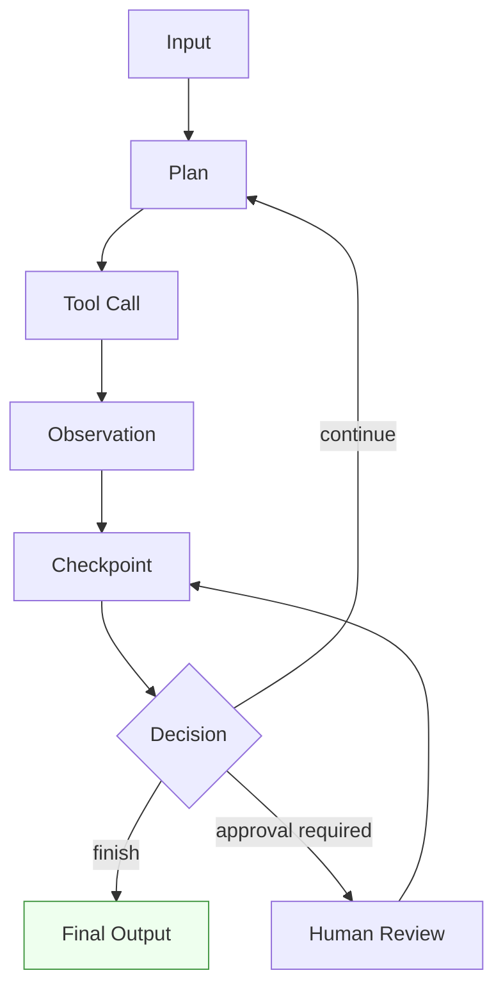
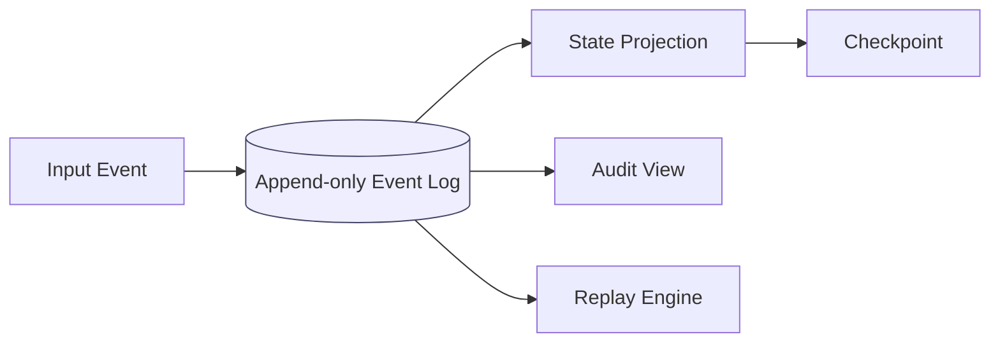
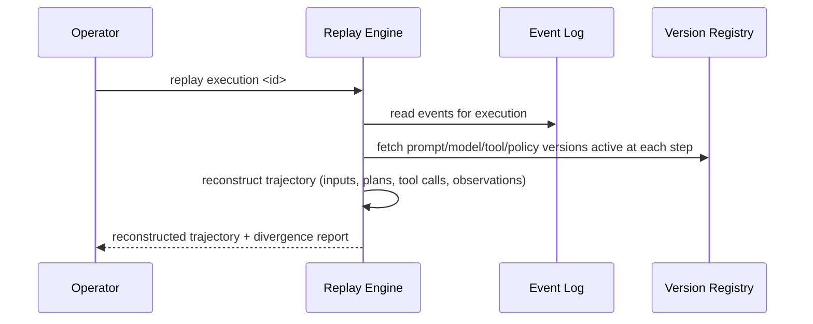
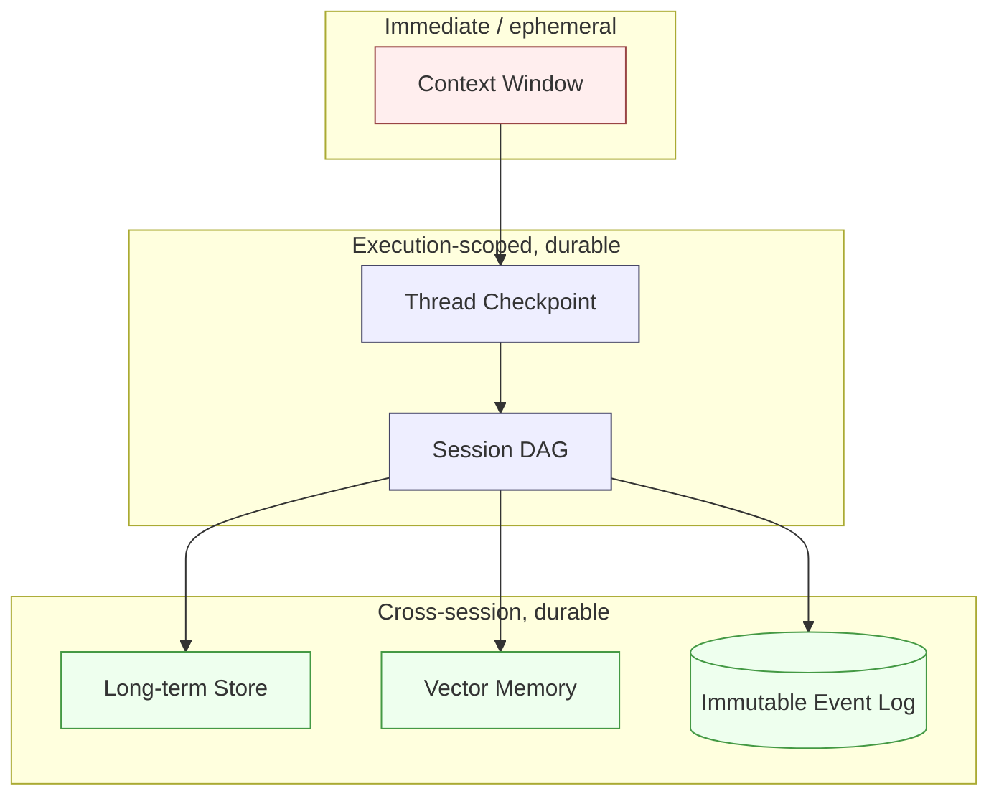

# State Management & Memory in Agentic AI Systems

> **Interview framing:** *"Chat history isn't state. Design how an agentic platform tracks,
> persists, and replays everything that actually happened during an execution — plans, tool
> calls, observations, approvals, and the versions of everything that produced them."*

This doc is part of the [agentic AI platform system-design track](system-design.md). It expands
the **State plane** from the master architecture (Section 2 of the uber doc) and the memory
layering referenced in that doc's "ten things to memorize" list (item 7). Generic event sourcing
and CQRS are assumed background here — this doc spends its words only on what is *different*
about state and memory when the actor generating transitions is a nondeterministic model instead
of deterministic application code.

---

## 1 · Problem statement: agent state is not chat history

The most common mistake in a system-design interview answer is treating "agent state" as
"the conversation so far." Chat history is *one input* to the model on the next turn. It is not
what the platform needs to persist, audit, resume, or replay.

Real agent state is the full record of what happened and why:

| State component | What it is | Why it must be durable |
|---|---|---|
| Input | The triggering request/event, plus caller identity and context | Reproducibility — you can't replay what you didn't record |
| Plan | The model's proposed next step(s) at each turn | Explains *intent* before any action was taken |
| Tool calls | Which tool/MCP server was invoked, with which arguments | The only place "what did the agent try to do" is captured |
| Observations | Raw and normalized tool/model outputs fed back into the loop | Needed to explain *why* the agent made its next decision |
| Checkpoints | Durable snapshots of execution progress at meaningful transitions | Resume point after a crash; unit of replay |
| Memory references | Pointers to retrieved long-term/vector memory used in a step | Lets you prove/disprove "the agent hallucinated this" vs "the agent was given this" |
| Policy decisions | Allow/deny/approve verdicts from the policy engine | The authority boundary's audit trail (see [system-design.md §2](system-design.md#2--master-architecture)) |
| Approvals | Human-in-the-loop decisions, with identity and timestamp | Legal/compliance evidence for high-risk actions |
| Budgets | Remaining step/token/time/cost budget at each point | Explains *why an execution stopped* (see [06 — Non-Determinism, Loops & Termination](06-non-determinism-loops-and-termination.md)) |
| Traces | Correlated span IDs across model/tool/state/policy calls | Cross-system debugging (see [08 — Observability, Tracing & Health](08-observability-tracing-and-health.md)) |
| Final outputs | The terminal result delivered to the caller | The thing everything else exists to justify |

Chat history is *derivable* from this record (it's a projection of inputs and outputs). The
record is not derivable from chat history — that's the asymmetry that makes it the system of
record and chat history a convenience view.

**If you remember one sentence from this section:** state is the append-only story of everything
the platform decided and observed; chat history is a lossy summary the model happens to read.

---

## 2 · The agent State DAG

Every agent turn moves through the same shape, whether the underlying framework calls it a
"graph," a "loop," or a "chain." Drawing this DAG is the fastest way to show an interviewer you
understand where durability boundaries belong.

Three properties of this DAG matter more than the boxes themselves:

1. **Checkpoint is the only node that must survive a process crash.** Input, Plan, Tool Call, and
   Observation can be reconstructed *from* a checkpoint plus the event log (Section 3); a
   checkpoint that wasn't durably written means the whole preceding turn is lost.
2. **Decision is the only branch point, and it's where budgets get consulted.** Every edge out of
   `Decision` should be thought of as "infrastructure evaluated a condition," not "the model
   decided to stop." See [06 §3 — Termination Control](06-non-determinism-loops-and-termination.md#3--termination-control-state-machine)
   for the state machine this branch actually drives.
3. **Human Review re-enters at Checkpoint, not at Plan.** Approval decisions must be recorded
   before the loop resumes, so the resumed path always has a durable record of *why* it was
   allowed to continue — never resume execution directly off an in-memory approval flag.

---

## 3 · Event sourcing applied to agents

Event sourcing is generic background (append-only log of immutable facts, current state derived
by folding events). What's agent-specific is *what the events are* and *what has to travel with
them* for replay to mean anything.

For a generic CRUD system, an event is "OrderPlaced" or "InventoryReserved" — a fact about
business state. For an agent, the events also have to capture facts about *the reasoning
process itself*: `PlanProposed`, `ToolInvoked`, `ObservationReceived`, `PolicyEvaluated`,
`ApprovalRequested`, `ApprovalDecided`, `BudgetConsumed`, `ExecutionTerminated`. None of these
have an obvious analog in a traditional CRUD event stream, and all of them are required to answer
"why did the agent do that" after the fact.

The other agent-specific requirement: **every event that resulted from a model or tool call must
carry the versions that produced it** — prompt version, model version/snapshot ID, tool/MCP
schema version, policy version. A generic event-sourced system can replay deterministically by
re-running the same code against the same events. An agent platform cannot: the "code" that
produced a `PlanProposed` event was a nondeterministic model call, so replay means *reconstructing
and re-examining what happened*, not regenerating an identical output. Without the versions
attached, replay degrades into "some model produced some plan, we don't know which one, running
it again today will produce a different answer." This is expanded in [Section 6, failure #4](#6--failure-modes).

The **Replay Engine** doesn't re-execute the agent against live tools — it reconstructs the
recorded trajectory for inspection, and optionally re-runs it in a sandboxed shadow mode against
the *same pinned versions* to check for divergence (useful for debugging "why did this regress
after we shipped a new prompt").

---

## 4 · The memory hierarchy

"Memory" is the most overloaded word in this space — interviewers use it to mean anything from
"the last few turns of context" to "a vector database." A strong answer names six distinct
layers and is explicit about what each one is (and is not) for.

| Layer | Purpose | Scope / lifetime | Backing store (typical) |
|---|---|---|---|
| Context window | Immediate model input for the current call | Single model call | In-memory, rebuilt every call |
| Thread checkpoint | Resume *this* execution after a pause/crash | One execution (one "thread"/run) | Checkpointer (KV store, relational row, blob) |
| Session DAG | Explain the path taken across an execution's steps | One execution, queryable after completion | Graph/relational representation of the State DAG (Section 2) |
| Long-term store | Cross-session facts and preferences about a user/tenant | Indefinite, tenant-scoped | Relational or document store |
| Vector memory | Semantic retrieval of relevant past content | Indefinite, tenant-scoped, similarity-ranked | Vector index / embedding store |
| Immutable event log | Audit and replay of everything that happened | Indefinite (subject to retention policy) | Append-only log/stream |

**LangGraph's persistence model is worth citing directly here because it draws exactly this
boundary in a shipping framework.** LangGraph separates two concerns that are easy to conflate:
**checkpointers**, which persist graph-state snapshots so a *specific run* can be paused, resumed,
or replayed; and **stores**, which persist application-defined data meant to span *many*
threads/sessions (the long-term-memory layer). That split maps directly onto this table:
checkpointer ≈ Thread checkpoint, store ≈ Long-term store / Vector memory. See
<https://docs.langchain.com/oss/python/langgraph/persistence> for the reference implementation of
this distinction.

### Why each layer exists, and what breaks if you collapse it

- **Context window vs. Thread checkpoint.** If you treat the context window as the durable state
  (i.e., "resume" by re-sending the last N messages), you silently drop everything that fell out
  of the window — including constraints and instructions from earlier in the execution. This is
  [Failure #2](#6--failure-modes) below, and it's one of the most common production incidents in
  agent systems: the agent "forgets" a rule it was told 30 turns ago because nothing outside the
  window enforced it.
- **Thread checkpoint vs. Session DAG.** A checkpoint alone tells you *where* execution can
  resume; it does not tell you *how it got there*. If you only keep the latest checkpoint and
  discard the DAG of prior steps, you lose the ability to explain a decision to a reviewer,
  debug a regression, or build a trajectory-level eval ([07 — Agent Evaluation Frameworks](07-agent-evaluation-frameworks.md)).
- **Session DAG vs. Long-term store.** The DAG is scoped to one execution. If you never promote
  durable facts (user preferences, resolved entities, prior decisions) into a long-term store,
  every new session starts from zero — the agent re-asks questions it was already answered.
  If you instead treat the DAG itself as long-term memory, it grows unbounded per user and
  becomes unqueryable.
- **Long-term store vs. Vector memory.** Vector memory is a *retrieval index*, not a source of
  truth. Treating vector memory as ground truth is the single most dangerous collapse in this
  hierarchy: embeddings retrieve by similarity, not by correctness or recency, so a stale or
  since-corrected fact can outrank the current one and get fed back into the model as if it were
  authoritative. The long-term store (or the event log) should hold the authoritative fact;
  vector memory should hold a retrievable *pointer/summary* validated against it.
- **Any durable layer vs. runtime process memory.** The runtime plane in the master architecture
  ([system-design.md §2](system-design.md#2--master-architecture)) is explicitly *not* the source
  of truth. If any of the above layers is only materialized in the executing process's memory
  (rather than checkpointed), a crash, a redeploy, or a rescheduled lease loses it completely —
  this is [Failure #1](#6--failure-modes).
- **Any queryable layer vs. the immutable event log.** The event log is append-only and
  optimized for completeness and auditability, not for fast reads. If you try to serve live
  queries (e.g., "what's the current state of execution X") directly off the raw event log
  instead of a projection/checkpoint, you pay replay cost on every read and couple your hot path
  to your audit path — collapse the log and a projection into one store and you lose the ability
  to reason about either independently.

---

## 5 · Enterprise vs. startup recommendation

| | Enterprise | Startup |
|---|---|---|
| Event log | Append-only events **plus** checkpoints; every checkpoint stores prompt version, model version, tool version, policy version, retrieved-content hashes, and approval decisions alongside it | Relational tables for sessions, events, checkpoints, and tool calls — no dedicated event-sourcing infrastructure yet |
| Memory | All six layers from Section 4, vector memory included from day one, tenant-isolated | Context window + thread checkpoint + session DAG only; add vector memory once recall quality actually becomes a measured problem |
| Replay | Dedicated replay engine, shadow-mode re-execution against pinned versions | Manual reconstruction from relational rows is acceptable |
| Retention | Explicit, tiered retention policy per layer (Section 6, failure #5) | Simple time-based deletion is acceptable initially, but must exist |

The startup version is not a lesser answer — naming it explicitly (rather than jumping straight
to event sourcing + vector databases for a 10-agent deployment) signals judgment. Only add vector
memory when you can point to a specific recall-quality gap that relational lookups can't close;
don't add it because "agents are supposed to have memory."

---

## 6 · Failure modes

| Failure | Root cause | Mitigation |
|---|---|---|
| Lost state after process restart | Runtime process memory treated as durable state instead of the checkpoint layer | Checkpoint after every meaningful transition (Section 2); resume only from durable storage, never from in-process variables |
| Context truncation silently removing constraints/instructions | Context window collapsed into "the state," with no durable record of what was truncated | Persist constraints/instructions outside the context window (system prompt versioning, policy layer) so truncation can't silently drop them; re-inject from durable state, don't rely on the window retaining them |
| Vector memory returning stale or unsafe content | Vector memory treated as ground truth instead of a retrieval index | Validate/refresh retrieved content against the authoritative long-term store before using it; record retrieved-content hashes in the checkpoint so a bad retrieval is auditable after the fact |
| Replay becomes impossible | Prompt/model/tool/policy versions weren't recorded alongside the checkpoint that used them | Every checkpoint and every event must carry the version identifiers active at that step (Section 3); treat "which version produced this" as a required field, not optional metadata |
| Checkpoints growing unbounded | No retention/compaction policy on the checkpoint or event store | Tiered retention: full-fidelity retention for a bounded audit window, compacted/summarized checkpoints beyond that, with the raw event log (if kept longer) moved to cold storage |

---

## 7 · Interview questions

1. **Why is chat history insufficient as agent state?**
   Chat history is a projection of inputs/outputs, not a record of what the platform decided.
   It's missing tool calls with their arguments, policy decisions, approvals, budgets, and the
   versions of the prompt/model/tools that produced each step — none of which can be
   reconstructed from message text alone (Section 1).

2. **What belongs in an event log vs. a checkpoint?**
   The event log holds every fact that happened, in order, forever (subject to retention) — it's
   the audit and replay substrate. A checkpoint is a *derived, resumable snapshot* at a
   meaningful transition, built by folding events up to that point; you resume execution from a
   checkpoint, you replay/audit from the event log (Section 3).

3. **How do you replay nondeterministic execution deterministically?**
   You don't regenerate identical model output — you reconstruct the recorded trajectory
   (inputs, plans, tool calls, observations) using the prompt/model/tool/policy versions pinned
   to each event, and optionally re-run those exact versions in a sandbox to check for divergence.
   Determinism in replay means *faithful reconstruction of what happened*, not *reproducing a
   fresh model call* (Section 3).

4. **How do you isolate tenant memory?**
   Partition every durable layer (checkpoints, session DAG, long-term store, vector index, event
   log) by tenant ID at the storage layer, not just at the query layer; vector retrieval must
   filter by tenant before ranking by similarity, never after. See
   [12 — Production Scale & Capacity](12-production-scale-and-capacity.md) for the broader
   multi-tenant isolation story.

5. **How do you evolve state schemas without breaking replay of old runs?**
   Version the event schema itself (not just the prompt/model/tool versions inside it); write a
   migration/adapter layer that upcasts old event shapes to the current projection logic rather
   than mutating historical events in place — the event log is immutable by design, so schema
   evolution has to happen in the reader, not the write history.

---

## Quick Revision Notes

- Agent state = input + plan + tool calls + observations + checkpoints + memory references +
  policy decisions + approvals + budgets + traces + final output. Chat history is a derived view,
  not the state.
- The State DAG's only crash-durable node is the checkpoint; everything else is reconstructible
  from it plus the event log.
- Agent-specific event sourcing requires recording prompt/model/tool/policy *versions* alongside
  every event — without that, replay is meaningless.
- Six memory layers, fast to slow: context window → thread checkpoint → session DAG → long-term
  store → vector memory → immutable event log.
- LangGraph's checkpointer/store split is a real-world validation of the
  thread-scoped-vs-cross-session-scoped distinction.
- The most dangerous collapse: treating vector memory as ground truth instead of a retrieval
  index over an authoritative store.
- Enterprise: event log + checkpoints with full version metadata. Startup: relational tables,
  vector memory added only once recall quality is a proven gap.

## Further Reading

- LangGraph persistence (checkpointers vs. stores) — <https://docs.langchain.com/oss/python/langgraph/persistence>
- Martin Fowler — Event Sourcing — <https://martinfowler.com/eaaDev/EventSourcing.html>
- Back to the [master platform doc](system-design.md)
- Related: [06 — Non-Determinism, Loops & Termination](06-non-determinism-loops-and-termination.md),
  [08 — Observability, Tracing & Health](08-observability-tracing-and-health.md),
  [11 — Governance, Guardrails & Security](11-governance-guardrails-and-security.md)
