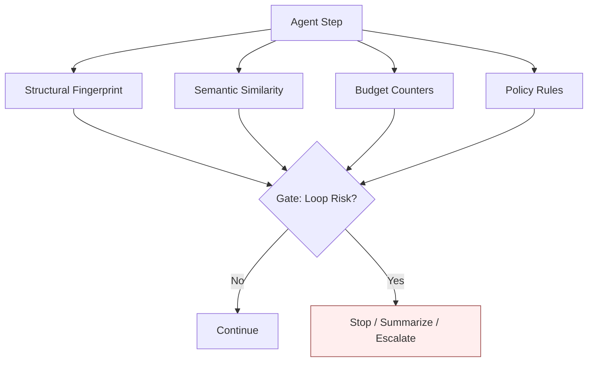
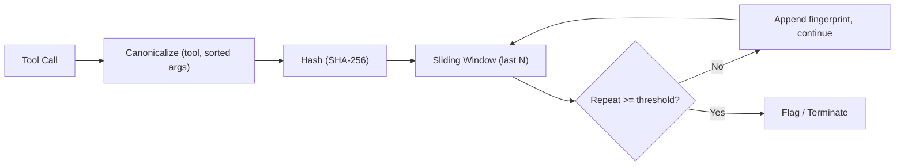
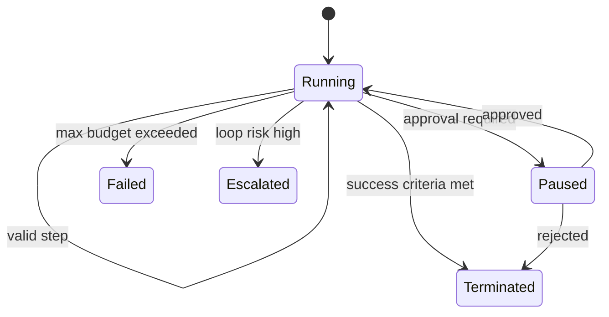

# Non-Determinism, Loops & Termination

> **Interview framing:** *"The model can't be trusted to know when to stop. Design the
> infrastructure that detects loops, enforces token/time/cost budgets, and forcibly terminates,
> pauses, or escalates an agent execution — with token budgets and loop detection as the two
> mechanisms you must go deep on."*

This doc is part of the [agentic AI platform system-design track](system-design.md). It expands
the loop-detection and termination row from the master architecture's failure-mode cheat sheet
("Infinite loop... Max steps + token/time/cost budgets + structural fingerprinting + semantic
similarity + supervisor escalation," [system-design.md §6](system-design.md#6--failure-mode-cheat-sheet))
into a full mechanism design. Generic distributed-systems concerns (retry backoff, circuit
breakers) are assumed background; this doc focuses on what's specific to bounding a
*reasoning loop* whose steps are chosen by a nondeterministic model.

---

## 1 · Problem statement

Agents loop for reasons a traditional retry loop doesn't have to consider:

- **Model output variance.** The same prompt and context can produce a different next action on
  a retry, so "did we already try this" can't be answered by exact request-equality alone.
- **Ambiguous observations.** A tool result that's technically valid but doesn't resolve the
  agent's uncertainty (e.g., an empty search result) can send the agent back to the same plan
  repeatedly, each time phrased slightly differently.
- **Tool failures.** A flaky or misbehaving tool can cause the agent to retry the same
  (semantically) call indefinitely, believing each retry is a new idea.
- **Underspecified success criteria.** If "done" isn't a testable condition, the model has no
  reliable signal to stop on and will keep proposing "one more step."

The core design principle: **termination is a property of the infrastructure, not a property of
the model's judgment.** The model is asked to decide *what to do next*; it is never the sole
authority on *whether to keep going*. That authority sits in budgets, fingerprinting, and policy
rules evaluated outside the model call, consistent with the platform's core thesis that the LLM
proposes intent and deterministic infrastructure governs what actually happens
([system-design.md](system-design.md)).

---

## 2 · Loop detection architecture

Each of the four checks catches a different failure shape; a production system runs all four in
parallel on every step rather than picking one.

### Structural fingerprinting

Hash the normalized `(tool name, normalized arguments)` tuple for each recent tool call (and
optionally the plan text) and compare against a sliding window of recent fingerprints. An
exact or near-exact repeat — the same tool called with the same (or trivially reordered/
whitespace-different) arguments within a bounded window — is a strong loop signal. This check is
cheap, deterministic, and catches the most common case: an agent re-issuing the same failing tool
call because the observation didn't change its plan.

**What it misses:** an agent that keeps trying *semantically* the same idea while varying surface
details — different search query wording, slightly different tool arguments, different phrasing
of the same flawed plan. That's the gap semantic similarity is for.

#### How It Actually Works: Canonicalize → Hash → Sliding Window

The mechanism behind "hash the normalized tuple" is a three-step pipeline:

1. **Canonicalize.** Represent each tool call as `(tool_name, sorted(args.items()))` — sort the
   argument key-value pairs, and normalize whitespace/casing/types (e.g., `"5"` and `5` should
   canonicalize to the same value) before anything is hashed.
2. **Hash.** Feed the canonical representation through a fixed-size hash (e.g., SHA-256) to get a
   compact fingerprint. Hashing, not storing the raw tuple, keeps comparison $O(1)$ and the
   sliding window's memory footprint fixed regardless of how large the arguments are.
3. **Slide and compare.** Maintain a fixed-size sliding window of the last *N* fingerprints. On
   each new step, check whether the new fingerprint already appears in the window beyond a
   configured repeat threshold (e.g., "same fingerprint 3+ times in the last 10 steps") — if so,
   flag or terminate.

**Canonicalization is the step that makes or breaks this check.** Two calls to the same tool with
identical semantics but differently-ordered keyword arguments (`{a: 1, b: 2}` vs. `{b: 2, a: 1}`),
or the same value in a different type/format (`"5"` vs. `5`, extra trailing whitespace in a
string argument), are *semantically identical* but would hash to two different fingerprints
without canonicalization — silently defeating the whole check. Sorting args and normalizing types
before hashing is not an optional cleanup step; it's the difference between the check working and
the check missing the exact loops it exists to catch.

### Semantic similarity

Embed the recent reasoning/observation text (the plan rationale and/or the tool result summary)
for each step and compute similarity against a window of prior steps. A sustained high-similarity
cluster — the agent's reasoning is a paraphrase of a previously failed approach — is a loop
signal that structural fingerprinting cannot see, because the tool arguments differ even though
the underlying strategy hasn't changed. This is the check that catches "the agent keeps trying
to solve the same sub-problem a different way, without ever escalating or changing course."

#### How It Actually Works: Embed → Pairwise Cosine Similarity → Threshold

The mechanism: embed the last-*k* thoughts/action descriptions (plan rationale or observation
summaries) into vectors, compute **pairwise cosine similarity** between the current step's
embedding and each of the prior *k* steps, and flag a loop if similarity exceeds a tuned
threshold across consecutive (or a majority of recent) steps.

> **Trade-off — threshold tuning is not a solved problem**
>
> - **Threshold too low (trips too easily):** false positives — the check kills a legitimately
>   iterating agent, e.g. one incrementally refining a document draft, where each step is
>   deliberately similar to the last by design.
> - **Threshold too high (trips too rarely):** false negatives — paraphrased repetition slips
>   through, because rewording a failed approach lowers cosine similarity just enough to dodge
>   detection even though the underlying strategy hasn't changed.
>
> This is a precision/recall trade-off you tune per workload, not a fixed constant you set once —
> a "research agent" profile and a "single-shot task" profile should not share the same threshold
> (see the enterprise/startup table in Section 6 and the research-shaped budget profile in
> [Section 5, failure #1](#5--failure-modes)).

### Budget counters

Hard ceilings on step count, cumulative token count (input + output), wall-clock time, and dollar
cost. These are not "loop detectors" in the semantic sense — they're the backstop that fires
**even when both fingerprinting checks fail to recognize a loop**, because they don't depend on
recognizing a pattern at all, only on counting a resource. This is your last line of defense
against runaway cost, and it's covered in depth in [Section 4](#4--token-budgets-in-depth).

### Policy rules

Deterministic, human-authored constraints independent of pattern detection — e.g., "no more than
N calls to the same mutating tool per execution, regardless of arguments," or "no more than one
`send_email` call without an intervening approval." These exist because some risks (mutating a
system repeatedly) are unacceptable regardless of whether the calls *look* like a loop —
a policy rule fires on the Nth call even if each call had genuinely different arguments and would
never trip structural or semantic detection.

**Gate logic:** the gate should be an OR across the four checks (any one tripping is enough to
route to Stop/Summarize/Escalate), each independently tunable in sensitivity, because they're
designed to catch different failure shapes rather than confirm each other.

---

## 3 · Termination control (state machine)

Detecting loop risk is only half the design — the other half is what states an execution can be
in and which transitions are allowed.

Notes on transitions that are easy to get wrong:

- **`Running → Paused` must write a checkpoint before pausing**, per
  [05 §2 — the State DAG](05-state-management-and-memory.md#2--the-agent-state-dag): resuming a
  paused execution should read the approval decision from durable state, never from an in-memory
  flag held by a process that may have been rescheduled.
- **`Paused → Terminated` (rejected) is a distinct outcome from `Running → Failed`.** A human
  rejecting a proposed action is a governed, expected outcome, not a budget failure — keep them
  as separate terminal states so downstream metrics/alerts don't conflate "the agent ran out of
  budget" with "a human said no."
- **`Running → Escalated` is not automatically terminal.** Escalation hands control to a
  supervisor (human or a higher-privilege agent, see
  [09 — Multi-Agent Communication Patterns](09-multi-agent-communication-patterns.md)) who can
  resume, redirect, or terminate — model this as its own state rather than folding it into
  `Failed`, because the two require different runbooks.
- **`Escalated` needs the identical timeout treatment as `Paused`, for the identical reason.** A
  supervisor who never responds leaves an execution waiting forever just as surely as an
  unanswered approval request does — this is not a different problem needing new reasoning, it's
  the exact same "paused on an external decision-maker" shape applied to a different
  decision-maker. Attach an escalation-timeout to every `Running → Escalated` transition and, on
  timeout, transition to `Terminated` (fail-safe default) or to a *second-tier* escalation with a
  wider timeout — never leave `Escalated` unbounded just because the supervisor is "probably more
  reliable" than an ad hoc human approver.
- **`Paused` needs a timeout**, or an execution can wait forever for an approval that never
  arrives — see [Section 5, failure #5](#5--failure-modes).

---

## 4 · Token budgets in depth

Token budgets are the mechanism most directly asked for in this doc's brief, and they operate at
three nested scopes, each with different enforcement semantics:

| Scope | What it bounds | Typical boundary behavior |
|---|---|---|
| Per-step token ceiling | Input + output tokens for a single model call | **Hard stop at the call level** — truncate/reject the call before it's sent, or reject an oversized response; a single step should never be allowed to consume an outsized fraction of the execution budget |
| Per-execution cumulative token ceiling | Total tokens across every step in one execution | **Soft warning** at ~70–80% (surface to the running trajectory/telemetry), **hard stop** at 100% — transition to `Failed` in the termination state machine (Section 3) if the execution hasn't already reached `Terminated` |
| Per-tenant daily/monthly token budget | Total tokens across all executions for a tenant over a billing/usage window | **Soft warning + throttling** as the tenant approaches the cap (e.g., deprioritize in the scheduler, per [system-design.md §3](system-design.md#3--plane-by-plane-responsibility-map) admission control); **hard stop or require-approval-to-continue** once exceeded, so a single runaway tenant can't silently blow through a shared cost budget |

The three scopes are deliberately independent and layered — an execution can be well within its
per-execution ceiling and still be blocked by a per-tenant cap, and a single step can be rejected
for being oversized even if the execution as a whole has budget remaining. This mirrors the
budget-manager component in the Control Plane of the master architecture
([system-design.md §2](system-design.md#2--master-architecture)).

#### How It Actually Works: Pre-Call Token Estimation, Not Post-Hoc Checking

Enforcing a "hard stop at the call level" (per-step ceiling, above) only works if the check
happens *before* the call is sent, using an accurate estimate of what the call will cost:

- **Use the actual tokenizer for the target model** (e.g., `tiktoken` for OpenAI models, the
  model-specific tokenizer for others) to count input tokens precisely, and estimate output
  tokens from the requested `max_tokens`/completion-length parameter — not a rough word-count or
  character-count heuristic, which can be off by a wide margin depending on language, code vs.
  prose, and tokenizer vocabulary.
- **Check the estimate against the remaining budget before the call is sent.** If the estimated
  cost of a single call would exceed the remaining per-execution or per-tenant budget, reject or
  truncate the call *before* it goes out — don't send it and check afterward.

> **Trade-off — why post-hoc budget checking is unsafe**
>
> Checking budget only *after* a call returns means a single expensive call (a huge context
> dump, a runaway `max_tokens`) can already have incurred its full token cost, latency, and
> dollar spend before you even learn you were over budget — by then the damage (cost, and
> potentially a rate-limit or quota violation with the model provider) is already done. Pre-call
> estimation is what makes the per-step ceiling in the table above an actual **hard** stop rather
> than an after-the-fact observation.

What should happen at each boundary is a design decision worth stating explicitly in an
interview, because "just stop" is an incomplete answer:

- **Soft warning:** annotate the trajectory/telemetry, don't interrupt execution — lets
  observability and the caller see budget pressure building without forcing a decision yet.
- **Hard stop:** transition the execution to `Failed` (per-execution) or block new executions
  (per-tenant) — no further model or tool calls are permitted; the platform must still be able to
  summarize whatever partial progress exists (see [Section 5, failure #2](#5--failure-modes)).
- **Requiring approval to continue:** used at the boundary where continuing is *possible* but
  costly enough to need a human or a higher-privilege policy to explicitly authorize it (e.g., a
  tenant that's hit their soft cap but has a legitimate reason to keep going) — this reuses the
  `Running → Paused` transition from Section 3 rather than inventing a new state.

#### Trade-offs: Budget-Exhaustion Policy

Beyond *when* to stop, there's a separate design decision for *what happens* once a budget is
actually exhausted — three real policies, each with a different cost/quality/latency profile:

> | Policy | Cost predictability | Task completion | Latency / complexity added |
> |---|---|---|---|
> | Hard-stop | Best — a predictable, fixed ceiling per execution/tenant | Worst — can abandon a task one step from completion, with no partial-credit mechanism beyond summarizing what exists | None — simplest to implement |
> | Escalate-to-human | Bounded by human response time, not model cost | Best — a human can approve continuation and let the task finish | Adds latency; requires a working HITL path ([11 — Governance, Guardrails & Security](11-governance-guardrails-and-security.md)) to actually be viable, not just a state transition on paper |
> | Degrade-to-cheaper-model | Good — keeps cost bounded while allowing continuation | Uncertain — the task can still complete, but a weaker model may silently produce lower-quality output | Low latency cost, but adds the hardest-to-detect risk: quality regression that doesn't trip any automated check |

None of these is universally correct — the choice depends on how expensive an abandoned task is
versus how expensive a wrong/low-quality answer is for a given use case, which is exactly the
kind of judgment call an interviewer is listening for rather than a single "right" policy.

---

## 5 · Failure modes

| Failure | Root cause | Mitigation |
|---|---|---|
| False-positive loop stop on valid deep research | Semantic/structural thresholds tuned too aggressively for legitimately long, iterative investigation | Separate budget profile for "research-shaped" executions (higher step/token ceiling, wider similarity window) and prefer `Escalated` over `Failed` for ambiguous cases so a supervisor can confirm rather than kill outright |
| False-negative runaway loop | Loop detection too permissive (similarity threshold too high, fingerprint window too short) | Budget counters (Section 4) are the deliberate backstop — they must fire independent of whether fingerprinting/similarity recognized the pattern |
| Multi-agent livelock | Two or more agents stuck responding to each other, each individually within its own step/token budget | Track cross-agent interaction counts as their own fingerprint dimension (not just single-agent tool-call fingerprints); a supervisor confidence check ([09 — Multi-Agent Communication Patterns](09-multi-agent-communication-patterns.md)) should monitor conversation-level, not just agent-level, budgets |
| Retry storm after a transient tool failure | Naive retry-on-failure logic treats every transient error as "try again," compounding structural fingerprint hits | Exponential backoff with jitter at the tool-gateway layer (generic background), plus counting retries against the same structural-fingerprint budget so repeated retries still trip loop detection |
| Agent waiting forever for an approval that never comes | `Paused` state has no timeout policy | Attach an approval-timeout to every `Running → Paused` transition; on timeout, transition to `Terminated` (rejected-by-default) or `Escalated`, never leave an execution parked indefinitely holding budget/leases |
| Agent waiting forever for a supervisor that never responds | `Escalated` state has no timeout policy — same shape as the `Paused` gap above, applied to a different decision-maker | Attach an escalation-timeout to every `Running → Escalated` transition identical in spirit to the `Paused` fix; on timeout, terminate (fail-safe) or widen to a second-tier escalation, never leave `Escalated` unbounded |

---

## 6 · Enterprise vs. startup recommendation

| | Enterprise | Startup |
|---|---|---|
| Loop control layers | Max steps + token budget + wall-clock budget + repeated-tool structural fingerprint + semantic similarity + supervisor confidence scoring | Max steps + max tool calls + repeated-action detection + manual kill/resume controls |
| Budget scopes | Per-step, per-execution, and per-tenant token budgets, all enforced (Section 4) | Per-execution step/tool-call ceiling; per-tenant budget tracked but enforced manually at first |
| Escalation | Dedicated supervisor role/agent with confidence scoring, automated `Escalated` routing | A human operator manually inspects and kills/resumes via an admin tool |
| Approval timeouts | Policy-configurable per action risk tier | A single global timeout is acceptable initially |

As with the state/memory doc, the startup answer is a legitimate design point on its own — naming
"manual kill/resume controls" explicitly for a small deployment is a stronger interview answer
than reaching for supervisor confidence scoring on day one.

---

## 7 · Interview questions

1. **How do you detect a semantic loop?**
   Embed the reasoning/observation text of recent steps and compare similarity against a sliding
   window; a sustained high-similarity cluster indicates the agent is paraphrasing a previously
   failed approach even though the literal tool calls differ — this is what structural
   fingerprinting (exact/near-exact repeat detection) cannot see (Section 2).

2. **How do you distinguish long-running legitimate work from livelock?**
   Give research-shaped or multi-step-by-design executions a wider budget profile and prefer
   escalation over hard termination when detection is ambiguous, so a supervisor can confirm
   real livelock (e.g., cross-agent repetition with no new information gained) versus a slow but
   genuinely progressing investigation (Section 5, failure #1).

3. **What should happen when an agent reaches a budget?**
   Depends on the scope and boundary: soft warnings annotate telemetry without interrupting;
   hard stops transition the execution to `Failed` (or block new tenant executions) and force a
   summarize-what-we-have step; some boundaries route to `Paused` requiring explicit approval to
   continue rather than an unconditional stop (Section 4).

4. **Where should loop detection run — model prompt, runtime, or a separate supervisor?**
   Structural/semantic/budget/policy checks belong in the runtime or a dedicated supervisor
   component — never solely in the model prompt ("please stop if you're looping"), because that
   makes termination a property of model judgment rather than infrastructure, contradicting the
   platform's core authority-boundary principle ([system-design.md](system-design.md)). A
   supervisor is preferable at scale because it can reason across multiple agents' interactions
   (multi-agent livelock), which a single agent's own runtime checks cannot see.

5. **How do you debug a terminated execution after the fact?**
   Every transition in the termination state machine (Section 3) should be a checkpointed,
   traced event — replay the execution via the event log and version metadata
   ([05 — State Management & Memory](05-state-management-and-memory.md)) and inspect which
   specific check (structural, semantic, budget, or policy) tripped the gate, using the
   correlated trace ([08 — Observability, Tracing & Health](08-observability-tracing-and-health.md))
   to see the exact step where risk was flagged.

---

## Quick Revision Notes

- Termination is enforced by infrastructure, never left to the model's own judgment.
- Four parallel loop checks, each catching a different shape: structural fingerprint (exact/
  near-exact repeats), semantic similarity (paraphrased repeats), budget counters (resource
  ceilings, fire regardless of pattern recognition), policy rules (deterministic hard limits).
- Budget counters are the backstop that catches what fingerprinting misses — they must be
  independent of pattern detection.
- Token budgets are layered: per-step ceiling, per-execution cumulative ceiling, per-tenant
  daily/monthly budget — each with its own soft-warning / hard-stop / require-approval behavior.
- The termination state machine has five states beyond `Running`: `Paused`, `Terminated`,
  `Failed`, `Escalated` — keep rejected-by-human and failed-by-budget as distinct outcomes.
- `Paused` needs an approval timeout, or an execution can wait forever.
- `Escalated` needs the identical timeout treatment as `Paused` — a supervisor that never
  responds is the same unbounded-wait bug wearing a different decision-maker's name.
- Enterprise: layered loop control + all three budget scopes + supervisor confidence scoring.
  Startup: step/tool-call ceilings + manual kill/resume.
- Structural fingerprinting = canonicalize `(tool_name, sorted(args.items()))` → hash (e.g.
  SHA-256) → sliding-window repeat check; skip canonicalization and reordered/differently-typed
  args silently defeat the whole check.
- Semantic similarity = embed recent thoughts → pairwise cosine similarity → threshold; threshold
  tuning is a real precision/recall trade-off — too low kills legitimate iteration, too high
  misses paraphrased loops.
- Budget checks must use a pre-call token estimate from the model's actual tokenizer, not a
  word-count heuristic or a post-hoc check — otherwise a single oversized call can blow the
  budget before you find out.
- Budget-exhaustion policy is its own trade-off: hard-stop (predictable, can abandon near-done
  work) vs. escalate-to-human (preserves completion, needs a working HITL path) vs.
  degrade-to-cheaper-model (keeps going, but quality risk is hard to detect automatically).

## Further Reading

- ReAct: Synergizing Reasoning and Acting in Language Models — <https://arxiv.org/abs/2210.03629>
- LangGraph persistence (checkpointers vs. stores) — <https://docs.langchain.com/oss/python/langgraph/persistence>
- OpenAI tiktoken — reference tokenizer implementation for accurate pre-call token counting — <https://github.com/openai/tiktoken>
- Reimers & Gurevych — Sentence-BERT: Sentence Embeddings using Siamese BERT-Networks — <https://arxiv.org/abs/1908.10084>
- Back to the [master platform doc](system-design.md)
- Related: [05 — State Management & Memory](05-state-management-and-memory.md),
  [09 — Multi-Agent Communication Patterns](09-multi-agent-communication-patterns.md),
  [11 — Governance, Guardrails & Security](11-governance-guardrails-and-security.md)
