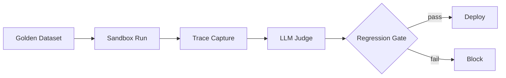
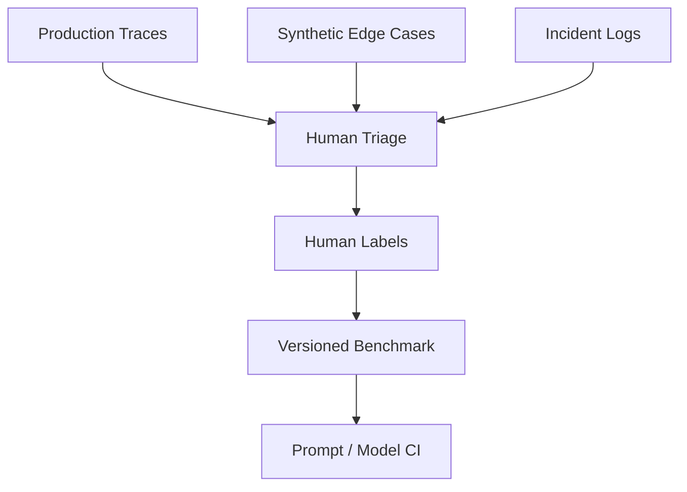
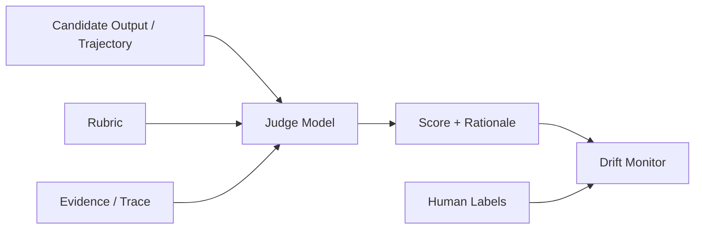
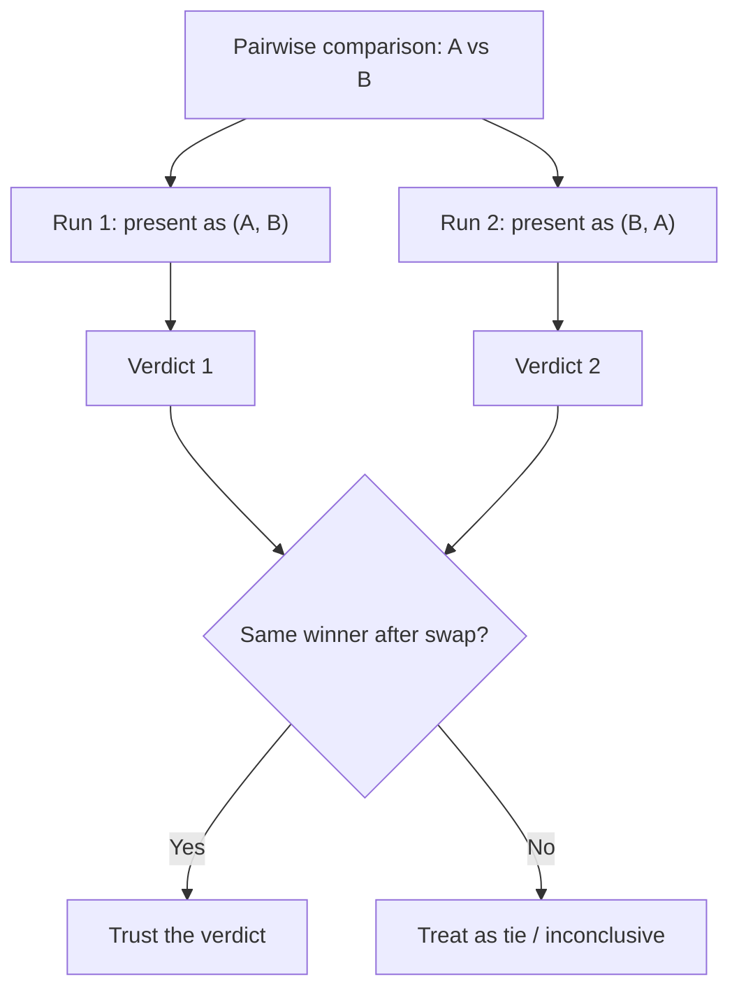

# Agent Evaluation Frameworks

> **Interview framing:** *"How do you evaluate an AI agent when there's no single correct
> answer, the agent takes multiple steps to get there, and manually grading every run doesn't
> scale?"*

This is deep-dive doc **07** in the `agentic-ai-system-design/` track. Start with the
[uber doc](system-design.md) for the full platform picture — this document expands the
**Evaluation** plane from its Section 3 plane map and Section 5 memorization item #8
("Evaluation covers output quality, trajectory validity, safety, latency, cost, and recovery
behavior — not just 'did it get the right answer'").

**Scope note:** this doc assumes you already know unit testing, CI regression gates, and
offline/online A-B evaluation as generic concepts. It only covers what changes when the thing
under test is a nondeterministic, multi-step, tool-using LLM agent instead of a deterministic
function with one input and one expected output.

> **Interview prep:** First pass → sections 1–4 (problem, golden dataset lifecycle, LLM-as-judge, regression gate). **What interviewers probe:** “What’s the difference between output evaluation and trajectory evaluation, and why does an agent need both?” and “What does a ‘label’ mean for an agentic task — why is it harder than a label for a classification task?” **Opening narrative:** output vs. trajectory evaluation → golden dataset lifecycle → LLM judge mechanics → regression gate → position bias mitigation.

---

## 1 · Problem statement

Traditional software testing is comfortable: deterministic input, deterministic output, one
assertion, pass or fail. Classic LLM app evaluation (a single prompt → single response) already
breaks that model, because "correctness" becomes a spectrum scored by string similarity,
semantic similarity, or a human/LLM rater. **Agent evaluation is a strict superset of both**,
because a single agent run produces:

| What has to be assessed | Why it's not covered by output-only checks |
|---|---|
| Final answer correctness | Necessary, but the easiest and least agent-specific part |
| Tool-call trajectory | Which tools were called, in what order, with what arguments — invisible if you only look at the final message |
| Policy compliance | Did the agent stay inside its declared scope/permissions while getting there |
| Safety | Harmful content, PII leakage, susceptibility to prompt injection along the way |
| Latency | Wall-clock time to complete, not just token-generation speed |
| Cost | Token spend *and* tool/API spend accumulated across every step |
| Recovery behavior | What happens after a tool errors, times out, or returns something unexpected |

The uncomfortable fact interviewers are testing for: **an agent can produce a textually correct
final answer via a dangerous, redundant, or lucky path**, and an eval harness that only checks
the final string will happily mark that run a "pass." Section 5 of this doc is dedicated to the
technique that catches exactly this — trajectory evaluation.

Because hand-labeling every dimension above at production scale is infeasible, most real
systems delegate scoring to **LLM-as-a-Judge**: another model call that grades the candidate's
output and/or trajectory against a rubric. This is useful and increasingly standard, but it
imports a new reliability problem instead of solving the old one for free — judge models exhibit
measurable bias (favoring fluent/verbose answers, favoring outputs from their own model family),
inconsistency (the same input scored differently across repeated calls), and there is no
industry-standard rubric format, which makes judge scores hard to compare across teams or over
time. The 2024 survey *"A Survey on LLM-as-a-Judge"* (<https://arxiv.org/abs/2411.15594>)
catalogs these failure modes in detail and is the canonical citation for this material — treat
it as required reading before designing a judge pipeline, not optional background.

---

## 2 · The evaluation pipeline

Read this left to right as the thing that runs on every prompt, model, or tool change before it
reaches production:

1. **Golden Dataset** — a versioned, curated set of tasks with expected answers and/or
   acceptable trajectory shapes (Section 3 covers how this is built).
2. **Sandbox Run** — the candidate agent (new prompt/model/tool version) executes every golden
   task in an isolated environment against mocked or replayed tool responses, so the run is
   reproducible and doesn't touch production systems.
3. **Trace Capture** — every LLM call, tool call, and checkpoint from the sandbox run is
   captured as a structured trace (this is exactly the span data produced by the Observability
   plane — see [08 — Observability, Tracing & Health](08-observability-tracing-and-health.md)).
4. **LLM Judge** — scores the final answer and/or the trajectory against the golden task's
   rubric (Section 4).
5. **Regression Gate** — compares the new score distribution against the last known-good
   baseline; a drop beyond a configured threshold blocks the change.
6. **Deploy or Block** — the only two outcomes; there is no "deploy with a warning" for a
   change that regresses the golden set.

**The one deliberate exception to the binary rule: a break-glass path for genuine incident
response.** "No deploy with a warning" is correct for the normal change path, but a platform also
needs an explicit, narrow exception for the case where a golden-set-blocked prompt/tool/model
change is itself the fix for an actively-exploited security hole that can't wait for a full
golden-set + judge run. This is not a third silent outcome bolted onto the pipeline above — it's
a separate, heavily constrained path: requires named human sign-off (never a fully automated
bypass), is itself logged to the [Audit Store](11-governance-guardrails-and-security.md#7--audit-what-must-every-record-contain)
as an explicit override with the blocked regression score attached, and is time-boxed — the
bypassed change must pass the normal gate retroactively within a committed window (e.g. 24-48
hours) or auto-revert. Treat the absence of this path, not its existence, as the real risk: a
team without a sanctioned break-glass process for evaluation gates will improvise one under
incident pressure, off the record, the first time they actually need it.

**The real bottleneck interviewers want you to name is not the judge call itself** — that's a
single extra API call per task and is cheap and fast. The actual hard, expensive, ongoing work
is (a) constructing a high-quality, representative, continuously-refreshed labeled dataset of
tasks *and acceptable trajectories*, and (b) designing a rubric precise enough that a judge model
applies it consistently instead of falling back on "does this sound like a good answer." Teams
that under-invest in dataset and rubric quality end up with an evaluation pipeline that runs
fast and produces numbers nobody trusts.

---

## 3 · Golden dataset generation

| Stage | What feeds it | Why it's a separate source |
|---|---|---|
| Production traces | Real user traffic, sampled (see doc 08 for sampling rules) | Only source that reflects the *actual* input distribution, phrasing, and tool-usage patterns |
| Synthetic edge cases | Adversarial prompts, boundary-value tasks, deliberately ambiguous instructions | Production traffic under-represents rare-but-important cases; you have to manufacture them |
| Incident logs | Every past production incident, once diagnosed | An incident that has bitten you once becomes a permanent regression fixture — this is the agent-world equivalent of "never let the same bug ship twice" |
| Human triage | All three sources above | De-duplicates, filters low-value cases, assigns severity/priority so labeling effort goes to what matters |
| Human labels | Triaged cases | Establishes ground truth: expected final answer (or acceptable answer set), **and** an acceptable trajectory shape / explicitly disallowed paths |
| Versioned benchmark | Labeled cases | Golden datasets are versioned like code (v1, v2, …) — a prompt change is evaluated against a *pinned* version, not "whatever the dataset currently contains" |
| Prompt/Model CI | Versioned benchmark | The automated gate that runs Section 2's pipeline on every prompt, model, or tool change |

The detail interviewers listen for: labels aren't just "the expected string." For an agent, a
label must also encode **what a valid path to that answer looks like** — otherwise you've built
a golden dataset that can only catch output regressions, not trajectory regressions, and you've
silently thrown away half the value described in Section 1.

---

## 4 · LLM-as-a-Judge — mechanics and reliability controls

The judge call takes three inputs — the **candidate** output/trajectory, a **rubric** describing
what "good" means for this task, and the **evidence** (the trace: tool calls, arguments,
observations) — and produces a **score plus rationale**. Always require the rationale, not a
bare number: a score with no explanation is undebuggable the first time someone asks "why did
this run fail evaluation?" Both the judge's scores and a stream of human labels feed a
**drift monitor**, which is what lets you detect when the judge itself has started disagreeing
with humans more than it used to (Section 7 covers this failure mode in depth).

#### Internals: Pointwise vs. Pairwise Scoring

There are two fundamentally different ways to ask a judge model to produce that score:

- **Pointwise scoring** — the judge sees a single candidate response and rates it in isolation
  against a rubric, typically an absolute scale (e.g., a 1-5 Likert score for "helpfulness" or
  "correctness"). One judge call per candidate, so scoring `n` candidates costs `O(n)` judge
  calls.
- **Pairwise comparison** — the judge is shown two candidate responses side by side (A and B)
  and picks the better one, or declares a tie. No absolute number is ever assigned.

Pairwise is generally **more reliable** than pointwise, for the same reason humans are bad at
absolute judgments but good at relative ones: asking "is this a 3 or a 4 out of 5" forces the
judge to invent and hold a stable internal scale across calls, and that scale drifts call to
call and rubric to rubric. Asking "which of these two is better" is a much easier, more
consistent question — the judge only has to make one relative comparison, not anchor an
absolute score. This is why most rigorous LLM-as-judge pipelines — and the human-preference
data behind techniques like RLHF — default to pairwise comparisons rather than Likert ratings
whenever the goal is *ranking* or *preference*, not an absolute quality gate.

The cost is scaling: ranking `n` candidates via pairwise comparison naively requires `O(n²)`
comparisons (every candidate compared against every other). That's fine for "did prompt v2 beat
prompt v1" (n=2, one comparison), but it doesn't scale to ranking, say, 20 candidate responses.
Tournament-bracket approaches (single-elimination, `O(n log n)` comparisons) or Elo/Bradley-Terry-
style rating systems — where each comparison updates a running rating rather than requiring
every pair to be compared — are the standard mitigations; the Chatbot Arena leaderboard is the
best-known production example of Elo-style pairwise ranking at scale.

> **Trade-off — Pointwise vs. Pairwise**
>
> | | Pointwise | Pairwise |
> |---|---|---|
> | Judge calls needed | `O(n)` — one per candidate | `O(n²)` naive; `O(n log n)` with tournament/Elo-style ranking |
> | Reliability | Lower — absolute scales drift across calls | Higher — relative judgments are easier and more consistent |
> | Best used for | Absolute quality gates (regression thresholds, "is this good enough") | Ranking/preference tasks (which prompt/model variant is better) |

### Known judge reliability problems and mitigations

| Problem | What it looks like | Mitigation |
|---|---|---|
| Fluency/verbosity bias | Judge rates longer, more confident-sounding answers higher regardless of correctness | Rubric anchored on task-specific criteria (facts present, tool calls correct), never "quality" in the abstract |
| Positional bias | In pairwise comparisons, the judge favors whichever answer appears first/second | Randomize presentation order, or prefer single-answer absolute scoring over pairwise when possible |
| Self-preference bias | Judge scores outputs from its own model family higher | Use a different model family for the judge than for the agent under test |
| Judge drift | Provider silently updates the judge model; score distribution shifts with no code change | Pin the judge model version explicitly; treat judge upgrades as a change requiring re-calibration |
| No standardized rubric | Every team's "rubric" is an ad hoc paragraph, scores aren't comparable across teams or time | Structured, versioned rubric schema per evaluation dimension (same discipline as prompt versioning) |
| Single point of failure | One judge call, one opinion, no error bars | Ensemble of judges (majority vote or averaged score) for high-stakes decisions |

#### Internals: Position Bias Mitigation

Position bias — a judge favoring whichever response is shown first (or, less commonly, second)
regardless of actual quality — is one of the best-documented pairwise judge failure modes. It's
a mechanical artifact of how the judge attends to its prompt, not a genuine preference signal,
and it can flip a verdict just by swapping which response is labeled "A" and which is labeled
"B."

The standard, concrete mitigation is **order-swapped double-judging**:

1. Run the pairwise comparison once as `(A, B)` — response A first, response B second — and
   record the verdict.
2. Run the *same* comparison again as `(B, A)` — swap the presentation order — and record that
   verdict.
3. Only trust the result if both runs agree on the same winner once the swap is accounted for
   (i.e., "A wins" in the first run and "A wins" again in the second run, even though A is now
   shown second). If the two runs disagree, treat the comparison as a **tie / inconclusive**
   rather than arbitrarily picking one of the two contradictory verdicts.

> **Trade-off:** order-swapped double-judging doubles the judge calls per pairwise comparison
> (2× cost/latency) in exchange for a mechanical check that filters out position-biased
> verdicts instead of silently trusting them. For a high-stakes regression gate (Section 2), that
> 2× cost is cheap insurance; for large-scale exploratory/offline analysis, some teams instead
> randomize (rather than swap-and-check) presentation order, washing out the bias statistically
> across many comparisons instead of catching it per-comparison.

**Reliability controls to always include, not optional extras:**

- Multiple judges (ensemble) with majority vote or averaged score for anything that gates a
  production deploy.
- A frozen calibration subset scored by humans, re-run periodically against the live judge to
  detect drift (Section 7).
- A confidence/ambiguity flag from the judge itself — route low-confidence judgments to a human
  reviewer instead of trusting the automated score blindly.
- Required rationale/chain-of-thought from the judge so a human can audit *why* a score was
  assigned, not just *what* the score was.

#### Internals: Self-Consistency / Majority Voting

A single judge call is one stochastic sample from the judge model's output distribution —
temperature, sampling, and prompt sensitivity all mean the *same* judge, given the *same*
candidate and rubric, can produce a different score or verdict on repeated calls.
Self-consistency (also called majority voting or self-ensembling) addresses this directly:

- Run the same judge prompt against the same candidate **N times** (e.g., N=3 or N=5), optionally
  at a non-zero temperature so the samples actually vary, and take the majority verdict
  (pairwise) or the mean/median score (pointwise).
- A stronger variant runs the **same rubric across multiple different judge models** — one call
  each to two or three different model families — and takes a majority/averaged verdict across
  models instead of across repeated calls to a single model. This also mitigates self-preference
  bias (the reliability table above), since no single model's bias dominates the ensemble.

> **Trade-off:** self-consistency trades cost/latency for reduced noise — N repeated judge calls
> cost N× as much and take (at best) N× as long if run sequentially, in exchange for a verdict
> that isn't at the mercy of one stochastic sample. N=3 or N=5 is the common sweet spot: enough to
> catch a one-off flaky verdict via majority vote, without the cost blowing up the way it would
> at N=20. Reserve full self-consistency for decisions that actually gate a deploy (Section 2's
> Regression Gate), not every judge call in a large sampled online-eval stream, where the
> aggregate signal across many samples already averages out single-call noise.

---

## 5 · Trajectory evaluation — the agent-specific core

This is the technique that has no real analog in traditional software or single-turn LLM
evaluation, and it is the section interviewers expect the most depth on.

**Definition:** trajectory evaluation scores the *path* the agent took — the ordered sequence of
reasoning steps, tool calls, and observations — **independent of whether the final answer text
happened to be correct**. An agent can reach a correct final answer through an inefficient,
redundant, or outright unsafe sequence of actions, and trajectory evaluation is the only
technique that catches this, because output-only evaluation is blind to everything that happens
before the last message.

### Worked example (the one to have ready in an interview)

Task: "Refund this customer $50." Both trajectories below terminate with the identical final
message: *"Refund issued, $50, confirmation #123."* An output-only evaluator scores both a pass.

- **Trajectory A (healthy):** `check_order` (1 call) → `check_refund_policy` (1 call) →
  `issue_refund` (1 call). Three steps, each necessary, correct authorization order, minimum
  viable tool usage.
- **Trajectory B (unhealthy):** `issue_refund` called immediately with a guessed order ID → fails
  → retried four more times with different guessed IDs until one happens to match → refund
  issued with **no policy check ever performed** → agent then calls the customer's payment API
  directly to "double check," pulling card details that were never needed for this task.

Trajectory B is a policy violation (mutating call before an eligibility check), a security
incident (unnecessary access to card data), and grossly inefficient (seven tool calls where
three sufficed) — and it is invisible to anything that only reads the final message. This is
the concrete answer to "how do you evaluate tool-call relevance/trajectory quality" (Section 9,
question 5).

### Dimensions of trajectory quality

| Dimension | What it measures | Example violation |
|---|---|---|
| Efficiency | Steps taken vs. minimum viable steps | Duplicate calls, unnecessary retries with no new information |
| Necessity / relevance | Was each tool call's output actually used | A tool is called but its result never appears in the agent's later reasoning |
| Ordering / dependency correctness | Were prerequisite checks done before mutating calls | Refund issued before the eligibility check ran |
| Safety | Did any step access data or perform an action outside the declared task scope | Reading unrelated customer records "just in case" |
| Redundancy | Repeated identical calls with no new information between them | Same lookup called three times with identical arguments |
| Recovery quality | Behavior after a tool error/timeout | Blind repetition of the same failing call vs. a sane retry-with-backoff or escalation |
| Tool selection correctness | Was the narrowest correct tool chosen from the registry | Using a broad `delete_all` tool instead of a scoped `delete_one` |

### How it's actually scored

Best practice is a two-tier approach, cheapest checks first:

1. **Structural / programmatic checks** run first, before any judge call: disallowed tool
   sequences, call-count thresholds, banned tool pairs (e.g., a read-only agent's trace should
   never contain a `write_*` call), missing prerequisite calls. These are deterministic, free of
   judge-reliability problems, and catch the most severe (policy) violations for near-zero cost.
2. **LLM judge over the full trace** for the nuanced dimensions structural rules can't express —
   "was this ordering *sensible* given the task," "was this retry strategy *reasonable*" — fed
   the rubric from Section 4 plus the table above as scoring criteria.

#### Internals: Trajectory Comparison Algorithms

The "LLM judge over the full trace" step above still needs a concrete algorithm for *how* a
candidate trajectory is compared against the reference trajectory from the golden dataset
(Section 3). Three algorithms show up in practice, in increasing order of robustness and
decreasing order of cheapness:

- **Step-level exact match** — walk the candidate and reference trajectories in lock-step and
  check whether the agent called the *exact same tool* with the *exact same arguments* at each
  step. Cheapest to compute (pure structural comparison, no LLM call) and fully deterministic —
  but brittle: it fails on equally-valid alternate paths (a different-but-equivalent tool, or a
  different-but-still-correct ordering, both fail this check) and penalizes the agent for taking
  any path other than the one literal reference trajectory that happened to be recorded.
- **Semantic step match** — instead of comparing literal tool/argument strings, ask whether each
  step accomplishes the *same sub-goal* as the corresponding reference step, judged by an LLM
  (does this step's intent match) or by embedding similarity between step descriptions. More
  robust to legitimate variation — an alternate tool or ordering that still achieves the same
  sub-goal can score as a match — but it's more expensive (an LLM call or embedding lookup per
  step) and inherits the same judge-noise and bias problems as any other LLM-as-judge call
  (Section 4).
- **Outcome-only evaluation** — ignore the path entirely and only check the final state/output
  (was the refund issued for the right amount, is the database in the expected end state).
  Simplest and cheapest to implement — but this is exactly the technique the worked example above
  shows failing: it cannot catch a "right answer for the wrong/unsafe reason" (Trajectory B
  reaching the correct refund amount via an unauthorized, policy-violating path).

> **Trade-off — Trajectory Comparison Algorithms**
>
> | Algorithm | Cost | Robust to valid alternate paths? | Catches "right answer, wrong path"? |
> |---|---|---|---|
> | Step-level exact match | Lowest — deterministic comparison, no LLM call | No — penalizes any deviation from the reference | Over-triggers false positives (flags valid alternates as failures) |
> | Semantic step match | Medium-high — LLM/embedding call per step | Yes | Yes |
> | Outcome-only | Lowest — final-state check only | Yes (doesn't inspect the path at all) | **No** — this is its defining blind spot |

Trajectory evaluation's input — the ordered tool calls, arguments, and results — is exactly the
span data the Observability plane already captures (`tool.name`, ordering, timestamps, results).
This is why the Evaluation and Observability planes are tightly coupled in practice: doc 08's
OTel spans are the literal input to doc 07's trajectory judge and structural checks. See
[08 — Observability, Tracing & Health](08-observability-tracing-and-health.md) for the span
schema this depends on.

#### Trade-offs: Programmatic Checks vs. LLM-as-Judge vs. Human Eval

Zooming out from trajectory-specific scoring, the same three-way choice shows up at every layer
of the evaluation stack (Section 2's pipeline, Section 6's dimension table): programmatic
checks, an LLM judge, and a human. The right answer is almost always "all three, at different
points in the pipeline," not "pick one."

| Method | Cost / latency | What it catches | What it misses |
|---|---|---|---|
| Programmatic assertions / regex / schema checks | Cheapest, fastest — zero LLM cost, runs in CI on every commit | Exactly what you explicitly coded for: banned tool sequences, schema violations, call-count limits, disallowed strings | Anything you didn't anticipate — no nuance, no semantic understanding |
| LLM-as-judge | Moderate — one (or a few, with self-consistency) extra model call per task | Nuanced, semantic failures programmatic checks can't express — tone, sensible ordering, "was this retry reasonable" | Inherits judge bias/variance (fluency bias, position bias, self-preference, drift — Section 4) |
| Human eval | Highest — slow, expensive, doesn't scale to every commit or every production run | Ground truth — the only method that can validate whether the *rubric itself* is right, not just whether the candidate matches it | Doesn't scale; used to calibrate/validate the other two methods (Section 4's calibration subset, Section 7's drift detection), not as the default check at production scale |

The interview-ready framing: programmatic checks are the cheap first-pass filter, LLM judges are
the scalable middle layer, and human eval is the calibration source of truth that keeps the LLM
judge honest — never the default evaluator at scale.

---

## 6 · What "evaluate the agent" covers, end to end

| Dimension | Question it answers | Typical technique |
|---|---|---|
| Final answer correctness | Did the agent produce the right output/action | Exact match, semantic similarity, or LLM judge against the golden answer set |
| Trajectory validity | Was the path taken efficient, safe, and non-redundant | Structural rule checks + LLM judge over the trace (Section 5) |
| Policy compliance | Did the agent stay inside its declared scope/permissions | Cross-check against Policy Engine decisions — see [11 — Governance, Guardrails & Security](11-governance-guardrails-and-security.md) |
| Safety | Harmful content, PII leakage, jailbreak susceptibility | Red-team suites, safety classifiers, human review |
| Latency | Time to complete vs. SLA | Direct measurement from trace span duration |
| Cost | Token + tool cost per execution | Aggregated from span attributes — see doc 08's health score inputs |
| Recovery behavior | Did the agent handle tool errors/timeouts sanely | Fault injection during sandbox runs + trajectory judge |

---

## 7 · Failure modes

| Failure mode | What goes wrong | Mitigation |
|---|---|---|
| Judge rewards fluency over correctness | Confident, well-written wrong answers outscore terse correct ones | Rubric anchored to task-specific criteria; require rationale; spot-check against human labels |
| Judge prompt/model drift over time | Provider silently updates the judge model; scores shift with no code change on your side | Pin judge model version; run periodic calibration against a frozen human-labeled subset; alert on distribution shift |
| Dataset overfitting | Prompt is tuned until it passes the golden set, not until it's actually better | Hold out a rotating/unseen slice; refresh the dataset from new production traces on a schedule |
| Synthetic cases missing production distribution | Hand-crafted edge cases don't resemble what users actually do | Weight the golden set by real production traffic segments, not only hand-authored cases |
| Online sampling missing rare high-risk events | Random sampling under-represents the tail where the worst incidents live | Combine random sampling with targeted sampling on policy-denials, escalations, and HITL interventions — never sample those away (see doc 08) |
| Eval cost too high to run on every change | Full golden-set + judge run is expensive; teams start skipping it | Tiered evaluation: fast structural/unit checks on every commit, full golden-set + judge on every prompt/model/tool change, continuous sampled online eval in production |

---

## 8 · Enterprise vs. Startup recommendation

**Enterprise — multi-layer evaluation stack:**

1. Unit prompt tests — fast, deterministic, run on every commit.
2. Golden datasets — versioned, run on every prompt/model/tool change (Section 3).
3. Sandbox simulations — full agent runs in an isolated environment against golden tasks with
   mocked/replayed tool responses.
4. Online sampled traces — continuous evaluation against live traffic, sampled per doc 08's
   rules (never dropping safety-relevant events).
5. LLM judge — trajectory and output scoring (Sections 4–5).
6. Human calibration loop — periodic human review of judge scores to catch drift before it
   compounds.

**Startup — a single, disciplined layer:** one versioned JSONL golden dataset (inputs +
expected answer + acceptable trajectory shape), run automatically on every prompt, model, or
tool change, scored by a single LLM judge, gated by a hard regression threshold (block deploy if
the score drops beyond it). Add the rest of the enterprise stack incrementally as traffic volume
and incident history justify the investment — naming this scaled-down version explicitly in an
interview signals judgment, not just knowledge of the full stack.

---

## 9 · Interview questions

1. **How do you evaluate an agent when there's no single correct answer?**
   Score against an acceptable-answer set using semantic similarity or a rubric-based LLM judge
   rather than exact match, and combine it with trajectory evaluation so multiple valid final
   answers can still be checked for whether the *path* to each was valid.

2. **What belongs in a golden dataset?**
   Production traces (real distribution), synthetic edge cases (adversarial/boundary coverage),
   and incident-derived regression cases — each triaged, hand-labeled with an expected answer
   *and* an acceptable trajectory shape, and versioned like code (Section 3).

3. **How do you detect judge drift?**
   Pin the judge model version, maintain a frozen human-labeled calibration subset, periodically
   re-score it with the live judge, and alert when the score distribution diverges from the
   human baseline (Section 4, Section 7).

4. **What should block a deployment?**
   A golden-set regression beyond threshold, any trajectory rule violation (disallowed tool
   sequence, missing prerequisite check), a safety-suite failure, or a cost/latency regression
   beyond SLA — any one of these should trip the regression gate (Section 2, Section 8).

5. **How do you evaluate tool-call relevance/trajectory quality?**
   Run cheap structural/programmatic checks first (banned sequences, call-count limits, unused
   tool-output detection), then an LLM judge over the full trace scored against a trajectory
   rubric — efficiency, necessity, ordering, safety, redundancy, recovery (Section 5).

---

## Quick Revision Notes

- "Did it get the right answer" is necessary but not sufficient — an agent can reach a correct
  answer via a dangerous or wildly inefficient path.
- The pipeline: Golden Dataset → Sandbox Run → Trace Capture → LLM Judge → Regression Gate →
  Deploy or Block. The bottleneck is dataset/rubric quality, not the judge call.
- The binary deploy/block rule has exactly one sanctioned exception: an audited, time-boxed,
  human-signed-off break-glass override for an active security incident — never a silent bypass.
- Golden datasets combine production traces + synthetic edge cases + incident logs, triaged and
  human-labeled with **both** an expected answer and an acceptable trajectory shape, versioned
  like code.
- LLM-as-a-Judge is useful but biased and inconsistent by default — mitigate with rubric
  anchoring, ensembles, calibration against human labels, and drift monitoring.
- Trajectory evaluation scores the path independent of the final answer: efficiency, necessity,
  ordering, safety, redundancy, recovery, and tool-selection correctness.
- Score structural/programmatic trajectory rules first (cheap, deterministic), then use an LLM
  judge for nuanced trajectory judgments.
- Never sample away rare high-risk events (policy denials, HITL escalations) from online eval.
- Startup: one versioned golden JSONL + one judge + a hard regression gate. Enterprise: layer in
  sandbox simulation, continuous sampled eval, and a human calibration loop.
- Pairwise judge comparisons are more reliable than pointwise Likert scoring (relative judgments
  are easier and more consistent than absolute ones), but scale as O(n²) without tournament- or
  Elo-style ranking.
- Mitigate judge position bias with order-swapped double-judging: run the comparison both ways
  and only trust a verdict that agrees both times, otherwise call it a tie.
- Self-consistency (majority vote across N judge calls or judge models) trades N× cost for
  reduced single-call noise — reserve it for decisions that actually gate a deploy.
- Trajectory scoring spans a spectrum: step-level exact match (cheap, brittle), semantic step
  match (robust, expensive), outcome-only (cheapest, blind to "right answer, wrong path").
- Programmatic checks, LLM judges, and human eval each catch different failure classes — human
  eval's real job is calibrating the LLM judge's rubric, not replacing it at scale.

## Further Reading

- A Survey on LLM-as-a-Judge — <https://arxiv.org/abs/2411.15594>
- ReAct: Synergizing Reasoning and Acting in Language Models — <https://arxiv.org/abs/2210.03629>
- Large Language Models are not Fair Evaluators (position bias in pairwise LLM judging) — <https://arxiv.org/abs/2305.17926>
- Chatbot Arena: An Open Platform for Evaluating LLMs by Human Preference (Elo-style pairwise ranking) — <https://arxiv.org/abs/2403.04132>
- Self-Consistency Improves Chain of Thought Reasoning in Language Models — <https://arxiv.org/abs/2203.11171>
- [System design uber doc](system-design.md) — plane map and full platform architecture
- [08 — Observability, Tracing & Health](08-observability-tracing-and-health.md) — the trace
  data that feeds trajectory evaluation
- [11 — Governance, Guardrails & Security](11-governance-guardrails-and-security.md) — policy
  decisions that trajectory/policy-compliance checks are validated against
- [06 — Non-Determinism, Loops & Termination](06-non-determinism-loops-and-termination.md) —
  loop/budget behavior that recovery-quality evaluation is checking for
