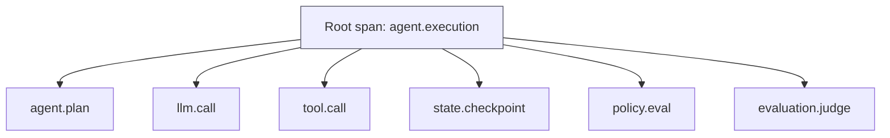
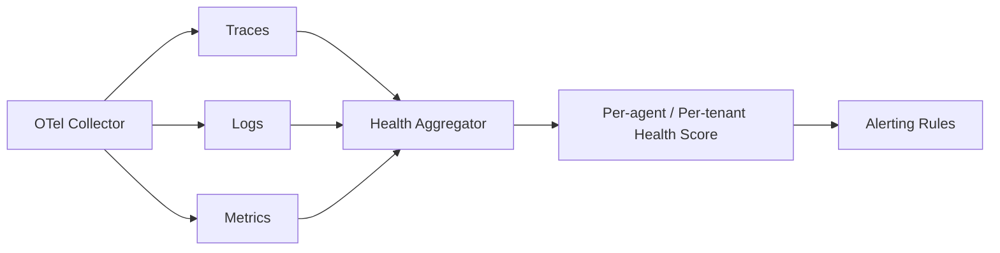

# Observability, Tracing & Agent Health

> **Interview framing:** *"How do you track the health of an AI agent in production — not just
> whether the service is up, but whether the agent is actually reasoning and acting well?"*

This is deep-dive doc **08** in the `agentic-ai-system-design/` track. Start with the
[uber doc](system-design.md) for the full platform picture — this document expands the
**Observability** plane from its Section 3 plane map and Section 5 memorization item #9
("Tracing links model calls, tool calls, checkpoints, policy decisions, and evals into one
correlated execution story"), and directly answers the platform requirement in Section 1's
table: *"Track agent health."*

**Scope note:** this doc assumes you already know generic APM — uptime monitoring, log
aggregation, metrics dashboards, p99 latency alerts. That's background. What's covered here is
what's actually different when the system under observation is a nondeterministic, multi-step,
tool-using agent instead of a stateless request/response service.

---

## 1 · Problem statement

For a stateless web service, "observable" mostly means: is it up, how fast does it respond, and
what's the error rate. For an agent, observability has to answer a much larger question: **what
happened, why it happened, how much it cost, which tools were used, what state changed, and
whether policies and evaluations passed** — because a single "successful" HTTP 200 response can
still hide a run that took a dangerous path, burned an unexpected amount of budget, or silently
failed a safety check.

This is grounded in [OpenTelemetry](https://opentelemetry.io/docs/) (OTel), the vendor-neutral
observability framework for traces, metrics, and logs that has become the de facto standard for
this layer. OTel models a request's path through a system as a **trace**: a tree of **spans**,
each with a trace ID linking it to every other span in the same request, and a parent-child
relationship describing causal structure (<https://opentelemetry.io/docs/concepts/signals/traces/>).
None of that is agent-specific — it's the same model used for any distributed request.

**What is agent-specific** is the shape of the tree and how long it can stay open. A single
user request to an agent isn't one span, and often isn't even one synchronous call chain — it's
a tree that includes multiple LLM calls (reasoning/planning), multiple tool calls (each a
side-effecting call to an external system), state checkpoints, policy decisions, and evaluation
judgments, and it can pause for **hours** waiting on a human-in-the-loop (HITL) approval before
resuming. All of those spans must share one trace ID, even across that async boundary, or you
lose the ability to reconstruct what happened when something goes wrong — which is the central
invariant of this document.

---

## 2 · Span hierarchy

`agent.execution` is the **root span** — one per agent run, created the moment the run is
admitted (see the uber doc's Section 4 lifecycle sequence). Every other span in that run —
`agent.plan` (a reasoning/planning step), `llm.call` (a model invocation), `tool.call` (a
tool/MCP invocation), `state.checkpoint` (a durable state write), `policy.eval` (a policy engine
decision), `evaluation.judge` (a trajectory/output judge score) — is a child of that root and
**inherits its trace ID**, regardless of how many process boundaries, queues, or HITL pauses sit
between them.

**The invariant that matters most in this document:** every tool call, policy decision,
checkpoint, and eval result must propagate and share the root's trace context. If a queued tool
worker or an HITL approval callback fails to carry the trace ID and parent span ID forward, that
span becomes an orphan — unlinked from the run it belongs to — and you lose the ability to
correlate an incident across that boundary. This is the single most common way agent tracing
breaks in practice (Section 5 covers it as a named failure mode), precisely because agent runs
routinely cross async boundaries that ordinary request/response services don't.

---

## 3 · Recommended span attributes

| Attribute | Purpose | Who reads it |
|---|---|---|
| `tenant.id` | Tenancy attribution — every span must be attributable to a tenant for cost/isolation | Billing, capacity planning, incident scoping |
| `agent.id` | Agent-level grouping — which agent definition produced this span | Agent owners, health dashboards |
| `execution.id` | Run correlation — ties every span in one run together (paired with the trace ID) | Debugging, replay tooling |
| `model.name` | Model attribution — which LLM/version generated this step | Cost analysis, model-swap regression triage |
| `prompt.version` | Release debugging — which prompt version was active | Root-causing regressions after a prompt change |
| `tool.name` | Dependency analysis — which tool/MCP server was invoked | Tool-error-rate health signal (Section 4), dependency health |
| `policy.decision` | Safety audit — allow/deny/needs-approval outcome | Governance review, policy-denial-rate health signal |
| `tokens.input` / `tokens.output` | Cost analysis | Cost-per-execution health signal, budget enforcement |
| `checkpoint.id` | Replay link — ties this span to the exact durable state to resume/replay from | Recovery tooling (see [05](05-state-management-and-memory.md)) |
| `eval.score` | Quality correlation — links a span/run to its evaluation outcome | Regression triage, drift monitoring (see [07](07-agent-evaluation-frameworks.md)) |

Treat this table as the minimum standardized attribute set every agent execution span should
carry — Section 6 calls out defining exactly this kind of internal semantic convention as the
enterprise recommendation.

---

## 4 · Agent health

This is the section that directly answers "track the agent health," and it's where agent
observability diverges most sharply from generic service monitoring.

### What "health" means for a nondeterministic reasoning system

A stateless service's health is basically: is it up, is it fast, is it erroring. None of those
tell you whether an *agent* is behaving well, because an agent can be perfectly "up" — every
HTTP call returning 200, every model call succeeding — while its reasoning quietly degrades: it
starts taking more steps to reach the same answers, its tool-error rate on one dependency creeps
up, its eval scores start regressing on a canary prompt version, or its policy-denial rate
spikes because someone is probing it with prompt injection. **None of these show up as a
service-level outage**, which is exactly why they need their own dedicated signals instead of
being inferred from generic uptime/error-rate metrics.

### Agent Health Score — component signals

| Signal | What it captures | Why it matters specifically for agents |
|---|---|---|
| Success rate | % of runs that complete their trajectory without escalation or failure | The core "is the agent actually doing its job" signal |
| Loop-escalation rate | % of runs that hit loop detection and had to escalate (see [06](06-non-determinism-loops-and-termination.md)) | A rising rate means termination controls are being stressed — reasoning is going in circles more often |
| Avg / p95 steps-to-completion | Number of plan/tool steps per run | Trending up = reasoning drift, tool friction, or a regressed prompt — invisible to latency alone |
| Avg / p95 cost per execution | Token spend + tool/API cost per run | Trending up = inefficiency, a provider price change, or a runaway trajectory |
| Policy-denial rate | % of proposed actions the policy engine blocked | A spike is a signal of a possible attack (prompt injection attempt) *or* a broken/misconfigured tool — either way it needs a human look |
| Eval-score trend | Rolling trend of the doc 07 evaluation score on sampled/canary traffic | The regression signal that ties production behavior back to the evaluation plane |
| HITL-approval-wait-time | How long humans are taking to approve/deny pending actions | A proxy for operational load and trust — a growing queue means humans, not the model, are now the bottleneck |
| Tool-error rate per tool/MCP server | Error rate broken out per registered tool, not aggregated | Isolates whether a degradation is agent-side (bad reasoning) or dependency-side (a specific tool/MCP server is unhealthy) |

### Health dashboard data flow

The OTel Collector receives all three signal types — traces, logs, metrics — from every agent
execution. A **Health Aggregator** consumes all three (traces for trajectory-level signals like
steps-to-completion and tool-error-rate, logs for decision records like policy denials, metrics
for cost/latency rollups) and computes the component signals above, **broken out per agent and
per tenant** — a fleet-wide average hides exactly the tenant or agent whose behavior is
degrading. The resulting scores drive **alerting rules**, for example:

- Page on-call if the policy-denial rate spikes beyond baseline within a short window — a
  likely attack or a broken tool, either of which needs immediate attention.
- Page on-call if the eval-score trend regresses on a canary cohort — catch a bad prompt/model
  rollout before it reaches full production traffic.
- Warn if loop-escalation rate doubles week-over-week — termination controls are being stressed.
- Warn if tool-error rate for a single MCP server crosses a threshold — isolate the incident to
  that one dependency instead of investigating the whole agent.
- Page if HITL-approval-wait-time exceeds SLA — approvals are backing up and blocking runs.

A single composite score can be useful as a dashboard headline, illustrated (not prescribed) as
a weighted combination:

$$\text{HealthScore} = w_1 \cdot \text{SuccessRate} - w_2 \cdot \text{LoopEscalationRate} - w_3 \cdot \text{PolicyDenialRate} + w_4 \cdot \text{EvalScoreTrend} - w_5 \cdot \text{NormalizedCost}$$

The exact weights aren't the point and should be tuned per agent/tenant criticality — the point
an interviewer is listening for is that **a single opaque "green/yellow/red" number is useless
to on-call unless it decomposes back into these named, independently-alertable component
signals.** On-call needs to know *which* signal moved before they can act.

---

## 5 · Failure modes

| Failure mode | What goes wrong | Mitigation |
|---|---|---|
| Missing trace context across async boundaries | HITL pauses or queued tool workers don't propagate trace ID/parent span, producing orphaned spans | Explicitly propagate trace context through queues and HITL callbacks — never rely on in-process context alone (Section 2) |
| Sensitive data logged in spans | PII or secrets leak into telemetry via raw tool arguments/results | Attribute allow-list + redaction/scrubbing before export; never log raw payloads verbatim |
| High-cardinality labels overloading the tracing backend | Unbounded values (raw user input, per-session IDs) used as metric labels blow up cardinality | Keep high-cardinality fields in span attributes/logs, never in aggregatable metric labels |
| Sampling dropping rare safety violations | Standard trace sampling drops a policy-denial or safety-escalation span because it's statistically rare | Never sample away policy-denial or safety-escalation spans — keep these at 100% regardless of the sampling rate applied elsewhere |
| Tool spans lacking checkpoint links | A tool span has no `checkpoint.id`, so an incident can't be replayed from that exact point | Every tool span must carry the checkpoint it corresponds to — this is the link back to [05 — State Management & Memory](05-state-management-and-memory.md)'s replay mechanism |

---

## 6 · Enterprise vs. Startup recommendation

**Enterprise:** adopt OpenTelemetry as the platform-wide telemetry layer, with an internal
**semantic convention** defined and enforced for agent execution spans — standardized attribute
names (Section 3's table) applied consistently across every agent and every team, so traces are
comparable and dashboards can be built once and reused fleet-wide.

**Startup:** start with structured logs — JSON log lines carrying `execution.id`, `tool.name`,
and the policy decision for each step is enough to answer "what happened" for a single-agent,
low-volume deployment. Add full OTel tracing once multi-step debugging becomes genuinely
painful — in practice, that inflection point is usually the first incident where reconstructing
"why did the agent do that" from logs alone took hours instead of minutes.

---

## 7 · Interview questions

1. **What is the root span of an agent run?**
   `agent.execution` — created once per run, holding the trace ID that every child span (plan,
   LLM call, tool call, checkpoint, policy decision, eval judgment) shares (Section 2).

2. **How do you attribute cost per tenant/agent?**
   Capture `tokens.input`/`tokens.output` and tool cost as span attributes tagged with
   `tenant.id` and `agent.id`, then aggregate them in the Health Aggregator into avg/p95 cost
   per execution, broken out per tenant and per agent (Section 3, Section 4).

3. **How do you sample telemetry without losing safety incidents?**
   Use tiered sampling: apply a normal sampling rate to routine spans, but keep policy-denial and
   safety-escalation spans at 100% as an explicit exception to the sampling policy, not subject
   to it (Section 5).

4. **What should never appear in telemetry?**
   Raw secrets/credentials, unredacted PII, and full tool payloads containing sensitive customer
   data — enforce this with an attribute allow-list and redaction before export, never by
   convention alone (Section 5).

5. **How do traces connect to replay/checkpoints?**
   Via the `checkpoint.id` attribute on tool/state spans, which links directly to the State
   Plane's durable checkpoint record, letting a trace viewer jump from "this span" to "the exact
   state to resume or replay from" (Section 3, Section 5).

6. **How would you design a health score for a fleet of agents?**
   Decompose it into the named, independently-alertable component signals in Section 4 (success
   rate, loop-escalation rate, steps-to-completion, cost, policy-denial rate, eval-score trend,
   HITL wait time, per-tool error rate), computed per agent and per tenant by a Health
   Aggregator fed from OTel traces/logs/metrics — never collapse straight to one opaque number
   without alerting rules tied to each underlying signal.

---

## Quick Revision Notes

- Agent observability must explain what happened, why, how much it cost, which tools were used,
  what state changed, and whether policy/eval passed — not just "is the service up."
- One root span (`agent.execution`) per run; every child span (plan/LLM/tool/checkpoint/
  policy/eval) shares its trace ID, even across HITL pauses and queued/async execution.
- Standardize span attributes across every agent: `tenant.id`, `agent.id`, `execution.id`,
  `model.name`, `prompt.version`, `tool.name`, `policy.decision`, `tokens.input/output`,
  `checkpoint.id`, `eval.score`.
- Agent health is not "is it up" — a fully "up" agent can still be spiraling into unsafe or
  inefficient reasoning that generic uptime/error-rate monitoring never surfaces.
- Health Score = success rate, loop-escalation rate, steps-to-completion, cost per execution,
  policy-denial rate, eval-score trend, HITL wait time, per-tool error rate — named and
  independently alertable, not one opaque composite.
- Never sample away policy-denial or safety-escalation spans; sample everything else.
- Never log raw secrets, unredacted PII, or full sensitive tool payloads into telemetry.
- Every tool/state span needs a `checkpoint.id` or you lose the ability to replay from it.
- Startup: structured logs first. Enterprise: OpenTelemetry plus an internal semantic convention
  for agent execution spans, applied consistently across every agent and team.

## Further Reading

- OpenTelemetry docs — <https://opentelemetry.io/docs/>
- OpenTelemetry traces (spans, trace IDs, parent-child relationships) — <https://opentelemetry.io/docs/concepts/signals/traces/>
- [System design uber doc](system-design.md) — plane map and full platform architecture
- [05 — State Management & Memory](05-state-management-and-memory.md) — checkpoints that
  `checkpoint.id` links back to
- [06 — Non-Determinism, Loops & Termination](06-non-determinism-loops-and-termination.md) —
  loop-escalation behavior that the health score's loop-escalation-rate signal tracks
- [07 — Agent Evaluation Frameworks](07-agent-evaluation-frameworks.md) — the evaluation scores
  that feed the health score's eval-score-trend signal
- [11 — Governance, Guardrails & Security](11-governance-guardrails-and-security.md) — the
  policy decisions recorded in `policy.decision` and the policy-denial-rate health signal
