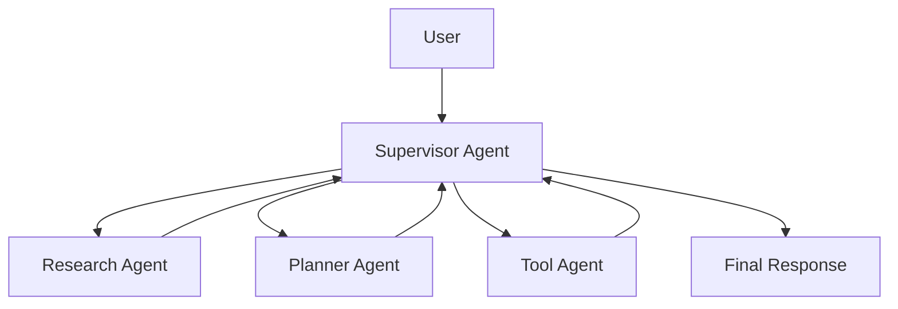
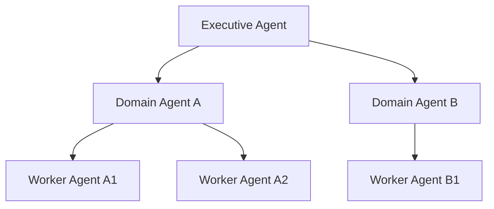
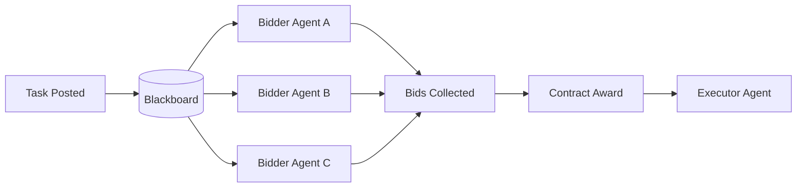
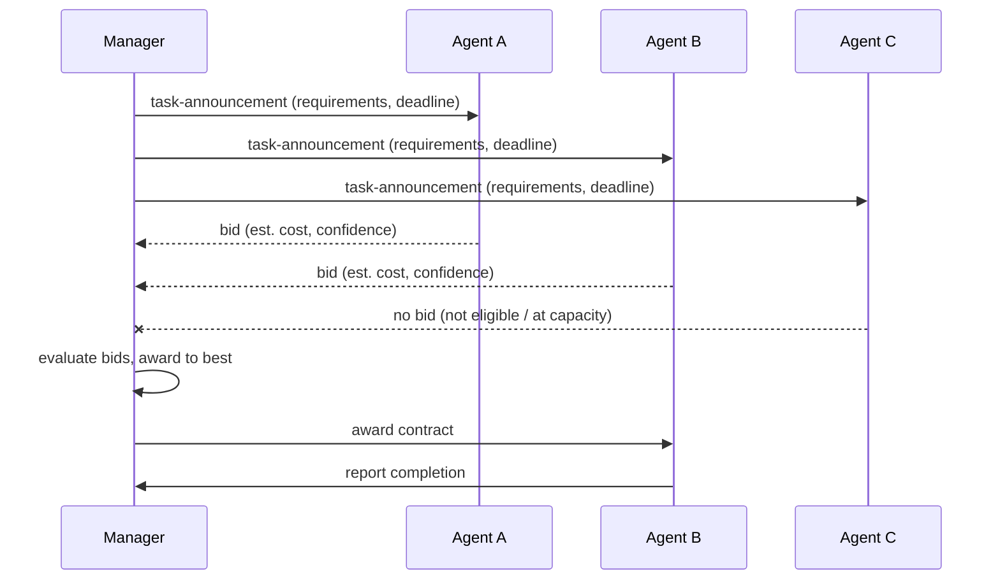

# Multi-Agent Communication Patterns

> **Interview framing:** *"Your single agent works. Now the product wants a research agent, a
> planning agent, and a tool-executing agent to collaborate on one task. How do they talk to
> each other, how do you keep them converging on an answer instead of talking in circles, and
> how do you prove — after the fact — which agent decided what?"*

This doc is part of the [Agentic AI Platform system design track](system-design.md). It zooms
into the **Control** and **Runtime** planes from the [master architecture](system-design.md#2--master-architecture)
and answers the "how do multiple agents coordinate" slice of the platform. For the underlying
loop/budget mechanics each agent uses individually, see
[06 — Non-Determinism, Loops & Termination](06-non-determinism-loops-and-termination.md). For how a
single agent's lifecycle is defined and versioned, see
[02 — Agent Lifecycle & Runtime](02-agent-lifecycle-and-runtime.md).

**Scope note:** generic pub/sub, message queues, and event buses are assumed background — this
doc spends its words on what's different when the "processes" sending messages are LLM-driven
reasoning agents rather than deterministic services: convergence, safety of natural-language
content crossing trust boundaries, and how a platform enforces budgets/policy across agents that
can't be trusted to self-report honestly.

> **Interview prep:** First pass → sections 1–3 (problem statement, coordination patterns, typed envelopes). Sections 4–6 cover tradeoffs, failure modes, and recommendations. **What interviewers probe:** "Why can't you use natural-language prose to convey budget and authority between agents?" and "How does a child agent's authority scope relate to its parent's, and who enforces it?" **Opening narrative:** 4 problems not present in single-agent systems → supervisor as the production default → typed envelope as the governance mechanism → partial pipeline failure and compensation.

---

## 1 · Problem statement

Splitting one agent into several specialized agents (a researcher, a planner, a tool-executor)
is attractive because it mirrors how you'd staff a human team: narrower responsibility per agent
means simpler prompts, tighter tool grants, and easier evaluation of each piece in isolation.
But decomposition creates four problems that don't exist — or exist in much milder form — in a
single-agent system:

1. **Coordination.** Something has to decide who acts next, with what input, and when the
   overall task is actually done. In a single agent this is implicit (the agent's own loop). In
   a multi-agent system it has to be an explicit protocol, or you get agents waiting on each
   other forever, or all racing to act at once.
2. **Convergence.** Multiple reasoning agents, each free to reinterpret the task, do not
   automatically agree. Without a convergence mechanism (a supervisor's decision, a vote, a
   contract award), two agents can loop forever "yes, and—"ing each other, burning budget with no
   terminal state.
3. **Safety.** Agent-to-agent messages are natural language content, generated by a model, being
   fed as input into *another* model. That is a prompt-injection amplifier: if one agent's output
   is compromised (by a poisoned tool result, a malicious document, an adversarial user), and
   that output is passed verbatim into a peer agent's context, the compromise propagates. A
   single agent has one trust boundary (its own tools); a multi-agent system has as many
   boundaries as it has agents, and they're chained.
4. **Auditability.** When five agents jointly produce an outcome, "the agent decided X" is no
   longer a sufficient audit record — you need to know *which* agent decided X, on whose input,
   under whose authority, within what budget, and whether that decision was itself downstream of
   another agent's possibly-wrong output.

The unifying design goal: **communication must be flexible enough for reasoning (agents need to
exchange open-ended natural-language content — hypotheses, partial plans, critiques) and
structured enough for validation (the platform needs to route, meter, and audit that content
without trusting the agents to self-report honestly).** Section 3 below is the concrete
mechanism that resolves this tension.

---

## 2 · Coordination patterns

There is no single "correct" multi-agent topology — the right pattern depends on how much
central control you want versus how much autonomy/parallelism you need. All of the patterns
below are variations on where decision authority and shared state live.

### 2.1 Supervisor (hub-and-spoke)

A single supervisor agent receives the task, delegates sub-tasks to specialist agents, and each
specialist reports its result back to the supervisor — never to each other directly. The
supervisor synthesizes the final answer.



This is the closest multi-agent analog to a single agent's own reasoning loop — the supervisor
*is* the control point, so nearly all of the single-agent governance you already have (budgets,
policy checks, loop detection) can be enforced at one place with minimal new machinery. This is
why it is the default recommendation for production systems (Section 5).

#### Internals: Supervisor Confidence Scoring

A supervisor's job is not just routing sub-tasks — it also has to decide, every time a
specialist reports back, whether to accept the result, ask for a retry with different
instructions, or escalate to a human. **Supervisor confidence scoring** is the mechanism behind
that decision: the supervisor (itself typically an LLM call, sometimes a smaller/cheaper model
than the specialists it oversees) scores its confidence that the specialist's reported result
actually satisfies the sub-task it was given — a distinct judgment from whether the specialist's
output is well-formed, closer in spirit to the [trajectory/output judging in
07](07-agent-evaluation-frameworks.md#4--llm-as-a-judge--mechanics-and-reliability-controls) but scoped to a single
delegation hop instead of a whole execution. Concretely, the inputs to that scoring call are the
original sub-task description, the specialist's full result, and (for cross-agent loop detection)
a count of how many times this same specialist has already been asked to redo this same sub-task
in this conversation — feeding directly into the cross-agent structural fingerprinting described
in [06 — Non-Determinism, Loops & Termination](06-non-determinism-loops-and-termination.md). A
low-confidence score routes back to the specialist with corrective feedback (bounded by the same
retry-budget discipline as any other loop) or, past a retry ceiling, escalates to a human —
exactly the `Running → Escalated` transition [06](06-non-determinism-loops-and-termination.md#3--termination-control-state-machine)
describes, just triggered by the supervisor's judgment instead of a structural/semantic loop
fingerprint.

> **Why this is a startup-vs-enterprise dial, not a day-one requirement:** confidence scoring is
> an additional LLM call on every delegation hop — real added cost and latency for a benefit
> (catching a specialist's subtly-wrong-but-well-formed answer) that mostly shows up at higher
> agent counts and sub-task complexity. A single-supervisor, few-specialist system can start with
> simple heuristic acceptance (did the specialist return a non-empty, schema-valid result?) and
> add confidence scoring once misrouted/silently-wrong specialist results actually show up in
> production evals.

### 2.2 Hierarchical (multi-level delegation)

The supervisor pattern generalizes to more than one level: an executive agent delegates to
domain-level agents, each of which may delegate further to worker agents. Authority and context
shrink as you go down the tree; synthesis happens as results bubble back up.



Hierarchical delegation is what lets a platform scale specialization without every specialist
reporting to one overloaded supervisor. The risk it introduces (Section 4) is that each level can
independently decide "this sub-task also needs decomposing," and without a hard depth/fan-out
limit, delegation depth becomes unbounded.

### 2.3 Group chat (peer collaboration)

All agents share a common conversation thread and contribute turns; there is no fixed supervisor,
though a moderator role (human or agent) may pick who speaks next. This maximizes flexibility —
agents can build on each other's reasoning in-context — at the cost of the convergence and safety
problems from Section 1. Because there's no single authority deciding the loop is done, group
chat is the pattern most prone to non-termination and is treated in this track as a *bounded,
supervised* tool rather than a default production topology.

### 2.4 Blackboard / contract-net

Two related patterns worth pairing because they share a "shared workspace, competitive
allocation" shape:

- **Blackboard**: agents read and write to a shared workspace ("the blackboard") rather than
  messaging each other point-to-point. Any agent whose contribution is currently relevant posts
  to it; other agents watch for updates that unblock their own work.
- **Contract-net**: a task is broadcast, agents *bid* to perform it (based on their own estimated
  capability/cost/confidence), a contract is awarded to the best bid, and the awarded agent
  executes.



Contract-net is attractive when the set of capable agents is dynamic (you don't know in advance
which specialist is best-suited, or capacity varies), but it adds real protocol overhead: you
need a bid schema, a scoring/award function, and a way to handle no-bid or all-bid-low situations.

#### Internals: How Blackboard Control Actually Works

The blackboard pattern has two moving parts, not one:

1. **The blackboard itself** — a shared workspace holding the current problem state (partial
   hypotheses, intermediate results, open questions). Any registered **knowledge source** (a
   specialist agent) can read the current state and write updates to it.
2. **A control component**, separate from every knowledge source, that decides *which* knowledge
   source acts next. This is not a fixed round-robin or priority order — it is **opportunistic
   control**: the controller inspects the current blackboard state and picks whichever knowledge
   source can make the most progress from *this* state, which can be a different agent on every
   iteration.

> **Trade-off — Blackboard**
> - **Strength:** very flexible for ill-structured problems where the right next step genuinely
>   isn't knowable in advance — the controller decides based on what the data actually looks like
>   right now, not a plan written before the run started.
> - **Cost:** because the next actor is chosen dynamically, execution order is hard to predict or
>   debug ahead of time ("why did the critique agent run before the summarizer this time?"), and
>   concurrent writes to shared state need explicit handling (versioning, single-writer-per-key,
>   or a lock) — two knowledge sources racing to update the same blackboard entry is a real
>   failure mode, not a hypothetical one.

#### Internals: How Contract Net Protocol Actually Works

Contract-net is not "broadcast and pick one" in the abstract — it is a specific message sequence,
originally formalized by Reid G. Smith and later standardized by FIPA:

1. **Task announcement.** The manager broadcasts the task to eligible agents, including its
   requirements and a bid deadline.
2. **Bidding.** Each eligible agent that wants the work submits a bid before the deadline —
   typically an estimated cost, confidence, or completion time, not just "yes I can do it."
3. **Award.** The manager evaluates the bids it received and awards the contract to exactly one
   bidder (or re-announces if no acceptable bid arrives).
4. **Report.** The awarded agent executes the task and reports the result back to the manager
   once it completes.



> **Trade-off — Contract Net Protocol**
> - **Strength:** decentralized load balancing — the manager doesn't need to track every agent's
>   exact current load/capability ahead of time; agents self-report fitness for *this* task via
>   their bid, which adapts naturally as agents' availability changes from run to run.
> - **Cost:** the bidding round-trip (announce → bid → award) adds a full extra network/latency
>   hop *before any work starts*. That's a bad fit for latency-sensitive, single-step tasks where
>   the overhead of running an auction exceeds the cost of just picking a default agent.

#### Trade-off: Centralized vs. Decentralized Control

Supervisor (Section 2.1) and contract-net/blackboard (this section) sit at opposite ends of the
same spectrum: where does decision authority live?

| | Centralized (supervisor) | Decentralized (contract-net / blackboard) |
|---|---|---|
| **Where policy/guardrails/observability live** | One place — the supervisor's own decision loop | Scattered — every bidding agent or knowledge source needs its own checks, or a gateway must intercept every peer-to-peer message |
| **Debuggability** | Easier — one call stack to trace, one place execution order is decided | Harder — order emerges from bids or blackboard state at runtime, not from a plan you can read ahead of time |
| **Failure blast radius** | A supervisor outage stalls the whole run — single point of failure | No single agent's failure stops the system — the remaining agents keep bidding/posting |
| **Scalability** | Bottlenecked by the supervisor's own throughput | Scales horizontally — new bidders/knowledge sources join without the coordinator becoming a bottleneck |
| **What you're trading** | Control and predictability | Scalability and resilience |

> Rule of thumb: pick centralized when you need to *bound and prove* what the system will do; pick
> decentralized when the set of capable agents or the right next step is too dynamic to plan for
> centrally — and budget extra effort for testing emergent behavior either way.

> **Aside — when do you actually need distributed consensus?** Contract-net and blackboard both
> avoid full distributed-consensus protocols (Raft, Paxos) because neither requires *strict
> agreement* on a single piece of shared mutable state — a contract-net award has one manager
> deciding, and a blackboard uses single-writer-per-key conventions or optimistic concurrency
> (Section 5's mitigation for shared memory corruption) instead of a vote. Real consensus is only
> needed when multiple agents must agree on one authoritative value with strict consistency
> guarantees — which is rare in practice, because most multi-agent platforms sidestep the problem
> entirely by giving each piece of shared state a single-writer owner instead of allowing
> contested writes.

### 2.5 Swarm (fully decentralized)

Many lightweight, largely autonomous agents work on overlapping pieces of a problem with minimal
central coordination, relying on emergent convergence (majority signal, redundancy, market-like
dynamics) rather than an explicit decision authority. Best suited to exploration/ideation
workloads where diversity of output is the goal and a human or downstream filter picks the
useful results — not to workflows that must reliably terminate with one authoritative outcome.

---

## 3 · The key invariant: typed envelopes

Every pattern above can be implemented safely or unsafely depending on **how messages between
agents are represented**. The invariant that makes multi-agent systems governable:

> **Message *content* can be natural language. Message *routing metadata* must never be.**

Concretely, every inter-agent message should be a structured envelope wrapping a natural-language
(or otherwise unstructured) payload:

```jsonc
{
  "schema_version": "1.2",
  "trace_id": "8f14e45f-...",          // ties this message to the whole execution's trace
  "sender": "agent:research-agent-v3",
  "receiver": "agent:supervisor-v3",
  "message_type": "result",             // result | request | critique | bid | escalation
  "budget_remaining": {                 // enforced by the platform, not self-reported honestly
    "tokens": 4200,
    "tool_calls": 3,
    "wall_clock_ms": 15000
  },
  "authority_scope": ["read:web-search"],  // tool/data grants this message is allowed to invoke
  "content": "Free-text reasoning, findings, or a proposed next step goes here..."
}
```

Why this matters more in multi-agent systems than single-agent ones:

- **Budget enforcement.** If budget remaining is embedded in prose ("I have about 4000 tokens
  left"), the platform has no way to verify it and no way to stop an agent that "forgets" or is
  manipulated into ignoring it. If it's a structured field the *runtime* decrements and checks —
  independently of what any agent claims — a supervisor cannot be talked into over-spending by a
  subagent's optimistic self-report.
- **Policy enforcement across subagents.** `authority_scope` on the envelope, not on the
  subagent's internal state, is what lets the tool gateway (see
  [system-design.md §2](system-design.md#2--master-architecture)) verify that a message asking
  for a tool call actually carries the authority to make it — regardless of what the sending
  agent's own reasoning concluded it was allowed to do.
- **Auditability.** `trace_id`, `sender`, `receiver`, and `message_type` are exactly the fields an
  audit query needs to reconstruct "which agent decided what, in response to which input" without
  re-running an LLM to interpret a transcript after the fact.
- **Injection containment.** Because routing/authority fields are structured and validated by the
  platform (not parsed out of prose by another LLM), a poisoned `content` field cannot forge a
  higher `authority_scope` or a different `sender` — the worst it can do is feed bad *reasoning*
  input to the receiving agent, which evaluation and policy layers can still catch downstream.

The practical rule of thumb: **if a piece of information is used for a routing, budget, or policy
decision, it belongs in the envelope schema, not in the prose the agents exchange.**

#### How It Actually Works: Message Delivery Guarantees

The envelope schema above says nothing about *how many times* a message might arrive — and in a
distributed multi-agent system, that's not a detail you get to ignore:

- **At-least-once** is the realistic default. A message can be delivered — and processed — more
  than once, most commonly when a sender times out waiting for an acknowledgment, retries, and it
  turns out the first attempt actually succeeded; both the original and the retry land on the
  receiver.
- **Exactly-once delivery** is not achievable at the transport level in a distributed system
  without cooperation from the receiver. The only way to get an *effectively-once* result on top
  of an at-least-once transport is for every message handler that causes a side effect to be
  **idempotent** — safe to process twice (or more) without a different outcome than processing it
  once.

> This is exactly why [10 — Recoverability, Rollbacks & the Saga Pattern](10-recoverability-rollbacks-and-saga.md#26-idempotency-keys-concretely)'s
> idempotency-key mechanism exists: it's the concrete mechanism that turns "at-least-once
> delivery" into "effectively-once execution" for any message that triggers a mutating tool call.
> If a supervisor's message to a tool-executing agent says "create the ticket" and that message
> arrives twice, the *ticket creation* needs the idempotency-key discipline from doc 10 — the
> messaging layer retrying is not, by itself, a bug; a non-idempotent handler reacting to the
> retry is.

---

## 4 · Pattern tradeoffs

| Pattern | Strength | Primary risk |
|---|---|---|
| Supervisor | Central control — one place to enforce budget/policy/loop limits | Supervisor becomes a bottleneck (throughput and reliability both depend on it) |
| Hierarchical | Delegation scales specialization across levels | Over-planning — depth/fan-out grows without a hard limit |
| Group chat | High collaboration quality on ambiguous, creative problems | Non-convergence — no natural terminal state without an external cutoff |
| Blackboard | Rich shared context available to every interested agent | Stale or conflicting state — agents may act on data another agent already superseded |
| Contract-net | Dynamic allocation to whichever agent is actually best-suited right now | Protocol complexity — bid schemas, scoring, and no-bid/tie handling add real engineering surface |
| Swarm | Wide exploration, resilient to any single agent's failure | Governance difficulty — hard to bound cost, hard to get one authoritative, auditable answer |

Framework grounding, because interviewers will ask "how does X do this in practice":

- **Semantic Kernel** documents concurrent, sequential, handoff, group chat, and Magentic
  orchestration as distinct, named agent-orchestration patterns — i.e., it treats "which topology"
  as a first-class configuration choice rather than something you hand-roll
  (<https://learn.microsoft.com/en-us/semantic-kernel/frameworks/agent/agent-orchestration/>).
- **AutoGen Core** takes an infrastructure-first stance: it emphasizes asynchronous messaging,
  distributed execution, and event-driven multi-agent systems built on the actor model, which
  maps naturally onto blackboard- and swarm-style topologies where agents react to events rather
  than being explicitly sequenced
  (<https://microsoft.github.io/autogen/stable/user-guide/core-user-guide/index.html>).

---

## 5 · Failure modes

| Failure mode | What it looks like | Mitigation |
|---|---|---|
| Infinite delegation | An executive/domain agent keeps deciding "this needs another sub-agent" and depth grows unbounded | Hard max delegation depth and max fan-out per level, enforced by the control plane, not the agent's own judgment |
| Prompt injection spreading across agents | A compromised tool result or document poisons one agent's output; that output is passed as trusted input to a peer, which acts on it | Treat inter-agent `content` as untrusted input at every hop; re-apply the same input-sanitization and policy checks used for external tool output; never let a peer agent's claim expand `authority_scope` |
| Agents disagreeing without convergence | Two peer agents (group chat) repeatedly revise each other's proposals with no terminal condition | External step/round cap; a designated tie-breaker (supervisor, vote, or human) once disagreement is detected |
| Shared memory corruption | Two agents write conflicting updates to a shared blackboard/state store without ordering guarantees | Versioned writes (optimistic concurrency), single-writer-per-key conventions, or CRDTs for the blackboard store |
| Supervisor overload | A hub-and-spoke supervisor becomes a throughput bottleneck and a single point of failure for the whole run | Horizontal supervisor sharding by task, async fan-out with bounded concurrency, backpressure into admission control |
| Tool authority leaking to child agents | A worker agent spawned by a domain agent inherits (or is granted) tool permissions it shouldn't have | Authority scopes shrink strictly on delegation — a child's `authority_scope` must be a subset of its parent's, enforced by the tool gateway, never by convention |
| Partial pipeline failure | Specialist B fails after specialist A already committed a side effect (e.g. A created a ticket, B failed to notify) | Each agent's tool calls need the same idempotency-key and saga-compensation discipline as single-agent tool calls — see [10 — Recoverability](10-recoverability-rollbacks-and-saga.md); the supervisor treats a specialist failure as a compensation trigger, not just a retry signal |
| Specialist output accepted without verification | A supervisor routes a specialist's result downstream without checking whether it actually satisfies the delegated sub-task | Supervisor confidence scoring (Section 2.1) — score the result against the original sub-task before passing it to the next agent; a low score triggers re-delegation or human escalation, not a silent pass-through |

---

## 6 · Enterprise vs. startup recommendation

**Enterprise:** default to **supervisor** or **hierarchical** orchestration for production
workflows — both keep a clear, enforceable authority chain and a small number of places where
budget/policy checks must live. Reserve **group chat** and **swarm** for bounded
research/planning/ideation work (a scratch phase whose *output* is reviewed before anything acts
on it), unless the organization has invested in externally governing those topologies
specifically (dedicated convergence monitors, hard round caps, mandatory human review gates).

**Startup:** one supervisor, two to four specialist agents, simple typed-envelope schemas (even a
minimal one — sender, receiver, message type, budget remaining is enough to start). Skip
hierarchical/contract-net/swarm entirely until the supervisor pattern's bottleneck actually shows
up in practice — most early products never reach that scale.

---

## 7 · Interview questions

1. When is group chat dangerous, and what makes it different from a supervised topology?
2. How do you prevent infinite delegation in a hierarchical multi-agent system?
3. What fields belong in an agent message envelope, and why can't they live in the prose content
   instead?
4. How do you audit a decision that emerged from five collaborating agents rather than one?
5. How do you enforce a token/tool-call budget across subagents that could misreport their own
   remaining budget?

---

## Quick Revision Notes

- Multi-agent systems add coordination, convergence, safety, and auditability problems that
  single-agent systems don't have (or have in much milder form).
- Six patterns, one spectrum of central control vs. autonomy: supervisor → hierarchical → group
  chat → blackboard → contract-net → swarm.
- The invariant that makes any of these governable: **routing metadata (schema version, sender,
  receiver, budget remaining, trace ID, authority scope) must be structured — content can be
  natural language, metadata cannot.**
- Authority scopes must strictly shrink on delegation — a child agent's grants are always a
  subset of its parent's.
- Supervisor confidence scoring is a distinct decision from schema validity — it judges whether a
  specialist's result actually satisfies the sub-task, feeding cross-agent loop detection ([06](06-non-determinism-loops-and-termination.md)).
- Default to supervisor/hierarchical for production; treat group chat/swarm as bounded,
  reviewed exploration tools, not default production topologies.
- Semantic Kernel names orchestration patterns explicitly (concurrent, sequential, handoff, group
  chat, Magentic); AutoGen Core leans on async, event-driven, actor-model infrastructure — know
  both framing styles.
- Contract Net Protocol is a four-message sequence — task-announcement → bid → award → completion
  report — that decentralizes allocation but adds a bidding round-trip before any work starts.
- Blackboard control is opportunistic (whichever knowledge source can make the most progress next
  acts, not a fixed order) — flexible for ill-structured problems, harder to debug or predict.
- At-least-once delivery is the realistic default for distributed multi-agent messaging;
  exactly-once isn't achievable without idempotent handlers on the receiving end (see doc 10's
  idempotency keys).
- Real distributed consensus (Raft/Paxos) is rarely needed in multi-agent systems — most platforms
  sidestep it by giving each piece of shared state a single-writer owner instead of requiring
  agreement.

## Further Reading

- Semantic Kernel agent orchestration patterns — <https://learn.microsoft.com/en-us/semantic-kernel/frameworks/agent/agent-orchestration/>
- AutoGen Core user guide — <https://microsoft.github.io/autogen/stable/user-guide/core-user-guide/index.html>
- Reid G. Smith, "The Contract Net Protocol: High-Level Communication and Control in a Distributed
  Problem Solver," IEEE Transactions on Computers, 1980 — <https://doi.org/10.1109/TC.1980.1675516>
- FIPA Contract Net Interaction Protocol Specification — <https://www.fipa.org/specs/fipa00029/>
- Stripe — Idempotent Requests (idempotency-key pattern reference) — <https://stripe.com/docs/api/idempotent_requests>
- Back to the [uber doc — Designing an Agentic AI Platform](system-design.md)
- [06 — Non-Determinism, Loops & Termination](06-non-determinism-loops-and-termination.md) for the budget/loop machinery each agent enforces individually
- [11 — Governance, Guardrails & Security](11-governance-guardrails-and-security.md) for policy engine and audit store details referenced above
