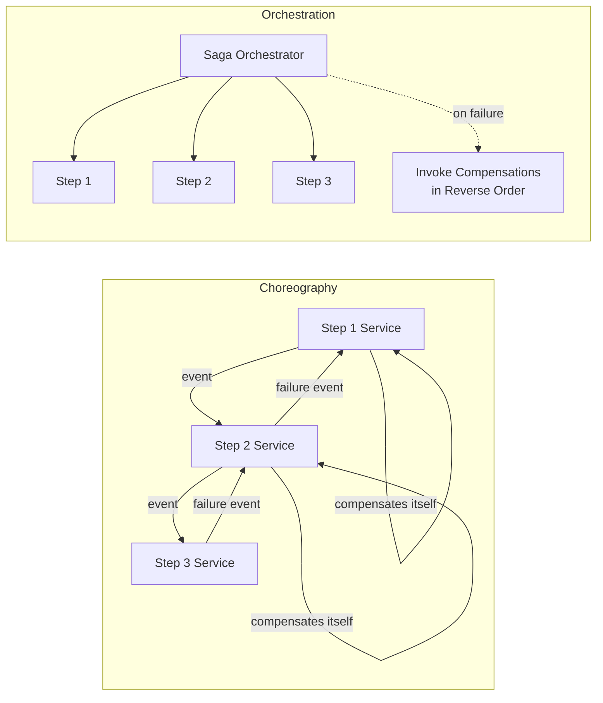
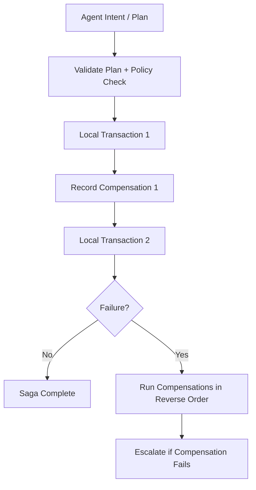
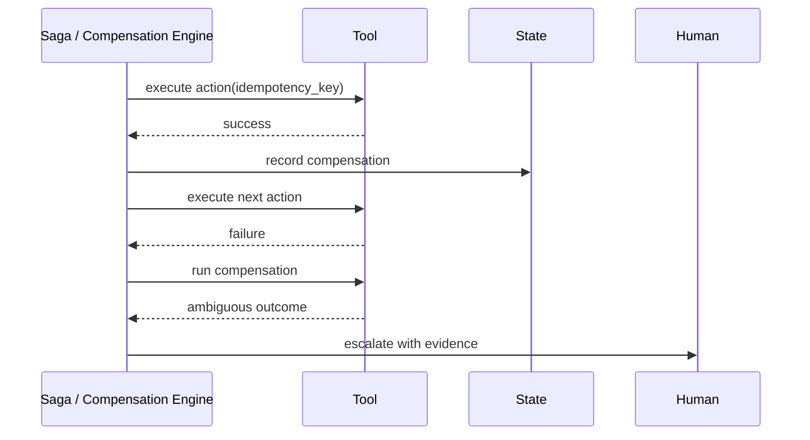
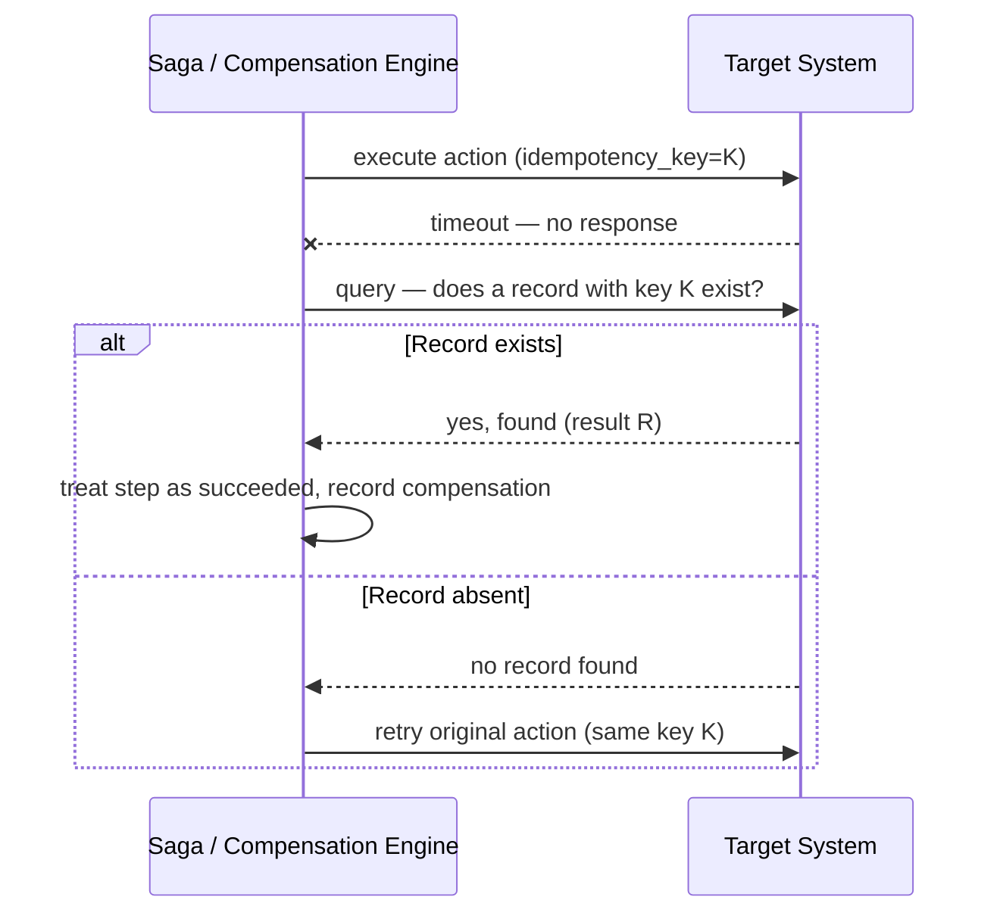

# Recoverability, Rollbacks & the Saga Pattern

> **Interview framing:** *"An agent creates a ticket, sends a confirmation email, and then a
> third tool call fails. How do you roll that back? What if you can't tell whether the failed
> call actually succeeded on the other side?"*

This doc is part of the [Agentic AI Platform system design track](system-design.md). It expands
the **Recovery** row of the [plane-by-plane responsibility map](system-design.md#3--plane-by-plane-responsibility-map)
and directly answers the "rollback agentic actions" requirement from the platform's capability
list. It is one of the most important documents in this track — get comfortable narrating the
Saga Pattern section (Section 2) end to end; it is very likely to be probed directly. For the
policy/approval mechanics that gate whether an action runs at all, see
[11 — Governance, Guardrails & Security](11-governance-guardrails-and-security.md). For how budget
exhaustion and escalation interact with recovery, see
[06 — Non-Determinism, Loops & Termination](06-non-determinism-loops-and-termination.md).

**Scope note:** this doc assumes you already know classic ACID transactions and generic
distributed-transaction background (two-phase commit, etc.) — it spends its words on what's
specific to agent platforms: LLM-driven tool calls that mutate real, external systems, and why
that makes "just roll it back" categorically harder than it is for a single database.

---

## 1 · Problem statement

Agents are useful precisely because they *do* things: create tickets, send emails, update
records, open pull requests, change configuration values, trigger deployments. Every one of
those actions is a **real side effect in a system the platform does not own** — a CRM, an email
provider, a ticketing system, a source control host, a cloud control plane.

An enterprise platform needs **recoverability for partial completion**: if an agent's multi-step
plan fails on step 3 of 5, what happens to the effects of steps 1 and 2? This is the exact
problem ACID rollback solves inside a single database — and the exact problem it *cannot* solve
here, for three reasons specific to this setting:

1. **Side effects cross system boundaries.** Step 1 might create a ticket in Jira, step 2 might
   send a confirmation email through SendGrid. There is no shared transaction coordinator across
   Jira, SendGrid, and your platform — no `ROLLBACK` statement undoes either of them.
2. **Some side effects are not undoable at all, only "correctable."** You cannot un-send an
   email. You cannot un-notify a human who already read a Slack message. The best you can do is
   issue a *corrective* action (a follow-up email saying "disregard the previous message"), which
   is a different, weaker guarantee than a true rollback.
3. **The LLM's plan is not a transaction plan.** A database transaction is written by a developer
   who knows exactly which statements need to commit together. An agent's plan is *proposed* by a
   model at runtime, is not guaranteed to be minimal or well-ordered, and can fail for reasons a
   developer never anticipated (a tool schema mismatch, a rate limit, an ambiguous timeout). The
   platform — not the model — has to supply the discipline a hand-written transaction would have
   had.

The answer the industry has converged on for "multi-step process across independent systems,
needs partial-failure recovery, cannot use a shared ACID transaction" is the **Saga pattern** —
and it applies directly, with agent-specific adaptations, to this problem. That's Section 2.

---

## 2 · The Saga Pattern

### 2.1 What a saga is

A **saga** is a sequence of local transactions, where **each step has a corresponding
compensating transaction that semantically undoes it** if a later step in the sequence fails.
Instead of one atomic commit across all systems, you get a chain of independently-committed
local transactions, plus a guarantee that if the chain doesn't complete, everything already
committed gets *compensated* — not truly rolled back, but brought back to an equivalent, safe
state.

This is not an agent-specific invention — it's the standard pattern the Azure Architecture Center
documents for coordinating local transactions and compensating transactions to preserve data
consistency across services that each own their own data
(<https://learn.microsoft.com/en-us/azure/architecture/patterns/saga>), paired with the
**Compensating Transaction** pattern, which formalizes what a "compensation" is: an operation
that semantically (not necessarily literally) reverses the effects of a previously completed
step (<https://learn.microsoft.com/en-us/azure/architecture/patterns/compensating-transaction>).
What's specific to an agent platform is *who writes the compensations* (the tool/MCP registry, at
registration time — not the agent, at run time) and *who decides to invoke them* (Section 2.2).

Concretely, for the ticket + email example: step 1's compensation is "close/cancel the ticket
with a system comment," and step 2's compensation is "send a corrective follow-up email" (not a
true undo — see reason 2 above, and Section 2.7 for why that distinction matters).

### 2.2 Choreography vs. orchestration

There are two ways to implement a saga, and the choice matters more for agent platforms than it
does for typical microservice sagas:

- **Choreographed sagas**: each service/tool reacts to events from the previous step and
  independently decides both its own action and its own compensation trigger. There is no central
  coordinator — the "plan" emerges from services listening to each other's events.
- **Orchestrated sagas**: a central Saga/Compensation Engine explicitly sequences each step,
  records the compensation for each completed step as it commits, and — on failure — invokes
  compensations in reverse order, under its own control.

**Recommendation for agent platforms: orchestrated sagas as the default.** The reasoning is
specific to this domain, not a generic microservices preference:

- The agent's plan is *already* being interpreted and executed by a central runtime (the
  platform's execution engine, per the [master architecture](system-design.md#2--master-architecture))
  — there is no meaningful sense in which the tool calls are independent, loosely-coupled
  services choreographing among themselves. Centralizing saga control mirrors the architecture
  that already exists; choreography would mean re-decentralizing something the platform
  deliberately centralized for governance reasons.
- **Audit** is a hard requirement for this platform (see [system-design.md capability table](system-design.md#1--what-the-platform-actually-needs-to-do)).
  A central orchestrator that records every step and every compensation decision in one place
  produces a linear, replayable audit trail. Choreography scatters that decision-making across
  services, making "why did compensation X run" much harder to reconstruct.
- **HITL escalation** (Section 2.7, and [11 — Governance, Guardrails & Security](11-governance-guardrails-and-security.md))
  needs one place that knows the full state of the saga — which steps committed, which
  compensations are pending, which outcome is ambiguous — in order to hand a human a complete,
  coherent picture. A choreographed system would need to reassemble that picture from scattered
  event logs at escalation time, under time pressure, which is exactly when you don't want to be
  doing forensic reconstruction.

#### Internals: What Each Approach Actually Costs You

The three bullets above explain *why* this platform defaults to orchestration — the underlying
cost trade-off is worth stating explicitly on its own, because it's the first thing a
staff-level interview will push on next:

| | Choreography | Orchestration |
|---|---|---|
| **Coordinator** | None — each service reacts to events from the previous step and decides its own compensation trigger | One — a central Saga/Compensation Engine explicitly sequences every step |
| **Single point of failure for saga logic** | No — there's no central coordinator to go down | Yes — the orchestrator is a critical-path dependency for every single step |
| **Where compensation-triggering logic lives** | Duplicated into every participating service — each one has to know when *it* needs to compensate | Centralized in one engine — services only expose "do the thing" / "undo the thing"; the engine decides when to call either |
| **"What's the current state of this saga right now?"** | Not answerable from any single place — has to be reconstructed after the fact from scattered events across services | Directly answerable — the orchestrator's own state *is* the saga's state, by definition |
| **Implementation cost as step count grows** | Grows faster — every new step means every other service that might need to react to it needs new event-handling logic | Grows roughly linearly — every new step is one more entry in the orchestrator's sequence |

> The practical failure mode of choreography at scale: nobody can answer "why did compensation X
> run?" without pulling logs from every service involved and manually reconstructing the event
> order — precisely the forensic-reconstruction problem the HITL-escalation bullet above already
> flags as unacceptable under time pressure.

### 2.3 Saga orchestration flow

Read this diagram as the generalization of the request lifecycle sequence diagram in the
[uber doc](system-design.md#4--end-to-end-request-lifecycle) specifically for the "proposed tool
call" branch: every commit (`Step1`, `Step2`, ...) is immediately paired with recording its
compensation *before* the next step runs — never after. If the orchestrator crashes between
`Step1` and `Record1`, you have committed an action with no known way to undo it, which is a
correctness bug, not just an inconvenience. The compensation record must be durable (part of the
[State Plane](system-design.md#3--plane-by-plane-responsibility-map)'s event log) before the saga
is allowed to proceed to the next step.

### 2.4 Compensation workflow (sequence view)

Notice the last two exchanges: a compensation call can *itself* return an ambiguous outcome. This
is not a hypothetical edge case; it's the same fundamental problem (Section 2.7) recurring one
level deeper, and it's why the escalation path has to be a first-class part of the design rather
than a fallback bolted on afterward.

### 2.5 The core invariant: classify every mutating action

Every mutating tool/MCP action an agent can invoke must be classified, in the tool registry, as
**exactly one** of:

| Classification | Meaning | Example |
|---|---|---|
| **Compensable** | Has a defined compensating transaction that semantically undoes it | Create ticket → close/cancel ticket with a system comment |
| **Retryable** | Safe to retry automatically, provided the retry carries an idempotency key | Re-attempt a webhook POST after a network timeout |
| **Explicitly irreversible** | No compensation exists; requires human approval *before* it is ever attempted | Permanently delete a production database, send an external legal notice |
| **Requires human approval unconditionally** | Regardless of compensability, policy mandates a human in the loop before execution (independent of reversibility) | Wiring a payment, modifying another user's access rights |

This classification is a **registration-time property of the tool**, decided by whoever owns the
tool/MCP integration — never something the agent infers at run time from the prompt. An agent
proposing to call a tool classified "requires human approval unconditionally" must be routed to
HITL by the tool gateway regardless of how confident or well-reasoned the model's plan looks.
See [03 — Tool, MCP & Skill Registry §4](03-tool-mcp-and-skill-registry.md#4--registry-data-model)'s
`compensation_class` field for where this classification lives in the registry schema — a
distinct axis from that same registry's `risk_classification` field, which drives the Policy
Engine's allow/deny/approval defaults rather than the Saga Engine's recovery behavior — and
[11 — Governance, Guardrails & Security](11-governance-guardrails-and-security.md) for how the
policy engine enforces it.

### 2.6 Idempotency keys, concretely

A **retryable** action is only safe to retry because of an idempotency key — a client-generated,
unique identifier attached to the tool/MCP call that the *receiving* system uses to deduplicate.

The mechanics:

1. Before the orchestrator invokes a tool call, it generates (or reuses, on retry) a unique key —
   typically derived from the saga step ID plus an attempt-scoped nonce, e.g.
   `saga:8f14e45f:step-2:attempt-1`.
2. The call is made carrying that key (as an HTTP idempotency header, an MCP call parameter, or
   equivalent, depending on the tool's transport).
3. The receiving system is contractually required (per its registration in the tool registry) to
   **dedupe on that key**: if it has already processed a request with that key, it returns the
   original result instead of performing the action again.
4. On any ambiguous failure (timeout, connection reset, 5xx with no clear body), the orchestrator
   retries with the **same** key, not a new one — this is what prevents "duplicate ticket" or
   "duplicate charge" outcomes when a retry follows a call that actually succeeded on the far
   side but whose response never arrived.

Without step 4's discipline, retries are indistinguishable from duplicate side effects, and
"just retry on failure" — the instinctive fix — becomes a bug generator instead of a safety net.

#### Internals: The Dedup Store

The mechanics above describe *what* the key is used for; here's *how* it's actually generated and
checked in practice:

1. **Key derivation.** A robust construction is
   `idempotency_key = hash(agent_id, step_id, canonicalized_args)` — hashing the agent, the saga
   step, and a *canonicalized* (stably key-ordered, whitespace-normalized) form of the call's
   arguments. Canonicalizing the args matters: two logically-identical calls whose arguments
   happen to serialize with differently-ordered JSON keys must still hash to the same key, or
   dedup silently fails exactly when you need it most.
2. **Pre-execution check.** Before the orchestrator executes a mutating tool call, it looks up
   that key in a **dedup store** — a durable key-value store with a TTL (long enough to outlive
   any realistic retry window, short enough not to grow unbounded).
   - **Key present, with a recorded result:** return the cached result immediately — do **not**
     re-execute the side effect. This is exactly the case that makes retrying after a
     "succeeded, but the response was lost" timeout safe.
   - **Key absent:** execute the tool call, then record its result under that key before
     returning to the caller.
3. **Why the store has to be durable and shared, not per-process memory.** If the dedup store
   lived in one process's memory, a retry routed to a different orchestrator replica (a
   near-certainty in any horizontally scaled deployment) would never see the first attempt's key
   — and would execute the side effect again, silently defeating the whole mechanism. The dedup
   store has to be a shared, durable service, at the same durability tier as the
   [State Plane](system-design.md#3--plane-by-plane-responsibility-map)'s event log, reachable by
   every orchestrator replica.

> This is the mechanism that converts [09 — Multi-Agent Communication Patterns](09-multi-agent-communication-patterns.md#how-it-actually-works-message-delivery-guarantees)'s
> "at-least-once delivery" — the realistic default for any distributed messaging layer — into
> **effectively-once execution** from the caller's point of view. The message or retry can still
> arrive twice; the dedup store is what guarantees the underlying *side effect* only happens once.

### 2.7 The ambiguous outcome problem

This is the single hardest case in agentic recovery, and it deserves to be named explicitly
because both naive "fixes" make things worse:

> A tool call times out. Did it fail before reaching the target system, or did it succeed on the
> other side and only the *response* got lost?

- **Blindly retrying** assumes it failed. If it actually succeeded, you now have a duplicate side
  effect (a second ticket, a second charge, a second email) — unless the target system dedupes on
  the idempotency key from Section 2.6, in which case the retry is safe. If the target system
  doesn't support dedup (many third-party integrations don't), blind retry is unsafe.
- **Blindly compensating** assumes it succeeded. If it actually failed, you're now running a
  compensation for an action that never happened — at best a no-op, at worst an error (you can't
  "cancel" a ticket that was never created) or, worse, a compensation that has its *own*
  unintended side effect (e.g., a cancellation notification sent for an action nobody took).

The correct sequence, in order of preference:

1. **Query the target system for current state before deciding anything.** If the tool/MCP
   integration supports a read/lookup call (e.g., "does a ticket with this idempotency key
   exist?"), use it. This converts an ambiguous outcome into a known one and lets the orchestrator
   proceed deterministically (retry if absent, treat as success if present).
2. **If querying isn't possible, escalate to a human with full evidence** — the action attempted,
   the idempotency key used, the exact error/timeout observed, and the saga's current state —
   rather than guessing. This is precisely the `Saga->>H: escalate with evidence` step in the
   sequence diagram above, and it is the correct default whenever Step 1 isn't available, not a
   fallback of last resort.

The rule of thumb worth memorizing: **an unknown commit outcome is a query problem first and an
escalation problem second — it is never a "pick retry or compensate and hope" problem.**

#### How It Actually Works: Check Before Compensate

Mechanically, "query the target system first" (preference 1 above) is a specific sequence worth
naming on its own — it's the piece that actually resolves the ambiguity, rather than just
managing risk around it:

1. A tool call is made; the response never arrives (timeout, connection reset, etc.). At this
   instant the orchestrator has **zero information** about whether the far side executed the
   mutation before or after the timeout fired.
2. Instead of guessing, the orchestrator issues a **read** against the target system, scoped to
   the same idempotency key or request ID used in the original call — e.g., "does a ticket
   tagged with idempotency key `saga:8f14e45f:step-2:attempt-1` already exist?"
3. **If the read confirms the effect landed:** treat the step as succeeded, record its
   compensation (Section 2.1), and proceed — do not compensate an action that legitimately needs
   to stay in effect.
4. **If the read confirms the effect did not land:** retry the original call, reusing the same
   idempotency key (Section 2.6) — no compensation is needed, because nothing happened yet.
5. **Only if the read itself is inconclusive or unavailable** does this fall through to human
   escalation with evidence (preference 2 above).

**The real-world constraint this depends on:** step 2 only works if the target system exposes a
way to query by your idempotency key or request ID in the first place. Plenty of third-party APIs
don't — they offer "look up by the resource's own ID" but not "look up by the client request ID
you sent," and you don't have the resource's own ID yet if the *create* call is what timed out.
That's a real integration constraint to check for before you depend on an integration for any
workflow where ambiguous-timeout recovery matters — and it's a legitimate, principled reason to
default to human escalation (step 5) for tools that don't support it, rather than a gap to just
paper over.

---

## 3 · Failure modes

| Failure mode | What it looks like | Mitigation |
|---|---|---|
| Compensation itself fails | The "undo ticket creation" call also times out or errors | Compensations are retryable-with-idempotency-key like any other action; if they exhaust retries, escalate — never silently give up |
| Ambiguous outcome (response lost, request maybe applied) | A tool call times out with no way to tell if it committed | Query target system state first (Section 2.7); escalate with evidence if querying isn't possible |
| Duplicate side effect from a retry | Two tickets created for one intended action | Idempotency key generated once per saga step and reused across retries; receiving system dedupes on it |
| Irreversible action attempted without approval | An agent calls a tool classified "explicitly irreversible" without a human ever being asked | Tool gateway hard-blocks irreversible/approval-required actions at the policy layer — never relies on the agent's own judgment |
| Human approves based on stale state | The world changed between when approval was requested and when it was granted (e.g., the target record was already modified by someone else) | Re-validate current state at the moment of execution, not just at the moment of approval request; reject/re-prompt if state has drifted materially |

---

## 4 · Enterprise vs. startup recommendation

**Enterprise:** orchestrated sagas as the default for any workflow with real side effects.
Require, as non-negotiable platform features: idempotency keys on every mutating call,
compensation contracts registered per tool (Section 2.5's classification, enforced at
registration, not at run time), a durable execution history for every saga step and compensation
(part of the [State Plane](system-design.md#3--plane-by-plane-responsibility-map)), and a defined
escalation path with evidence bundling for ambiguous outcomes and irreversible actions.

**Startup:** you likely can't afford to build a general saga orchestrator on day one. Instead,
write a manual rollback runbook per write-capable tool (a short, human-readable "if this fails
after commit, do X" doc per tool), and require human approval before *any* destructive operation
regardless of classification sophistication. Formalize into an orchestrated saga engine once you
have more than a handful of write tools or the manual runbooks stop scaling.

---

## 5 · Interview questions

1. Why is rollback (in the ACID sense) not enough once an agent's actions cross system
   boundaries?
2. What is a compensating transaction, and how is it different from a true undo?
3. How do you handle a tool call whose outcome is unknown (e.g., after a timeout)?
4. When is saga orchestration preferable to choreography for an agent platform specifically?
5. What kinds of actions should be denied outright, regardless of any human approval given?

---

## Quick Revision Notes

- ACID rollback doesn't apply once side effects cross system boundaries — you can't roll back an
  email already sent or a ticket already created in a third-party system.
- A **saga** = a chain of local transactions, each with a compensating transaction that
  semantically undoes it if a later step fails.
- **Orchestrated sagas are the default for agent platforms** — the runtime is already centralized,
  audit needs one coherent record, and HITL escalation needs one place with the full picture.
- Every mutating action is classified at registration time as exactly one of: compensable,
  retryable (with idempotency key), explicitly irreversible (approval required before attempt),
  or requires human approval unconditionally.
- Idempotency keys are generated once per saga step and reused across retries so the receiving
  system can dedupe — never generate a new key on retry.
- An ambiguous outcome (timeout, lost response) is solved by **querying current state first**,
  and escalating to a human with evidence second — never by guessing retry vs. compensate.
- Human approvals must be re-validated against current state at execution time — approving based
  on stale state is its own failure mode.
- An idempotency key is typically `hash(agent_id, step_id, canonicalized_args)`, checked against a
  durable, shared dedup store before every mutating call — this is what turns at-least-once
  delivery (see doc 09) into effectively-once execution.
- "Check before compensate": on an ambiguous timeout, query the target system by idempotency
  key/request ID before deciding to retry or compensate — never guess between the two.
- Not every third-party API supports querying by idempotency key or request ID — that's a real
  integration constraint, and a legitimate reason to default to human escalation for tools that
  lack it.
- Choreography scatters compensation-triggering logic across every participating service and
  makes "what's this saga's current state?" unanswerable from any single place; orchestration
  centralizes both, at the cost of the orchestrator being a critical-path dependency for every
  step.

## Further Reading

- Azure Architecture Center — Saga pattern — <https://learn.microsoft.com/en-us/azure/architecture/patterns/saga>
- Azure Architecture Center — Compensating Transaction pattern — <https://learn.microsoft.com/en-us/azure/architecture/patterns/compensating-transaction>
- Stripe — Idempotent Requests (idempotency-key pattern reference) — <https://stripe.com/docs/api/idempotent_requests>
- IETF — The Idempotency-Key HTTP Header Field (draft) — <https://datatracker.ietf.org/doc/draft-ietf-httpapi-idempotency-key-header/>
- Back to the [uber doc — Designing an Agentic AI Platform](system-design.md)
- [11 — Governance, Guardrails & Security](11-governance-guardrails-and-security.md) for HITL approval mechanics
- [06 — Non-Determinism, Loops & Termination](06-non-determinism-loops-and-termination.md) for budget/escalation ties
- [03 — Tool, MCP & Skill Registry](03-tool-mcp-and-skill-registry.md) for where compensation classification lives in the registry schema
