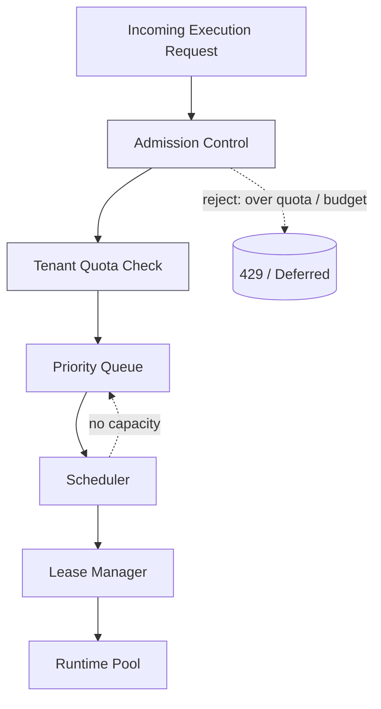
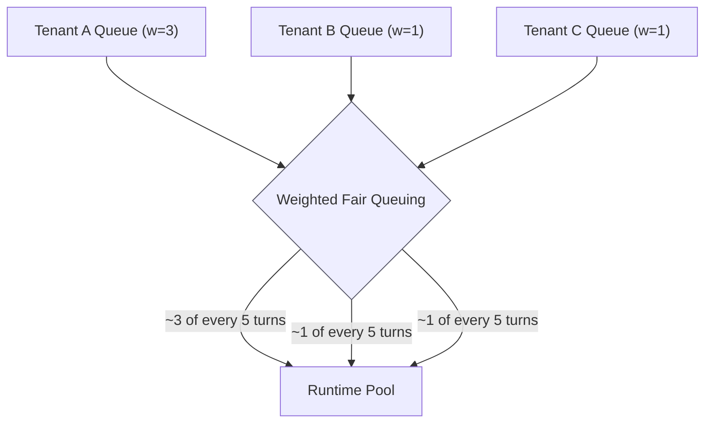
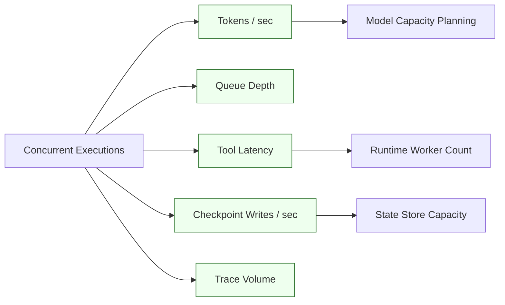

# Production Scale & Capacity for Agentic Platforms

> **Interview framing:** *"At hyperscale, how do you safely operate many concurrent,
> nondeterministic agent executions under tenant isolation, cost budgets, reliability targets,
> and audit requirements — not just how do you run one agent?"*

This doc is part of the [Designing an Agentic AI Platform](system-design.md) track — read that
doc first for the plane map and master architecture referenced throughout. This document is the
"scale variant" of that architecture worked out in depth, per [system-design.md §9](system-design.md#9--scale-variants).

**Scope note:** generic autoscaling, load balancing, and horizontal-scaling patterns are assumed
background. What's specific to agent platforms is that the unit of work is a **long-running,
nondeterministic, stateful execution** rather than a stateless request — which changes what
"capacity" even means, what leading indicators predict trouble, and why a naive queue-and-worker
model runs into agent-specific bottlenecks (model provider rate limits, checkpoint write volume,
trace/eval volume) well before generic CPU/memory exhaustion.

> **Interview prep:** First pass → sections 1–3 (admission control, weighted fair queuing, capacity planning). **What interviewers probe:** “How does weighted fair queuing prevent noisy-neighbor starvation without a hard concurrency cap?” and “What are the leading indicators you’d instrument before a scale event, and why leading vs. lagging?” **Opening narrative:** admission → tenant quotas → WFQ scheduler → leading indicators (concurrent executions as the driver) → hyperscale considerations.

---

## 1 · Problem statement

Running a single agent is a solved problem — call a model, call some tools, checkpoint state,
done. Running **many** agents safely and economically at scale means answering questions that
don't arise at small scale:

- How do you decide which of 10,000 pending executions get to run *right now*, given that
  runtime workers, model provider quota, and tool-call throughput are all finite?
- How do you stop one tenant's runaway or buggy agent from starving every other tenant's
  workloads?
- How do you know you're about to run out of capacity *before* customers notice slow or failing
  agents, given that agent workloads don't fail the way a stateless API does — they degrade
  first (queue depth rises, steps get slower, retries increase) and only fail visibly later?
- How do you keep governance (§ per [11 — Governance, Guardrails & Security](11-governance-guardrails-and-security.md))
  and audit correctness intact when execution volume is orders of magnitude higher than any
  single team can review?

The organizing idea: **at scale, the platform's job shifts from "execute this agent correctly"
to "admit, schedule, isolate, and budget many concurrent nondeterministic executions correctly."**
Everything below is about that shift.

---

## 2 · Scheduling and admission control

Each stage answers a distinct question:

| Stage | Question it answers | Agent-specific detail |
|---|---|---|
| Admission control | Should this request even enter the system right now? | Must account for *execution* cost (potentially many model + tool calls over minutes), not just request cost — admitting an agent run is a much bigger commitment than admitting an HTTP request |
| Tenant quota | Is this tenant within its allotted concurrency/budget? | Quota needs multiple dimensions simultaneously: concurrent executions, tokens/sec, tool calls/sec, and $ spend — a tenant can exhaust any one of these independently |
| Priority queue | Given many admitted-but-not-yet-running requests, what order do they run in? | Priority should reflect tenant SLA tier *and* execution risk tier (from [11](11-governance-guardrails-and-security.md)) — e.g. a high-risk execution awaiting HITL shouldn't hog a runtime slot while paused |
| Scheduler | Which specific runtime worker/pool handles this now? | Must consider model-affinity (some executions need a GPU/specific provider), resumability (a resumed execution may need to land near its checkpointed state for locality), and fairness across tenants |
| Lease manager | Who owns this execution right now, and for how long? | Same fencing-token mechanism as [02 — Agent Lifecycle & Runtime](02-agent-lifecycle-and-runtime.md) — at scale, lease churn (renewal traffic) itself becomes a capacity concern |
| Runtime pool | Where does the execution actually run? | Pools are commonly tiered (hot/warm/cold) by latency requirement and cost, per [system-design.md §9](system-design.md#9--scale-variants) |

**The interview-critical point:** admission control for agentic workloads must reject or defer
*before* committing model-gateway and tool-gateway capacity, because an admitted-but-then-starved
execution is worse than a rejected one — it holds a lease, consumes checkpoint storage, and may
be mid-way through a multi-step plan with partial side effects when it stalls.

#### How It Actually Works: Weighted Fair Queuing Across Tenants

Admission control at platform ingress uses the same token-bucket / leaky-bucket rate limiting
mechanism [04 — Model Gateway & LLM Providers](04-model-gateway-and-llm-providers.md#internals-token-bucket-vs-leaky-bucket-rate-limiting)
uses at its egress to model providers — same algorithm, different end of the pipeline: a token
bucket accumulates capacity at a fixed refill rate and absorbs legitimate bursts, a leaky bucket
enforces a strictly constant outflow and cannot. See doc 04's internals section for the full
mechanism and trade-off table rather than re-deriving it here; admission control at ingress
typically wants the token-bucket's burst tolerance (business-hours spikes are normal), the same
conclusion doc 04 reaches for its own boundary.

Once requests are admitted, the priority queue above needs a second, distinct mechanism to
decide *whose* request runs next when multiple tenants have pending work and capacity is
limited — **weighted fair queuing (WFQ)**. WFQ assigns each tenant a weight (e.g. proportional to
their subscription tier) and the scheduler cycles through tenant queues, serving each queue a
number of requests proportional to its weight before moving to the next — so a tenant with
weight 3 gets roughly three times the scheduling turns of a tenant with weight 1, and no single
tenant can flood the scheduler and starve the others out, even without a hard concurrency cap.

---

## 3 · Capacity planning: leading indicators, not lagging ones

**These five signals are leading indicators of a scale bottleneck, not lagging ones.** The
distinction matters because agent executions degrade gradually before they fail visibly — an
agent doesn't crash the moment capacity runs short, it just gets slower, retries more, and takes
longer to complete. If you only alert on end-to-end failure rate or p99 completion time (lagging
indicators), you find out about a capacity problem only after customers already have slow or
stuck agents. Alerting on the signals above catches the same problem while it's still building:

| Signal | What it predicts | Why it leads instead of lags |
|---|---|---|
| Queue depth | Scheduler/runtime pool is falling behind admission rate | Rises *before* any individual execution times out — the first visible symptom of undercapacity |
| Tool latency | Downstream enterprise systems or tool gateway are saturating | Degrades before tool calls start outright failing or timing out |
| Checkpoint write rate/latency | State store is approaching write capacity | A slow checkpoint write stalls the *entire* execution step (per [05 — State Management & Memory](05-state-management-and-memory.md)), long before the store returns errors |
| Trace volume | Observability backend ingestion is approaching its limit | Trace drops/sampling kick in silently, degrading incident-review quality before anyone notices tracing is incomplete |
| Tokens/sec against model capacity | Model gateway is approaching provider throughput limits | Feeds directly into model capacity planning — see below |

Two derived planning rules, worth stating explicitly in an interview:

- **Tokens/sec → model capacity planning.** If aggregate tokens/sec is approaching a provider's
  rate limit, the fix is provider-side capacity (higher-tier quota, additional provider/region,
  or fallback routing in the [Model Gateway](04-model-gateway-and-llm-providers.md)) — not more
  runtime workers, which would just queue harder against the same model bottleneck.
- **Tool latency → runtime worker count; checkpoint writes → state store capacity.** These are
  two *different* bottlenecks that look similar from the outside ("agents are slow") but require
  different remediation. Conflating them is a common mistake — scaling out runtime workers does
  nothing if the actual bottleneck is checkpoint write throughput on a single state-store shard.

#### Internals: Autoscaling Signal Trade-offs

The five leading indicators above feed alerting, but *autoscaling decisions* (how many workers to
run right now) typically key off one of three signal families, each with a different reaction
profile:

- **Queue-depth-based scaling.** Scale workers up when the backlog of admitted-but-not-yet-
  running executions grows. This reacts directly to demonstrated, already-arrived demand — no
  guessing — but it necessarily lags a sudden spike, because the queue has to visibly build up
  before the signal fires, and by the time it does, some requests have already waited longer than
  ideal.
- **Latency-based scaling.** Scale based on P95/P99 request (or step) latency crossing a
  threshold. This reacts faster to degradation than queue depth in many cases, because latency
  can start rising from secondary effects (e.g. a downstream tool slowing down) before the queue
  itself visibly grows. The cost is that latency is a noisier, more indirect signal — it can
  spike for reasons unrelated to capacity (a single slow downstream dependency, a GC pause, a
  transient network blip) and trigger scale-up that doesn't actually address the cause.
- **Resource-utilization-based scaling.** Scale on CPU/GPU utilization crossing a threshold. This
  works well for compute-bound workloads where utilization directly tracks load. It is much less
  meaningful for agent workloads specifically, because an agent step spends most of its
  wall-clock time *waiting* on a model-provider network call, not consuming CPU — a runtime pool
  can be at 10% CPU utilization while still being fully saturated on concurrent in-flight
  requests.

**Trade-off — Autoscaling Signal Comparison**

| Signal | Reaction speed | Noise sensitivity | Best-fit workload |
|---|---|---|---|
| Queue depth | Slower — lags until backlog visibly builds | Low — a direct, stable measure of backlog | Any workload where a growing backlog is an acceptable, safe leading indicator |
| P95/P99 latency | Faster — can catch early degradation | Higher — sensitive to transient, unrelated slowdowns | Workloads where user-facing responsiveness is the thing you're protecting |
| Resource utilization (CPU/GPU) | Medium | Low for compute-bound work | Compute-bound workloads; poor fit for I/O-bound agent steps waiting on model-provider calls |

> Agent platforms typically combine queue depth (primary, stable signal) with latency as a
> secondary/faster-reacting signal, and treat raw CPU/GPU utilization as informative but not
> load-bearing for autoscaling decisions — since most agent wall-clock time is spent waiting on
> the model gateway, not consuming compute.

#### How It Actually Works: Little's Law for Concurrency Sizing

Before any of the above autoscaling signals kick in reactively, you need a starting estimate of
how many concurrent execution slots to provision in the first place. **Little's Law** gives you
that estimate from first principles:

$$L = \lambda W$$

where $L$ is the average number of concurrent in-flight executions, $\lambda$ (lambda) is the
average arrival rate of new executions, and $W$ is the average time-in-system (wall-clock
duration) per execution. This holds for any stable queuing system regardless of the arrival or
service-time distribution, which is what makes it useful as a quick sizing tool rather than
something requiring a full simulation.

**Worked example:** if agents arrive at $\lambda = 10$/sec, and each execution takes $W = 8$
seconds end-to-end on average (model calls, tool calls, and checkpointing included), then:

$$L = 10 \times 8 = 80$$

You need roughly **80 concurrent execution slots** provisioned just to keep pace with
steady-state arrival — before adding any burst headroom or retry overhead. **This $L$ counts only
actively-running executions.** An execution paused awaiting HITL approval should release its
runtime slot back to the pool while it waits — per §2's admission-control discussion, a paused
execution shouldn't hog a runtime slot for what might be minutes-to-hours of human latency — so
it does **not** count against this number. It still consumes other, separate capacity that needs
its own sizing: a reserved lease/checkpoint entry so it can resume where it left off, and a slot
in the reviewer/HITL queue — don't fold either into the runtime-slot count this $L$ is sizing. In
practice, provision meaningfully above the raw Little's Law number — it gives you
the steady-state floor, not a safety margin, and it assumes arrivals and durations stay close to
their historical averages, which bursty or long-tail workloads violate routinely.

---

## 4 · Platform planes at scale: where each becomes the bottleneck

This table reuses the plane map from [system-design.md §3](system-design.md#3--plane-by-plane-responsibility-map),
reframed around *where it saturates first* as concurrency grows.

| Plane | Responsibility | Where it becomes the bottleneck at scale |
|---|---|---|
| Ingress | APIs, webhooks, scheduled triggers | Connection/request fan-in at extreme trigger volume (e.g. thousands of scheduled agents firing at the same cron boundary) |
| Control | Registry, scheduling, leases, policy hooks | Lease-renewal traffic and scheduler decision latency under very high concurrent-execution counts |
| Runtime | Model calls, tool calls, step execution | Worker pool exhaustion — not enough execution slots for admitted, ready-to-run work |
| Model gateway | Provider routing, rate limits, fallback | Aggregate tokens/sec hitting provider-side rate limits; this is usually the *first* hard ceiling a platform hits, before compute or state |
| Tool gateway | Policy-checked side effects, MCP/tool calls | Downstream enterprise system throughput and latency; policy-engine evaluation latency at very high calls/sec |
| State / memory | Event log, checkpoints, DAG, vector recall | Checkpoint write throughput on the state store; vector-index query latency under high concurrent recall load |
| Evaluation | Golden sets, trajectory checks, regression gates | Eval pipeline throughput falling behind production execution volume — evals become a lagging batch process instead of a gate |
| Observability | Traces, logs, metrics | Trace ingestion/storage capacity; sampling decisions trading off cost against incident-review completeness |
| Governance | Policy, HITL, audit | HITL queue backing up (reviewers can't keep pace with approval volume); audit-store write throughput |
| Capacity | Admission, quotas, scheduling itself | The admission-control layer's own decision latency, and the accuracy of the quota data it reads (stale quota counters under high concurrency) |

**The point to make explicitly:** at real scale, the *model gateway* is usually the first ceiling
you hit (provider rate limits are typically the tightest constraint), not compute. Many teams
over-invest in runtime worker autoscaling and under-invest in model-gateway-level capacity
management (multi-provider fallback, request batching/coalescing where applicable, and
per-tenant token budgeting) — which is exactly backwards for where the real bottleneck sits.

---

## 5 · Failure modes

| Failure | Root cause | Mitigation |
|---|---|---|
| Noisy-tenant starvation | One tenant's runaway/buggy agent consumes disproportionate concurrency, tokens, or tool calls | Hard per-tenant quotas on concurrency, tokens/sec, and tool-calls/sec enforced at admission control, independent of overall system headroom |
| Queue buildup | Admission rate exceeds scheduling/runtime throughput | Alert on queue depth (leading indicator, §3) before it translates into completion-time SLA breaches; shed load via admission control rather than letting the queue grow unbounded |
| Model gateway throttling | Aggregate tokens/sec exceeds provider rate limits under load | Multi-provider fallback routing, per-tenant token budgets enforced before the call reaches the provider, request queuing with backoff at the gateway rather than the caller |
| State store saturation | Too many concurrent checkpoint writes for one store/shard | Shard the state store by tenant or execution ID; batch/async-flush checkpoints where checkpoint semantics allow it (per [05](05-state-management-and-memory.md)) |
| Trace backend overload | Trace volume exceeds observability ingestion capacity | Tail-based or priority-aware sampling (never drop traces for high-risk/HITL executions, even under load) rather than uniform random sampling |
| Evaluation pipeline lag | Eval throughput can't keep pace with production execution volume, so regressions ship before detection | Tier evaluation: a fast, cheap synchronous subset gates release; the full golden-set/trajectory suite runs asynchronously and can still roll back a release, per [07 — Agent Evaluation Frameworks](07-agent-evaluation-frameworks.md) |
| Region-level dependency outage | A single-region model provider, state store, or control plane becomes unavailable | Multi-region model gateway fallback; state store replication with a defined RPO/RTO; explicit runbook for failing over in-flight (not just new) executions |

---

## 6 · Enterprise vs. startup recommendation

| | Enterprise | Startup |
|---|---|---|
| Philosophy | **Build a platform, not a wrapper.** Frameworks like LangGraph, Semantic Kernel, and AutoGen help an *application developer* orchestrate one agent well — they do not schedule, isolate, budget, or audit thousands of tenants' concurrent executions. The platform must own scheduling, state, policy, telemetry, evaluation, and recovery itself, with a framework living inside the Runtime plane at most. | A managed queue (e.g. a cloud queue service), Postgres for state/checkpoints, a small container worker pool, and simple per-tenant quotas. Avoid building a hyperscale control plane before you have hyperscale traffic — it's expensive to build and expensive to operate, and premature. |
| Admission control | Full multi-dimensional quotas (concurrency, tokens/sec, tool-calls/sec, $ spend) enforced per tenant, with priority tiers | A simple concurrency cap per tenant is enough initially; add dimensions as real contention appears |
| Capacity signals | Dashboards and alerts on all five leading indicators from §3, with paging thresholds tuned per plane | Watch queue depth and tool latency manually at first; formal alerting on the rest can wait |
| Model gateway | Multi-provider fallback, per-tenant token budgeting, provider-quota-aware routing | Single provider is fine; add fallback only once you've actually been throttled |
| Region strategy | Multi-region with defined failover for in-flight stateful executions | Single region; document the manual recovery runbook rather than building automated failover |

Naming the startup version explicitly in an interview signals judgment — over-engineering
scheduling/capacity infrastructure for traffic you don't have yet is itself a design smell.

---

## 7 · Interview questions

1. How do you schedule roughly 100,000 concurrent agent executions without starving any single
   tenant?
2. How do you prevent noisy-neighbor behavior between tenants sharing the same runtime pool and
   model gateway?
3. How do you size runtime worker pools, and how is that different from sizing model-gateway
   capacity?
4. How do you attribute cost by tenant across model calls, tool calls, and state storage?
5. How do you fail over stateful, in-flight agent executions across regions without losing or
   duplicating side effects?

---

## Quick Revision Notes

- At scale the question changes from "run one agent correctly" to "admit, schedule, isolate, and
  budget many concurrent nondeterministic executions correctly."
- Admission control must reject/defer *before* committing model-gateway and tool-gateway
  capacity — an admitted-but-starved execution is worse than a rejected one.
- Five leading indicators predict scale trouble before customers notice: queue depth, tool
  latency, checkpoint write rate, trace volume, and tokens/sec against model capacity.
- The model gateway (provider rate limits) is usually the *first* hard capacity ceiling in
  practice, not compute — plan multi-provider fallback and token budgets accordingly.
- Tool latency points at runtime worker count; checkpoint write latency points at state store
  capacity — these are different bottlenecks that look identical from the outside.
- Noisy-tenant starvation is prevented with hard, multi-dimensional per-tenant quotas
  (concurrency, tokens/sec, tool-calls/sec, spend), enforced at admission, not after the fact.
- Evaluation pipelines must be tiered — a fast synchronous gate plus an async full suite — or
  eval throughput falls behind production volume and regressions ship before detection.
- "Build a platform, not a wrapper": orchestration frameworks live inside the Runtime plane; the
  platform itself must own scheduling, state, policy, telemetry, evaluation, and recovery.
- Startups should reach for a managed queue, Postgres, and simple quotas — not a hyperscale
  control plane — until real contention appears.
- Token bucket / leaky bucket algorithms enforce global rate limits at ingress the same way they
  do at model-provider egress (04) — only where in the pipeline they're applied differs.
- Weighted fair queuing gives each tenant a proportional share of scheduler turns so one noisy
  tenant can't starve the rest, without relying on hard per-tenant caps alone.
- Queue-depth scaling reacts to demonstrated demand but lags spikes; latency-based scaling reacts
  faster but is noisier; utilization-based scaling fits compute-bound work, not I/O-bound agents.
- Little's Law (L = λW) sizes concurrent execution slots from arrival rate and average duration —
  e.g. 10/sec arrivals × 8-second average duration ≈ 80 concurrent slots needed, before headroom.

## Further Reading

- OpenTelemetry docs — <https://opentelemetry.io/docs/>
- AutoGen Core user guide — <https://microsoft.github.io/autogen/stable/user-guide/core-user-guide/index.html>
- LangGraph persistence (checkpointers vs. stores) — <https://docs.langchain.com/oss/python/langgraph/persistence>
- Little's Law (queuing theory reference) — <https://en.wikipedia.org/wiki/Little%27s_law>
- Token bucket algorithm — <https://en.wikipedia.org/wiki/Token_bucket>
- Weighted fair queuing — <https://en.wikipedia.org/wiki/Weighted_fair_queueing>

See also: [system-design.md](system-design.md) for the master architecture and scale-variant
summary this doc expands on, [11 — Governance, Guardrails & Security](11-governance-guardrails-and-security.md)
for how policy/audit/HITL behave under the same load, [05 — State Management & Memory](05-state-management-and-memory.md)
for checkpoint semantics referenced in §3–§5, [06 — Non-Determinism, Loops & Termination](06-non-determinism-loops-and-termination.md)
for the budget mechanisms enforced at admission and the model/tool gateways, and
[07 — Agent Evaluation Frameworks](07-agent-evaluation-frameworks.md) for the tiered evaluation
pipeline referenced in §5.
