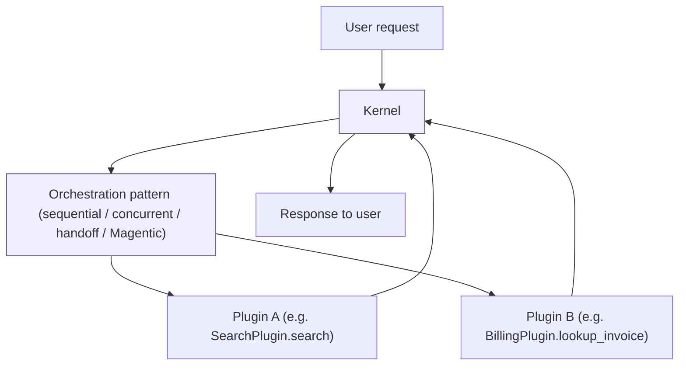
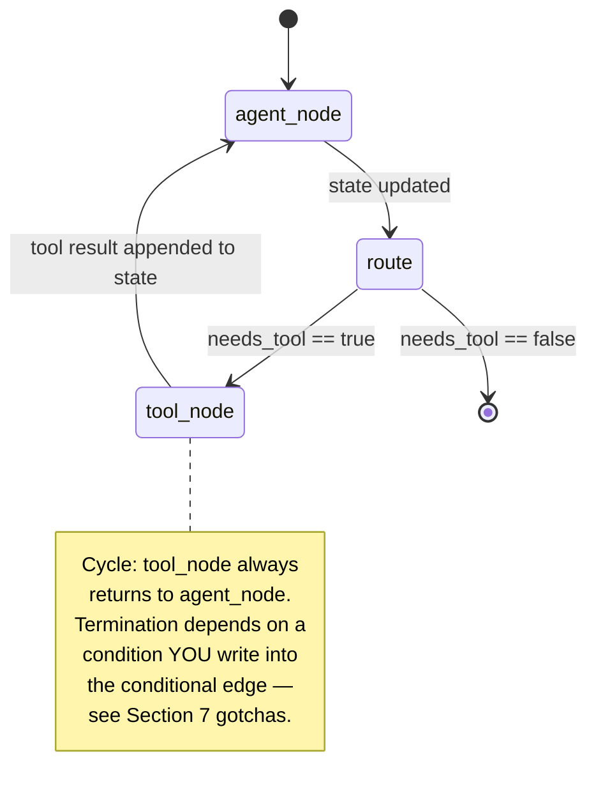

# Semantic Kernel vs. LangGraph

> Part of the [agentic-ai-system-design](system-design.md) track. This doc was requested as a
> standalone, code-level comparison of two orchestration frameworks that keep coming up in the
> same breath in interviews and architecture reviews: **Microsoft Semantic Kernel** and
> **LangChain's LangGraph**. It assumes you've read [system-design.md](system-design.md) —
> specifically the plane model in Section 2 and the framework landscape in Section 8 — and goes
> one level deeper on just these two.

> **Interview prep:** First pass → sections 1–3 (philosophical contrast, side-by-side diagrams, comparison table). **What interviewers probe:** “When would you choose LangGraph over Semantic Kernel for a new production agent platform?” and “What production gaps does each framework leave for the platform team to fill — and are those gaps the same or different?” **Opening narrative:** SK’s orchestration-pattern philosophy → LangGraph’s explicit-state-graph philosophy → what each leaves for the platform to build → the production-readiness gaps both frameworks share.

---

## 1 · Problem framing

Say this out loud before anything else, because it's the single most common thing people get
wrong when they walk into an interview having only read a framework's quickstart:

> **Semantic Kernel and LangGraph are both libraries that live inside the Runtime plane of the
> platform in [system-design.md](system-design.md#2--master-architecture). Neither is a
> platform. Neither ships a control plane, a policy engine, an audit store, an evaluation
> pipeline, or multi-tenant admission control.** You still have to build or buy all of that
> around either one for production enterprise use.

Concretely, in the language of system-design.md's plane map:

| Plane | Does Semantic Kernel provide this? | Does LangGraph provide this? |
|---|---|---|
| Control (scheduling, leases, tenant quotas) | No | No |
| Model gateway (routing, fallback, cost metering) | Partial — connectors to AI services, no multi-tenant routing/budgeting | Partial — model-agnostic via LangChain chat models, no built-in budget/routing layer |
| Tool gateway (policy checks on side effects) | No — plugins execute directly when invoked | No — tool nodes execute directly when invoked |
| State (durable, replayable, auditable) | No built-in durable store; you own persistence | **Yes** — checkpointers persist graph state per thread/run natively |
| Memory (long-term, cross-session) | No first-class abstraction | **Yes** — the `Store` abstraction is explicitly for cross-thread memory |
| Observability | Basic logging hooks; you wire your own tracing | Basic logging hooks; you wire your own tracing (commonly paired with LangSmith) |
| Evaluation | None | None |
| Governance / HITL / audit | None built-in | Interrupts give you a *hook point* for HITL, but the approval workflow, audit log, and policy decision are yours to build |

Neither column is "complete." That's the whole point of this section: **you are choosing an
orchestration primitive, not a finished production system.** Once that's settled, the rest of
this doc compares them purely as orchestration frameworks — on their own terms, for what they're
actually good at.

---

## 2 · Core mental model

### 2.1 Semantic Kernel: plugins + orchestration patterns

Semantic Kernel (SK) is a plugin/skill-based orchestration SDK available in .NET, Python, and
Java. Its central object is the **`Kernel`**:

- The `Kernel` holds one or more **AI service connectors** (chat completion, embeddings, etc.)
  so your code isn't hardwired to a specific provider.
- The `Kernel` holds a registry of **plugins**. A plugin is a named collection of functions —
  each function carries a semantic description (name, parameter docs, purpose) so the model can
  decide, at inference time, which function to call and with what arguments. This is SK's tool
  abstraction: what MCP servers or "tools" are in other frameworks, SK calls **plugins**.
- **Orchestration patterns** are how SK sequences multi-step or multi-agent execution instead of
  making you hand-wire a graph. Semantic Kernel's agent framework documents first-class support
  for **concurrent**, **sequential**, **handoff**, **group chat**, and **Magentic** orchestration
  patterns (source:
  <https://learn.microsoft.com/en-us/semantic-kernel/frameworks/agent/agent-orchestration/>).

#### How Group Chat / Magentic Turn-Taking Actually Works

Take "who speaks next" as the concrete mechanism worth knowing cold, because it's the detail
that separates "I've read the docs" from "I understand the trade-off":

- SK's `GroupChatOrchestration` (and, structurally, the Magentic orchestration too) delegates
  every turn-taking decision to a **manager** object. On every round, the manager answers three
  questions in order: does the chat need human input right now (`ShouldRequestUserInput`),
  should the chat terminate (`ShouldTerminate`), and — if neither — who should speak next
  (`SelectNextAgent` / `select_next_agent`) (source:
  <https://learn.microsoft.com/en-us/semantic-kernel/frameworks/agent/agent-orchestration/group-chat>).
- The **default** manager, `RoundRobinGroupChatManager`, answers `SelectNextAgent` with a fixed
  cyclic order — agent 1, then agent 2, then agent 3, then back to agent 1 — for up to a
  configured maximum number of rounds. It never inspects message content to decide who's next.
- A **custom** manager (or the `StandardMagenticManager` that backs the Magentic pattern)
  answers `SelectNextAgent` with an actual reasoning step: it's handed the chat history and the
  roster of available agents, and it makes an LLM call whose output is "which agent should
  respond next, and why." The Magentic manager additionally plans the overall task and tracks
  progress across rounds, but the turn-selection primitive underneath it is the same
  manager/selector hook (source:
  <https://learn.microsoft.com/en-us/semantic-kernel/frameworks/agent/agent-orchestration/magentic>).
- Practically: swapping `RoundRobinGroupChatManager` for a custom or Magentic manager is a
  small, contained change in orchestration setup — you're not rewriting the agents, just
  replacing which component decides whose turn it is.

> **Trade-off — deterministic round-robin vs. LLM-selector manager**
>
> | | Round-robin manager | LLM-selector manager (custom / Magentic) |
> |---|---|---|
> | How "next speaker" is decided | Fixed cyclic order, no content inspection | Extra LLM call reasons over chat history + agent roster |
> | Determinism | Fully deterministic — turn order is predictable from agent count alone | Non-deterministic — the same conversation can route differently across runs |
> | Adaptivity | Can't skip an irrelevant agent or fast-forward to the obviously-correct one | Adapts turn order to what actually happened last turn |
> | Cost/latency per turn | No extra call | +1 LLM call every turn just to pick a speaker, before that speaker even responds |
> | Failure mode to watch | Wastes turns on agents with nothing to add | Selector itself can misroute — now two models (selector + speaker) can each be wrong |

The mental model: **you pick an orchestration pattern that matches your workflow shape, register
your plugins/agents into it, and the pattern owns the control flow.** You are choosing from a
menu of pre-built shapes (sequential pipeline, concurrent fan-out, handoff between specialists,
group chat, or the more autonomous Magentic pattern for open-ended orchestration) rather than
drawing the control-flow graph yourself node by node.

Older SK material also talks about **planners** — components that take a goal and a set of
registered functions and generate a plan (a sequence of function calls) to satisfy it. In
current SK, agent orchestration patterns have mostly superseded ad-hoc planners for multi-step
agent workflows, but the concept is the same: something other than your hand-written code decides
the next step, using the plugin/function registry as its available action space.

### 2.2 LangGraph: explicit state graph + persistence

LangGraph is a graph-based orchestration library. You define agent logic as an explicit
**state graph**:

- **Nodes** are functions (often: "call the LLM," "run a tool," "summarize," "route").
- **Edges** connect nodes, including **conditional edges** — a routing function that inspects the
  current state and decides which node runs next.
- **State** is a shared, typed object (commonly a `TypedDict` or Pydantic model) threaded through
  every node; nodes read and return partial updates to it.

Because the graph and its transitions are all explicit code you write and can read top-to-bottom,
LangGraph gives you, natively, three things that are awkward to bolt onto a purely
plan-and-execute framework:

1. **Cycles (loops)** — an edge is allowed to point back to a node you've already visited. A
   "keep calling tools until you have enough information" loop is just an edge back to the agent
   node, not a special case.
2. **Conditional branching** — any node's outgoing edge can be a function of state, not a fixed
   pipeline step.
3. **Human-in-the-loop interrupts** — you can pause graph execution at a node, wait for external
   input, and resume — because the graph's execution state is a first-class, checkpointable
   object, not just a call stack that dies when the process does.

The other pillar of LangGraph's model is its **persistence layer**, which explicitly separates
two different jobs (source:
<https://docs.langchain.com/oss/python/langgraph/persistence>):

- **Checkpointers** — persist a snapshot of the graph's state after each step, scoped to a
  specific **thread** (a single run/conversation). This is what gives you resume-after-crash,
  replay, and time-travel debugging: you can rewind a thread to any prior checkpoint and
  re-execute from there.
- **Stores** — persist data **across** threads/sessions — e.g., long-term memory a user's next,
  unrelated conversation can still draw on. Stores are not scoped to a single run the way
  checkpoints are.

#### How LangGraph Checkpointing Actually Works (Super-Steps)

The mechanism behind "time travel" and interrupts is worth being able to explain in one breath,
because interviewers will ask "how does that actually work under the hood":

- LangGraph executes a graph in synchronous rounds called **super-steps**. In a given
  super-step, every node that's scheduled to run executes (conceptually in parallel if there's
  more than one), and their returned partial-state updates are merged back into a single state
  dict before the next super-step begins.
- After each super-step completes, the configured **checkpointer** serializes the *entire
  current state dict* — typically via `pickle`, though plain JSON-serializable state works too —
  and persists it as a new checkpoint. Development commonly uses an in-memory saver
  (`MemorySaver`); production uses a database-backed saver (SQLite- or Postgres-backed, among
  others).

> **Security caveat this track otherwise takes seriously elsewhere and shouldn't skip here:**
> `pickle` deserializes by executing arbitrary Python bytecode embedded in the serialized bytes —
> unpickling untrusted or tampered data is a well-known remote-code-execution vector (CWE-502),
> not a theoretical one. A production, multi-tenant, database-backed checkpoint store is exactly
> the kind of place a compromised or tampered checkpoint could land (a corrupted row, a replayed
> checkpoint from a different tenant if isolation ever slips, a supply-chain issue in whatever
> wrote it) — and a worker resuming from it via a bare `pickle.load` would execute whatever that
> payload contains. Prefer a JSON-serializable state shape in production specifically to avoid
> this exposure, or, if `pickle` is unavoidable for a given object graph, restrict deserialization
> to a known-safe class allow-list rather than calling `pickle.load` on the raw bytes — the same
> discipline this track already applies to tool-result provenance tagging
> ([11 §6](11-governance-guardrails-and-security.md#6--security-blocks-prompt-injection-in-depth))
> should extend to anything a worker deserializes from a shared store.
- Every checkpoint is keyed by a **`thread_id`** — the identifier that scopes an entire
  conversation/execution's checkpoint history — plus a monotonically increasing checkpoint
  sequence within that thread. `thread_id` is exactly the `config={"configurable": {"thread_id":
  ...}}` value from Section 4.2's code sketch.
- Because each checkpoint is a **complete, addressable snapshot** (not a diff you'd need to
  replay from the start to reconstruct), two things fall out for free:
  - **Time travel** — you can point the graph at any prior checkpoint id within a thread and
    resume execution from exactly that state, or fork a brand-new thread from that checkpoint
    without touching the original thread's history.
  - **Human-in-the-loop interrupts** — pausing the graph at a node is cheap to get right,
    because the last-written checkpoint already captured a complete, durable snapshot of state.
    Resuming after a human approves is mechanically identical to resuming after a crash: replay
    from the last checkpoint, nothing special-cased for "a human was involved."

> **Trade-off — full-state checkpoints are simple, not free**
>
> Serializing the entire state dict every super-step means checkpoint storage grows with
> `state size × number of super-steps`, not with the size of what actually changed. A state dict
> that accumulates full message history (a common mistake) checkpointed on every super-step will
> bloat a production checkpoint store fast — this is why trimming/summarizing what you put in
> state (not just what you show the model) matters at scale; see
> [05 — State Management & Memory](05-state-management-and-memory.md) if that doc exists in your
> copy of this track.

The mental model: **you draw the state machine, and LangGraph gives you durable snapshots of
"where you are in the machine" (checkpointer) plus a separate durable store for "what you've
learned across machines" (store).** Compare this to SK, where the analogous concerns (how do I
resume, how do I remember across sessions) are left to you to design, because SK's abstraction
level is "which orchestration pattern," not "which node in my hand-drawn graph."

This is the crux of the structural difference to keep in your back pocket for interviews:

> **Semantic Kernel's unit of reuse is the orchestration** *pattern* **— you select a shape.
> LangGraph's unit of reuse is the** *graph* **— you draw the shape yourself, and get explicit
> cycles, conditionals, and checkpoints as a consequence of drawing it in code.**

#### Trade-offs: Own the Graph vs. Borrow the Pattern

Distilling Sections 2.1/2.2 into the single trade-off an interviewer actually wants to hear:

| | LangGraph (explicit graph) | Semantic Kernel (orchestration pattern) |
|---|---|---|
| What you get | An explicit, inspectable graph you fully control node-by-node, with native per-thread checkpointing | A pre-built orchestration pattern (sequential, concurrent, handoff, group chat, Magentic) plus a plugin/function-calling model |
| Best when | You need custom cyclic control flow, fine-grained checkpointing, or to reason precisely about every edge/transition | You need to stand up a common multi-agent shape fast and don't need to see inside the pattern's control-flow implementation |
| What it costs you | You design, draw, and maintain the graph yourself — no shape (not even "just call tools in a loop") is free | Less visibility into exactly how turn-taking/looping is decided inside a given pattern's implementation — you're trusting the manager/selector |

---

## 3 · Side-by-side diagrams

### 3.1 Semantic Kernel-style orchestration (pattern selection, no explicit cycle)



Notice what's *not* on this diagram: there's no arrow labeled "loop back." The orchestration
pattern is responsible for internally deciding how many turns/hand-offs happen before control
returns to the `Kernel`. From the outside, invoking an orchestration pattern looks like a single
call that resolves to a result — the multi-step behavior is encapsulated inside whichever pattern
you picked.

### 3.2 LangGraph-style explicit state graph (with a real cycle)



This is the structural difference made visible: `tool_node --> agent_node` is a real edge in a
graph you wrote. Nothing stops it from firing again next iteration except a condition you put
into the `route` conditional edge yourself (e.g., a step counter in state, or `needs_tool`
flipping to false). Contrast with 3.1, where the looping-until-done behavior of, say, the
Magentic pattern happens *inside* the orchestration pattern's own implementation, not in a graph
edge you drew.

---

## 4 · Minor code snippets

These are **illustrative, simplified sketches of API shape** — they show what each framework's
code *feels* like to write, not verbatim, dependency-complete, copy-pasteable examples. Package
names, exact decorator signatures, and imports may differ slightly across SDK versions; check the
linked docs before running anything.

### 4.1 Semantic Kernel (Python) — kernel, service, plugin, invoke

```python
# Illustrative only — matches the *shape* of the SK Python SDK, not a pinned version.
import asyncio
from semantic_kernel import Kernel
from semantic_kernel.connectors.ai.open_ai import AzureChatCompletion
from semantic_kernel.functions import kernel_function

class BillingPlugin:
    """A plugin = a named collection of functions the kernel can invoke."""

    @kernel_function(
        name="lookup_invoice",
        description="Look up an invoice total by invoice id.",
    )
    def lookup_invoice(self, invoice_id: str) -> str:
        # In real code this hits a billing service; stubbed here.
        return f"Invoice {invoice_id}: $482.10, due 2026-08-01"

async def main() -> None:
    kernel = Kernel()

    # Register the AI service the kernel will use for reasoning/tool selection.
    kernel.add_service(
        AzureChatCompletion(deployment_name="gpt-4o", endpoint="...", api_key="...")
    )

    # Register the plugin so the model can discover and call its functions.
    kernel.add_plugin(BillingPlugin(), plugin_name="Billing")

    # Ask a question; the model decides whether/how to call the registered function.
    result = await kernel.invoke_prompt(
        "What's the status of invoice INV-1042?"
    )
    print(result)

asyncio.run(main())
```

What to notice: there's no graph here. You register services and plugins onto the `Kernel`, then
either invoke a prompt directly (letting function-calling pick the plugin function) or hand the
`Kernel` plus your plugins to one of the orchestration patterns from Section 2.1 for multi-step /
multi-agent work.

### 4.2 LangGraph (Python) — state graph, conditional loop, checkpointer

```python
# Illustrative only — matches the *shape* of the LangGraph Python SDK, not a pinned version.
from typing import TypedDict
from langgraph.graph import StateGraph, START, END
from langgraph.checkpoint.memory import MemorySaver

class AgentState(TypedDict):
    messages: list[str]
    steps_taken: int
    needs_tool: bool

def agent_node(state: AgentState) -> AgentState:
    # Call the LLM, decide if another tool call is needed (stubbed here).
    state["steps_taken"] += 1
    state["needs_tool"] = state["steps_taken"] < 3
    return state

def tool_node(state: AgentState) -> AgentState:
    state["messages"].append(f"tool result at step {state['steps_taken']}")
    return state

def route(state: AgentState) -> str:
    # Explicit termination condition — this is the loop guard from Section 7.
    if state["needs_tool"] and state["steps_taken"] < 5:
        return "tool_node"
    return END

graph = StateGraph(AgentState)
graph.add_node("agent_node", agent_node)
graph.add_node("tool_node", tool_node)
graph.add_edge(START, "agent_node")
graph.add_conditional_edges("agent_node", route, {"tool_node": "tool_node", END: END})
graph.add_edge("tool_node", "agent_node")  # the cycle

app = graph.compile(checkpointer=MemorySaver())

config = {"configurable": {"thread_id": "conversation-42"}}
for event in app.stream(
    {"messages": [], "steps_taken": 0, "needs_tool": True}, config=config
):
    print(event)
```

What to notice: the cycle (`tool_node -> agent_node`) and the termination condition (`route`'s
`steps_taken < 5` check) are both plain code you wrote and can unit-test in isolation. The
`checkpointer=MemorySaver()` line is what gives this graph resumability per `thread_id` — swap
`MemorySaver` for a database-backed checkpointer and you get crash-resume/replay without changing
any node logic.

---

## 5 · Comparison table

| Dimension | Semantic Kernel | LangGraph |
|---|---|---|
| Primary abstraction | `Kernel` + plugins (tool functions) + orchestration patterns (sequential, concurrent, handoff, group chat, Magentic) | Explicit `StateGraph`: typed state + nodes + (conditional) edges |
| How multi-step flow is expressed | Selecting/configuring an orchestration pattern; the pattern owns the internal control flow | Drawing nodes and edges yourself; you own the control flow explicitly |
| State/persistence model | No built-in durable state store; you persist conversation/plan state yourself | Native: **checkpointers** (per-thread state snapshots, resume/replay/time-travel) + **stores** (cross-thread/session long-term memory) |
| Support for cycles/loops | Implicit — happens inside an orchestration pattern's own implementation (e.g., Magentic's iterative loop); not something you draw | First-class — a normal edge can point back to an earlier node; loops are explicit graph structure |
| Human-in-the-loop support | Possible via custom code around agent/orchestration calls; no dedicated "pause graph, wait for input, resume" primitive | First-class **interrupts** — pause execution at a node, persist state via checkpointer, resume later with human input |
| Multi-agent orchestration patterns out of the box | Concurrent, sequential, handoff, group chat, Magentic — named, documented patterns you configure | None named/bundled — you compose multi-agent behavior yourself as a graph of agent nodes (commonly via a supervisor/router node) |
| Typical language/ecosystem fit | .NET, Python, Java — strong fit for enterprise/.NET shops and polyglot orgs | Python (and JS/TS) — strong fit for teams already in the LangChain ecosystem |
| Debuggability/observability story | Standard logging hooks; you wire your own tracing/telemetry around kernel and plugin calls | Checkpoints double as an inspection/debug aid (you can inspect state at each checkpoint); commonly paired with LangSmith for trace visualization; still no built-in eval |
| Where it needs the most extra platform work | State/checkpoint/replay story (Section 1's State plane) — you build durable persistence and resumability yourself | Multi-agent orchestration *patterns* (Section 1's Runtime plane) — you hand-build supervisor/handoff/group-chat logic as graphs instead of selecting one |
| Shared production gap (per [system-design.md](system-design.md#1--what-the-platform-actually-needs-to-do)) | Both need an external control plane (scheduling/leases/quotas), policy/governance layer (Tool Gateway equivalent), audit store, and evaluation pipeline layered on top — neither is a platform |

---

## 6 · When to choose which

Concrete, opinionated guidance — pick based on what you're optimizing for, not brand loyalty:

- **Choose Semantic Kernel when** you're in a .NET or broadly Microsoft-stack enterprise shop,
  you want ready-made multi-agent orchestration patterns (sequential, concurrent, handoff, group
  chat, Magentic) without hand-building a graph for each one, and your team values "configure a
  named pattern" over "draw a state machine." SK's multi-language support (.NET/Python/Java) also
  matters if your org's agent logic needs to live next to existing enterprise codebases that
  aren't Python-first.
- **Choose LangGraph when** you need explicit, inspectable, resumable state machines — you want
  to see and unit-test your control flow as code, you need first-class cycle/loop support (agent
  keeps calling tools until some condition), and you need fine-grained control over
  checkpointing/replay/time-travel debugging. LangGraph is the stronger choice when "what exactly
  is my agent's state, and can I rewind to any point in it" is a requirement, not a nice-to-have.
- **Both are commonly paired with an external agent platform** (per
  [system-design.md](system-design.md)) for the governance, evaluation, and observability layers
  neither framework provides natively — the control plane, tool gateway/policy engine, audit
  store, and evaluation pipeline in Section 2's architecture diagram sit *around*, not *inside*,
  either framework.
- **Worth knowing about as a third point of comparison: AutoGen Core.** AutoGen Core (distinct
  from SK and LangGraph) is an event-driven, distributed, actor-model framework for multi-agent
  systems — agents are actors that exchange asynchronous messages, which fits naturally with
  distributed, loosely-coupled multi-agent deployments rather than a single in-process graph or
  orchestration pattern (source:
  <https://microsoft.github.io/autogen/stable/user-guide/core-user-guide/index.html>). It's not
  the focus of this doc, but if an interviewer asks "what else is out there," AutoGen Core is the
  answer for "actor-model, distributed-first multi-agent" as opposed to SK's "pattern selection"
  or LangGraph's "explicit graph."

---

## 7 · Failure modes / gotchas for each

**Semantic Kernel:**

- **Orchestration pattern choice can hide loop/budget risk.** Patterns like Magentic are designed
  to iterate until a goal is satisfied — if you don't pair the pattern with external termination
  controls (max turns, token budget, timeout), you've reintroduced the exact "the model should
  know when to stop" anti-pattern that
  [06 — Non-Determinism, Loops & Termination](06-non-determinism-loops-and-termination.md) warns
  against, just one abstraction layer further from your code.
- **Plugin descriptions are load-bearing.** Function-calling quality depends heavily on how well
  a plugin function's semantic description is written; a vague description silently degrades
  which plugin the model picks — this is easy to miss in review because it fails quietly (wrong
  tool called) rather than loudly (exception thrown).
- **No built-in durable state** means "resume this multi-agent conversation after a crash" is
  something your team has to design and test from scratch — don't assume it "comes with" SK the
  way persistence comes with LangGraph.

**LangGraph:**

- **An easy-to-express cycle is also an easy-to-accidentally-make-infinite loop.** Because
  `add_edge("tool_node", "agent_node")` is one line, it's trivial to ship a graph where the
  conditional edge's termination check has a bug (off-by-one on a step counter, a condition that
  never actually flips) and the graph loops until it hits a provider-side timeout or budget
  exhaustion. Always put an explicit, tested step/iteration cap in state — see the `steps_taken <
  5` guard in Section 4.2 — and cross-reference
  [06 — Non-Determinism, Loops & Termination](06-non-determinism-loops-and-termination.md) for the
  full set of budget dimensions (step, token, time, cost, semantic, structural) a production
  system needs, not just a step counter.
- **Checkpointer choice matters for production.** `MemorySaver` (in-process) is fine for local
  dev and demos; it does not survive a process restart. Production deployments need a
  database-backed checkpointer, and you need to think about checkpoint retention/growth the same
  way you'd think about any other durable log — see
  [05 — State Management & Memory](05-state-management-and-memory.md) framing on checkpoints if
  that doc exists in your copy of this track.
- **Stores vs. checkpointers is an easy thing to conflate.** Putting long-term/cross-session data
  into checkpoint state (scoped to a single thread) means it silently doesn't show up in a
  different thread; putting per-run transient state into a cross-thread store means it leaks
  across unrelated conversations. Keep the checkpointer/store boundary intentional.
- **Interrupts pause the graph, not the world.** A LangGraph interrupt for human-in-the-loop
  approval stops that thread's execution, but nothing about the framework enforces least
  privilege, an audit trail, or a timeout on how long a paused interrupt can sit waiting — that's
  the same Tool Gateway / governance gap called out in Section 1, and it maps directly to
  [11 — Governance, Guardrails & Security](11-governance-guardrails-and-security.md) if that doc
  exists in your copy of this track.

---

## Quick Revision Notes

- Neither framework is a platform — both live in the **Runtime** plane of
  [system-design.md](system-design.md); you still need control/policy/audit/eval planes around
  either one.
- SK's unit of reuse is a **pattern you select** (sequential, concurrent, handoff, group chat,
  Magentic); LangGraph's unit of reuse is a **graph you draw** (nodes + edges + conditional edges).
- SK's tool abstraction is the **plugin** (a named collection of semantically-described
  functions); it's the model-callable-tool concept, just SK's name for it.
- LangGraph's persistence layer splits cleanly into **checkpointers** (per-thread state snapshots
  — resume/replay/time-travel) and **stores** (cross-thread/session long-term memory).
- `pickle`-based checkpoint serialization is a real deserialization-RCE surface (CWE-502) in a
  multi-tenant production store — prefer JSON-serializable state, or allow-list classes if not.
- Cycles/loops are **implicit** inside an SK orchestration pattern's implementation; they're
  **explicit graph edges** in LangGraph, which is why LangGraph gets first-class credit for
  loop/branch/interrupt support.
- LangGraph gives you more of the **state/checkpoint story** out of the box; SK gives you more of
  the **multi-agent orchestration-pattern story** out of the box.
- SK fits polyglot/.NET-enterprise shops best; LangGraph fits Python/LangChain-ecosystem shops
  best.
- Both frameworks' biggest production gotcha is the same shape: **a convenience that hides a
  termination/authority risk** — SK's autonomous patterns can loop without external budgets;
  LangGraph's cycles can loop without an explicit, tested termination condition in state.
- **AutoGen Core** is the third framework worth naming in this space — event-driven, distributed,
  actor-model multi-agent, distinct from both SK's pattern-selection and LangGraph's
  explicit-graph models.
- When asked "which one should I use," anchor on the real axis: *do you want a menu of
  pre-built orchestration patterns (SK), or do you want to draw and own an explicit, checkpointed
  state machine (LangGraph)?*
- LangGraph persists a full state snapshot per **super-step**, keyed by `thread_id` — that's the
  entire mechanism behind time travel and cheap human-in-the-loop resume.
- SK's `GroupChatManager` (or Magentic manager) decides turn order via `SelectNextAgent` — swap
  `RoundRobinGroupChatManager` (deterministic, no content awareness) for an LLM-selector manager
  (adaptive, non-deterministic, +1 call/turn) with a small, contained config change.
- The real LangGraph-vs-SK trade-off in one line: own an explicit, checkpointed graph
  (LangGraph) vs. borrow a pre-built orchestration pattern you don't have to draw but can't
  fully see inside (SK).
- Full-state-per-checkpoint is simple but not free — checkpoint storage scales with
  state size × super-step count, so trim what you put in state, not just what you show the model.

---

## Further Reading

- Semantic Kernel agent orchestration patterns — <https://learn.microsoft.com/en-us/semantic-kernel/frameworks/agent/agent-orchestration/>
- Semantic Kernel group chat orchestration (`GroupChatManager` / `SelectNextAgent`) — <https://learn.microsoft.com/en-us/semantic-kernel/frameworks/agent/agent-orchestration/group-chat>
- Semantic Kernel Magentic orchestration (`StandardMagenticManager`) — <https://learn.microsoft.com/en-us/semantic-kernel/frameworks/agent/agent-orchestration/magentic>
- LangGraph persistence (checkpointers vs. stores) — <https://docs.langchain.com/oss/python/langgraph/persistence>
- AutoGen Core user guide — <https://microsoft.github.io/autogen/stable/user-guide/core-user-guide/index.html>
- Back to the uber doc — [system-design.md](system-design.md)
- Loop/termination budgets in depth — [06 — Non-Determinism, Loops & Termination](06-non-determinism-loops-and-termination.md)
- Agent lifecycle, leases, and runtime execution frames — [02 — Agent Lifecycle & Runtime](02-agent-lifecycle-and-runtime.md)
