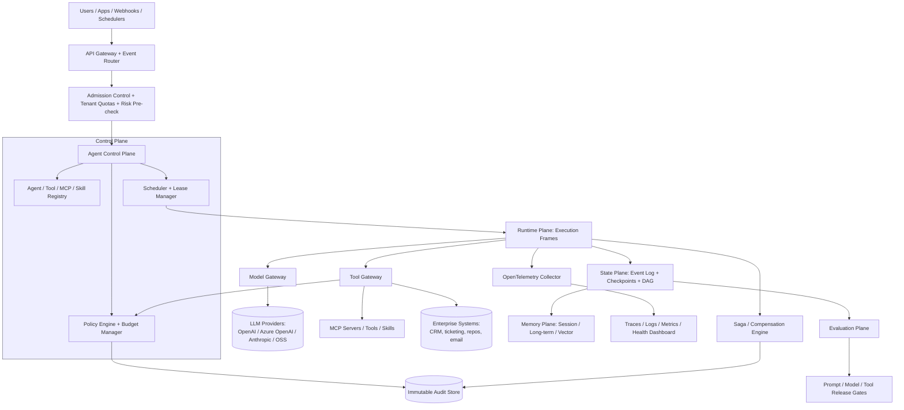

# Designing an Agentic AI Platform — System Design

> **Interview framing:** *"Design a platform that lets users create and deploy AI agents, register
> tools/MCP servers/skills, configure LLM providers, and run those agents safely in production —
> with health tracking, rollback, audit, guardrails, budgets, loop detection, and security
> controls."*

This is the uber/master document for the `agentic-ai-system-design/` track. It draws the
whole platform end-to-end and points into a dedicated doc for every component that earns its
own deep-dive. Read this file first; use the linked docs as the "45-minute, one-section-at-a-time"
reference layer.

**Core thesis** (memorize this — it answers 60% of follow-up questions on its own):

> The LLM is a *reasoning and planning component*, not the system of record, not the scheduler,
> not the policy engine, and not the authority that approves side effects. It proposes intent.
> A deterministic, observable, policy-governed distributed system around it decides what is
> actually allowed to happen, persists what happened, and can explain and undo it later.

This document — and this whole track — is scoped to **what is different about agent platforms
versus "just" distributed systems**. Queues, leader election, sharding, and load balancers are
assumed background knowledge; they get a sentence each. Loop detection, semantic evaluation,
trajectory replay, tool/MCP governance, and LLM-specific recovery patterns get full documents.

---

## 1 · What the platform actually needs to do

Restating the ask as capabilities, because interviewers grade on whether you covered the
full surface, not just the parts you find interesting:

| Capability the user asked for | Where it's designed |
|---|---|
| Create agents (define role, prompt, model, tools, policies) | [02 — Agent Lifecycle & Runtime](02-agent-lifecycle-and-runtime.md) |
| Deploy agents (versioning, rollout, rollback of the *agent definition*) | [02 — Agent Lifecycle & Runtime](02-agent-lifecycle-and-runtime.md) |
| Register tools, MCP servers, skills | [03 — Tool, MCP & Skill Registry](03-tool-mcp-and-skill-registry.md) |
| Sandbox/isolate agent and tool execution | [03 — Tool, MCP & Skill Registry §6](03-tool-mcp-and-skill-registry.md#6--tool-call-safety) |
| Configure LLMs and LLM providers | [04 — Model Gateway & LLM Providers](04-model-gateway-and-llm-providers.md) |
| Track agent health | [08 — Observability, Tracing & Health](08-observability-tracing-and-health.md) |
| Rollback agentic *actions* (not just deployments) | [10 — Recoverability, Rollbacks & Saga](10-recoverability-rollbacks-and-saga.md) |
| Audit agentic actions | [11 — Governance, Guardrails & Security](11-governance-guardrails-and-security.md) |
| Guardrails and policy enforcement | [11 — Governance, Guardrails & Security](11-governance-guardrails-and-security.md) |
| Token budgets | [06 — Non-Determinism, Loops & Termination](06-non-determinism-loops-and-termination.md) |
| Loop detection | [06 — Non-Determinism, Loops & Termination](06-non-determinism-loops-and-termination.md) |
| Security blocks (prompt injection, tool over-permission) | [11 — Governance, Guardrails & Security](11-governance-guardrails-and-security.md) |

Supporting depth, each with its own document because the content warrants it:

| Doc | Covers |
|---|---|
| [01 — Foundations of Agentic Systems](01-foundations-of-agentic-systems.md) | What makes a system "agentic," determinism spectrum, control/data plane split |
| [05 — State Management & Memory](05-state-management-and-memory.md) | Event sourcing, checkpoints, memory hierarchy, replay |
| [07 — Agent Evaluation Frameworks](07-agent-evaluation-frameworks.md) | Golden datasets, trajectory evaluation, LLM-as-judge, regression gates |
| [09 — Multi-Agent Communication Patterns](09-multi-agent-communication-patterns.md) | Supervisor, hierarchical, blackboard, contract-net, swarm |
| [12 — Production Scale & Capacity](12-production-scale-and-capacity.md) | Admission control, tenant quotas, hyperscale capacity planning |
| [13 — Semantic Kernel vs LangGraph](13-semantic-kernel-vs-langgraph.md) | Framework-level comparison with code, requested separately |

---

## 2 · Architecture



**The one boundary that matters most:** everything to the *left* of the Tool Gateway is the
model proposing intent. Everything crossing the Tool Gateway into `Enterprise` / `MCP` is a
real side effect and **must** pass through `PolicyEngine` first. If you remember one line to
draw on a whiteboard, draw that arrow and label it "authority boundary."

#### How These Planes Actually Talk To Each Other

The diagram's arrows are doing a lot of work silently — naming the actual mechanism at each
boundary is what turns "I can draw the diagram" into "I can defend the diagram":

- **Runtime → Model Gateway.** Typically a synchronous request/response call (often streamed
  token-by-token back to the caller) that passes through the Model Gateway's rate-limiting and
  circuit-breaker logic before ever reaching a provider — see
  [04 — Model Gateway & LLM Providers](04-model-gateway-and-llm-providers.md) for the routing,
  fallback, and budget mechanics behind that call.
- **Runtime → State/Memory.** A checkpoint write at each super-step boundary — the runtime
  doesn't stream continuous state to the State Plane, it persists a durable snapshot after each
  discrete step completes — see
  [05 — State Management & Memory](05-state-management-and-memory.md) for how checkpoints,
  event logs, and the memory hierarchy fit together.
- **Control Plane → Runtime (scheduling).** A lease/fencing-token handoff — the Control Plane
  grants the Runtime a time-bounded, uniquely-fenced lease on an execution before it starts, so
  a stale or duplicate runtime instance can't commit writes after its lease expires — see
  [02 — Agent Lifecycle & Runtime](02-agent-lifecycle-and-runtime.md) for the full lease/fencing
  mechanism.
- **Tool Gateway → Sandbox.** Every authorized tool call executes inside an isolation boundary
  allocated fresh for that one call — a short-lived scoped credential and a default-deny network
  egress allow-list are attached at allocation time, and the whole boundary (filesystem, process
  state, credential) is discarded the instant the call returns, success or failure — see
  [03 — Tool, MCP & Skill Registry §6](03-tool-mcp-and-skill-registry.md#6--tool-call-safety) for
  the isolation-tier and lifecycle mechanics.

---

## 3 · Plane-by-plane responsibility map

| Plane | Owns | Interview angle |
|---|---|---|
| Ingress | APIs, webhooks, scheduled triggers, identity context | How requests enter safely and consistently |
| Admission | Tenant quota, priority, risk pre-check, budget pre-check | How you prevent overload before execution starts |
| Control | Agent/tool/MCP/skill registry, scheduling, leases, policy hooks | How nondeterministic work is bounded by deterministic infrastructure |
| Runtime | Model calls, tool calls, step execution, isolation | How work runs without corrupting shared state — see [03 §6](03-tool-mcp-and-skill-registry.md#6--tool-call-safety) for the per-call sandbox mechanism |
| Model gateway | Provider routing, rate limits, fallback, cost metering | How you configure/swap LLMs without touching agent logic |
| Tool gateway | Policy-checked side effects, MCP/tool invocation | How model intent becomes an authorized action |
| State | Event log, checkpoints, DAG, tool records, approvals | How you replay, resume, audit, and debug execution |
| Memory | Thread memory, long-term stores, vector recall | How recall is useful without leaking tenants or stale facts |
| Observability | Traces, logs, metrics, health signals, cost attribution | How you explain what happened, and track agent health |
| Evaluation | Golden sets, trajectory checks, judges, regression gates | How you stop prompt/model/tool regressions before production |
| Recovery | Sagas, compensations, rollbacks, idempotency | How you undo or contain a partially-completed agentic action |
| Governance | Policy, HITL approval, audit, least privilege | How guardrails, security blocks, and audit actually work |

**Mnemonic:** `I‑A‑C‑R‑M‑T‑S‑Mem‑O‑E‑Rec‑G` is unwieldy — compress it to
**C‑R‑S‑M‑O‑E‑G**: **C**ontrol → **R**untime → **S**tate → **M**emory → **O**bservability →
**E**valuation → **G**overnance. If you can narrate that chain end to end, you can derive
almost every other answer in this track.

---

## 4 · End-to-end request lifecycle

This diagram covers more than "a request comes in and a response goes out" — it's meant to be
the one place that visibly connects **instantiation** (resolving and loading an agent
definition, allocating an execution frame), **execution** (the model/tool step loop),
**sandboxing** (where a per-call isolation boundary actually opens and closes), **governance**
(the pre-execution policy decision), and **monitoring** (span emission) into a single continuous
story. It deliberately still omits the failure/compensation path — that's Section 4.1, directly
below, because it deserves its own diagram rather than a cluttered `alt` branch buried in this
one.

```mermaid
sequenceDiagram
    participant U as Caller
    participant Adm as Admission
    participant Ctl as Control Plane
    participant Rt as Runtime
    participant MG as Model Gateway
    participant TG as Tool Gateway
    participant St as State Plane
    participant Obs as Observability
    participant Ev as Evaluation
    participant Au as Audit Store

    U->>Adm: Create/invoke agent run
    Adm->>Adm: check tenant quota, risk, budget
    Adm->>Ctl: admitted
    Ctl->>Ctl: resolve agent_version_id -> definition (prompt/model/tools/policies)
    Ctl->>Ctl: create execution id + fenced lease
    Ctl->>Rt: schedule execution onto a worker
    Rt->>Rt: allocate execution frame; load resolved definition
    Rt->>Obs: open root span (agent.execution)
    loop Agent step
        Rt->>MG: LLM call (reasoning/plan)
        MG-->>Rt: proposed action / next step
        Rt->>St: checkpoint (plan)
        Rt->>TG: proposed tool/MCP call
        TG->>TG: policy check + budget check + loop check
        alt allowed
            TG->>Au: log decision (allow) + idempotency key
            TG->>Rt: execute inside a fresh per-call sandbox (see 03 §6)
            Rt-->>Rt: sandbox result + provenance; sandbox torn down
            TG-->>Rt: tool result
        else needs approval
            TG->>U: HITL request
            U-->>TG: approve/deny/edit
        else denied
            TG->>Au: log decision (deny)
        end
        Rt->>St: checkpoint (observation)
        Rt->>Obs: emit child spans (llm.call, tool.call, policy.eval)
    end
    Note over Rt: A later step failing after an earlier one already committed hands off to<br/>the Saga Engine -- see Section 4.1, not shown here to keep this diagram readable
    Rt->>Ev: lightweight online guardrail check (fast, blocking)
    Rt->>St: final checkpoint
    Rt->>Obs: close root span
    St->>Au: immutable record complete
```

Every arrow that crosses into `Tool Gateway` or writes to `Audit Store` is a place a security
review will ask "what stops this from being abused?" Have an answer ready for each.

**Reconciling the two "evaluation" steps in this track.** The `lightweight online guardrail
check` above is fast, synchronous, and **blocking** — it runs inline on every single execution
and can affect that execution's own outcome (e.g. redact or refuse a response). It is a different
thing from the heavy trajectory/LLM-judge regression-gate pipeline in
[07 — Agent Evaluation Frameworks §8](07-agent-evaluation-frameworks.md#8--enterprise-vs-startup-recommendation),
which runs **asynchronously** — against golden datasets pre-deployment, and against sampled live
traces post-hoc — and only ever gates *future* deployments; it never blocks or alters an
execution that's already running. Keep these straight in an interview: **fast inline guardrail
vs. slow async regression gate** are two different planes of "evaluation" doing two different
jobs, not one blurry concept.

### 4.1 · Failure & compensation path

[10 — Recoverability, Rollbacks & Saga §2.3](10-recoverability-rollbacks-and-saga.md#23-saga-orchestration-flow)
states explicitly that its saga-orchestration flowchart should be read as "the generalization of
the request lifecycle sequence diagram in the uber doc, specifically for the 'proposed tool
call' branch." This is that extension, made concrete: what actually happens when step *N*'s tool
call fails **after** an earlier step (*N-1*) already committed a real side effect.

```mermaid
sequenceDiagram
    participant Rt as Runtime
    participant TG as Tool Gateway
    participant Saga as Saga / Compensation Engine
    participant Ext as External System (system of record)
    participant Au as Audit Store
    participant U as Human (HITL)

    Note over Rt,TG: Step N-1 already committed (e.g. ticket created); checkpointed with its compensation recorded
    Rt->>TG: step N proposed call
    TG-->>Rt: timeout / error / ambiguous result
    Rt->>Saga: step N failed -- evaluate already-committed steps for compensation
    Saga->>Ext: check-before-compensate: query system of record for step N-1's actual outcome
    Ext-->>Saga: confirmed committed / confirmed not committed / still ambiguous
    alt confirmed committed
        Saga->>TG: invoke compensation for step N-1
        TG->>Au: log compensation result
    else confirmed not committed
        Saga->>Au: log no-op -- nothing to compensate
    else still ambiguous
        Saga->>U: escalate -- present full saga state (committed steps, pending compensations)
        U-->>Saga: manual resolution
        Saga->>Au: log manual resolution
    end
    Saga->>Au: record final saga outcome
```

The two diagrams answer two deliberately separate questions with two separate mechanisms: the
`alt allowed / needs approval / denied` branch in Section 4 governs whether a **single proposed
action starts**; this diagram governs what happens **after an earlier one already finished**.
Policy decides admission. The Saga Engine decides recovery. Conflating the two — e.g. trying to
make the policy engine also own compensation logic — is a design smell worth naming out loud in
an interview.

---

## 5 · Ten things to memorize first

1. The LLM proposes intent; deterministic infrastructure grants authority.
2. The control plane owns scheduling, leases, budgets, cancellation, and policy boundaries.
3. The runtime plane executes steps but is **never** the source of truth.
4. Every meaningful transition creates durable state and observable telemetry.
5. Every mutating tool/MCP call needs policy, idempotency, audit evidence, and recovery semantics.
6. Loops are bounded by step, token, time, cost, semantic, and structural controls — never by
   "the model should know when to stop."
7. Memory is layered: context window → checkpoint → session DAG → long-term store → vector
   memory → immutable audit log.
8. Evaluation covers output quality, trajectory validity, safety, latency, cost, and recovery
   behavior — not just "did it get the right answer."
9. Tracing links model calls, tool calls, checkpoints, policy decisions, and evals into one
   correlated execution story (OpenTelemetry spans, one root span per execution).
10. Enterprise scale needs tenant isolation, quotas, admission control, noisy-neighbor
    protection, and per-tenant cost attribution.

---

## 6 · Failure mode cheat sheet

| Failure | Likely root cause | Answer |
|---|---|---|
| Infinite loop | Weak termination criteria, ambiguous observations | Max steps + token/time/cost budgets + structural fingerprinting + semantic similarity + supervisor escalation ([06](06-non-determinism-loops-and-termination.md)) |
| Stale worker write | Lease expiry + duplicate runtime ownership | Fencing tokens; reject commits from expired leases ([02](02-agent-lifecycle-and-runtime.md)) |
| Lost progress after crash | Runtime memory treated as source of truth | Checkpoint after every meaningful transition; resume from durable state ([05](05-state-management-and-memory.md)) |
| Unsafe side effect | Model output treated as authority | Tool gateway + policy engine + HITL + least privilege + audit ([11](11-governance-guardrails-and-security.md)) |
| Bad production regression | Prompt/model/tool change never evaluated | Golden datasets + trajectory checks + LLM judge + regression gates ([07](07-agent-evaluation-frameworks.md)) |
| Unexplainable incident | Missing trace correlation across async boundaries | Propagate trace context across model/tool/state/policy/eval spans ([08](08-observability-tracing-and-health.md)) |
| Cross-tenant leakage | Shared memory/logs/vector index without isolation | Partition state/memory by tenant; ACL-aware retrieval; scrub telemetry ([05](05-state-management-and-memory.md), [12](12-production-scale-and-capacity.md)) |
| Partial completion across systems | Side effects without a compensation plan | Saga orchestration + idempotency keys + compensation contracts + escalation ([10](10-recoverability-rollbacks-and-saga.md)) |
| Rogue/incompatible tool version | Tool/MCP registered without contract or sandbox | Versioned registry, capability negotiation, sandboxing ([03](03-tool-mcp-and-skill-registry.md)) |
| Wrong/expensive model routed | No fallback or budget-aware routing | Model gateway with routing policy, fallback chain, per-tenant budget ([04](04-model-gateway-and-llm-providers.md)) |
| Ambiguous tool-call outcome (timeout/partial response) | Side effect assumed failed and blindly retried | Check-before-compensate: query the system of record for actual state before retrying or compensating ([10](10-recoverability-rollbacks-and-saga.md)) |
| ANN recall silently degrades at scale | HNSW/IVF-PQ parameters (`M`/`efSearch`, `nlist`/`nprobe`) untuned as the index grows | Tune HNSW `efSearch`/`M` or IVF-PQ `nprobe`/`nlist` against a recall benchmark as corpus size grows ([05](05-state-management-and-memory.md)) |
| LLM-judge score looks inflated/inconsistent | Judge position bias (favors whichever answer it sees first/second) | Swapped-order verification: score both orderings, flag/average disagreements ([07](07-agent-evaluation-frameworks.md)) |
| Injected/compromised tool call taints a later step in the same execution | Sandbox reused across calls instead of allocated fresh per call | Fresh sandbox per tool call, torn down immediately after — no filesystem/credential state survives to the next call ([03 §6](03-tool-mcp-and-skill-registry.md#6--tool-call-safety)) |

---

## 7 · Interview answer template

When asked *"design an agentic AI platform,"* narrate in this order:

1. **State the invariant.** What must always be true even when the model is wrong? (→ Section 1's
   core thesis.)
2. **Separate the planes.** Control, runtime, model gateway, tool gateway, state, memory,
   observability, evaluation, recovery, governance.
3. **Name the risks.** Loop, duplicate execution, stale write, unsafe tool call, missing audit,
   noisy neighbor, cost blowout, prompt injection.
4. **Choose mechanisms.** Queues, leases + fencing tokens, checkpoints, event logs, policy
   gateways, budgets, HITL, evaluation gates, sagas.
5. **Discuss scale.** Tenant quotas, admission control, runtime pool sizing, model gateway
   throttling, state-store write rate, trace sampling.
6. **Close with tradeoffs.** Latency vs. reliability, autonomy vs. governance, memory quality vs.
   isolation, eval coverage vs. cost.

---

## 8 · Framework landscape (summary — full comparison in doc 13)

| Approach | Best for | Production gap you must fill yourself |
|---|---|---|
| Semantic Kernel-style orchestration | Developer-friendly app orchestration, enterprise .NET/Python integration | Needs external control/state/governance planes |
| LangGraph-style stateful graphs | Durable, explicit, resumable stateful workflows | Needs enterprise governance/capacity layered on top |
| AutoGen-style multi-agent | Event-driven, distributed, async multi-agent systems | Needs policy/eval/recovery hardening |
| Plain workflow engines | Deterministic business processes | Weak for open-ended reasoning |
| Actor systems | Distributed stateful concurrency | Need LLM-specific safety/eval bolted on |

No framework in this table *is* the platform. Each is (at most) a runtime/orchestration
library that lives inside the **Runtime** plane in Section 2's diagram. See
[13 — Semantic Kernel vs LangGraph](13-semantic-kernel-vs-langgraph.md) for a hands-on,
code-level comparison of the two most commonly asked about in interviews today.

---

## 9 · Scale variants

**Startup / 10-agent deployment:** one API service, one queue, one worker pool, one relational
database, a simple vector store, structured logs (not full OTel yet), hard step/token limits,
manual approval for every write tool, nightly golden-set evals.

**Enterprise / hyperscale:** everything in Section 2, plus tenant-aware admission control,
hot/warm/cold runtime pools, per-tenant model gateway throttling, sharded state stores, sampled
but safety-aware tracing, continuous evaluation with drift monitors, and a dedicated audit store
with retention policy.

Don't reach for the enterprise version on day one — name the startup version explicitly in an
interview; it signals judgment, not just knowledge.

---

## Quick Revision Notes

- The LLM proposes intent; infrastructure grants authority — repeat this until it's reflexive.
- Memorize the plane chain: **C‑R‑S‑M‑O‑E‑G**.
- Every mutating tool call = policy check + idempotency key + audit log entry + compensation plan.
- Loops die by budget (step/token/time/cost) + fingerprint (structural/semantic), never by hope.
- State ≠ chat history. State = input + plan + tool calls + observations + checkpoints +
  versions (prompt/model/tool/policy) + approvals + final output.
- One root span per execution; every child span (model/tool/state/policy/eval) shares its trace ID.
- Rollback in agent systems usually means **compensate**, not **undo** — most tool calls aren't
  transactional across system boundaries.
- Registries (agents, tools, MCP servers, skills) are versioned and capability-scoped — never
  "just a list of functions."
- No framework (LangGraph, Semantic Kernel, AutoGen) replaces the control/governance/eval planes;
  they live *inside* the runtime plane.
- Plane boundaries have concrete mechanisms, not magic: Runtime→Model Gateway is a synchronous
  (often streamed) call through rate-limit/circuit-breaker logic; Runtime→State is a checkpoint
  write per super-step; Control→Runtime is a lease/fencing-token handoff.
- Don't blindly retry an ambiguous tool-call outcome — check the system of record first, then
  compensate only if it actually failed.
- ANN recall degradation as a vector index grows is a tuning problem (HNSW `efSearch`/`M`,
  IVF-PQ `nprobe`/`nlist`), not a "the vector DB is broken" problem.
- LLM judges carry position bias — verify a preference with swapped-order scoring before
  trusting it as ground truth.
- An execution's "birth" is concrete, not magic: resolve `agent_version_id` → definition, mint a
  fenced lease, allocate a worker/execution frame, *then* open the root span — in that order.
- Every authorized tool call runs inside a sandbox allocated fresh for that one call, with a
  short-lived scoped credential and default-deny egress — and the whole boundary is discarded the
  instant the call returns, so a compromised call can't taint a later one in the same execution.
- "Evaluation" means two different things at two different speeds: a fast, inline, blocking
  guardrail check that can affect *this* execution, and a slow, async, sampled/pre-deployment
  LLM-judge regression gate that only affects *future* deployments — don't conflate them.
- Section 4's diagram covers admission through the happy path; Section 4.1 is the explicit
  extension for what happens when a later step fails after an earlier one already committed —
  policy governs whether an action starts, the Saga Engine governs what happens after one ends.

## Further Reading

- OpenTelemetry docs — <https://opentelemetry.io/docs/>
- OpenTelemetry traces/spans — <https://opentelemetry.io/docs/concepts/signals/traces/>
- LangGraph persistence (checkpointers vs. stores) — <https://docs.langchain.com/oss/python/langgraph/persistence>
- Semantic Kernel agent orchestration patterns — <https://learn.microsoft.com/en-us/semantic-kernel/frameworks/agent/agent-orchestration/>
- AutoGen Core user guide — <https://microsoft.github.io/autogen/stable/user-guide/core-user-guide/index.html>
- Azure Architecture Center — Saga pattern — <https://learn.microsoft.com/en-us/azure/architecture/patterns/saga>
- Azure Architecture Center — Compensating Transaction pattern — <https://learn.microsoft.com/en-us/azure/architecture/patterns/compensating-transaction>
- ReAct: Synergizing Reasoning and Acting in Language Models — <https://arxiv.org/abs/2210.03629>
- LLM-as-a-Judge survey — <https://arxiv.org/abs/2411.15594>
- Model Context Protocol specification — <https://modelcontextprotocol.io/>
- LangChain human-in-the-loop docs — <https://docs.langchain.com/oss/python/langchain/human-in-the-loop>
- Martin Fowler — Event Sourcing — <https://martinfowler.com/eaaDev/EventSourcing.html>
- Hierarchical Navigable Small World (HNSW) paper — <https://arxiv.org/abs/1603.09320>
- FAISS indexes guide (HNSW / IVF-PQ parameters) — <https://github.com/facebookresearch/faiss/wiki/Faiss-indexes>
- Judging LLM-as-a-Judge with MT-Bench and Chatbot Arena (position bias) — <https://arxiv.org/abs/2306.05685>
