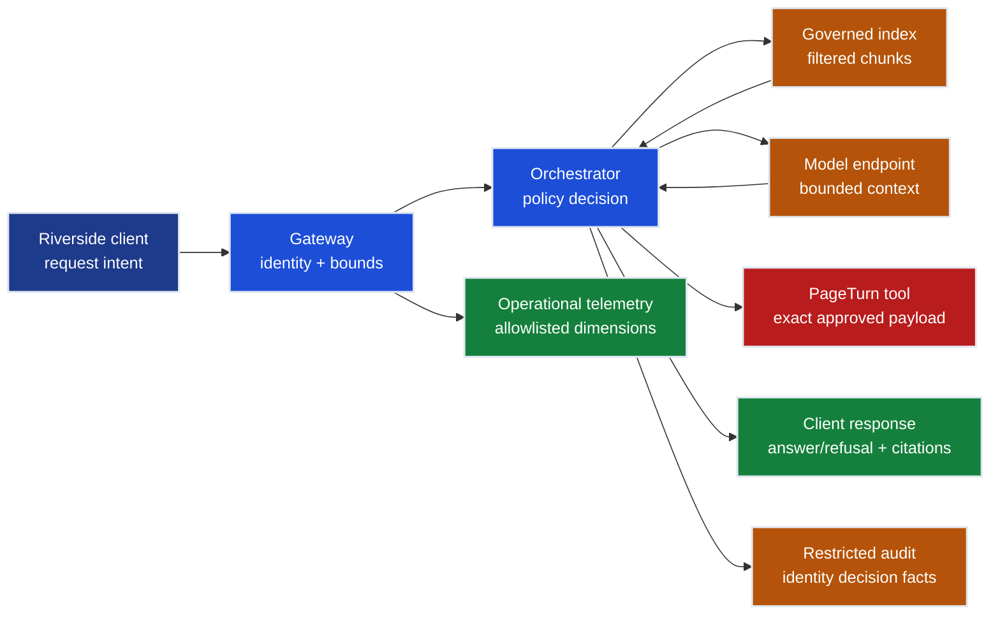

# Riverside Data-Flow and Residency Map

**Status:** `[Modeled]` design artifact. No production region, backup location,
cross-region recovery behavior, or compliance commitment is approved or proven.

## Data categories and decisions

| Category | Example | Frozen policy/model | Local proof available | External evidence required | Owner |
|---|---|---|---|---|---|
| Customer content | EU manuscript and retrieved chunks | `TEN-RIV-EU` permits `REG-UKS`; public AI service prohibited | Context/filter logic and expected denials | Actual storage, processing, cache, backup, support, model endpoint, and deletion paths | Security + Legal |
| Security metadata | Tenant, roles, title assignments, purpose | Required at authorization boundary | Required fields and decision propagation | IdP token/revocation, data store, audit access, retention | Identity + Security |
| Tool payload | PageTurn transition and approval hash | Exact payload, human confirmation, one business key | Local tool-policy shape | Live endpoint authority, idempotency, reconciliation, audit | Applications owner |
| Response/citations | Answer/refusal, source lineage | Authorized sources only; safe v1 envelope | Response minimization design | Gateway/runtime streaming and error behavior | Platform owner |
| Operational telemetry | Route/outcome/token buckets | No prompt, completion, user, request, tenant, document, or trace IDs as metric labels | Allowlist inspection | Sample metrics/logs/traces under load and failure | Operations + Security |
| Restricted audit | Allow/deny decision facts | Preserve identity decision without content | Synthetic audit schema | Destination RBAC, encryption, immutability, retention, legal hold, deletion exception | Security + Legal |
| Model/evaluation artifacts | Release, test cases, reports | Versioned, immutable evidence | Source contract inspection | Registry/build/runner regions, replication, processor paths | ML platform owner |
| Control-plane metadata | Resource/identity/configuration | No customer identifiers in tags | IaC/source inspection | Service control plane and vendor support commitments | Cloud platform owner |

## Regional gate

- `TEN-RIV-EU`: modeled primary region `REG-UKS`; no failover permission is implied.
- `TEN-RIV-US`: modeled primary region `REG-EUS`; cross-tenant access remains prohibited.
- `TEN-RIV-CORP`: modeled region `REG-UKS`.
- `TEN-RIV-SBX`: synthetic fixtures only in `REG-UKS` as a teaching label, not a cloud deployment.

A record's `region_id` constrains policy; it does not move data, configure a
resource, disable replication, or prove where a service processed a request.

## Unresolved decision record

| Decision | Status | Required approvers | Revalidation trigger |
|---|---|---|---|
| EU storage and processing scope | External validation required | Security, Legal/Privacy, data owner | Service/SKU/feature change |
| Backup and restore location | External validation required | Security, Legal/Privacy, Operations | Redundancy or backup change |
| Diagnostics and support path | External validation required | Security, Privacy, Operations | Telemetry/export/support change |
| Regional outage behavior | External validation required | Security, Editorial, Operations | Failover architecture change |
| Deletion and legal hold | External validation required | Legal/Privacy, data owner, Security | Retention or legal basis change |
