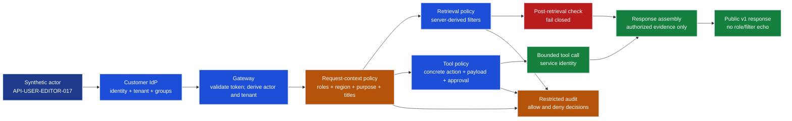

# Riverside Identity Flow

**Status:** `[Local-static]` design artifact. Not a deployed identity proof.

## Context propagation

| Boundary | Trusted input | Decision | Forwarded context | Must not cross |
|---|---|---|---|---|
| Actor to IdP | Authentication ceremony | Establish identity | Actor, tenant memberships, groups, status | Passwords, authenticators |
| IdP to gateway | Signed token | Validate issuer, audience, signature, expiry, scope | Actor, tenant, trusted groups | Unvalidated client tenant/role headers |
| Gateway to policy | Validated identity plus approved request intent | Derive effective roles; validate region, purpose, titles | All seven required context fields | Caller-added authority |
| Policy to retrieval | Normalized context | Build mandatory filters | Tenant, region, purpose, title scope, effective roles, trace | Model-generated filters as authority |
| Policy to tool | Normalized context plus concrete action | Allow, deny, or require exact-payload approval | Minimum action scope and service identity | Caller token, broad credentials |
| Components to audit | Decision facts | Preserve allow and deny evidence | Synthetic actor/tenant, trace, policy/rule, outcome, reason | Prompt, completion, manuscript, token |
| Response assembly to client | Authorized evidence and decision | Minimize public envelope | Answer/refusal, citations, trace, deployment metadata | Internal roles, filters, token claims, backend errors |

## Invariants

1. Authentication does not grant a purpose or a tool action.
2. Requested roles may narrow but never expand trusted entitlements.
3. The region field is policy metadata until deployed routing/storage is externally proven.
4. Retrieval enforces filters before search and authorization again after search.
5. The model proposes intent; deterministic policy controls authority.
6. Audit records identity decisions; metrics use only bounded, non-identifying dimensions.

## Open external validations

- Token issuance, nested-group behavior, revocation, and reconciliation freshness.
- Managed/workload identity permissions and exact Azure scopes.
- Private network and DNS behavior for every hop.
- Audit retention, legal hold, support access, and deletion policy.
- Regional storage, processing, backup, diagnostics, and subprocessor paths.
