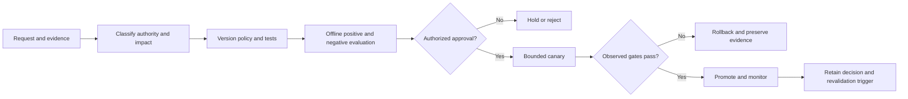

# Policy-Change Process Template

> Policy changes alter authority and safety behavior. Treat them as versioned releases with evaluation, approval, bounded exposure, rollback, and retained evidence.

## Change control

| Field | Value |
|---|---|
| Change ID | `CHG-POL-<stable ID>` |
| Policy artifact/version/digest | `<reference>` |
| Requestor and accountable policy owner | `<roles>` |
| Technical implementer | `<role>` |
| Approval authorities | Workflow/product, security, data, legal/compliance where applicable |
| Target environment/cohort/date | `<scope>` |
| Current known-good policy | `<immutable reference>` |
| Status | `proposed / evaluating / approved / rolling out / rolled back / superseded` |
| Revalidate on | Policy intent, source, evaluator, role, data, model, tool, or jurisdiction change |

## Change flow

## Proposal

| Question | Required answer |
|---|---|
| What decision behavior changes? | `<before/after in bounded terms>` |
| Which policy source and authority support the intent? | `<source version and owner>` |
| Which users, tenants, regions, data, tools, or actions are affected? | `<scope>` |
| What is explicitly unchanged? | `<non-goals>` |
| What failure or evidence triggered the request? | `<incident, review, feedback, regulation, or expired evidence>` |
| What new false allows and false denies are plausible? | `<threat/failure analysis>` |
| Does the change affect consequential or irreversible actions? | `<classification and required HITL>` |
| Which claims become invalid? | `<claim IDs>` |

## Required gates

| Gate | Evidence | Owner/reviewer | Pass rule | Failure action |
|---|---|---|---|---|
| Source and authority | Current source, applicability, and authorized policy owner | `<roles>` | Intent and scope are approved | Hold |
| Static/contract review | Version/digest, schema, code/policy review | `<roles>` | No unreviewed direct production edit | Repair |
| Positive behavior | Allowed cases by approved slice | `<roles>` | Approved cases remain allowed | Hold or narrow scope |
| Negative behavior | Forbidden, cross-tenant, stale-source, over-privileged cases | Security/data | Zero successful forbidden access | Block and investigate |
| Quality/operations | Retrieval, generation, latency, cost, support impact | `<roles>` | Accepted gates pass | Stop rollout |
| Rollback | Named prior version and restore path | Release/change owner | Timed rehearsal or retained current evidence | Block exposure |
| Approval | Scoped decision and conditions | Authorized owners | Authority matches impact | Hold |

## Rollout and rollback

- Start with offline/replay evidence, then the smallest approved cohort.
- Stop on any false allow, prohibited action, failed critical gate, untrustworthy telemetry, or missing authority.
- Restore the named known-good policy through the controlled deployment path.
- Revalidate auth, routing, retries, normalized errors, telemetry, quality, and affected actions.
- Preserve the rejected candidate, evidence, decision, and reason; do not rewrite history.
- If committed actions were affected, reconcile and compensate separately. Policy rollback does not undo them.

## Emergency change

Emergency containment may precede the full record only when delay increases harm. Record commander, scope, exact change, known-good target, expiry, evidence preserved, and retrospective review. Emergency does not mean direct undocumented portal editing becomes acceptable.

## Riverside exercise

For `INC-RIV-001`, propose a change that prevents superseded policy citation. Do not encode the answer as a prompt-only preference. Identify source lifecycle, index behavior, retrieval evaluation, policy-owner approval, canary scope, rollback target, and reindex evidence.

## Completion record

| Decision | Evidence class/reference | Approver/authority | Scope and conditions | Result | Limitations | Supersedes |
|---|---|---|---|---|---|---|
| `<decision>` | `<reference>` | `<role/date>` | `<scope>` | `<result>` | `<limits>` | `<change ID>` |
