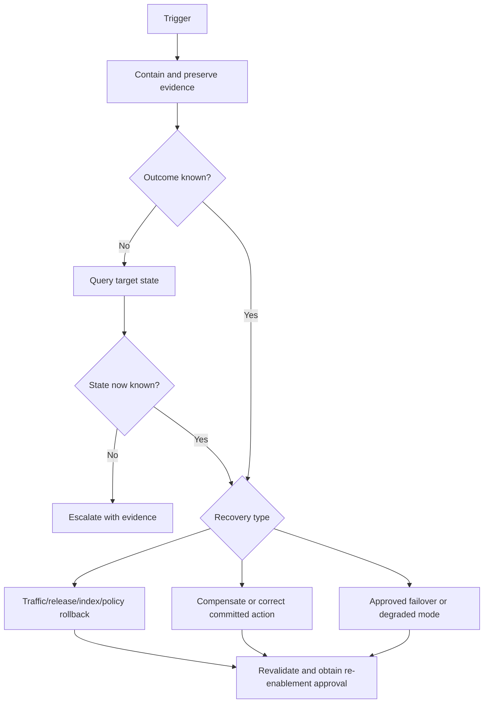

# Operational Runbook Template and Riverside Set

> A runbook must help a trained operator make the next safe decision under pressure. Command lists without scope, stop conditions, evidence handling, and authority are incomplete.

## Runbook control

| Field | Value |
|---|---|
| Runbook ID/title | `<RBK-ID and title>` |
| Version/status | `<version; draft/approved/superseded>` |
| Scenario and scope | `<services, tenants, regions, use cases>` |
| Primary owner/backup | `<roles>` |
| Incident/change authority | `<role>` |
| Last drill/result | `<Measured record or not run>` |
| Known-good references | `<release, index, policy, config>` |
| Revalidate on | Dependency, contract, policy, identity, release, ownership, or tooling change |

## Trigger and safety boundary

- **Trigger:** `<alert, report, or observation>`
- **Do not use when:** `<conditions requiring another runbook or immediate escalation>`
- **Prohibited actions:** bypassing auth/ACL/policy; deleting evidence; printing secrets/content; speculative broad credential rotation; unapproved cross-region failover; increasing retries during overload.
- **Success condition:** `<observable state plus approved observation window>`
- **Stop/escalate condition:** `<ambiguous state, failed compensation, missing evidence, authority boundary>`

## Procedure

| Step | Operator action | Expected observation | Evidence to retain | Stop/escalate when | Authority required |
|---:|---|---|---|---|---|
| 1 | Declare scope and assign commander/scribe | Incident/change record exists | UTC timestamp, reporter, versions, affected scope | No commander for required severity | Incident authority |
| 2 | Freeze conflicting changes | Release/index/policy/data state stops moving | Change freeze record | Freeze would violate a higher-priority safety control | Incident authority |
| 3 | Apply narrow containment | Exposure is bounded without weakening controls | Decision and before/after state | Outcome is ambiguous or containment fails | Named service/security owner |
| 4 | Diagnose by boundary | Evidence supports or rejects each hypothesis | Queries, versions, safe logs/traces | Telemetry is missing or content handling is unsafe | Data/security owner as applicable |
| 5 | Roll back, reconcile, compensate, or roll forward | State matches the selected recovery target | Commands/actions, approvals, target state | External side effect outcome is unknown | Release/tool/change authority |
| 6 | Revalidate | Relevant positive and negative gates pass | Test/drill package and limitations | Any critical gate fails | Re-enablement authority |
| 7 | Observe and communicate | Stable signals for approved window | Metrics, updates, open risks | Regression or new impact appears | Communications/incident authority |
| 8 | Close and learn | Temporary controls have owners/expiry | Review, actions, backlog links | A document-only action substitutes for remediation | Acceptance owner |

## Recovery decision

## Minimum Riverside runbook set

| Runbook ID | Scenario | First containment | Critical distinction | Seeded exercise |
|---|---|---|---|---|
| `RBK-RIV-PROVIDER` | Degraded model, embedding, or regional provider | Stop ramp; use approved fallback/degraded mode or fail closed | Provider fallback cannot violate region or data policy | `INC-RIV-006` |
| `RBK-RIV-STALE-RETRIEVAL` | Stale, superseded, duplicate, or unauthorized retrieval | Freeze index promotion; disable affected guidance | Index rollback is independent of model rollback | `INC-RIV-001`, `INC-RIV-002` |
| `RBK-RIV-IDENTITY` | Identity failure or cross-tenant access | Disable affected route; revoke narrow path; preserve evidence | False allow is security; false deny is availability until proven otherwise | `INC-RIV-003` |
| `RBK-RIV-BUDGET` | Quota or budget exhaustion | Stop ramp and retry amplification; protect known-good traffic | More workers do not solve provider token quota | Capacity exercise |
| `RBK-RIV-TOOL-AMBIGUOUS` | Tool timeout or duplicate workflow attempt | Pause writes; query committed state; keep safe read mode | Unknown commit outcome is query first, escalation second | `INC-RIV-005` |
| `RBK-RIV-DATA-SYNC` | Sync, schema, reindex, or deletion failure | Pause publication; retain lineage; serve known-good index where allowed | Never restore content subject to valid deletion | `INC-RIV-002` plus `UNK-RIV-002` |
| `RBK-RIV-ROLLBACK` | Candidate release/index/policy causes regression | Remove candidate exposure and select named known-good target | Deployment rollback does not undo committed side effects | Rollback drill |
| `RBK-RIV-REENABLE` | Restore after containment | Keep containment until all relevant gates and approvals pass | Recovery is not re-enablement authority | Any seeded incident |
| `RBK-RIV-TELEMETRY` | Missing, stale, overloaded, or content-leaking telemetry | Stop evidence-dependent changes; contain unsafe export | Missing telemetry lowers confidence; it does not prove health | Telemetry drill |

## Scenario-specific additions

### Tool timeout or duplicate workflow attempt

1. Pause PageTurn writes and preserve read-only assistance if it remains safe.
2. Locate the stable business key, idempotency key, checkpoint, attempts, and PageTurn event history.
3. Query PageTurn for committed state before retrying or compensating.
4. If committed once, treat the operation as success and repair local state.
5. If absent and retry is contractually idempotent, retry with the same key.
6. If state remains ambiguous, escalate. Do not guess.
7. If a duplicate committed, invoke the approved correction/compensation path and retain both action records.

### Re-enablement

Require health/readiness, contract smoke, negative authorization, telemetry-redaction, representative quality, stable operational signals, exact version confirmation, and incident/security/release approval as applicable. Record limitations and the observation window.

## Drill record

| Field | Entry |
|---|---|
| Drill ID/date | `<ID/UTC date>` |
| Scenario and injected evidence | `<bounded description>` |
| Operators/observers | `<roles>` |
| Time to detect/contain/decide/recover | `<Measured values>` |
| Unsafe or skipped steps | `
` |
| Evidence preserved correctly | `yes/no with reference` |
| Outcome | `pass / remediate and repeat / blocked` |
| Remediation owner/due date | `<owner/date>` |

An attendance record is not a drill result. A failed drill keeps the related handoff gate open.
