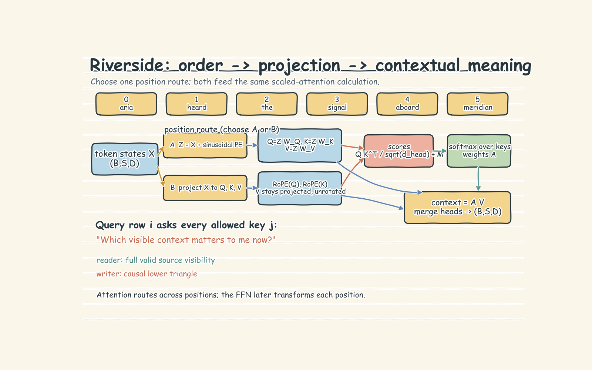

# Attention and Transformer Blocks: Handwritten Theory Notes

## 1. See the whole path first

Start with one ordinary sentence such as **"Aria heard the signal aboard Meridian."** The story is irrelevant; the useful part is that order and relationships already matter.

```text
text
-> token IDs
-> token embeddings + position
-> attention gathers context between tokens
-> the FFN refines each token privately
-> an output head produces vocabulary logits
-> loss measures the next-token error
-> backpropagation improves every learned step
```

A Transformer block is the middle of this path. Attention lets each token ask which other tokens matter and retrieve a weighted blend of their information. The FFN then transforms the gathered features inside each token. Compared with an RNN, attention gives distant tokens a direct connection and processes training positions in parallel.

The notebook uses one word per token and a frozen three-dimensional embedding map so the intermediate vectors can be inspected. Real tokenizers often split words into subwords, and real embeddings are trained with the rest of the model.

## 2. Embeddings need position

IDs shaped `(batch, sequence)` become embeddings shaped `(batch, sequence, model width)`. Averaging the six Riverside vectors loses order: the correct sentence and a shuffle have the same mean. The model knows the words but not who heard what or where.

**Additive sinusoidal position** adds a fixed pattern with fast- and slow-changing dimensions to each token. Later projections mix content and position, so relative distance is learnable but not guaranteed to stay explicit in the attention score.

**RoPE** instead rotates coordinate pairs in projected queries and keys. Absolute positions set the rotations, but their comparison exposes relative distance. The notebook preserves the `signal`-to-`meridian` dot product when both move but their gap stays fixed. This does not mean sinusoidal encoding fails.



## 3. Q, K, V and one attention head

Each token is mapped through three learned projections:

- **Query:** what information am I looking for?
- **Key:** what kind of information do I advertise?
- **Value:** what information do I send if selected?

A query scores every key, softmax creates positive weights that sum to one, and those weights mix the values: a soft dictionary lookup.

In operation order, attention multiplies queries by transposed keys, divides those scores by the square root of the query/key width, applies an optional mask, normalizes with softmax, and uses the resulting weights to mix the values. `Q`, `K`, and `V` are the query, key, and value tensors. A blocked mask entry acts like negative infinity, giving that token pair zero weight.

Wider vectors produce larger dot products. Without square-root scaling, softmax becomes nearly one-hot, its slope shrinks, and learning weakens. Multiplying the resulting weights by `V` creates one contextual vector per query.

The notebook first uses raw embeddings as Q, K, and V, then learns separate projections so similarity and contribution can differ. Attention weights are routing coefficients, not proof of reasoning.

## 4. Multi-head attention and shape flow

One head produces one routing pattern. Multiple heads learn several in parallel, perhaps favoring nearby syntax or related entities. Roles can overlap and need not be human-readable.

Every head receives the full token representation, then projects it to a narrower head width. The notebook uses model width 16, two heads, and width 8 per head. The practical shape trace is:

```text
input                 (B, S, 16)
split Q/K/V           (B, 2, S, 8)
attention scores      (B, 2, S, S)
weighted values       (B, 2, S, 8)
concatenate + output  (B, S, 16)
```

Model width must divide evenly by head count. More heads are not automatically better because each becomes narrower.

## 5. FFN, residual paths, and normalization

Attention mixes **across token positions**. The FFN mixes features **within each token**, using shared weights at every position. It expands width, applies GELU, and projects back; the notebook uses `16 -> 32 -> 16`.

Layer normalization stabilizes each token across its feature dimensions. The notebook uses **pre-LN**, so normalization happens before attention and before the FFN. Residual additions preserve the original stream while each sublayer learns a correction:

Start with input `x`: normalize it, run multi-head attention, and add that correction back to `x` to form the post-attention state `a`. Then normalize `a`, run the feed-forward network, and add that correction back to form output `y`. Residuals give gradients a direct route through depth, as the notebook's 24-layer probe shows.


Sequence length and model width remain unchanged across a block. Stacking blocks changes what each token represents, not the outer shape.

## 6. From contextual vectors to prediction and learning

After the final block, each token position holds a contextual vector, not a word or probability. A vocabulary head converts that vector into one score per possible next token. Softmax turns the scores into probabilities; the highest probability is the model's current best guess, not guaranteed truth.

During training, the actual next token is known. Loss becomes large when the model assigns it little probability and small when the model assigns it much probability. Backpropagation then carries responsibility from that error through the vocabulary head, FFN, attention projections, positional mechanism, and token embeddings. The optimizer nudges all trainable weights in directions that should make future predictions less surprising.

Backpropagation is used to learn the weights. It is not another layer in the generation-time forward path.

## 7. Masks, model families, and practical failure modes

Encoders can inspect the full sequence. Decoders use a causal mask so each position sees only itself and earlier positions, preventing leakage during parallel training. Generation predicts from the current prefix, appends one token, and repeats. A separate padding mask blocks empty batch positions.

| Family | Information rule | Best fit |
|---|---|---|
| Encoder-only | Every input token can read the complete input | Classification, extraction, tagging, and retrieval |
| Decoder-only | Every token can read only its visible prefix | Continuation, chat, and code generation |
| Encoder-decoder | A full-input reader builds memory for a causal writer | Translation, summarization, and source-to-target transformation |

Common mistakes:

- **Shuffled inputs look identical:** add positional information.
- **Scores become too sharp:** scale by the square root of head width and mask before softmax.
- **Future tokens leak:** use a causal mask for next-token prediction.
- **Padding affects outputs:** combine the padding mask with any causal mask.
- **Head reshape fails:** choose a head count that divides model width.
- **The model only routes information:** retain the nonlinear FFN.
- **Deep training becomes unstable:** retain residual paths and normalization; pre-LN is a strong default.
- **Toy attention maps look meaningful:** remember that seeded projections and hand-labelled embeddings are demonstrations, not production evidence or causal explanations.
