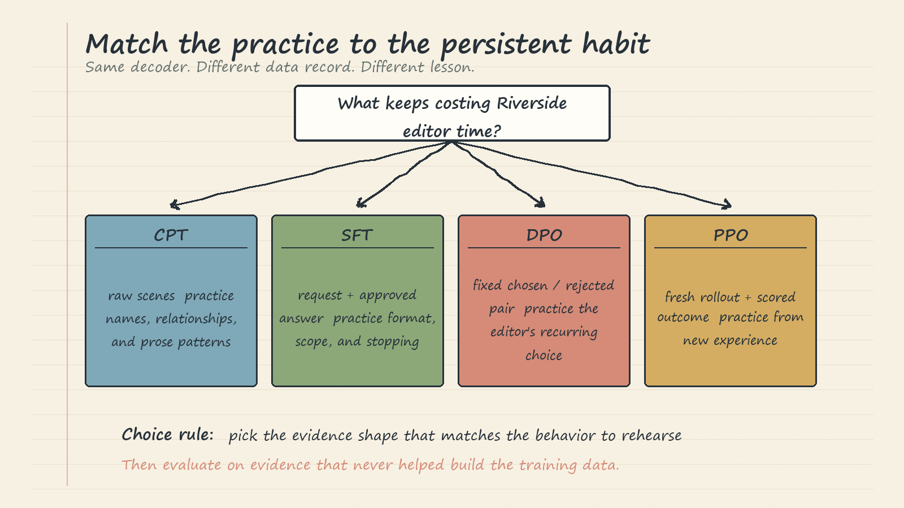
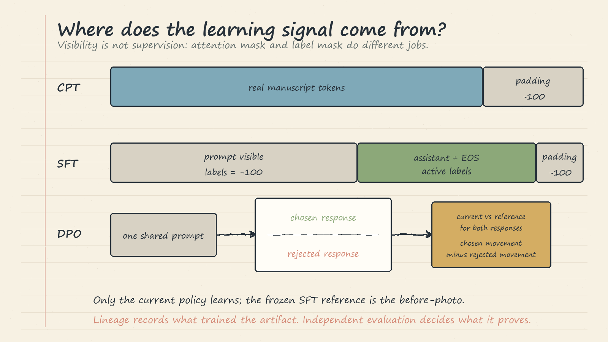

# LLM Fine-Tuning Data Techniques: Handwritten Theory Notes

## 1. Choose the behavior before the trainer

Riverside's fluent model still needs reminders of its private story world, answer shape, and which valid draft is useful. Test fine-tuning only when that stable behavior should become a default habit.

- **CPT:** practice raw domain sequences.
- **SFT:** practice an approved request/response contract.
- **Preference learning:** practice choosing one acceptable answer over another.
- **PPO:** learn from fresh outcomes produced by a changing policy.
- **DPO:** learn directly from a fixed archive of chosen/rejected pairs.

These are alternatives, not a mandatory chain. Prompt first when clear instructions work. Use RAG for current, citable, deletable, permission-filtered facts; fine-tuning is a poor database.



## 2. One decoder, different answer keys

Instruction, context, and completion still form one left-to-right token stream. The objective changes which positions create error and gradient. **Attention masking** controls what a token may read; **loss masking** controls which predictions are graded. A label of `-100` means “ignore this target.”

### CPT: raw prose is the lesson

```text
record: { text: "Aria traced the prime-number signal ..." }

input:  [real manuscript tokens ........ padding]
labels: [same real token IDs ........... -100   ]
mask:   [1 1 1 1 1 .................... 0 0    ]
```

Flow: `raw paragraph -> tokenize -> keep overflow blocks -> predict every real next token`. CPT makes names, relationships, terminology, and prose patterns less foreign. It does not rehearse “one sentence and stop” or say which valid draft an editor prefers. Plain truncation loses tails; packing and overflow preserve more text but introduce document-boundary or cross-block context trade-offs.

### Response-masked SFT: show the prompt, grade the answer

```text
Request: Continue this scene in exactly one sentence and stop.
Context: Aria watched the signal repeat across node seventeen.
Answer:  She isolated the transmission and called Wren.

input:  [system + request + context] [assistant sentence + EOS] [padding]
labels: [-100 -100 -100 ..........] [real IDs ..............] [-100   ]
mask:   [1 1 1 1 1 ..............] [1 1 1 .................] [0 0    ]
```

Flow: `paragraph i -> request context`; `first sentence of paragraph i+1 -> approved response`. Prompt tokens remain visible because the answer depends on them, but only the assistant suffix and one EOS are supervised. EOS is part of the stopping lesson. The notebook bounds the rendered prompt and response separately and verifies the native chat-template boundary; those budgets are implementation choices, not universal constants.



## 3. Preference data controls everything except the choice

SFT can teach the output contract and still leave two acceptable drafts. That is the complaint preference learning answers: **both responses work, but editors consistently keep one.** If the rejected response is truncated or breaks the format, the pair teaches surface correctness instead of editorial preference. Hold the contract fixed; change only the choice.

```text
prompt:   shared editor request and context
chosen:   complete scene-advancing sentence + EOS
rejected: complete coherent stalling sentence + EOS
```

Both responses must satisfy the same surface contract. Otherwise the model can learn “prefer shorter,” “prefer grammatical,” or “prefer the response with EOS” instead of editorial usefulness. Riverside uses an authentic next sentence as chosen, a hand-authored grammatical stall as rejected, rejects fragments, bounds lengths, and allows only a small token gap.

That construction is reproducible, not proof of editor agreement. Production pairs need a written rubric, qualified and randomized review, ties and disagreement handling, duplicate and shortcut checks, privacy and consent rules, automated-label audits, and provenance for prompts, candidates, raters, or outcome sources.

### PPO intuition: fresh experience, cautious credit

Use PPO when the changing policy must try new tool calls, simulator actions, or drafts:

```text
current writer -> fresh rollout -> frozen judge score
judge score - SFT-reference drift cost -> regularized outcome
value model expectation -> better/worse than expected credit
old-policy snapshot -> measure this batch's probability move
clipping -> stop rewarding an excessive one-batch move
```

The frozen SFT reference anchors trusted behavior throughout training. The old policy is the short-lived snapshot that generated the current batch. The value model predicts expected outcome, not editorial quality. PPO fails with exploitable rewards, biased rollouts, noisy value estimates, or weak safety and retention gates. Clipping stabilizes movement; it cannot repair a bad reward.

### DPO intuition: fixed pairs, direct movement

DPO starts with a frozen SFT reference and a trainable copy. For each complete suffix:

```text
chosen:  reference support -12.0 -> current support -10.8 -> movement +1.2
rejected: reference support -11.5 -> current support -11.3 -> movement +0.2
result: chosen moved farther from the shared start -> preferred direction
```

The lesson is relative movement from the same SFT before-photo, not which response originally had higher raw probability. Only the current policy receives gradients. `beta` controls reference regularization, not optimizer step size: smaller values may permit farther movement; larger values keep behavior closer. Ambiguous or inconsistent labels teach the wrong ranking directly.

## 4. Provenance is not evidence

The notebook records model IDs and revisions, seed, package versions, arguments, artifact ancestry, profile paths, and hashes for all 40 training chapters. This is a strong lineage contract: it explains what produced an artifact and supports reconstruction.

It does not establish quality. All chapters participate in training, runs use only ten optimizer steps, and before/after generations are in-sample mechanism illustrations. They cannot support claims about unseen behavior, generalization, production prose, release readiness, or live services.

Independent evidence must be separately versioned and isolated from training-data construction, checkpoint selection, prompt tuning, and threshold setting. Use the objective-appropriate baseline, workload measures, retention and safety checks, and gates fixed before results are inspected. A saved artifact proves only that state was saved.

## 5. Selection rules and failure modes

- **CPT** for recurring language patterns. Watch truncation, bad packing, excess exposure, and forgetting.
- **SFT** for role, format, scope, and stopping. Watch prompt-label leakage, missing EOS, target truncation, unstable serialization, and weak demonstrations.
- **DPO** for trustworthy fixed comparisons. Watch unclear rubrics, disagreement, length/style shortcuts, malformed alternatives, and lost contract retention.
- **PPO** when fresh outcomes are essential. Watch reward hacking, rollout bias, unstable credit, and confusion between old-policy clipping and SFT-reference drift control.
- For fair comparisons, hold seed policy, effective batch, token budget, data boundary, and trainable surface fixed. Objective chooses the signal; batch controls noise; learning rate scales steps; exposure repeats them.

Memory aid: **raw text teaches familiarity; demonstrations teach the answer contract; comparisons teach the choice; independent evaluation decides whether any of it worked.**
