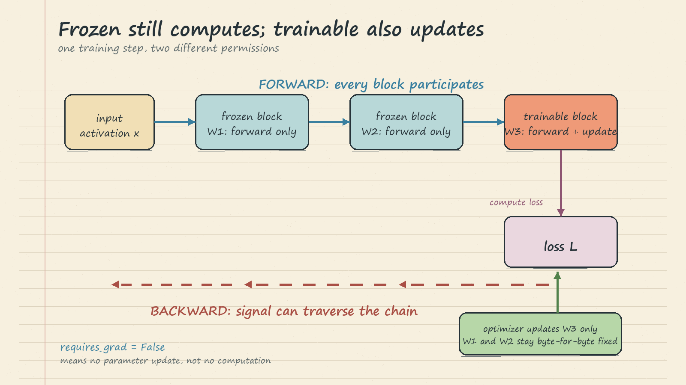

# LLM Fine-Tuning Parameter Techniques: Handwritten Theory Notes

## 1. One Objective, Different Places to Store Learning

The learning objective decides **what behavior to practice**; the parameter strategy decides **which values may change**. The notebook keeps raw-Aria continued pretraining fixed and compares full fine-tuning, partial freezing, LoRA, and QLoRA. This makes their costs comparable.

Three costs matter. **Update state** includes gradients and optimizer history for trainable values. **Artifacts** are the model or adapter files that must be stored, moved, and versioned. **Quality risk** includes losing instruction following or other useful behavior, detecting that regression, and recovering from it. The notebook can show writable tensors and saved files, but only separate target and retention tests can establish quality.

## 2. Full Fine-Tuning

Full fine-tuning lets every weight change. It gives the optimizer maximum freedom, which may help when a task needs broad changes across the model. It also creates the largest memory and storage bill: every weight may need a gradient and optimizer history, and each adaptation becomes another complete checkpoint.

The quality risk is broad because narrow data can pull every weight toward the new task. In the notebook, an instruction model practices raw fiction, so better prose continuation could coincide with worse instruction following. A small learning rate and short run limit movement but do not prove safety. Mixing representative old data, evaluating during training, and stopping early can reduce risk, yet retained capability must still be measured.

Rollback means replacing the adapted checkpoint with the pinned original or another complete model. This is reliable, but moving and redeploying a full artifact is operationally heavier than disabling an adapter.

## 3. Freezing Most of the Model

Freezing changes update permission, not computation. Frozen blocks still run in the forward pass and shape every later activation; they simply receive no optimizer update. The notebook freezes everything, then reopens roughly the last quarter of decoder blocks and the final normalization layer while keeping the tied embedding/output weight frozen.

This reduces gradient and optimizer state and guarantees that the frozen tensors remain unchanged. However, the writable upper layers can still alter the final behavior, so freezing narrows rather than removes quality risk. It also still saves a complete checkpoint. Use it when a known layer slice is likely sufficient and full-checkpoint deployment and rollback are acceptable.

## 4. LoRA: Add a Small Correction

LoRA keeps a projection's original weight `W` frozen and learns a low-rank correction beside it. For layer input `x`, matrix `A` compresses the input into a small bottleneck and matrix `B` expands it back to the output width. The layer adds that correction to the frozen projection's output to produce the combined result `y`.

For a 4096-wide projection with rank 8, `W` has shape 4096 by 4096, while `A` is 8 by 4096 and `B` is 4096 by 8. The two narrow matrices hold far fewer trainable values than a full replacement for `W`.

The notebook attaches rank-8 corrections to `q_proj`, `k_proj`, `v_proj`, and `o_proj`. Only the adapter matrices receive gradients; the shared base stays unchanged. This sharply reduces optimizer state and produces a small per-job artifact. Several Riverside jobs can share one pinned base and load different adapters.

The constraint is also the tradeoff. A low rank offers fewer independent directions in which to change behavior, so LoRA may underfit a change that genuinely needs broad capacity. An adapter can still harm outputs while active, and it works only with the exact compatible base, dimensions, target modules, and tokenizer contract.

Rollback is simple: disable or replace the adapter. Because the base was never rewritten, its original behavior is immediately available without restoring a full checkpoint.

## 5. QLoRA: Make the Frozen Base Smaller

LoRA reduces trainable memory but still keeps the full base model resident. QLoRA addresses that remaining cost by storing the frozen base in a compact low-bit representation while keeping the LoRA correction trainable in a wider floating-point type.

Think of two paths. The base path reads compact codes and scale information, reconstructs useful values for computation, and remains frozen. The adapter path computes the learned correction. Their outputs are added, and optimizer history is needed only for the adapter.

QLoRA is useful when the frozen base itself does not fit comfortably. It keeps adapter-local rollback, but quantization introduces a second quality risk: compact weight representation can change outputs even when no base weight is trained. The notebook's CPU four-bit example demonstrates the two paths only; it is not production NF4 training. Compare a real low-bit base with its full-precision version before acceptance.

## 6. Memory Is More Than Trainable Parameters

Training memory has several parts: resident model weights, gradients, optimizer history, saved activations, temporary workspaces, and framework overhead. Freezing and LoRA mainly shrink gradients and optimizer history. QLoRA also shrinks resident base weights. None automatically shrinks activations, which depend strongly on sequence length, batch size, checkpointing, kernels, and hardware.

Therefore, trainable percentage is not peak memory, speed, or quality. Measure those under matched conditions. Artifact size is separate too: full tuning and partial freezing save complete models; LoRA and QLoRA save adapters plus a dependency on a compatible base.

Quality follows the same caution. Full tuning has the most freedom and the broadest forgetting surface. Freezing narrows that surface. LoRA constrains capacity and isolates rollback. QLoRA adds quantization error. Every option still needs target tests and retained-capability tests; structural efficiency is not behavioral evidence.

## 7. Choosing a Strategy

Choose **full fine-tuning** when maximum flexibility justifies the largest memory, artifact, regression-testing, and rollback costs.
Choose **partial freezing** when a known upper layer slice is likely enough and complete checkpoints remain acceptable.
Choose **LoRA** when many adaptations should share one base, small artifacts matter, and fast rollback is valuable.
Choose **QLoRA** when resident base memory is the blocker and low-bit quality validation is affordable.

Hold the model, data, objective, token budget, and training duration fixed when comparing strategies. Then reject any candidate that fails either its target-quality gate or its retained-capability gate, regardless of how little memory it uses.

The governing principle is to choose the smallest **total bill** that still meets both requirements.
