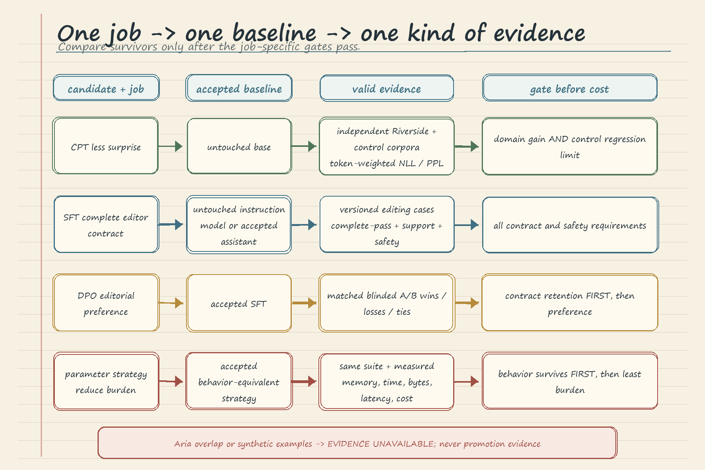

# LLM Fine-Tuning Comparison and Decision: Handwritten Theory Notes

These notes follow the Riverside House comparison notebook. The central habit is **evaluate first, compare second, decide last**. A trained artifact or attractive sample is not release evidence by itself.

## 1. Comparison Methodology

Start with one immutable candidate, one job, and one falsifiable claim. Freeze an independent, versioned case suite before inspecting results. Run the accepted baseline and candidate on the same cases and inference settings. Preserve outputs, scorer fields, and failure reasons before aggregating the metric that matches the claim. Apply product-owned gates chosen in advance.

The conclusion vocabulary is deliberately strict:

- **Supported:** all required evidence is valid and every required gate passes.
- **Not supported:** valid evidence exists, but at least one required gate fails.
- **Evidence unavailable:** required evidence is missing, contaminated, or too uncertain to apply the gates.

`Evidence unavailable` is not a soft failure or "promising" result. It means the claim cannot yet be evaluated. Compare candidates only after independent evaluation and only when they compete for the same job. Never collapse unrelated evidence into a universal score: prose likelihood cannot rescue a failed instruction contract, preference cannot rescue safety regression, and low cost cannot rescue lost capability.

## 2. Candidate Loading and Isolation

Reconstruct the untouched baseline, full-FT, partial-freeze, LoRA, SFT, and DPO artifacts as independent model objects. Restore the pinned tokenizer, base revision, model profile, prompt contract, and adapter targets. Give every PEFT adapter a **fresh base-model instance**; shared mutable state can leak between wrappers and invalidate the comparison.

Reload full and partial checkpoints independently, verify required files, set evaluation mode, and derive counts from the loaded objects. Reapply the partial-freeze pattern because `requires_grad` bookkeeping is not checkpoint behavior. Counts describe update scope, not quality or speed. Candidate identity must include artifact digest, ancestry, training manifest, data fingerprint, prompt policy, and evaluation-code revision. Rerun prerequisites from clean kernels on the same hardware profile.

## 3. Metrics and Evidence

Use evidence aligned to each candidate's job:

| Candidate | Fair baseline | Independent evidence | Required reading |
| --- | --- | --- | --- |
| CPT | Untouched base | Token-weighted NLL/perplexity on separate Riverside and general-control corpora | Domain text becomes less surprising without unacceptable control regression |
| SFT | Untouched instruction model or accepted assistant | Complete-contract records for one sentence, clean stop, source support, and safety | A case passes only when every required field passes |
| DPO | Accepted SFT artifact | Contract eligibility followed by randomized, blinded editor wins, losses, and ties | Contract and safety pass first; preference is evaluated only among eligible pairs |
| Full, partial, LoRA | Accepted behavior-equivalent strategy | Identical capability and safety suite, then measured resources | Change only update storage; eliminate behavior failures before comparing cost |

For CPT, use teacher forcing so both models receive the same true prefix and score the same actual next token. Aggregate NLL by evaluated token, not by paragraph average. Perplexity is only a more readable view of the same likelihood evidence; neither metric establishes truth, reasoning, instruction following, or editorial quality.

For SFT, retain every case record, failed rule, difficult slice, sample size, and uncertainty estimate. For DPO, use matched prompts and decoding, conceal model identity, randomize response order, and keep wins, losses, ties, and ineligible cases separate. Synthetic notebook examples demonstrate calculations only.

Parts 1 and 2 trained on all 40 Aria chapters, so Aria phrase and shared-corpus results are contaminated diagnostics. Production evidence must be separately versioned and excluded from training, prompt design, rubric examples, threshold tuning, and checkpoint selection.

## 4. Cost, Capability, and Rollback Tradeoffs

Carry three bill lines into every comparison: update state during training, per-job artifact operations, and the capability-regression/rollback surface. Full fine-tuning may win behavior and still lose operationally; LoRA may be cheap and still fail the response contract. Cost narrows the survivor set. It never excuses failed evidence.

Parameter strategy is a constrained cost comparison. Hold base revision, ordered data, objective, split, template, optimizer policy, token budget, seeds, suite, and decoding fixed; change only where updates are stored.

Apply identical capability, source-support, retention, and safety gates first. Among survivors, compare measured training memory and time, artifact bytes, serving latency, and request cost. Choose LoRA when it preserves behavior and removes a real burden. Choose full fine-tuning only when a repeatable capability gain justifies its larger cost and rollback surface. Teaching-run parameter counts alone prove neither efficiency nor a winner.

## 5. Decision Flow and Worked Miniature Choice

Riverside wants a one-sentence, source-supported fiction continuation assistant. The full-CPT model's same-corpus perplexity answers a contaminated language-modeling question, so it cannot rank assistants. The DPO preference example is synthetic and includes an ineligible contract case, so it cannot support promotion.

SFT LoRA is aligned to the job, but its five synthetic records are too small and artificial. Its conclusion is **evidence unavailable**. Riverside must build a versioned external editing suite, compare the untouched instruction baseline and immutable SFT adapter on identical requests, and precommit complete-contract, source-support, retention, safety, latency, and cost gates.

If all offline gates pass, write a decision and lineage record, then begin a small monitored canary with the previous immutable release ready for rollback. Watch live prompt mix, failures, latency, and cost. Route traffic back immediately if a live gate degrades; expand only while healthy. If matched LoRA and full-FT assistants both survive, choose the less burdensome candidate unless full FT's repeatable gain pays for its additional cost.

## 6. Common Failure Modes

- Ranking unlike objectives with one perplexity or preference table.
- Calling training-overlapping text held out, or tuning gates after viewing outputs.
- Sharing a mutable base across adapters or comparing unmatched decoding histories.
- Treating likelihood as truth, safety, contract compliance, or editorial quality.
- Letting aggregates hide failed rules, weak slices, tiny samples, or scorer error.
- Folding contract failures into preference instead of reporting them separately.
- Changing data, optimizer, budget, or seeds while claiming to isolate parameter strategy.
- Choosing the smallest artifact before capability, retention, and safety gates pass.
- Promoting without lineage, decision records, canary monitoring, and an immutable rollback target.

When an experiment cannot answer the production question, design the next experiment. Do not ask contaminated or mismatched evidence to say more than it measured.
