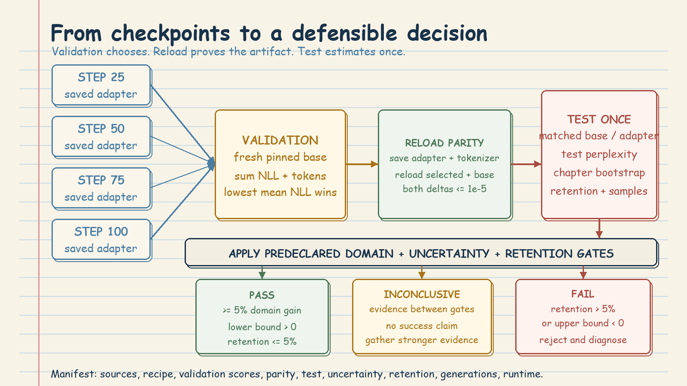

# LLM Fine-Tuning Practice: Evidence Before Claims

Eight independent LoRA continued-pretraining experiments use one Riverside novel each, the same pinned SmolLM2 base, and the same recipe. They ask: **does the adapter model later chapters better without unacceptable damage to general-language behavior?**

The notebook is CUDA-only. Training and overwrite are separate opt-ins so an accidental rerun cannot silently replace completed evidence.

## 1. Why the Split Is by Chapter

One successful novel can be a favorable split. Eight separately initialized experiments make luck harder to mistake for a reusable recipe. The same gates must survive different prose, chapter boundaries, and held-out endings before Riverside treats the method as repeatable.

Each novel is divided chronologically into training, validation, and test chapters. Validation and test each receive 15% of the chapters, rounded up and never fewer than three. A 40-chapter novel becomes 28 train, 6 validation, and 6 test chapters.

Complete chapters are the separation unit because nearby prose is highly related. Random token chunks could put adjacent passages on opposite sides of the split and make memorization look like generalization. The chronological split asks a harder question: does learning from earlier chapters transfer to a later narrative region? It is not an IID sample; later characters or plot arcs may differ.

Only `chapter-*.txt` files participate. Appendices are recorded as exclusions. Before checkpoint selection, test files are hashed but not decoded or tokenized. The audit also checks that every chapter appears once, partitions do not overlap, all eight novels exist, and no chapter file is an exact duplicate.

## 2. Tokenization and Training Boundaries

Each chapter is tokenized independently, receives one terminal EOS token, and is divided into blocks of at most 512 tokens. Tails shorter than 64 tokens are dropped. No block joins two chapters.

SmolLM2 uses the same token ID for padding and EOS. Labels must therefore be masked from the attention mask, not from the token ID. Otherwise genuine end-of-chapter EOS targets would disappear from the loss.

Every novel starts fresh with a new base model, rank-8 LoRA adapter, optimizer, scheduler, seed, and checkpoint directory. Checkpoints are saved at steps 25, 50, 75, and 100. Training loss is useful telemetry, but it does not choose the winner.

## 3. Token-Weighted Validation and Checkpoint Choice

Validation scores every real next-token target. Add the negative log-likelihood from all validation tokens, add the token counts, and divide once. This gives every token equal influence. Averaging chapter means would let a short chapter count as much as a long one; averaging batch losses could make the result depend on padding and batch shape.

Each saved adapter is loaded onto a fresh pinned base and scored by this explicit helper. The checkpoint with the lowest validation mean NLL wins for that novel. Do not pool novels: eight adapters are eight experiments.

**Tiny example:** step 25 scores 2.41 over 18,000 validation tokens; step 50 scores 2.32; step 75 scores 2.35; step 100 scores 2.44. Select step 50, save it as `selected-adapter`, reload it, verify the validation score, and only then open test chapters.

## 4. Test Isolation and Uncertainty

The selected adapter and tokenizer are saved, then reloaded on another fresh base. The reloaded adapter score and the disabled-base score must match their pre-save validation values within the declared tolerance. This parity check proves that the artifact on disk is the artifact that was measured.

Only after selection and parity pass are test chapters decoded and tokenized. Base and adapter are scored on exactly the same chapters. Looking at test results while tuning turns test into validation. Any test-informed rerun needs a new untouched test source or an explicit exploratory label.

Uncertainty is estimated with 2,000 paired bootstrap repeats. Each repeat resamples whole test chapters with replacement and recomputes the base-versus-adapter improvement. Pairing keeps both models on the same sampled chapters; chapter resampling respects the strongest available independent unit.

Many novels have only four to six test chapters, so the interval is a sensitivity check, not a population guarantee. If it crosses zero, the conclusion changes with chapter membership and is **INCONCLUSIVE**, even when the point estimate looks strong.

## 5. Decision Rules and Artifact Lineage

- **PASS:** test perplexity improves by at least 5%, the interval's lower bound is above zero, and general-retention regression is at most 5%.
- **FAIL:** retention regression exceeds 5%, or the whole improvement interval is below zero.
- **INCONCLUSIVE:** every case between those rules.

Read uncertainty first, retention second, then runtime and GPU memory. Cheap training cannot rescue weak evidence. Fixed general-language passages are a regression canary, not proof of broad capability. Deterministic generations help inspection but never select a checkpoint or override a gate.

Artifact lineage connects every claim to its ingredients. Each novel keeps interval checkpoints, the selected adapter and tokenizer, and an `experiment-manifest.json`. The manifest records source paths, hashes and byte counts; exclusions; model and tokenizer revisions; seed; packages and hardware; token counts; recipe; checkpoint scores; selected step; parity deltas; test and retention results; bootstrap settings; generations; runtime; and peak GPU memory. Final JSON and CSV ledgers are valid only when all eight novels have one result and one manifest.

## 6. Failure Modes and Practical Runbook

**Leakage:** random chunks, cross-chapter blocks, duplicates, or test-driven tuning inflate evidence. Rebuild the split.

**Wrong winner:** selecting the latest checkpoint or training loss ignores validation. Keep all four checkpoints and use minimum token-weighted validation NLL.

**Wrong aggregation:** averaging batches or chapter means changes weighting. Sum token losses and token counts, then divide once.

**Artifact mismatch:** reload parity failure means the saved adapter is not trustworthy. Stop before test; inspect base revision, tokenizer, and adapter files.

**Domain gain with damage:** more than 5% retention regression is FAIL. **Unstable gain:** an interval crossing zero is INCONCLUSIVE. **Confounded pooling:** keep decisions per novel. **Interrupted run:** preserve the partial ledger and rerun only with an explicit, novel-scoped overwrite.

Run in this order: verify CUDA, revisions, packages, disk, and destination; inspect the split audit while training is disabled; confirm chapter-bounded tokenization and attention-mask label masking; freeze thresholds; enable training without overwrite; require four checkpoints; select by explicit validation NLL; save and verify parity; open test once; run paired chapter bootstrap, retention, and deterministic samples; apply gates mechanically; then require eight unique rows, manifests, selected adapters, and final ledgers before summarizing.

PASS means only that this narrow evidence contract passed. It does not establish production readiness, deployed behavior, or live Azure validation.
