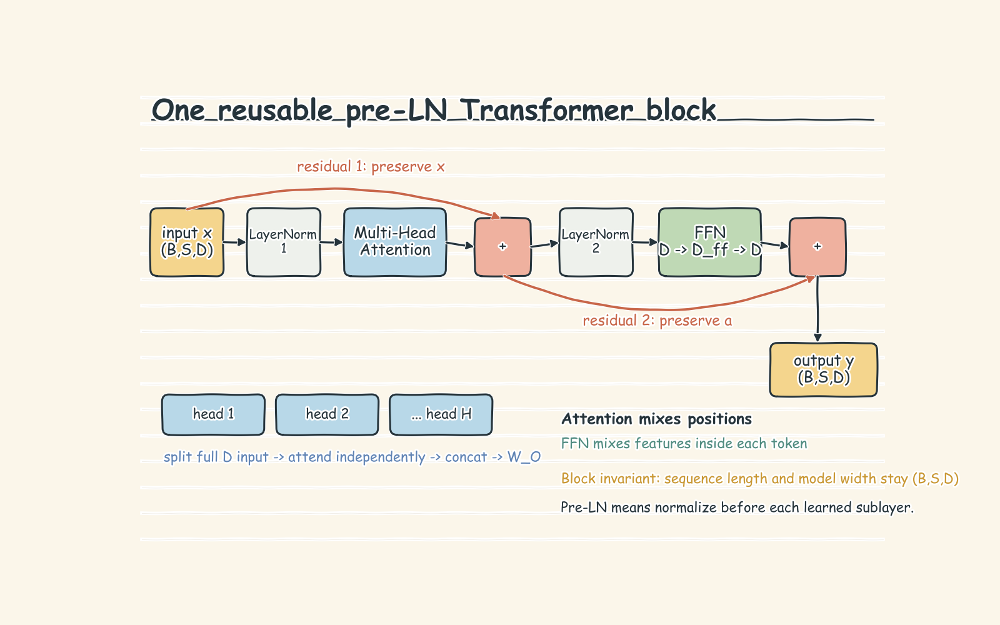

# Attention and Transformer Blocks: Handwritten Theory Notes

## 1. Mental model: a room full of informed tokens

Riverside House wants an assistant to understand:

> **“Aria heard the signal aboard Meridian.”**

The model must preserve **who** acted (`Aria`), **what** happened (`heard`), **what was heard** (`signal`), and **where** (`aboard Meridian`). A useful mental model is a room in which every token carries a note. Attention lets each token ask the room a question, decide whose notes are relevant, and rewrite its own note as a weighted blend of the answers. A Transformer block repeats this communication, then gives each token private computation time.

An RNN moves information through a sequential hidden state. Attention creates short, direct paths between token positions and allows all positions to be processed in parallel during training. The reusable block therefore has four jobs:

1. preserve order;
2. route context between tokens;
3. transform each contextual token nonlinearly;
4. preserve a stable path for activations and gradients.

The notebook starts with a deliberately hand-authored vocabulary and three-dimensional embedding map. Its axes, **concreteness, agency, and activity**, are teaching labels, not discovered properties of a trained model. The map is frozen so attention is the only changing mechanism. A production model instead learns a large embedding table jointly with the rest of the network, and individual dimensions usually have no tidy interpretation.

Tokenization first maps text to integer IDs. Here one word is one token; production tokenizers usually split text into subwords. The basic contract is:

$$
\text{token IDs }(B,S) \rightarrow X\in\mathbb{R}^{B\times S\times D},
$$

where $B$ is batch size, $S$ sequence length, and $D=d_{model}$ is representation width.

## 2. Order is information, not decoration

If we average the six Riverside word vectors, the correct sentence and any permutation have the same result. From the notebook’s hand-authored vectors,

$$
\frac{x_{aria}+x_{heard}+x_{the}+x_{signal}+x_{aboard}+x_{meridian}}{6}
= [0.518\overline{3},\ 0.260,\ 0.410].
$$

Reversing the words does not change that average. This tiny worked example proves the problem: a bag of words knows which tokens exist but not who heard what or where.

### Additive sinusoidal position

The original Transformer adds a deterministic position vector to each token embedding:

$$
PE(m,2i)=\sin\left(\frac{m}{10000^{2i/D}}\right),\qquad
PE(m,2i+1)=\cos\left(\frac{m}{10000^{2i/D}}\right).
$$

$m$ is token position, $i$ selects a sine/cosine dimension pair, and $D$ is model width. Fast dimensions distinguish nearby positions; slow dimensions vary over longer spans. The input becomes $X+PE$. This gives each position a fingerprint and is a valid, simple design.

Its limitation is precise: after content and position are added, learned query/key projections can mix them. Relative distance may be learned, but an explicit relative-distance pattern is not guaranteed to survive in the dot product used by attention. The notebook’s seeded projection demonstration shows the clean positional similarity band becoming weaker after content is added and a random $W_Q$ is applied; it does **not** claim sinusoidal encoding universally fails.

### Rotary position encoding (RoPE)

RoPE injects position later, where tokens are actually compared. It rotates pairs of coordinates in projected queries and keys. Let $d_r$ be the rotated query/key width, normally one head's width after heads are split. For pair $i$,

$$
	heta_i=10000^{-2i/d_r},\qquad
R(m\theta_i)
\begin{bmatrix}x_{2i}\\x_{2i+1}\end{bmatrix},
$$

where $R(\alpha)$ is the ordinary 2-D rotation matrix and $m$ is absolute position. Because rotations combine as $R(m)^TR(n)=R(n-m)$, the rotated query-key dot product depends on relative displacement. The notebook verifies that shifting both `signal` and `meridian` while keeping their gap fixed leaves their rotated dot product equal within numerical tolerance.

## 3. Attention is a soft dictionary lookup

Each token is projected into three learned views:

$$
Q=XW_Q,\qquad K=XW_K,\qquad V=XW_V.
$$

- **Query:** what am I looking for?
- **Key:** what information do I advertise?
- **Value:** what do I contribute if selected?

For one head, scaled dot-product attention is

$$
\operatorname{Attention}(Q,K,V)
=\operatorname{softmax}\left(\frac{QK^T}{\sqrt{d_k}}+M\right)V.
$$

$d_k$ is query/key width. $QK^T$ has shape $(B,H,S,S)$ after heads are split: every row is one query position and every column is one candidate key position. $M$ is an optional visibility mask. Allowed entries add $0$; blocked entries add $-\infty$, so softmax gives them zero weight. The resulting weights sum to one along the key axis, and multiplying by $V$ builds one contextual vector per query.

The division by $\sqrt{d_k}$ is not cosmetic. For roughly independent unit-variance coordinates, dot-product variance grows with $d_k$, so its standard deviation grows like $\sqrt{d_k}$. Large logits make softmax nearly one-hot, where gradients are tiny. Scaling keeps score spread roughly stable as head width grows. The notebook measures this with random vectors across several widths and separately demonstrates healthier gradients with scaling; those are seeded teaching experiments, not production benchmarks.

At “first contact,” the notebook temporarily uses raw embeddings as queries, keys, and values. This exposes the central weighted-blend idea, but it is position-blind and lacks learned projections. In the full mechanism, $W_Q$, $W_K$, and $W_V$ learn what similarity and contribution should mean for the task. Attention weights are routing coefficients, not automatically explanations of model reasoning.

## 4. Why multiple heads?

One head creates one attention matrix and one blended output per token. Multiple heads provide several independent routing spaces:

$$
head_h=\operatorname{Attention}(Q_h,K_h,V_h),
$$

$$
\operatorname{MHA}(X)=\operatorname{Concat}(head_1,\ldots,head_H)W_O.
$$

Every head receives the full $D$-wide token representation, then its own projections map it to $d_{head}=D/H$. In the notebook’s working block, $D=16$, $H=2$, and $d_{head}=8$. Shapes flow as

$$
(B,S,D)\rightarrow(B,H,S,d_{head})
\rightarrow(B,H,S,S)\rightarrow(B,H,S,d_{head})
\rightarrow(B,S,D).
$$

The controlled demonstration constructs one head that attends to the previous token and another that attends to the most semantically similar token. Their patterns carry different information, and concatenation preserves both. Real heads are not assigned human roles: specialization is learned, may overlap, and may not remain interpretable. More heads are therefore not automatically better; at fixed $D$, increasing $H$ makes every head narrower.

## 5. Attention communicates; the FFN computes

After tokens exchange information, the feed-forward network independently transforms each token at every position using shared weights:

$$
\operatorname{FFN}(x)=\operatorname{GELU}(xW_1+b_1)W_2+b_2.
$$

The notebook expands $D=16$ to $D_{ff}=32$ and projects back. Its prose also names the common rule of thumb “expand by $4\times$”; the executable toy uses $2\times$. The important contract is $D\rightarrow D_{ff}\rightarrow D$, with a nonlinear activation between. Attention mixes **across positions**; the FFN mixes **across features within each position**.

Layer normalization stabilizes each token vector across its hidden dimensions:

$$
\operatorname{LN}(x)=\gamma\odot\frac{x-\mu}{\sqrt{\sigma^2+\epsilon}}+\beta.
$$

$\mu$ and $\sigma^2$ are that token’s feature mean and variance; $\gamma$ and $\beta$ are learned scale and shift. The notebook uses **pre-LN**, normalizing before attention and before the FFN.

## 6. The complete reusable pre-LN block

For input $x$:

$$
a=x+\operatorname{MHA}(\operatorname{LN}_1(x)),
$$

$$
y=a+\operatorname{FFN}(\operatorname{LN}_2(a)).
$$

The two additions are residual paths. They let every sublayer learn a correction while preserving an identity route for information and gradients. The notebook’s 24-layer probe compares a plain tanh stack with a residual stack and measures much stronger gradient reaching the earliest layer with skips. This is a controlled illustration of trainability, not a universal multiplier to quote outside that setup.

Stacking $L$ blocks repeatedly refines every token’s context. Sequence length and model width stay unchanged through a block; only the values become more contextual.

## 7. Training and inference behavior

During training, all sequence positions can be processed in parallel. Backpropagation updates embeddings and every projection, output, FFN, normalization, and later task head parameter. An encoder-style reader uses bidirectional attention. A decoder-style writer applies an upper-triangular causal mask so position $t$ can see only positions $\le t$; this prevents future-token leakage while still allowing parallel training over known targets.

At autoregressive inference, a decoder receives only the prefix available so far, predicts the next token, appends it, and repeats. The block itself is unchanged; visibility and the outer generation loop change. Production KV caching is adjacent engineering, but this notebook deliberately names rather than builds it. Next-token loss and generation are Part 2, not hidden features of this Part 1 block.

## 8. Failure modes and practical decision rules

- **Order disappears:** pooling or position-free attention cannot distinguish permutations. Add a positional mechanism.
- **Position is overclaimed:** additive sinusoidal PE remains valid; choose RoPE when explicit relative displacement in query-key geometry is a design goal.
- **Future leakage:** use a causal mask for autoregressive prediction. Use full visibility when the complete source is legitimately available.
- **Softmax saturates:** scale scores by $\sqrt{d_k}$; also apply masks before softmax.
- **Head shape breaks:** require $D\bmod H=0$. Increase heads only when narrower $d_{head}$ still has useful capacity.
- **Attention is mistaken for computation:** keep the position-wise nonlinear FFN; routing alone is limited.
- **Depth becomes hard to optimize:** retain residual paths and normalization. Pre-LN is a strong default for stable deep stacks.
- **Padding contaminates context:** production batches need a padding mask in addition to any causal mask.
- **Toy geometry is treated as evidence:** Riverside’s three named axes and random seeded projections are inspectable scaffolds, not learned semantics or benchmark results.
- **Attention maps are overinterpreted:** heads can be redundant or diffuse, and high attention weight does not prove causal importance.

## 9. Breadth checklist

- [ ] I can trace text $\rightarrow$ token IDs $\rightarrow(B,S,D)$ embeddings.
- [ ] I can explain why the Riverside sentence and its reversal have the same mean embedding.
- [ ] I know how sinusoidal PE differs from rotating projected Q/K with RoPE.
- [ ] I can define query, key, and value without relying on code.
- [ ] I can derive the $(B,H,S,S)$ score shape and the weighted-value output shape.
- [ ] I can explain softmax, $\sqrt{d_k}$ scaling, padding masks, and causal masks.
- [ ] I know why multiple heads provide independent routing spaces but are not guaranteed interpretable roles.
- [ ] I can separate cross-token attention from per-token FFN computation.
- [ ] I can write the two pre-LN residual equations from memory.
- [ ] I can distinguish parallel masked training from token-by-token autoregressive inference.
- [ ] I can state what this notebook measures and what it intentionally postpones to Parts 2 and 3.
