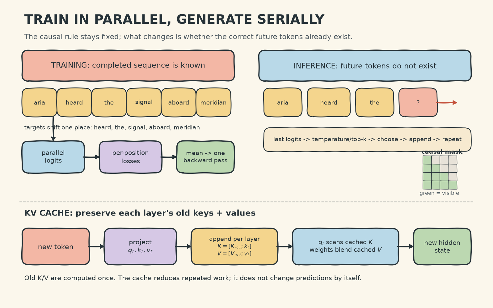

# Decoder-Only Language Models: Handwritten Theory Notes

## 1. The one-tape mental model

A decoder-only language model is a **reader and writer sharing one growing tape**. The tape begins with the prompt. The model reads only what is already on the tape, predicts one next token, appends it, and repeats. Riverside's running line is:

`aria heard the signal aboard meridian`

During training, the completed line is visible to the training system, but the model at position $i$ is prevented from looking at positions $j>i$. During inference, those future positions do not exist yet. The causal mask makes these two situations obey the same information rule.

This is the central distinction:

- **Causal does not mean context-free.** A position may gather information from itself and every earlier position.
- **Causal means future-blind.** It may not inspect any token to its right.

The notebook's toy tokenizer assigns one word to one token from a vocabulary containing special tokens such as `<PAD>`, `<BOS>`, and `<EOS>`. A production tokenizer uses subwords, so a name such as `Meridian` may occupy one or several positions. Tokenization changes the tape's units, not the causal-learning principle.

## 2. From token IDs to contextual representations

Let batch size be $B$, sequence length be $S$, vocabulary size be $V$, model width be $d$, number of heads be $H$, and head width be $d_h=d/H$.

Token IDs have shape $(B,S)$. An embedding lookup and positional signal produce

$$
X_{b,i}=E[t_{b,i}]+P_i, \qquad X\in\mathbb{R}^{B\times S\times d}.
$$

The embedding says **what token this is**; position says **where it occurs**. The recap uses sinusoidal positions. DistilGPT-2 instead has learned positional embeddings. Either way, order must enter explicitly because self-attention alone has no built-in left-to-right geometry.

For each attention head,

$$
Q=XW_Q,\quad K=XW_K,\quad V=XW_V,
$$

with head tensors shaped $(B,H,S,d_h)$. Scores and contextual blends are

$$
A=\operatorname{softmax}\left(\frac{QK^\top}{\sqrt{d_h}}+M\right),
\qquad C=AV.
$$

$QK^\top$ asks **which visible tokens are relevant to this query?** The scaling by $\sqrt{d_h}$ keeps dot products from becoming so large that softmax becomes excessively sharp. $AV$ answers **what information should be carried forward?** Heads run in parallel, concatenate, and pass through $W_O$ to return to width $d$.

The feed-forward network then processes each position independently:

$$
\operatorname{FFN}(x)=W_2\,\operatorname{GELU}(W_1x+b_1)+b_2.
$$

The notebook uses a Pre-LayerNorm block:

$$
x' = x+\operatorname{MHA}(\operatorname{LN}(x)),
\qquad
x''=x'+\operatorname{FFN}(\operatorname{LN}(x')).
$$

Mental model: attention is the **communication step**, the FFN is the **private thinking step**, residual paths preserve the existing stream, and LayerNorm keeps each token's feature scale manageable.


## 3. Causal masking and the accumulation tower

The causal mask is an upper-triangle block:

$$
M_{ij}=\begin{cases}
0, & j\le i,\\
-\infty, & j>i.
\end{cases}
$$

After softmax, blocked entries receive zero probability. In the six-token Riverside line, position 0 sees one token; position 5 sees all six. The attention matrix is therefore lower triangular when rows are queries and columns are keys.

Across layers, the last position becomes an **accumulation point**. In the first block, `meridian` can directly blend earlier token features. In the next block, it can blend representations that have themselves already absorbed earlier context. Depth therefore builds an accumulation tower, not merely repeated word lookup.

Compare `aria heard the signal aboard meridian` with the truncated `aria heard the`. Their last tokens differ, and their histories differ. The notebook traces the last-position vector through three fresh random blocks and measures cosine similarity. The important claim is qualitative: context changes hidden states, and deeper contextual processing can increase that divergence. The printed values are run observations, not universal constants.

## 4. MiniLM: hidden states become token predictions

The notebook's MiniLM uses width 16, two attention heads, feed-forward width 32, and two transformer blocks. After the final LayerNorm, every position has a hidden vector $h_i\in\mathbb{R}^{d}$. Weight tying reuses the input embedding table as the output classifier:

$$
z_i=h_iE^\top\in\mathbb{R}^{V},
\qquad p(t_{i+1}=v\mid t_{\le i})=\operatorname{softmax}(z_i)_v.
$$

Thus the forward contract is

$$
(B,S)\ \text{token IDs}\longrightarrow(B,S,V)\ \text{logits}.
$$

Weight tying is a useful mental symmetry: input rows tell the model how tokens enter representation space; their transposes also act as directions against which the final hidden state is scored.

## 5. Training: one sequence, many supervised lessons

The tiny corpus creates prefix/target pairs such as:

```text
aria                                      -> heard
aria heard                                -> the
aria heard the                            -> signal
aria heard the signal                     -> aboard
aria heard the signal aboard              -> meridian
```

This is a worked example of next-token supervision. The explicit training loop left-pads prefixes, reads logits at each row's final position, applies cross-entropy, backpropagates, clips the global gradient norm, and takes an Adam step.

The executable toy passes only a causal mask, so its left-padding tokens can enter attention. That shortcut is acceptable for exposing the update loop, not for a production batch. A real batch combines causal and padding visibility masks and excludes padded target positions from loss.

The more general and efficient formulation feeds a complete sequence once. Shift alignment by one position:

$$
\text{inputs}=[t_0,t_1,\ldots,t_{S-2}],\qquad
\text{targets}=[t_1,t_2,\ldots,t_{S-1}].
$$

Each eligible position contributes

$$
\ell_i=-\log p_\theta(t_{i+1}\mid t_{\le i}),
\qquad
\mathcal{L}=\frac{1}{N}\sum_{i\in\text{valid}}\ell_i.
$$

All position logits are computed **in parallel** because the known training sequence is already present. The causal mask prevents leakage. The losses are reduced to one scalar; one backward pass creates one gradient field; one optimizer step updates all trainable parameters. Training is therefore not a slow token-generation loop.

PyTorch expresses the update as zero gradients, forward, `backward`, gradient clipping, and optimizer step. Keras/TF uses `GradientTape`, `tf.clip_by_global_norm`, and `apply_gradients`. The mathematical update is the same.

## 6. Inference: autoregressive and serial

At inference, there is no ground-truth next token to place on the tape. For prefix $t_{0:i}$:

1. Run the decoder and read only the last-position logits.
2. Optionally divide logits by temperature $T$.
3. Optionally retain only the top-$k$ candidates.
4. Choose greedily or sample from softmax.
5. Append the chosen token and stop on `<EOS>`, a length limit, or another rule.

$$
p_T(v)=\operatorname{softmax}(z/T)_v.
$$

Lower $T$ sharpens the distribution; higher $T$ flattens it. Greedy decoding is reproducible but can become repetitive or locally shortsighted. Sampling adds diversity but can admit unlikely continuations. Top-$k$ limits the candidate set but may remove a contextually suitable long-tail token.

The prefixes `Aria heard the` and `Aria crossed the` have the same length and prediction position, yet should produce different hidden states: the former carries hearing/information features; the latter carries movement/setting features. The mask blocks future words, not earlier context.

## 7. KV cache: reuse memory, preserve predictions

Without caching, every generation step rebuilds keys and values for the whole prefix. With a KV cache, each layer stores the earlier $K$ and $V$ tensors. For a new token, compute its query, key, and value; compare the new query with all cached keys; blend cached values; then append the new key and value.

The cache stores **per-layer keys and values, not final model outputs**. It trades growing memory for less repeated computation. With identical arithmetic and decoding choices, caching should not change the prediction distribution by itself.



## 8. Why $W_V$ is not a passthrough

Attention weights answer **who contributes**; $W_V$ controls **what each contributor says**. The notebook keeps the same attention weights for `signal` but applies two value lenses. An action lens retains Animacy and Dynamism; an object lens retains Concreteness and Animacy. The weighted blends differ even though the contributor weights do not.

Decision rule: never interpret an attention heatmap as the complete information flow. A high weight matters only together with the projected value, the output projection, residual stream, later layers, and FFNs. Averaging heads is useful for an overview but can erase head-specific behavior.

## 9. Toy scale to DistilGPT-2

The mechanism survives scaling. The notebook opens DistilGPT-2 as a concrete production bridge: six transformer blocks, 12 heads per block, model width 768, and about 82 million parameters. It inspects learned positional embeddings, real BPE pieces, per-layer attentions, individual-head diversity, next-token probabilities, and a manual temperature/top-$k$ sampling loop.

The returned attention for one layer has axes `(batch, heads, sequence, sequence)`. Inspecting all heads reveals specialization that a mean-over-heads heatmap may hide. The displayed token probabilities and sampled continuation depend on the checkpoint, prompt, software state, and random sampling; reproduce them from the notebook instead of memorizing a number.

## 10. Failure modes and decision rules

- **Future leakage:** if the wrong triangle is masked, training metrics can look excellent while generation fails. Verify that query $i$ cannot attend to key $j>i$.
- **Padding contamination:** the notebook's left-padded prefix trainer demonstrates this caveat because its toy block has no padding mask. Production variable-length batches must hide padded keys and exclude padded targets from loss.
- **Shift mistakes:** logits at $i$ predict token $i+1$, not token $i$. Check shapes and print context/target pairs.
- **Train/inference confusion:** parallel teacher-forced loss is valid in training; generated outputs must be fed back serially at inference.
- **Exposure drift:** one weak sampled token becomes context for later steps, so errors can compound. Adjust decoding and stopping rules; do not expect low training loss alone to guarantee good free-running text.
- **Context overflow:** the model cannot attend beyond its supported window. Truncate, chunk, retrieve, or choose a longer-context model according to the task.
- **Over-reading attention:** use attention as a diagnostic, not a complete causal explanation.
- **Cache misuse:** cache every layer's K/V in correct position order; invalidate it when the prefix or model state changes.
- **Tokenizer assumptions:** reason in tokens, not words, when budgeting context or interpreting generation length.

## 11. Coverage checklist

- [x] One-tape decoder-only mental model and Riverside running example
- [x] Tokenization, embeddings, positional information, and tensor shapes
- [x] Multi-head attention, FFN, Pre-LN residual block, and equations
- [x] Causal triangle and depth-wise accumulation tower
- [x] MiniLM logits and tied input/output embeddings
- [x] Prefix-pair and per-position cross-entropy training
- [x] One backward pass, gradient field, clipping, and optimizer update
- [x] Autoregressive inference, temperature, top-$k$, and stopping
- [x] KV-cache behavior and recomputation trade-off
- [x] $W_V$ as a task-specific extraction lens
- [x] Toy-to-production scaling and DistilGPT-2 internals
- [x] Failure modes, interpretation cautions, and practical decision rules
