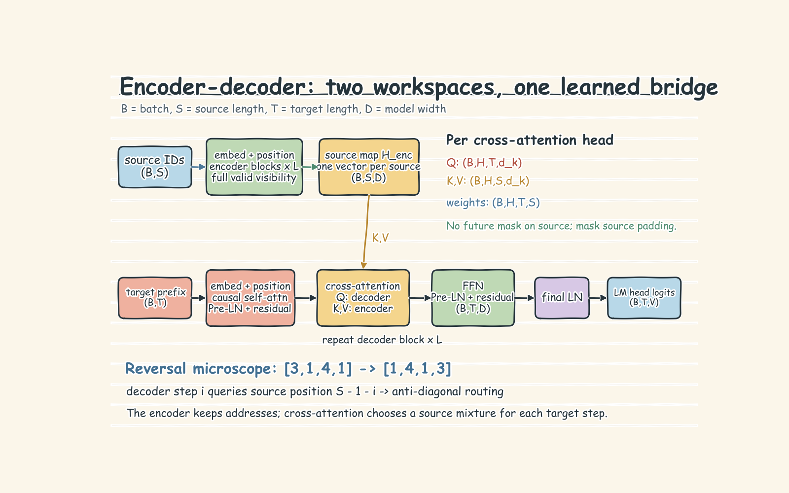
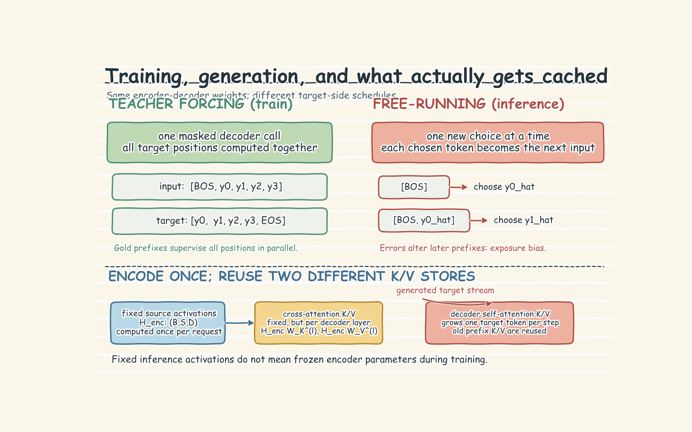

# Encoder-Decoder Transformers and Cross-Attention

## 1. The Core Intuition: A Reader and a Causal Writer

An encoder-decoder Transformer keeps the source and target in two different workspaces. The **encoder** reads the complete source and builds one contextual vector for every source position. The **decoder** writes the target from left to right. At each writing step, it can use its own earlier target tokens and look back at any encoded source position.

This separation fits Riverside's editorial task: read a complete Aria passage plus a brief, then produce a revision whose wording and length may differ while source details remain available. The notebook uses sequence reversal only as a routing microscope. For `[3, 1, 4, 1] -> [1, 4, 1, 3]`, we know exactly where every output must retrieve its information, so learned routing can be inspected rather than guessed.



The model has three main stacks:

1. **Encoder:** token embedding plus position, repeated bidirectional self-attention and feed-forward blocks, then a final normalization.
2. **Decoder:** target embedding plus position, then repeated causal self-attention, cross-attention, and feed-forward sublayers.
3. **LM head:** a linear map from each final decoder vector to vocabulary logits.

Every sublayer in the notebook uses a Pre-LayerNorm residual pattern. In shorthand,

$$x \leftarrow x + \operatorname{Sublayer}(\operatorname{LN}(x)).$$

Residual paths preserve an easy information and gradient route; the feed-forward network adds per-position nonlinear processing after attention has mixed information.

## 2. Symbols and Tensor Flow

Let:

- $B$ = batch size
- $S$ = source length
- $T$ = target length
- $D=d_{model}$ = hidden width
- $H$ = number of attention heads
- $d_k=D/H$ = width of one head
- $V$ = vocabulary size

Source token IDs have shape $(B,S)$. Embedding plus positional encoding gives $(B,S,D)$. The encoder preserves that shape and returns

$$H_{enc} \in \mathbb{R}^{B\times S\times D},$$

one enriched vector per source position, not one pooled sentence vector and not next-token logits. Encoder self-attention is bidirectional because it has no causal mask. Each source query may use all source keys in the first layer.

For one attention head,

$$Q=XW_Q,\qquad K=XW_K,\qquad V=XW_V,$$

$$\operatorname{Attention}(Q,K,V)=\operatorname{softmax}\left(\frac{QK^\top}{\sqrt{d_k}}\right)V.$$

The decoder input IDs have shape $(B,T)$. Its self-attention also forms $Q,K,V$ from decoder states, but masks score $(i,j)$ when $j>i$. Thus target position $i$ can use positions $0$ through $i$, never a future answer token.

Cross-attention uses the same equation with different origins:

$$Q=H_{dec}W_Q,\qquad K=H_{enc}W_K,\qquad V=H_{enc}W_V.$$

After splitting heads, $Q$ is $(B,H,T,d_k)$ and $K,V$ are $(B,H,S,d_k)$. Therefore the score and weight tensors are

$$A=\operatorname{softmax}\left(\frac{QK^\top}{\sqrt{d_k}}\right)\in\mathbb{R}^{B\times H\times T\times S},$$

and $AV$ returns $(B,H,T,d_k)$. Merging heads restores $(B,T,D)$, and the LM head produces logits $(B,T,V)$.

The $T\times S$ shape is the signature of cross-attention. Source and target lengths are independent. There is no causal mask over source positions because the source is already known in full. Production batches still need a **source padding mask** so real tokens do not attend to padded slots; that is different from hiding future source information.

## 3. Why Keep a Source Map?

Early sequence-to-sequence RNNs passed one final encoder state to the decoder. That fixed-size summary had to preserve every detail needed later. Mean-pooling Transformer encoder outputs creates a similar practical problem: it blurs positional identity and removes an inspectable address for each detail.

Cross-attention keeps all $S$ contextual vectors live. The decoder does not merely receive a larger summary; each target query chooses a different weighted mixture of source values. This replaces a fixed bottleneck with addressable memory. It also avoids forcing source and target into one self-attention matrix even when their lengths differ.

The attention weights are useful diagnostics, but they are not complete causal explanations. A large weight says where one head placed probability mass. The result also depends on value vectors, other heads and layers, residual streams, and feed-forward transformations. Held-out task accuracy tests behavior; an attention map tests whether routing is consistent with the expected rule.

## 4. Tiny Worked Routing Example

Take source $x=[3,1,4,1]$ and desired target $y=[1,4,1,3]$. Number source positions from 0 to 3.

| Decoder step $i$ | Required output | Needed source position $S-1-i$ |
| ---: | ---: | ---: |
| 0 | 1 | 3 |
| 1 | 4 | 2 |
| 2 | 1 | 1 |
| 3 | 3 | 0 |

At step 0, the decoder state starts from `<BOS>`. Its query should score source key 3 highest, so the retrieved value carries information for token `1`. Step 1 has the target prefix `<BOS>, 1`; its new query should route to source position 2 and predict `4`. Repeating this produces an anti-diagonal in the $4\times4$ cross-attention map.

The repeated value `1` is a useful detail: content alone cannot distinguish source positions 1 and 3. Positional information and the decoder step must participate in the routing rule. Before training, random projections give diffuse, roughly uniform attention. Prediction loss teaches the projections and surrounding blocks to form useful queries, keys, and values.

## 5. Teacher Forcing Versus Generation

Training shifts the known target into two aligned sequences:

```text
decoder input : [BOS] + target
expected output: target + [EOS]
```

For a four-token target, the implementation supplies `[BOS, y0, y1, y2, y3]` and grades `[y0, y1, y2, y3, EOS]`. A causal mask prevents each position from seeing later target tokens. Even so, all target positions are evaluated in one parallel decoder call: matrix operations compute every position's logits, per-position cross-entropy losses are combined, and one backward pass updates the LM head, decoder, cross-attention, and encoder unless parameters are explicitly frozen.

At generation time, the answer is unavailable. The encoder still runs once, but decoding becomes sequential:

```text
[BOS] -> predict y0
[BOS, y0] -> predict y1
[BOS, y0, y1] -> predict y2
... stop at EOS or a length limit
```

The generated token is fed back as the next input. An early mistake therefore changes every later prefix. This train/inference mismatch is exposure bias. Teacher-forced accuracy can look better because a wrong prediction is not allowed to poison the next input. Free-running greedy accuracy is the honest end-to-end test. Beam search changes only the inference strategy: instead of committing to one prefix, it keeps the top $k$ partial sequences by cumulative log-probability. Production beam search also needs length normalization, batched beam handling, and per-beam EOS logic.



## 6. Cross-Attention Is Not the Decoder KV Cache

Three reusable objects are easy to confuse:

- **Encoder output:** $H_{enc}$ is computed once for the source and stays fixed during one inference request.
- **Cross-attention K/V:** decoder layer $l$ has its own $W_K^{(l)}$ and $W_V^{(l)}$. Because $H_{enc}$ is fixed, implementations may precompute $K_{enc}^{(l)}=H_{enc}W_K^{(l)}$ and $V_{enc}^{(l)}=H_{enc}W_V^{(l)}$. These are fixed per-layer caches, not one universal memory tensor.
- **Decoder self-attention KV cache:** each generated target token contributes new keys and values. This cache grows with the prefix and avoids recomputing K/V for old target positions.

The notebook's toy `greedy_decode` reuses encoder outputs but recomputes decoder-prefix attention each step. That is logically correct and simple at length 4; a production server adds caches for latency. Fixed encoder activations during inference do not mean frozen encoder parameters during training: target loss normally backpropagates through cross-attention into the encoder.

## 7. Common Failure Modes

- **Removing the decoder causal mask:** training leaks future target tokens, producing impressive loss and invalid generation behavior.
- **Applying a causal mask to cross-attention:** the decoder loses legal access to later source positions. Cross-attention may need padding masks, not target-style future masking.
- **Pooling encoder states too early:** positional details become harder to retrieve and routing cannot be inspected per source token.
- **Forgetting target shifting:** feeding and grading the same target positions lets the decoder copy its current answer.
- **Reporting teacher-forced argmax as generation:** gold prefixes hide compounding errors. Always run a self-fed loop.
- **Re-encoding the source every step:** correct outputs, unnecessary cost. Encode once and reuse the result.
- **Ignoring EOS and padding:** generation may not stop, and padding can affect attention or loss. Use source/target padding masks and `ignore_index` or an equivalent loss mask.
- **Treating an attention heatmap as proof:** verify held-out sequence accuracy and free-running behavior too.
- **Reading averaged heads as the whole mechanism:** heads may specialize; averaging can hide distinct routes.

## 8. Choosing the Transformer Family

The notebook's appendix places the same Riverside tokens into three contracts:

- **Encoder-only:** every token reads both left and right context. Use it for classification, retrieval embeddings, tagging, or extraction when the full input is available; it does not natively generate a separate target sequence.
- **Decoder-only:** prompt and completion share one causal tape. Use it for open-ended continuation and general assistants where a single next-token interface is valuable.
- **Encoder-decoder:** a bidirectional source map feeds a causal target writer. Use it when source and target are distinct objects, especially translation, summarization, structured rewriting, or transformations with different lengths.

Decoder-only models dominate many general-purpose deployments because one objective and one stack scale across prompting, continuation, and tool-formatted text. That is an engineering and ecosystem advantage, not proof that cross-attention is obsolete. Encoder-decoder models retain a useful source/target boundary, full source visibility, and reusable source memory for conditional generation.

## 9. Practical Rules to Remember

1. Keep one encoder vector per source token until the decoder has finished.
2. Encoder self-attention is bidirectional; decoder self-attention is causal; cross-attention queries the full valid source.
3. Check shapes at every boundary: encoder $(B,S,D)$, cross weights $(B,H,T,S)$, logits $(B,T,V)$.
4. Shift targets with BOS and EOS, and exclude padding from both attention and loss.
5. Evaluate teacher-forced loss, held-out sequence accuracy, and free-running generation separately.
6. Encode once; cache layer-specific cross-attention K/V when useful; grow decoder self-attention K/V one token at a time.
7. Use the simplest decoding policy that meets the task: greedy first, beam search only when alternative prefixes matter.
8. Interpret routing plots alongside outputs, not instead of them.

## 10. Breadth Checklist

- [x] Token and positional embeddings
- [x] Bidirectional encoder self-attention
- [x] Causal decoder self-attention
- [x] Decoder-query / encoder-key-value cross-attention
- [x] Multi-head split, merge, residuals, LayerNorm, and FFN
- [x] $T\times S$ tensor shapes and attention equations
- [x] Teacher forcing, shifted targets, cross-entropy, and gradient flow
- [x] Greedy free-running generation, exposure bias, and beam-search intuition
- [x] Encoder reuse, cross-attention K/V, and growing decoder KV cache
- [x] Attention-map limits, padding, EOS, and evaluation failure modes
- [x] Bridge to T5/BART: same structural contract at larger width, depth, vocabulary, and data scale
- [x] Encoder-only, decoder-only, and encoder-decoder contracts and selection trade-offs

The durable mental model is simple: **the encoder makes an addressable source map; the causal decoder writes a target; cross-attention lets every writing step ask the source a new question.**
