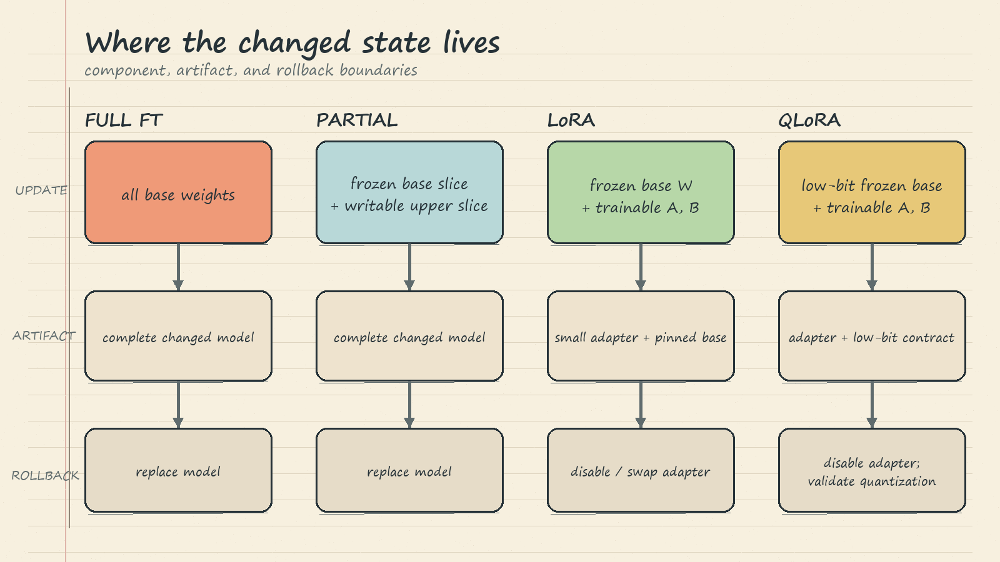

# LLM Fine-Tuning Parameter Techniques: Handwritten Theory Notes

## 1. The Question: Where Should the Update Live?

Fine-tuning has two separate choices. The **learning objective** says what behavior to practice; the **parameter strategy** says which model values may change. This notebook holds the objective fixed: continued pretraining on raw Aria prose from *The Weight of Distant Light*, with every real token supervised and padding labeled `-100`. It then changes only the location and representation of the update.

Riverside's total bill has three parts:

1. **Update-state bill:** trainable weights need gradients and optimizer state; a training step also needs activations and temporary memory.
2. **Artifact bill:** adapted state must be stored, moved, versioned, loaded, and eventually replaced.
3. **Capability-regression bill:** Riverside must test for lost instruction following or general capability, diagnose failures, and roll back or retrain when necessary.

The notebook proves structural facts such as which tensors are writable, how many values are trainable, what an artifact contains, and where rollback occurs. It does **not** prove final quality or forgetting. Those require the matched target and retention measurements in Part 3.

## 2. Trainable and Frozen Parameter Flow

For an input activation $x$, a layer computes an output such as

$$
y = Wx.
$$

Here $x$ is the incoming activation, $W$ is the layer's weight matrix, and $y$ is the outgoing activation. **Frozen does not mean skipped.** A frozen $W$ still participates in the forward pass and still shapes $y$. Freezing changes update permission.

During training, the model produces a loss $L$. Backpropagation carries information about $L$ through the computation graph. If $W$ is trainable, PyTorch records its gradient

$$
g_W = \frac{\partial L}{\partial W},
$$

where $g_W$ describes how changing each value in $W$ would locally change the loss. An optimizer then applies an update, schematically

$$
W_{t+1}=W_t-\eta g_W,
$$

where $t$ is the current optimizer step and $\eta$ is the learning rate. If `requires_grad=False`, $W$ remains in forward computation but is excluded from the writable parameter set. Gradients can still pass through its computation toward earlier activations, while the frozen tensor itself receives no optimizer update.

**Tiny example.** Imagine three sequential blocks. Blocks 1 and 2 are frozen; block 3 is trainable. All three transform the input in the forward pass. The loss is computed after block 3. Backpropagation traverses the chain, but the optimizer changes only block 3. This protects the exact stored values in blocks 1 and 2, not the model's complete behavior: a changed final block can still alter outputs substantially.

The notebook counts numeric values, not tensor objects:

$$
P_{\text{train}}=\sum_{p\,:\,p.\text{requires\_grad}} \operatorname{numel}(p).
$$

$p$ is one parameter tensor, $\operatorname{numel}(p)$ is its number of scalar values, and $P_{\text{train}}$ is the total trainable count.

## 3. Full Fine-Tuning

Full fine-tuning gives every model weight permission to move, so

$$
P_{\text{train}}=P_{\text{total}}.
$$

This gives maximum update freedom. It can be useful when the desired change truly needs broad model capacity, but it creates the largest structural bill. Gradients and Adam state cover the whole model, each job saves a complete changed checkpoint, and every base weight lies on the possible capability-regression surface.

The notebook begins with an instruction-tuned SmolLM2 checkpoint but adapts it using only raw fiction prose. That mismatch explains the risk: the new data rehearses prose continuation, not broad instruction behavior. A small learning rate and ten teaching steps reduce expected drift, but they cannot certify retention. Real controls may include representative replay or mixed data, regularization, periodic evaluation, and early stopping. These controls are part of the bill, not proof that forgetting disappeared.

**Rollback:** the pinned original still exists, but recovery means replacing the adapted complete model with another complete artifact. **Failure mode:** a target prose metric improves while instruction following regresses. The correct response is not to celebrate the target metric alone; Part 3 must place target gain and retained-capability cost on the same ledger.

## 4. Partial Freezing

Partial freezing first marks every parameter frozen, then re-enables a selected slice. The notebook opens roughly the last quarter of decoder blocks plus the final normalization layer. The tied input embedding/output-head weight remains frozen.

This strategy reduces trainable state because frozen tensors need no parameter gradients or optimizer moments. It may also narrow interference because early and middle weights remain byte-for-byte unchanged. However, the complete model still runs, and the writable upper slice can still change old behavior.

**Tiny example.** With 12 decoder blocks, choosing `unfreeze_from = 9` makes blocks 9, 10, and 11 writable. Blocks 0 through 8 still compute activations. The final norm is enabled separately because it sits outside the block list.

Partial freezing has a subtle operational limit: it still saves a **complete checkpoint**. Therefore it reduces the update-state bill but does not obtain LoRA's small per-job artifact or adapter-local rollback. A configuration error is also easy: forgetting to freeze the tied embedding/output weight can silently make a much larger shared tensor writable. The notebook uses identity and `requires_grad` assertions as preflight checks.

Use partial freezing when a known layer slice is likely sufficient and complete-checkpoint deployment and rollback remain acceptable. Do not infer speed, peak memory, or quality from trainable percentage alone.

## 5. LoRA: Learn a Small Correction

LoRA leaves a base projection $W$ frozen and learns a scaled low-rank detour:

$$
y = Wx + \frac{\alpha}{r}B(Ax).
$$

$x$ is the input activation, $W$ is the frozen base matrix, $A$ compresses the activation to rank $r$, $B$ expands it back to the output width, and $\alpha/r$ scales the learned correction independently of rank. The notebook targets the attention projections `q_proj`, `k_proj`, `v_proj`, and `o_proj`, using rank $r=8$, alpha $16$, dropout $0.05$, and no trained bias.

For a square width-$d$ projection, a full update trains $d^2$ values. LoRA trains

$$
P_{\text{LoRA}} = rd+dr=2rd.
$$

$d$ is the projection width and $r$ is the low-rank bottleneck. With $d=4$ and $r=2$, a full matrix has $16$ values while $A$ and $B$ together also have $16$; a tiny rank gives no saving at this toy width. With large $d$ and small $r$, $2rd$ becomes much smaller than $d^2$. Rank limits the independent directions available to the correction, so smaller state also means a stronger capacity constraint.

Only $A$ and $B$ receive updates; the shared base remains unchanged. `save_pretrained()` writes adapter files rather than copying the base into every job directory. Riverside can keep one compatible base and switch between a raw-prose adapter and an instruction adapter by name.

**Rollback:** disable or replace the active adapter and the exact unchanged base behavior is available again. This is cheaper than replacing a rewritten full checkpoint. Still, an active adapter can degrade output, so retention testing remains mandatory.

**Compatibility failure:** an adapter is not a self-contained model. Base identifier, model size, tensor dimensions, target-module names, tokenizer contract, and profile must agree. A 135M adapter cannot be silently attached to the 360M or 1.7B profile. Pin and validate the base dependency.

## 6. QLoRA: Compact the Frozen Base

LoRA shrinks trainable and per-job state, but the full frozen base still resides in memory. QLoRA is relevant when that resident base is the blocker. It combines a compact low-bit representation of the frozen base with floating-point LoRA matrices.

The layer still has two paths. Compact codes plus scales represent frozen base weights; runtime computation reconstructs compute-friendly values. In parallel, floating-point $A$ and $B$ produce the trainable correction. The outputs are added, and optimizer state belongs only to the adapter.

The notebook's CPU example uses signed uniform four-bit codes and one scale $s_i$ per output row. Each reconstructed entry is

$$
\widehat{W}_{ij}=Q_{ij}s_i,
$$

or, in matrix form, $\widehat{W}=\operatorname{diag}(s)Q$. $Q$ is the integer code matrix, $s$ contains row scales, and $\widehat{W}$ is the reconstructed compute weight. This is a structural analogy, **not** NF4 and not a trained production QLoRA checkpoint. NF4 is named as the common four-bit format, but storage precision and arithmetic precision remain separate choices.

QLoRA keeps adapter-local rollback and limits catastrophic-forgetting exposure to adapter updates. It also adds a distinct **quantization-quality bill**: low-bit representation can change outputs even though pretrained weights are not being trained. Compare the compact base with the full-precision base before accepting it.

## 7. Memory, Artifacts, Rollback, and Quality

For the notebook's bounded fp32 proxy, each trainable value contributes 4 bytes of gradient and 8 bytes of two Adam moments:

$$
M_{\text{update}} \approx 12P_{\text{train}}\text{ bytes}.
$$

This estimate excludes resident model weights, activations, temporary buffers, allocator overhead, and hardware effects. The idealized anatomy adds 4 bytes per fp32 resident weight. Its QLoRA floor uses 0.5 byte per frozen base value only to show direction; real low-bit storage also needs metadata. Sequence length, batch size, checkpointing, kernels, and runtime determine activation and peak-memory costs.

Therefore: **trainable ratio is not peak memory, elapsed time, throughput, or quality.** Measure those under matched conditions. Likewise, a smaller artifact does not guarantee a better model. Full tuning offers more freedom; LoRA deliberately constrains the update; QLoRA trades resident memory for extra representation validation.

## 8. Failure Modes and Decision Rules

- **Confounded comparison:** changing objective, corpus, token budget, or steps along with parameter strategy. Hold them fixed as the notebook does.
- **Frozen means bypassed:** false. Frozen layers still execute and shape activations.
- **Exposure treated as evidence:** writable surface suggests risk; only target and retention tests show actual quality and forgetting.
- **Small learning rate treated as safety proof:** it limits movement but does not certify retained behavior.
- **Partial checkpoint assumed small:** partial freezing still saves a complete changed model.
- **Adapter assumed portable everywhere:** dimensions and contracts must match the pinned base.
- **Dynamic int8 conversion called QLoRA:** post-training CPU conversion is a different representation exercise, not QLoRA training.
- **Idealized memory called telemetry:** structural estimates must not replace measured peak allocated and reserved memory.

Decision rules:

1. Choose **full fine-tuning** when maximum update freedom justifies full state, full artifacts, broad regression testing, and model-level rollback.
2. Choose **partial freezing** when a known layer slice should suffice and complete-checkpoint operations remain acceptable.
3. Choose **LoRA** when many jobs should share one base, per-job artifacts should be small, and cheap rollback matters.
4. Choose **QLoRA** when the frozen base itself cannot fit comfortably and Riverside can pay the low-bit quality-validation bill.
5. Reject any candidate that fails target or retained-capability gates, regardless of parameter efficiency.

## 9. Breadth Checklist

- [ ] Same pinned starting checkpoint and same raw-Aria causal objective?
- [ ] Real tokens supervised and padding ignored with `-100`?
- [ ] Forward participants distinguished from trainable parameters?
- [ ] Trainable scalar count measured, not guessed from tensor count?
- [ ] Tied weights and final normalization handled explicitly?
- [ ] Gradient plus optimizer state separated from resident weights and activations?
- [ ] Saved artifact identified as complete checkpoint or adapter plus base dependency?
- [ ] Rollback boundary tested: model replacement or adapter disable/swap?
- [ ] Adapter compatibility checked across model ID, size, targets, and tokenizer contract?
- [ ] Quantization quality separated from catastrophic forgetting?
- [ ] Structural estimates labeled as estimates, not peak-memory or speed claims?
- [ ] Part 3 target improvement and retention measurements required before selection?

The governing principle is simple: choose the smallest **total bill** that still meets both target-behavior and retained-capability requirements.
