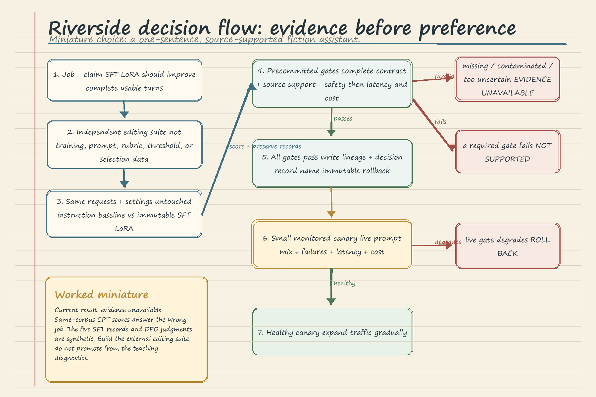

# LLM Fine-Tuning Comparison and Decision: Handwritten Theory Notes

These notes follow the Riverside House comparison notebook. The central habit is: **evaluate first, compare second, decide last**. A trained artifact is not automatically a candidate for release, and a visually impressive sample is not evidence by itself.

## 1. Comparison Methodology

Start with one candidate, one job, and one falsifiable claim. Then freeze an independent, versioned case suite before looking at candidate results. Run the accepted baseline and the immutable candidate on the same cases, preserve case-level records and failure reasons, aggregate the metric that matches the claim, and apply product-owned gates chosen in advance.

The conclusion vocabulary is deliberately strict:

- **Supported:** all required evidence is valid and every required gate passes.
- **Not supported:** valid evidence exists, but at least one required gate fails.
- **Evidence unavailable:** required evidence is missing, contaminated, or too uncertain to apply the gates.

The last category is not a soft failure and must not be rewritten as "promising." It means the production claim cannot yet be evaluated.

Candidates may be compared only after independent evaluation and only when they are competing for the same job. Continued pretraining (CPT) is compared with the untouched base on domain and control language modeling. Supervised fine-tuning (SFT) is compared with an untouched instruction model or accepted assistant on complete editing-contract behavior. Direct preference optimization (DPO) is compared with the accepted SFT artifact on contract retention and blinded editorial preference. Full, partial-freeze, and LoRA strategies are compared under a matched experiment that changes only where the update is stored.

Never combine unrelated measurements into a universal score. Lower prose perplexity cannot compensate for a failed instruction contract. A preference win cannot compensate for a safety failure. Lower adapter cost cannot compensate for lost required behavior.

## 2. Candidate Loading and Isolation

The notebook reconstructs six independent model objects: the untouched baseline, full-FT continuation, partial-freeze continuation, LoRA continuation, SFT LoRA assistant, and DPO assistant. Their ancestry matters because they did not practice the same objective.

Loading must preserve isolation. Restore the shared tokenizer, pinned model profile, revision, prompt contract, and LoRA target modules. Every PEFT adapter receives a **fresh base-model instance**. Otherwise one wrapper can mutate or retain state that leaks into another candidate, making the comparison uninterpretable. Reload full and partial checkpoints independently, verify required configuration and weight files, check adapter target modules, set models to evaluation mode, and derive parameter counts from the objects actually loaded.

The partial-freeze candidate needs special reconstruction: `requires_grad` bookkeeping is not saved as checkpoint behavior, so the freeze pattern is reapplied after loading. This is useful for describing update scope, but trainable-parameter counts alone do not prove quality, efficiency, or causal superiority.

The prerequisite is equally important: Parts 1 and 2 should be rerun from clean kernels on the same hardware profile. Candidate identity should include artifact digest, base model and revision, training manifest, data fingerprint, prompt policy, and evaluation code revision. A result without lineage is hard to reproduce and unsafe to promote.

## 3. Metrics and Evidence

### CPT evidence

CPT asks whether independent Riverside prose becomes less surprising without unacceptable regression on an independent general-language control corpus. Use teacher forcing: both models receive the same true prefix and are scored on the same actual next token. This prevents sampled histories from forking.

For each evaluated token, record negative log-likelihood (NLL). Aggregate by token, not by averaging paragraph averages, then report mean NLL and perplexity:

$$
\text{perplexity}=\exp(\text{mean NLL}).
$$

Lower values mean the supplied text was more expected under the model. They do not establish truth, reasoning, safety, instruction following, or editorial quality. Perplexity is the same information as mean NLL on a translated scale, not an additional observation. Compare models only with the same tokenizer, text, boundaries, and scoring procedure.

A fixed-phrase microscope can compare adapted-minus-base shifts for Riverside phrases and generic controls. A positive selectivity contrast suggests a local Riverside-specific shift, but it does not establish corpus-level improvement or generalization.

The notebook's Aria and shared-corpus calculations are contaminated because Parts 1 and 2 used all 40 Aria chapters for mechanism-sized training and upstream candidates have different training coverage. These calculations demonstrate scoring and diagnose pipelines; they cannot support a production gate. Production CPT evidence requires separately versioned Riverside and control corpora that were not used for training, prompt design, rubric examples, threshold tuning, or checkpoint selection.

### SFT evidence

SFT asks whether the assistant completes the entire editor contract more often. Each independent case contains a source passage, request, explicit constraints, and scorer instructions. Save separate fields such as `one_sentence`, `clean_stop`, `source_supported`, and `safety_pass`. A case passes only if every required rule passes:

$$
\text{complete-contract pass rate}=\frac{\text{cases passing every rule}}{N}.
$$

Keep case records, failure reasons, difficult slices, and an uncertainty interval. The notebook's five worked SFT records are synthetic and produce two complete passes out of five, or 40 percent. They explain aggregation only. Five examples and a wide bootstrap interval cannot support a release gate, and resampling cannot repair a biased suite or a miscalibrated scorer.

### DPO evidence

DPO asks whether qualified, blinded editors prefer it to the accepted SFT candidate **while the accepted contract remains intact**. Use matched prompts and decoding settings. Randomize A/B order, hide model identity, and apply one written rubric. If either answer fails contract or safety eligibility, record that failure separately rather than hiding it inside preference.

Preserve DPO wins, SFT wins, and ties. Half-crediting ties gives:

$$
\text{credited DPO win rate}=\frac{W+0.5T}{W+L+T}.
$$

The notebook's miniature preference record has three DPO wins, two SFT wins, and two ties among seven eligible comparisons, giving 57.1 percent credited DPO preference; an eighth case is contract-ineligible. These are synthetic judgments, not an editor study. Contract and safety gates come first. Preference cannot rescue regression.

## 4. Cost, Capability, and Rollback Tradeoffs

Parameter strategy is a constrained cost comparison, not a popularity contest. Hold the base revision, ordered data, objective, split, instruction template, optimizer policy, token budget, seeds, evaluation suite, and decoding fixed. Change only update storage: full weights, selected late layers, or LoRA matrices.

First apply identical capability, source-support, and safety gates. Eliminate failures. Only then compare measured training memory, training time, artifact bytes, serving latency, and request cost. Choose LoRA when it preserves Riverside's workflow and removes a real burden. Choose full fine-tuning only when a repeatable improvement matters enough to pay for. Part 2's teaching runs do not yet hold every optimizer setting fixed or provide an independent behavior suite, so their parameter counts describe scope rather than prove a winner.

A supported offline decision begins a small monitored canary, not a full rollout. Record the candidate digest, evidence suite, policy, code revision, metrics, and immutable rollback artifact. During the canary, watch live prompt mix, latency, cost, and failures that the fixed suite may not represent. If a live gate degrades, route traffic back to the accepted immutable artifact. Expand gradually only while the canary remains healthy.

## 5. Decision Flow and Worked Miniature Choice

Miniature decision: Riverside wants a one-sentence, source-supported fiction continuation assistant. The full-CPT model may lower same-corpus perplexity, but that diagnostic answers a language-modeling question and is contaminated. It cannot rank the assistant candidates. The DPO adapter may receive 57.1 percent credited preference in the synthetic example, but those judgments are not real evidence and one case is contract-ineligible. It cannot be promoted either.

The SFT LoRA artifact is the correctly aligned candidate for this job, but the five synthetic contract records are too small and artificial. Therefore its current conclusion is **evidence unavailable**, not supported. Riverside should build a separately versioned editing suite, compare the untouched instruction baseline and immutable SFT adapter on identical requests, require complete-contract, source-support, and safety gates, and measure latency and cost. If all precommitted gates pass, SFT LoRA may enter a small canary with the previous production artifact as rollback. If LoRA and a full-FT assistant both pass the same behavior gates in a truly matched study, choose the less burdensome survivor unless full FT's repeatable capability gain justifies its additional cost.

## 6. Common Failure Modes

- Ranking every artifact by one prose perplexity table even though objectives differ.
- Calling training-overlapping Aria text "held out" or treating same-corpus diagnostics as generalization evidence.
- Sharing a mutable base between PEFT adapters and accidentally comparing contaminated model state.
- Comparing generated samples with different histories and attributing sampling luck to training.
- Reading raw phrase scores across unequal phrases instead of adapted-minus-base shifts.
- Averaging paragraph losses equally instead of weighting NLL by evaluated token count.
- Treating lower perplexity as truth, safety, instruction following, or editorial preference.
- Letting an average pass rate hide which contract rule failed or which slice is weak.
- Using a tiny synthetic suite or bootstrap interval as if it created representative evidence.
- Folding contract failures into DPO preference instead of filtering and reporting them separately.
- Tuning thresholds after inspecting candidate outputs.
- Comparing full, partial, and LoRA runs while data, optimizer policy, budget, or seeds also changed.
- Choosing the smallest artifact before checking capability and safety gates.
- Promoting without dataset fingerprints, artifact digests, decision records, canary monitoring, or rollback.

## 7. Final Breadth Checklist

- [ ] Candidate job and falsifiable claim are written.
- [ ] Correct accepted baseline is named for that claim.
- [ ] Candidate object and rollback object are immutable and content-addressed.
- [ ] Base revision, tokenizer, prompt contract, adapter targets, and ancestry are recorded.
- [ ] Evaluation files are versioned, content-addressed, and disjoint from training content.
- [ ] Cases were not used for prompt design, rubric examples, thresholds, or checkpoint selection.
- [ ] Baseline and candidate saw the same cases and matched inference settings.
- [ ] Scorer matches the job: NLL, complete contract, or blinded preference.
- [ ] Case-level outputs, scorer fields, and failure reasons are preserved.
- [ ] Aggregate, difficult slices, sample size, and uncertainty are reported.
- [ ] Safety and source support remain separate required gates.
- [ ] Gates were fixed before candidate results were inspected.
- [ ] Unrelated metrics were not collapsed into one score.
- [ ] Cost is compared only among candidates that preserve required behavior.
- [ ] Training memory, time, bytes, latency, and request cost are measured rather than inferred from parameter count.
- [ ] Conclusion is exactly supported, not supported, or evidence unavailable.
- [ ] Supported candidates receive a decision and lineage record before canary traffic.
- [ ] Canary live gates, gradual expansion, and immediate rollback routing are defined.

The final rule is simple: when an experiment cannot answer the production question, design the next experiment. Do not ask contaminated or mismatched evidence to say more than it measured.
