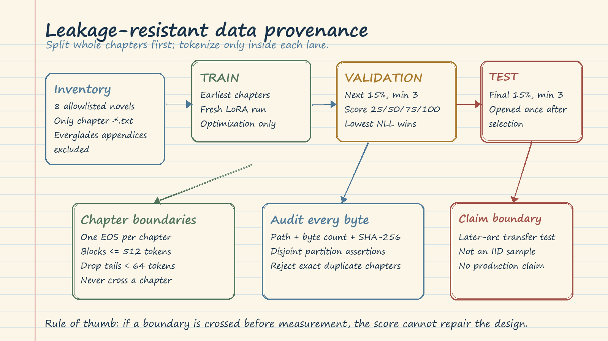

# LLM Fine-Tuning Practice: Evidence Before Claims

This practice is not merely "train eight adapters." It is an evidence design for eight independent LoRA continued-pretraining experiments. Each Riverside novel starts from the same pinned `HuggingFaceTB/SmolLM2-360M` revision, uses the same recipe, and produces its own selected adapter, measurements, and manifest. The central question is: **did domain likelihood improve on untouched later chapters without unacceptable general-language regression?**

The notebook is deliberately CUDA-only. There is no CPU fallback, and the ordinary 360M LoRA run is not QLoRA or inference quantization. `RUN_TRAINING=False` makes expensive execution an explicit opt-in. `OVERWRITE_RUNS=False` separately prevents accidental destruction of completed evidence.

## 1. Data Split and Provenance

The unit of separation is a complete chapter, not a token block. For each novel, validation receives 15% of chapters and test receives another 15%, each rounded upward and never smaller than three chapters. Earliest chapters train, the next block validates, and the final block tests. Examples are 6/3/3 for 12 chapters, 28/6/6 for 40, and 56/12/12 for 80.

This chronological split prevents adjacent prose from leaking across a random chunk boundary and asks whether learning transfers into a later narrative region. It is intentionally harder than a random split, but it is **not IID**: later chapters may contain different characters, settings, or narrative arcs. Therefore, a test score describes this forward-transfer challenge, not every possible passage from the novel.

Only `chapter-*.txt` files are eligible. Ten Everglades appendices have a different document function and are recorded as excluded. Before selection, the only operation over test bytes is SHA-256 hashing. Test text is not decoded or tokenized. The split audit asserts that all chapters are assigned exactly once, partitions are disjoint, all eight allowlisted novels exist, and no exact duplicate chapter hashes occur across novels.

Provenance turns a result into a reproducible claim. Every source entry records repository-relative path, SHA-256 digest, and byte count. The manifest also fixes the model and tokenizer revision, seed, package versions, hardware, CUDA runtime, precision, excluded files, and the hash of the general-retention probe. A filename alone says what we intended to use; a digest says what bytes were actually used.

## 2. Tokenization Without Boundary Leakage

Each chapter is encoded independently. Existing terminal EOS tokens are removed, then exactly one EOS is appended. The chapter is divided into blocks of at most 512 tokens, and tails shorter than 64 tokens are omitted so mostly padded fragments do not create many low-information batches. No block contains text from two chapters.

SmolLM2 uses the same token ID for EOS and padding. Labels must therefore be masked where `attention_mask == 0`, not wherever the token ID equals EOS. Token-ID masking would erase genuine end-of-chapter prediction targets. This small implementation detail protects the meaning of the loss.

## 3. Training and Interval Checkpoints

Each novel run starts fresh. It creates a new base model, LoRA adapter, optimizer, scheduler, and checkpoint directory; it never resumes implicitly. The seed is `20260804 + novel_index`. Deterministic algorithms are requested, while the manifest still records hardware and software because exact floating-point reproducibility can depend on the GPU stack.

LoRA updates `q_proj`, `k_proj`, `v_proj`, and `o_proj` with rank 8, alpha 16, dropout 0.05, and no bias. The target modules are checked against the pinned model before training. The recipe uses batch size 1, gradient accumulation 8, learning rate $10^{-4}$, 100 maximum steps, 10% warmup, weight decay 0.01, gradient clipping at 1.0, gradient checkpointing, and BF16 when supported, otherwise FP16. Model parameters must remain on CUDA.

Adapters are saved at steps 25, 50, 75, and 100. Training loss is optimization telemetry, not final evidence. A falling training curve can coexist with overfitting, domain damage, or a broken artifact. Checkpoints preserve alternatives so validation can choose the useful stopping point instead of assuming the final step is best.

## 4. Token-Weighted Validation Selection

For a chapter, sum next-token negative log-likelihood over all non-padding targets and count those targets. Across validation chapters,

$$
\operatorname{mean\ NLL}=\frac{\sum_c \operatorname{NLLSum}_c}{\sum_c \operatorname{Tokens}_c},
\qquad
\operatorname{PPL}=\exp(\operatorname{mean\ NLL}).
$$

This is token weighting: every scored token contributes equally. Averaging chapter means would give a short chapter and a long chapter equal influence. Averaging `Trainer` batch losses can similarly depend on batch shape. The notebook therefore uses `Trainer` only for optimization and checkpoint writing. Each saved adapter is reloaded onto a fresh copy of the pinned base and scored by the explicit helper. Minimum validation mean NLL selects the winner.

Selection is per novel. Do not pool tokens from all eight novels to invent one apparently precise model score: there are eight different adapters and eight different experiments.

## 5. Test Isolation and Artifact Parity

After selection, the winning adapter and tokenizer are saved to `selected-adapter`. The adapter is then loaded again on a fresh base. Validation NLL must match the pre-save selected score within $10^{-5}$. With the adapter disabled, base validation NLL must also match within $10^{-5}$. This reload parity check asks whether the artifact on disk is the model that was measured.

Only after the choice and parity checks are fixed are test chapters decoded and tokenized. Consulting test results earlier, or repeatedly changing the recipe after seeing them, silently turns test into validation. A rerun after a test-informed decision needs a new untouched test source or must be labeled exploratory rather than confirmatory.

The selected adapter and unchanged base are scored on exactly the same test chapters. Domain improvement is

$$
100\times\frac{\operatorname{PPL}_{base}-\operatorname{PPL}_{adapter}}{\operatorname{PPL}_{base}}.
$$

The adapter is also compared with the disabled base on six fixed general-language passages spanning science, government, databases, geography, and music. This retention suite is a regression canary, not proof of general capability. Two deterministic continuations from the first test chapters provide visible, matched inspection evidence, but generations do not select checkpoints and cannot override quantitative gates.

## 6. Uncertainty and Conservative Decisions

The notebook draws 2,000 paired bootstrap replicates. Each replicate resamples whole test chapters with replacement, then recomputes base and adapter perplexity from their token totals and records percentage improvement. Pairing keeps both models on the same sampled chapter membership. Resampling chapters, rather than tokens, respects the strongest available independent unit.

There are only four to six test chapters for many novels. The resulting 95% percentile interval is therefore a **small-sample sensitivity estimate**, not a population confidence guarantee. An interval crossing zero means chapter membership can reverse the conclusion. A large point estimate does not repair that uncertainty.

Decision rules are fixed before held-out results:

- **PASS:** test perplexity improves by at least 5%, the bootstrap lower bound is above zero, and retention regression is at most 5%.
- **FAIL:** retention regression exceeds 5%, or the entire bootstrap interval is below zero.
- **INCONCLUSIVE:** all cases between those gates, including a positive point estimate whose interval crosses zero.

Read each result in order: uncertainty first, retention second, then runtime and peak GPU memory. Low cost never rescues failed evidence. The partial ledger written after each novel protects completed work, but the final ledger is valid only when it contains exactly one row and one manifest for every allowlisted novel.

## 7. Artifacts That Make the Claim Auditable

Each novel directory contains interval training checkpoints, the selected adapter and tokenizer, and an `experiment-manifest.json`; the selected-adapter directory receives the same manifest. The manifest captures source partitions, hashes, tokenization counts, LoRA and training configuration, complete training history, every checkpoint validation score, selected step, reload parity deltas, base and trained test statistics, retention statistics, bootstrap settings and interval, deterministic generations, elapsed time, and peak allocated GPU bytes.

Across novels, partial JSON is replaced on successful completion by final JSON and CSV ledgers. The dashboard is rendered only after all eight measured rows exist. These are local training and evaluation artifacts. They do not establish a deployed service, production readiness, or live Azure behavior; the chapter README explicitly marks Azure compatibility and behavior as live-unvalidated.

## 8. Failure Modes and What They Mean

**Leakage:** random token chunks, cross-chapter blocks, duplicate files, or test-driven tuning inflate evidence. Rebuild the split before training.

**Last-checkpoint bias:** choosing step 100 because it is newest ignores validation. Keep interval checkpoints and select minimum explicit validation NLL.

**Wrong aggregation:** averaging per-batch or per-chapter means changes weighting. Sum NLL and tokens, then divide once.

**Artifact mismatch:** a saved adapter that fails reload parity is not trustworthy. Stop before test and inspect revision, tokenizer, and adapter files.

**Domain gain with retention damage:** improvement on novel text can hide broad regression. More than 5% retention regression is FAIL even if domain gain is large.

**Unstable improvement:** a point estimate above 5% with an interval crossing zero is INCONCLUSIVE, not PASS. Gather more independent chapters or repeat a predeclared study.

**Confounded pooling:** combining novel tokens hides weak adapters behind strong ones. Keep one gate, interval, runtime, and manifest per novel.

**Operational interruption:** preserve the partial ledger, diagnose the last completed manifest stage, and rerun only with an explicit overwrite decision. Never delete another novel's evidence.

## 9. Practical Runbook and Decision Rules

1. Confirm CUDA visibility, pinned revision, package versions, free disk space, and artifact destination.
2. Leave training disabled; run and inspect the complete split audit first. Resolve missing, empty, duplicate, or misclassified files.
3. Confirm chapter-bounded tokenization, one EOS per chapter, 512-token blocks, 64-token minimum tails, and attention-mask label masking.
4. Freeze the recipe and thresholds before held-out scores are visible. Record why any deviation is necessary.
5. Enable training without overwrite. For each novel, verify four checkpoints and inspect logs for non-finite loss or device violations.
6. Select only by explicit token-weighted validation NLL. Save the winner and require both parity deltas to be at most $10^{-5}$.
7. Open test once. Score base and adapter on matched chapters, run the paired chapter bootstrap, evaluate retention, and generate deterministic inspection samples.
8. Apply the declared gates mechanically. Investigate chapter-level statistics; do not rewrite thresholds to rescue a favored run.
9. Require eight unique result rows, eight manifests, selected adapters, final JSON/CSV ledgers, and no leftover partial ledger before summarizing.

Decision discipline: **FAIL** means reject and diagnose; **INCONCLUSIVE** means make no success claim and obtain stronger evidence; **PASS** means this narrow evaluation contract passed, not that every downstream product requirement passed.

## Final Breadth Checklist

- [ ] Complete chapter-disjoint train, validation, and untouched chronological test partitions
- [ ] Paths, byte counts, SHA-256 hashes, exclusions, seeds, revisions, packages, and hardware recorded
- [ ] Chapter-bounded tokenization and correct pad/EOS masking verified
- [ ] Fresh per-novel LoRA training with steps 25/50/75/100 preserved
- [ ] Minimum token-weighted validation NLL used for selection
- [ ] Saved-adapter and disabled-base reload parity within $10^{-5}$
- [ ] Test opened only after selection; base and adapter evaluated on matched chapters
- [ ] 2,000 paired whole-chapter bootstrap replicates interpreted as small-sample sensitivity
- [ ] Domain, retention, and deterministic generation evidence kept in their proper roles
- [ ] PASS/FAIL/INCONCLUSIVE rules applied without post-test tuning
- [ ] Eight independent manifests and final ledgers complete
- [ ] No claim of IID generalization, production deployment, or live Azure validation
