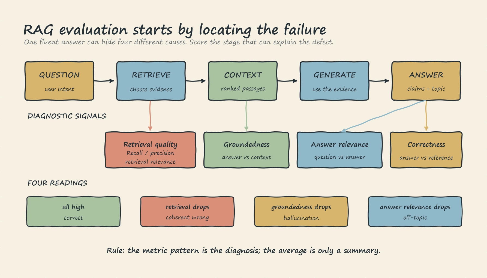
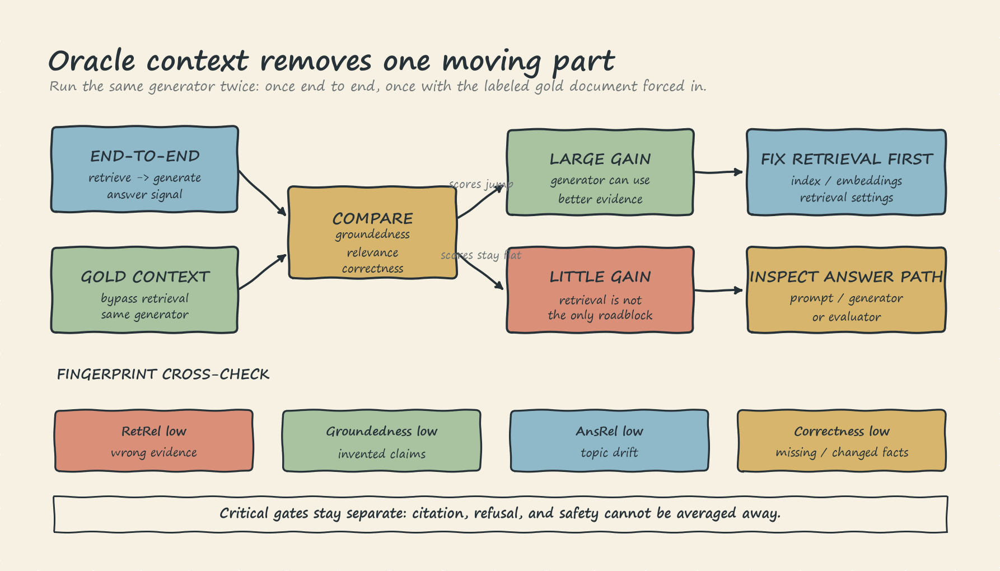

# RAG Evaluation: A Diagnostic Theory Note

RAG evaluation is not one score attached to one answer. It locates failure in a two-stage system: retrieval chooses evidence, then generation uses, ignores, or distorts it. A fluent answer can therefore be correct, faithfully wrong, hallucinated, or off-topic. Answer quality alone cannot reliably distinguish those cases.

This note uses a small Riverside rehearsal: 14 internal documents, eight labeled question/reference/gold-document cases, and one running question:

> How does ReAct combine reasoning and acting?

The fixture demonstrates evaluation mechanics, not production thresholds. Release thresholds require representative labels, versioned scorers, and repeated runs.

## 1. Localize the Failure

Start with one fluent wrong answer. It can fail because retrieval missed the evidence, because the generator ignored good evidence, because it invented an unsupported detail, or because it answered a different question. The prose alone does not reveal the failing stage. That complaint forces separate retrieval, grounding, relevance, and correctness signals.

| Retriever | Generator | Observable result |
| --- | --- | --- |
| Correct | Faithful to context | Correct answer |
| Wrong | Faithful to context | Coherent wrong answer |
| Correct | Ignores context | Hallucination |
| Wrong | Ignores context | Double failure |

The coherent wrong answer is especially dangerous: it is fluent, cites a real document, and may summarize that document accurately. The defect is upstream because the required evidence never entered the answer path. Improving generation cannot recover missing evidence.

Evaluate each query in this order:

1. **Retrieval:** Did the system fetch the required evidence?
2. **Groundedness:** Does the retrieved context support every answer claim?
3. **Answer relevance:** Does the answer address the question?
4. **Correctness:** Does it contain the required reference content?

These signals overlap, but their pattern is the diagnosis.

## 2. Read Retrieval and Answer Metrics Separately

Retrieval recall measures how much required evidence appears in the top results. Retrieval precision measures how much of those results is required rather than noise. Returning the whole corpus can produce perfect recall and poor precision; returning one correct page can produce perfect precision while omitting another required page. With one gold document per Riverside question, rank-one recall is simply whether that document appears first.

Embedding similarity between a question and retrieved documents provides a continuous retrieval-relevance signal. It handles paraphrase better than keyword overlap, but remains a proxy: a nearby topic can be semantically similar without answering the question.

Answer metrics ask different questions:

- **Groundedness or faithfulness** tests support from context. Token overlap cheaply catches obvious inventions, but misses negation and distortion. "ReAct does not interleave thought and action" reuses source vocabulary while reversing its meaning. Verbatim copying can also look grounded without being useful. Subtle cases need entailment-aware or audited judge evaluation.
- **Answer relevance** tests whether the response is about the requested topic. Embedding similarity catches topic drift, but an invented answer packed with ReAct vocabulary can still look relevant.
- **Correctness** compares the answer with labeled required content. Recall-oriented ROUGE-L gives partial credit when reference words remain in order, but it misses heavy paraphrases and does not penalize unsupported extras. Semantic scoring or an audited judge is needed when wording changes substantially.

Groundedness and correctness must remain distinct. An answer can faithfully describe the wrong retrieved document and be grounded but incorrect. It can also state a correct fact from model memory that the supplied context does not support and be correct but ungrounded.

## 3. Use Fingerprints, Not Only a Composite

A composite mean is useful for summarizing a run, but it hides cause. Two systems can share the same average and require opposite repairs. Keep the component fingerprint:

| Fingerprint | Likely failure | Inspect first |
| --- | --- | --- |
| Retrieval relevance low | Wrong evidence neighborhood | Index, embeddings, retrieval settings |
| Groundedness low, relevance high | On-topic invention | Prompt and generation constraints |
| Answer relevance low | Topic drift | Retrieval-generation interface or prompt |
| Correctness low | Required content omitted or changed | Answer construction and reference coverage |

Retrieval is upstream. Good retrieval is necessary, not sufficient; absent evidence limits any context-bound generator.

## 4. Isolate Retrieval With Oracle Context

For a failed query, bypass retrieval and give the same generator the labeled gold document. This oracle-context ablation is a diagnostic, not a deployable feature.

If answer scores jump, the generator can use good evidence and retrieval is the likely bottleneck. If scores barely move, inspect answer construction or the evaluator. Mixed gains across queries indicate multiple failure modes and should be analyzed by slice.

### Tiny ReAct case

Question: "How does ReAct combine reasoning and acting?"

Gold context: ReAct interleaves thought and action steps and uses tools such as search or a calculator.

- A LoRA answer drawn from a LoRA document may be well grounded in its retrieved context, yet have low retrieval relevance and correctness. Repair retrieval first.
- A ReAct answer that adds "quantum entanglement" may remain relevant, but groundedness and correctness fall. Repair generation constraints.
- A fine-tuning answer produced from the ReAct context can have healthy retrieval while relevance and correctness fall. Inspect answer construction.

Forcing the gold ReAct context should repair only the first case. If invention remains, retrieval was not the controlling defect.

## 5. Judge Limits and Release Rules

An LLM judge can evaluate entailment, negation, coreference, and paraphrase better than local proxies. Give it bounded questions, facts, and a rubric; require a structured verdict with concise evidence, not hidden chain-of-thought. Judges still introduce **verbosity bias**, **position bias**, and **self-preference**. Audit reordered pairs or multiple judges, calibrate against human labels, and version the judge, prompt, and rubric.

Apply these release rules:

1. Diagnose per query before averaging, and run oracle-context isolation on weak cases.
2. Use cheap proxies for frequent regressions; reserve audited semantic judges for periodic review and boundary cases.
3. Treat narrow margins as review. With eight cases, one binary result moves a mean by 0.125, so a one-case margin cannot justify automatic release.
4. Keep citation correctness, refusal appropriateness, authorization, and safety as separate gates; strong relevance must not average them away.
5. Version the dataset, prompt, retriever, generator, evaluator, thresholds, and report in the release record.
6. Feed privacy-reviewed production failures back into labeled offline regression cases.

Eight hand-written cases remain a rehearsal, not evidence of production readiness. Trust evaluation only when every release claim maps to a measured, versioned signal.
