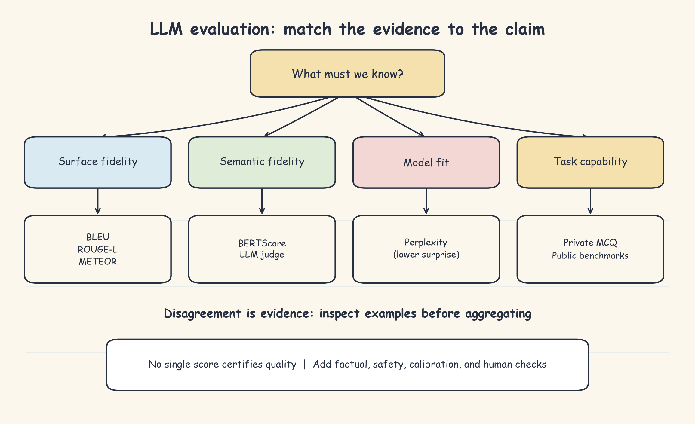
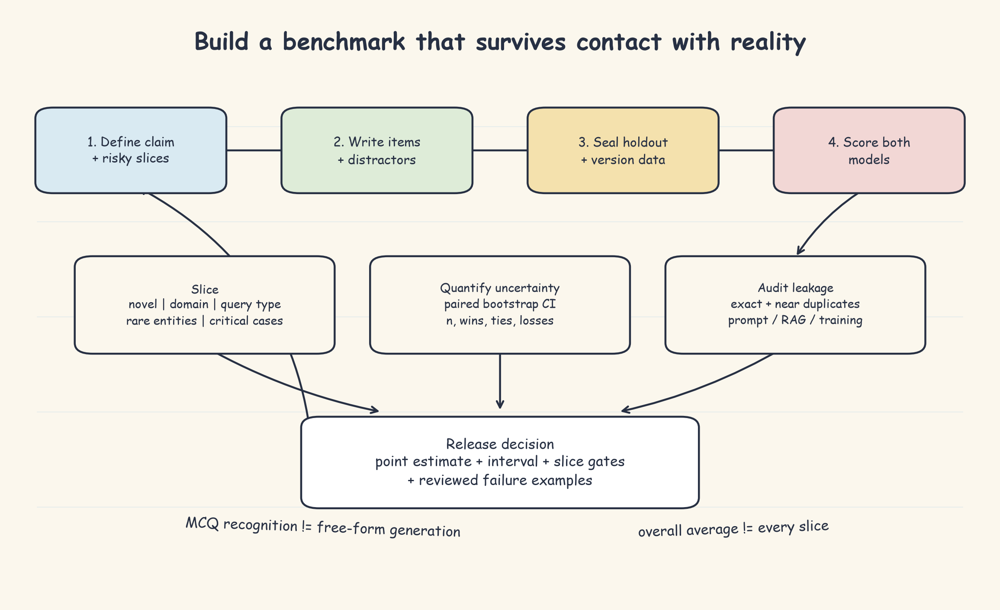

# LLM Evaluation Metrics and Benchmarks: Handwritten Theory Notes

LLM quality is multidimensional. A fluent answer can be wrong, and a correct paraphrase can look unlike its reference. Therefore, no single score can certify a model. Start with the decision or claim, then combine metrics that provide different kinds of evidence.

## 1. Metric taxonomy

**Reference-based string metrics** compare an answer with human-written references. BLEU measures matching n-grams, ROUGE-L measures ordered token coverage, and METEOR adds stems, synonyms, and a word-order penalty. They depend on reference wording.

**Model-based semantic metrics** compare meaning rather than exact strings. BERTScore uses contextual token embeddings and reports semantic precision, recall, and F1. It catches paraphrases such as "reclaim" versus "recover," but depends on the evaluator model and does not prove factual entailment. LLM-as-judge is another model-based method, developed separately because rubrics, bias, and answer-order effects need controls.

**Reference-free metrics** score text without a gold answer. Perplexity measures how surprising a sequence is to a language model. It is useful for domain-fit regression, not correctness.

**Capability benchmarks** contain fixed tasks, known answers, and scoring rules. Examples include MMLU, HellaSwag, TruthfulQA, HumanEval, and HELM. Riverside also needs a private manuscript benchmark.

Thus, the taxonomy separates surface fidelity, semantic fidelity, model fit, and task capability. Human, factuality, safety, and calibration checks remain companion evidence.

## 2. Core metric intuition

**BLEU** asks whether candidate n-grams occur in a reference. It clips repeated matches so copying one good phrase many times cannot inflate the score indefinitely. BLEU-4 combines one- through four-word matches, while a brevity penalty discourages tiny answers such as "noble birth" from receiving excessive credit. BLEU suits translation with close references, but valid open-ended answers often score poorly because they use different phrases.

**ROUGE-L** finds the longest shared token sequence in the same relative order; the tokens need not be adjacent. For example, "pendant hides a letter" and "pendant secretly hides an old letter" retain an ordered match. ROUGE-L helps measure summary coverage, but misses unseen synonyms and may reward extractive copying.

**METEOR** aligns exact words, stems, and WordNet synonyms, then penalizes fragmented matches. An answer containing the right words in a scrambled list loses credit. It is more paraphrase-tolerant than BLEU or ROUGE-L, though language resources limit it.

**BERTScore** compares contextual token vectors. Each reference token takes its best candidate-token match for recall, and each candidate token takes its best reference-token match for precision; F1 balances them. It recognizes similar meanings despite vocabulary changes. However, "the colony was destroyed" and "the colony was thriving" discuss the same entities and may still appear semantically close. High BERTScore is not a factuality certificate.

All reference metrics inherit reference quality. One reference represents one valid wording, not every correct answer. Use multiple independently written and reviewed references when possible.

## 3. Perplexity as average surprise

Perplexity can be understood as the model's average surprise while reading text token by token. Lower perplexity means the next tokens were more expected. A Riverside-tuned model should be less surprised by names such as Mei-Lin and manuscript-specific phrases than base GPT-2.

This does not mean the text is true. "Aria discovered the colony was destroyed" and the false sentence "Aria discovered the colony was thriving" can both sound natural in the same fictional style. Use perplexity as an alarm for domain shift or model degradation. Compare it only on the same held-out corpus, tokenizer, and context policy, not across unrelated model families.

## 4. Riverside disagreement example

Reference: "The pendant hides a letter proving Mei-Lin's noble birth, allowing her to reclaim the family trade route."

A correct answer might say: "A document inside the pendant confirms Mei-Lin's lineage, letting her recover the trade permit." BLEU may be low because exact phrases changed; ROUGE-L finds limited ordered overlap; METEOR and BERTScore should reward the synonyms and preserved meaning.

A wrong answer might call the pendant "a jade heirloom symbolizing family status." It is fluent and shares topical words, so overlap and perplexity may look respectable, yet it omits the hidden letter and legal consequence. This is why metric disagreement is diagnostic rather than noise.

## 5. Benchmarks, slices, and leakage

Define a capability before writing benchmark items. Riverside's 20-question multiple-choice benchmark separates manuscript recall, general literary knowledge, and evaluation knowledge. For each option, a causal model can score the complete prompt and continuation; the lowest-loss option wins. Keep formatting fixed, score the answer continuation when possible, consider option-length effects, and shuffle option order to detect bias.

Record each item's source, skill, difficulty, answer, distractors, reviewer, and version. Separate development data from a sealed test set. Include positive, negative, contrastive, and boundary cases, and remove ambiguous items. Public benchmarks enable comparison but may have leaked into training data. Private tests better measure proprietary knowledge but are less comparable. Check exact and near-duplicate leakage across training data, prompts, retrieval indexes, and evaluator context.

MCQ accuracy measures recognition, not free-form generation. Pair it with representative generation prompts.

Keep per-example results and report slices that match risk: manuscript, query type, rare entities, answer length, and critical cases. Overall accuracy can hide a severe local regression. When scores disagree, move from the dashboard to the slice, item, claim, and likely cause: retrieval, prompt, decoding, reference, evaluator, or model. Low overlap plus high semantic similarity often means paraphrase; high similarity plus failed factual review often means contradiction or unsupported content. Report sample size and uncertainty, and use paired comparisons when models answer the same items.

## 6. Decision rules

1. Close translation: BLEU, plus semantic or human checks for freer wording.
2. Summarization: ROUGE-L for ordered coverage and BERTScore for paraphrases.
3. Open-ended Riverside QA: BERTScore plus METEOR, followed by factual judging or human review.
4. Domain style regression: held-out perplexity, never treated as accuracy.
5. Factual recall: a private benchmark plus generated-answer evaluation.
6. Safety, hallucination, and calibration: specialized protocols, not overlap metrics.
7. Any disagreement: inspect examples and let the original task claim decide; never select whichever metric is largest afterward.

Riverside's minimum suite is BERTScore for semantic fidelity, perplexity for domain-fit regression, a private MCQ benchmark for manuscript recall, and recurring manual review. The governing principle is: **measure the claim, preserve disagreement, guard against leakage, and inspect the failures.**
