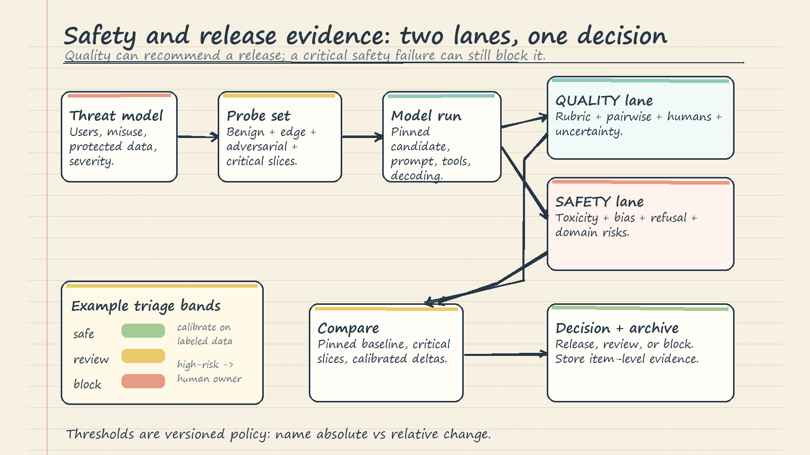

# LLM-as-Judge, Safety, and Evaluation Pipelines: Intuition Notes

The companion notebook demonstrates pipeline shape; production values require in-domain calibration.

## 1. Begin with the release decision

Write the decision first: for example, "Can this checkpoint replace the approved model?" Then identify the required evidence. Keep factuality, completeness, relevance, latency, and cost as separate dimensions. Safety is a parallel gate: a fluent answer can still be unsafe, and a high mean can hide a severe slice failure.

## 2. Treat the judge as an instrument

An LLM judge is a measurement instrument, not an oracle. Its model, prompt, rubric, context, decoding settings, and output schema jointly define what it measures, so version them together.

A rubric should ask one observable question per dimension. Factuality asks whether material claims match supplied evidence; completeness asks whether required points are present; relevance asks whether the response addresses the request. Anchor the scale with concrete examples. On a 1-5 factuality scale, 5 can mean every material claim is supported, 3 that the central answer is supported but an important detail is absent, and 1 that the answer is mainly unsupported or contradictory.

Require validated structured output. Store the score, evidence rationale, versions, and raw response. Parseable JSON does not make a verdict correct.

## 3. Rubric and pairwise scoring

**Rubric scoring** evaluates one answer against absolute, anchored dimensions. It suits gates such as "factuality must be at least 4/5," but scale use can drift across judges, topics, or time. Calibrate against human-labeled examples and inspect item and slice results, not only the mean.

**Pairwise scoring** asks whether A, B, or neither better meets the same criterion. Comparing concrete alternatives is often easier than inventing an absolute score, and directly answers whether a candidate beats a baseline. Run both `A vs B` and `B vs A`, map verdicts back to system identity, and accept a win only when it survives the swap. Otherwise mark it order-sensitive. Allow ties and abstentions when evidence is insufficient or differences are immaterial.

Decomposition can strengthen either flow: identify required claims, check support, omissions, and contradictions, then score. Visible subchecks improve auditability, but can still contain biased or hallucinated reasoning.

## 4. Human agreement and judge bias

Agreement asks whether evaluators apply the task similarly; correctness asks whether their labels match the intended behavior. Measure human-human agreement, judge-human agreement, and repeated-run stability separately.

Observed agreement is simply how often raters choose the same label. Chance agreement is the overlap expected because each rater may heavily favor common labels. A chance-corrected statistic discounts that easy overlap. It can fall when label prevalence is skewed even if raw agreement looks high, so always inspect raw agreement, label frequencies, confusion cases, and uncertainty alongside it. Low agreement is a debugging signal: clarify anchors, train annotators, review ambiguous items, and relabel a pilot set.

Position bias favors the first or second answer; the order swap exposes it. Verbosity bias mistakes length for quality, so test matched answers that preserve facts while changing length. Self-preference favors outputs resembling the judge's family or voice. Use human calibration, isolated counterfactual tests, and genuinely diverse judges.

## 5. Safety is a gated pipeline

Start from a threat model covering users, capabilities, protected data, plausible misuse, and harm severity. Build probes from realistic benign traffic, difficult legitimate requests, adversarial prompts, and domain edge cases. The notebook demonstrates toxicity, demographic counterfactuals, and refusal behavior; actual coverage must follow product risks rather than a generic catalog.

Treat classifier thresholds as triage policy, not probabilities of real-world harm. Calibrate review and block bands on labeled in-domain outputs, examine false positives and false negatives, and assign human escalation for high-risk or ambiguous cases. Counterfactual tests change one demographic cue while holding the prompt fixed; differences flag investigation, not proof of unfairness. Refusal evaluation must catch both unsafe compliance and unnecessary refusal of benign requests.

## 6. Regression and evidence pipeline

A regression table is not operational until it names the failed version, baseline delta, affected slice, severity, and release action. The useful output is an alert such as `judge 4.1 -> 3.8, MCQ 0.60 -> 0.50: HOLD`, not a dashboard someone must remember to inspect.

Thresholds encode policy. Give each one an owner, rationale, calibration set, direction, unit, effective date, and review schedule. Do not reuse one delta across metrics with different scales and noise. State whether change is absolute or relative, estimate repeated-run variation, and examine critical slices.

The release flow is `dataset -> run -> score -> compare -> decide -> archive`. Freeze and hash the comparison set; pin the baseline, candidate artifact, prompts, judge configuration, dependencies, and relevant seeds. Archive item-level outputs, disagreement cases, safety reviews, metric and slice summaries, threshold configuration, and the accountable human decision. A stable holdout preserves comparability; new failures should enter through controlled, versioned updates with overlap between old and new sets.

An alert is not a diagnosis. It should pause promotion, expose failed examples, and produce a documented decision. A credible release requires no safety-gate failure, no material regression on critical slices, and evidence that aggregate gains are practically meaningful.

## 7. Common failure modes

- **Rubric leakage:** rewarding reference wording instead of desired behavior.
- **Contamination:** evaluation examples enter training or prompt tuning.
- **Aggregate masking:** a mean hides regressions in a language, task, or risk slice.
- **Judge drift:** unversioned model or prompt changes alter the instrument.
- **Forced certainty:** no tie, abstention, or human-review state exists.
- **Rationale theater:** plausible explanations are accepted without source checks.
- **Safety monoculture:** one classifier is treated as complete coverage.
- **Threshold folklore:** copied numbers replace in-domain calibration.
- **Missing evidence:** outputs, versions, hashes, or decisions are not archived.
- **Goodhart pressure:** tuning improves the visible benchmark more than the product.

## 8. Operating rules

1. Define the release decision and threat model before metrics.
2. Anchor observable quality dimensions and keep safety as independent gates.
3. Calibrate judges with humans; test order, verbosity, and self-preference.
4. Version inputs, instruments, thresholds, outputs, and decisions.
5. Report item and slice evidence with uncertainty, and retain human ownership.

The durable model is simple: judges produce evidence, safety gates constrain action, and a versioned regression pipeline turns evidence into accountable release decisions.
