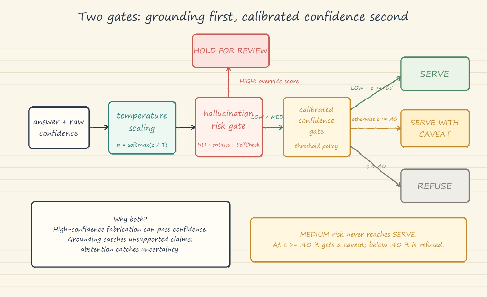

# Calibration and Confidence: Handwritten Theory Notes

## 1. Confidence is not correctness

Correctness is an observed outcome: an answer is correct or incorrect after evaluation. Confidence is a score produced before that outcome is known. Calibration asks whether the score has an honest long-run meaning.

Suppose Riverside labels 100 answers that each received about 80% confidence. If roughly 80 are correct and 20 are wrong, that group is calibrated. The score does not mean one answer is "80% correct," and it never proves that a particular answer is right. Even a calibrated 80% group contains about 20 errors.

Accuracy and calibration can diverge. Two systems may both answer 85 of 100 questions correctly, while one usually reports 70% confidence and the other 99%. Their accuracy is identical, but neither score describes the observed 85-of-100 frequency. Calibration makes confidence interpretable; it does not create correctness.

LLM confidence may come from token probabilities, a separate confidence model, or a verbalized estimate requested in the prompt. Each is only a candidate signal. Fluent falsehoods can have high token probability, long correct answers can receive weaker sequence scores, and verbalized percentages can be sycophantic or prompt-sensitive. Validate the exact signal on representative labeled data before displaying it as a probability.

## 2. Reliability diagrams and ECE bins

A reliability diagram groups answers into confidence bins and compares mean confidence with the fraction correct. In a 70-80% bin, imagine 20 answers averaging 76% confidence but only 10 correct. Observed accuracy is 50%, so the point appears below the perfect-calibration diagonal: 26 percentage points overconfident. If 18 were correct, the 90% accuracy would indicate underconfidence.

Expected Calibration Error (ECE) summarizes bin gaps while giving larger bins more influence. Consider 100 answers:

- 50 average 60% confidence; 30 are correct, so the gap is zero.
- 30 average 80% confidence; 21 are correct, so the gap is 10 points.
- 20 average 90% confidence; 10 are correct, so the gap is 40 points.

Across all answers, the bins contribute 0, 3, and 8 percentage points respectively, producing ECE of 11 percentage points. The last bin matters most despite being smaller because it is confidently wrong.

ECE hides direction and local extremes, so retain the diagram. It also changes with bin boundaries: too few bins hide failures; too many leave noisy groups. Report bin count and strategy, use equal-mass bins when appropriate, and add uncertainty and slice checks. Simulated counts are teaching examples, not measurements of typical LLM behavior.

## 3. Temperature scaling

Temperature scaling fits one positive adjustment on held-out calibration data. A temperature above 1 flattens probabilities; below 1 sharpens them; 1 leaves them unchanged.

Suppose a multiple-choice model answers 100 calibration questions with average top-choice confidence of 92%, but only 72 answers are correct. Fitting temperature may reduce the adjusted average to about 73%. The model still selects the same option on every question because all logits are rescaled uniformly. Accuracy remains 72 of 100; only probability magnitude changes.

Fit on a calibration split, freeze the temperature, and report results on a separate test split. Refit after changing the model, prompt, decoding policy, or domain. Temperature scaling cannot repair bad ranking: if wrong answers regularly score above correct ones, flattening cannot create discrimination. It also cannot detect unsupported claims or improve grounding.

## 4. Selective prediction and risk-coverage

Selective prediction abstains below a confidence threshold. Suppose a test set has 100 questions and the system serves all of them, making 20 errors. Coverage is 100%, and selective risk is 20 errors among 100 served answers.

At a 0.70 threshold, it may serve 70 answers and get 63 correct: coverage is 70%, while risk is 7 errors among 70 served answers, or 10%. At 0.90, it may serve 30 and get 29 correct: coverage is 30%, and risk is 1 error among 30. A risk-coverage curve shows this trade-off across thresholds.

Higher thresholds reduce or preserve coverage, but improve served-answer accuracy only when confidence ranking is useful. Temperature scaling changes numeric thresholds but preserves ranking, so it cannot improve the ideal frontier indexed by coverage. Report risk and coverage directly; coverage is not recall, so their harmonic mean is not ordinary F1.

## 5. Hallucination plus confidence routing

Calibration asks how often scores like this are correct. A hallucination guard asks whether the answer is unsupported, contradictory, or populated with ungrounded entities. A fluent fabrication can be high-confidence, so confidence cannot be the only gate. A grounded answer may still be uncertain and deserve a caveat.

Use the tutorial rules in this order:

1. HIGH hallucination risk: `HOLD_FOR_REVIEW`, regardless of confidence.
2. Otherwise, confidence at least 0.65 and LOW risk: `SERVE`.
3. Otherwise, confidence at least 0.40: `SERVE_WITH_CAVEAT`.
4. Otherwise: `REFUSE` and direct the user to source material.

MEDIUM hallucination risk therefore receives a caveat even above 0.65. These are examples, not production guarantees. Log the raw score, calibration version, adjusted score, hallucination signals, route, and reason.

## 6. Business rules and failure modes

Choose thresholds from consequences, not a favorite percentage. Estimate the cost of a wrong served answer, unnecessary caveat, review, and refusal. High-impact legal or publishing claims should require low selective risk and accept lower coverage; brainstorming may favor coverage. Choose the highest validated coverage satisfying the use case's maximum-risk rule, using representative time-split data and critical slices.

Calibration degrades under dataset shift. Tiny bins are unstable; broad bins hide local failure. Token confidence rewards fluency and can depend on length. Verbalized confidence changes with prompts. One global temperature can conceal domain, language, or subgroup errors. Tuning thresholds on the test set leaks information. Refusal can concentrate poor coverage on important groups. Recalibrate after material system changes, monitor ECE and risk-coverage in production, and tighten or roll back routing when the service promise fails.
