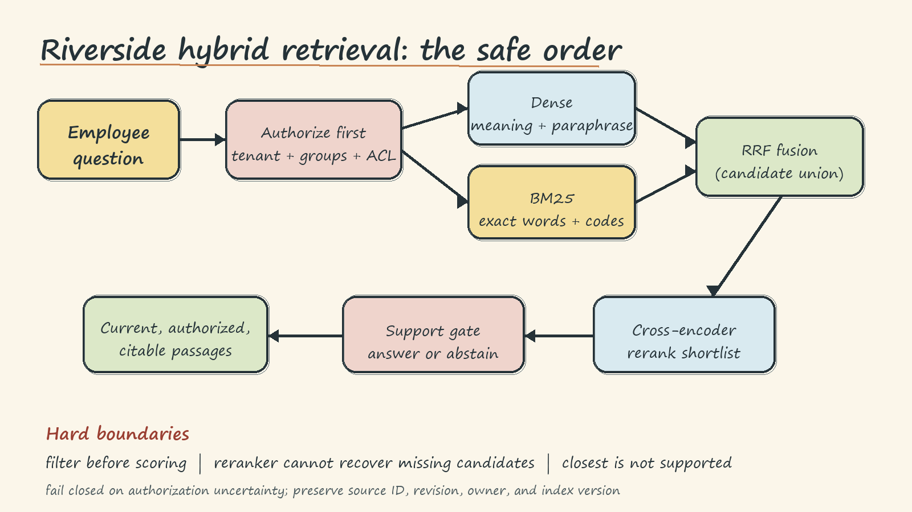
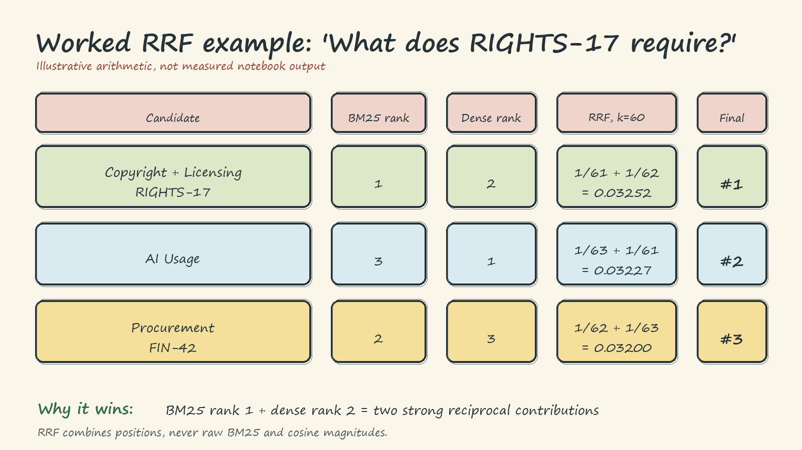

# Hybrid Search for RAG - Handwritten Theory Notes

## 1. The central picture

Riverside should **fine-tune stable behavior** and **retrieve changing knowledge**. House style and response format may belong in model behavior. HR, Legal, Security, Finance, and editorial policies do not: they change, require citations, can be deleted or superseded, and may be visible to one employee but not another.

The retrieval question is therefore:

> Can the system place a current, authorized, supporting passage near the top before generation begins?

Hybrid search is useful because employee questions arrive in two forms. Some contain exact codes or approved phrases, such as `RIGHTS-17` or `FIN-42`. Others express the right meaning in different words, such as `support when welcoming a baby` for a parental-leave policy. One retriever rarely handles both perfectly.



## 2. Lexical retrieval and dense retrieval

**Lexical retrieval asks: "Which passage contains these words?"** BM25 tokenizes the query and documents, rewards rare matching terms with inverse document frequency, saturates repeated terms, and adjusts for document length. Exact identifiers are powerful because they occur rarely. Repeating `approval` ten times does not make a passage ten times better, and a long handbook does not win merely because it contains more words.

$$
\operatorname{BM25}(q,d)=\sum_{t\in q}\operatorname{IDF}(t)\frac{f(t,d)(k_1+1)}{f(t,d)+k_1\left(1-b+b\frac{|d|}{\operatorname{avgdl}}\right)}
$$

$f(t,d)$ counts term $t$ in passage $d$; $k_1$ controls term-frequency saturation, and $b$ controls length normalization. The fraction grows with useful repetition but flattens, while the length term prevents long passages from winning by accumulation alone.

BM25 is fast, interpretable, and strong for codes, names, numbers, and approved wording. Its blind spot is vocabulary mismatch. It cannot infer that `welcoming a baby` means birth, adoption, foster placement, and parental leave when useful tokens do not overlap.

**Dense retrieval asks: "Which passage means something like this?"** A bi-encoder maps the query and each passage into vectors. Cosine similarity ranks passages by the angle between those vectors. Because meaning is represented continuously, `work from home schedule` may land near `work away from the office`, even without exact wording.

Dense retrieval handles paraphrases and intent, but it may dilute unfamiliar identifiers. `RIGHTS-17` is highly meaningful to Riverside and almost meaningless to a general embedding model. Dense search can also return a topically related but operationally wrong policy.

The lesson is not that hybrid always wins. It is that the two retrievers have **different measurable failure modes**. First test an exact-code query and a realistic paraphrase. Record target ranks. The evidence for hybrid search is complementary candidate contribution, not the elegance of the architecture.

## 3. Candidate union, normalization, and fusion

Let $D_{sem}$ be dense candidates and $D_{lex}$ be lexical candidates. Fusion can only rank the union:

$$
C = D_{sem} \cup D_{lex}, \qquad H_K \subseteq C
$$

If neither first-stage retriever supplies the correct passage, no fusion or reranker can recover it. Candidate cutoffs therefore set a hard recall ceiling.

Raw BM25 and cosine scores must not be added. Cosine is bounded between $-1$ and $1$; BM25 is corpus-dependent and unbounded. A BM25 score of 10 is not evidence of ten times the relevance of cosine 1.0.

Two sound options are:

1. **Rank fusion:** discard raw magnitudes and combine positions, usually with RRF.
2. **Score fusion:** normalize each result list, then blend comparable values.

Min-max normalization maps a list to $[0,1]$:

$$
\operatorname{norm}(x)=\frac{x-\min(X)}{\max(X)-\min(X)}
$$

It is easy to interpret but sensitive to an extreme score. Z-score normalization measures standard deviations from the mean, but yields negative values and needs extra handling for a weighted blend. Normalization is local to the observed candidate scores, so a changed candidate pool can change the scale.

If every score in $X$ is equal, the min-max denominator is zero and the list contains no score-based ordering information. Handle that case explicitly, for example with equal normalized values, rather than dividing by zero or inventing a preference.

## 4. Reciprocal Rank Fusion (RRF)

RRF gives each appearance a contribution that falls with rank:

$$
\operatorname{RRF}(d)=\sum_{s\in \mathcal{R}:d\in s}\frac{1}{k+r_s(d)}
$$

Here $\mathcal{R}$ is the set of retriever result lists and $r_s(d)$ is document $d$'s rank in list $s$; an absent document contributes nothing. A document near the top of either list gets credit. A document found by both systems gets credit twice. RRF does **not** average rank numbers. The damping constant $k$ controls steepness: small $k$ emphasizes the first few positions; large $k$ makes nearby ranks more similar. Riverside uses $k=60$ as a notebook baseline, not as a proven production optimum.

### Worked ranking example

Suppose the query is `What does RIGHTS-17 require?` and both retrievers return three candidates:

| Candidate | BM25 rank | Dense rank | RRF with $k=60$ |
| --- | ---: | ---: | ---: |
| Copyright and Licensing (`RIGHTS-17`) | 1 | 2 | $1/61+1/62=0.03252$ |
| AI Usage | 3 | 1 | $1/63+1/61=0.03227$ |
| Procurement (`FIN-42`) | 2 | 3 | $1/62+1/63=0.03200$ |

The exact policy wins because BM25 places it first and dense retrieval still recognizes related Legal language. The example is arithmetic for intuition, **not measured notebook output**.



## 5. Weighted fusion and alpha tuning

Normalized weighted fusion keeps score magnitude:

$$
\operatorname{hybrid}(d)=(1-\alpha)\operatorname{norm}(\text{lex}_d)+\alpha\operatorname{norm}(\text{dense}_d)
$$

$\alpha=0$ is pure lexical retrieval; $\alpha=1$ is pure dense retrieval. A code-heavy query mix may prefer a lower value, while paraphrase-heavy traffic may prefer a higher one. Riverside must not hardcode $\alpha=0.5$ merely because it looks balanced.

Sweep candidate values on fixed labeled queries containing codes, formal controls, and employee paraphrases. Choose on validation data, then check different held-out questions. If Recall@5 is flat, the data and cutoff cannot distinguish the settings. The first maximum returned by `argmax` is not a unique optimum. Revalidate as policies and employee language change.

## 6. Two-stage retrieval and cross-encoder reranking

A production-shaped pipeline spends cheap computation broadly and expensive computation narrowly:

1. Dense and BM25 retrieval collect a broad candidate set.
2. RRF or normalized fusion creates one shortlist.
3. A cross-encoder jointly reads each `(query, passage)` pair and reorders the shortlist.
4. Only the best few authorized passages reach the answer model.

A bi-encoder independently embeds queries and passages, enabling cached document vectors and fast search. A cross-encoder allows token-level interaction and can notice finer distinctions, but its cost grows with candidate count. It is a reranker, not a first-stage index.

Judge reranking by relevant-policy movement across many labels. A changed order is not automatically better. More importantly, reranking changes rank, not membership: a relevant passage omitted by stage one remains impossible to recover.

## 7. Evaluation metrics

**Recall@$K$ asks whether the labeled relevant set was covered:**

$$
\operatorname{Recall@K}(q)=\frac{|R_q\cap T_{q,K}|}{|R_q|}
$$

Use the same $K$ across systems. In the notebook, each supported query has one labeled policy, so Recall@5 is simply whether that policy appears in the first five.

**MRR asks how early the first relevant result appears:**

$$
\operatorname{MRR}=\frac{1}{|Q|}\sum_{q\in Q}\frac{1}{r_q}
$$

Rank 1 contributes 1, rank 2 contributes 0.5, and rank 10 contributes 0.1. Two systems can tie on Recall@5 while differing sharply on MRR.

**nDCG@$K$** is appropriate when labels are graded, for example authoritative answer passage versus useful background. Riverside's notebook explains nDCG but does not compute it because its fixture has one binary relevant policy per query.

Retrieval metrics do not prove answer grounding. The generator can still ignore, distort, or overstate correct evidence. Measure retrieval quality separately from final-answer correctness and citation support.

## 8. Authorization is a retrieval boundary

Authorization must run **before scoring**, not after top results are returned. Otherwise an inaccessible document can affect ranks, appear in logs, leak through snippets, or reach the model before a late filter removes it.

The correct order is:

```text
identity + tenant + groups -> authorized candidate universe -> dense/BM25 -> fusion -> rerank
```

Each chunk should preserve a stable ID, source policy ID, revision, owner, tenant, and ACL metadata through fusion and citation. If identity or ACL evaluation is uncertain, fail closed. An empty authorized set means abstain; it does not mean retry without filters.

The notebook's sentence chunks and department/group slices prove the **filter-first ordering** on toy metadata. They do not prove identity integration, group inheritance, production ACL enforcement, or the best chunk size.

## 9. No-answer support, fallback, and telemetry

A ranker always chooses a winner. Riverside's unsupported dental-deductible and parking-space questions still receive passages from the ten-policy corpus. "Closest" is not the same as "supported."

Use a separate support gate calibrated on labeled answerable and unanswerable questions. If no authorized passage clears that gate, decline and say the available policy collection does not support an answer. Ten documents and two unsupported probes are enough to expose the failure, not to establish a universal threshold.

Publish dense and sparse artifacts together under one immutable version with checksums and a manifest. Never mix revisions. Keep the previous complete version for rollback.

When one retriever times out, return the surviving authorized retriever's ranking and record the degraded mode. If reranking fails, return fused order. If both retrievers fail, return an error or abstention. Authorization uncertainty never gets a fallback that broadens access.

Log compact, privacy-aware telemetry: index version, retrieval mode, per-stage latency and errors, authorized candidate count, dense/sparse candidate counts, overlap, empty-result rate, fallback rate, support-gate decisions, and rank distributions. Join this with offline Recall@K, MRR or nDCG, sampled relevance judgments, stale-version tests, and no-answer error rates. Do not log confidential passage text merely for convenience.

## 10. Failure modes and rules

- **Exact code lost by dense search:** retain a lexical path.
- **Paraphrase lost by BM25:** retain a semantic path.
- **Raw-score addition:** use RRF or normalize before blending.
- **Narrow candidate pools:** measure first-stage recall before tuning reranking.
- **Flat alpha sweep:** report inconclusive evidence; gather stronger labels.
- **Reranker changes order:** verify relevant-document movement, not motion itself.
- **Unsupported query gets a plausible passage:** add a calibrated support decision.
- **ACL filter after retrieval:** move authorization before every scoring path.
- **Dense and sparse versions drift:** publish and roll back one atomic index version.
- **One attractive toy result:** resist generalization; evaluate representative traffic.

## 11. Breadth checklist and measured boundary

- [x] Lexical/BM25 intuition, dense retrieval, complementary failures
- [x] Candidate union, normalization, RRF, weighted fusion, $\alpha$ tuning
- [x] Two-stage retrieval and cross-encoder reranking
- [x] Recall@K, MRR, and when nDCG is appropriate
- [x] Stable chunk identity and authorization-before-ranking
- [x] No-answer support gate, fallbacks, versioning, rollback, telemetry
- [x] Worked RRF ranking and production failure rules

**Measured in the notebook:** ten Riverside policy passages; five validation queries; three distinct held-out queries; semantic, BM25, RRF, weighted, and naive fusion comparisons; Recall@5 and MRR; a real cross-encoder over five fused candidates; two unsupported-query probes; and toy authorization slices with sentence-sized chunk IDs.

**Not established by the notebook:** production retrieval quality, latency improvement on a real index, a universal $k$ or $\alpha$, support-gate threshold, optimal chunk size, approximate-index behavior, domain-encoder superiority, or production ACL enforcement. The production indexing/query example is disabled by default. Riverside must validate these boundaries on the complete approved collection before release.
