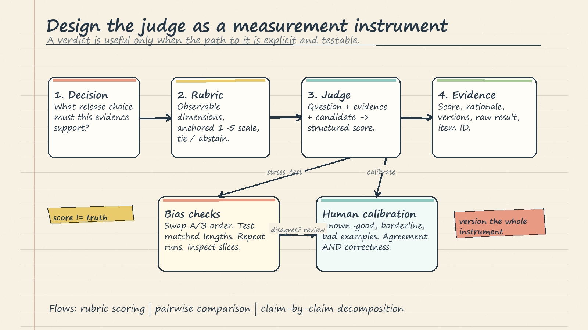

# LLM-as-Judge, Safety, and Evaluation Pipelines: Intuition Notes

These notes are a copy-ready mental model for the companion notebook. The notebook uses a deterministic local scorer to demonstrate the shape of an LLM judge; a production judge would be a separately versioned model call. Its sample sizes, scores, and thresholds are teaching examples, not evidence that the same values will transfer to another model, domain, or risk level.

## 1. Start with the decision, not the metric

An evaluation is useful only when it supports a decision. First write the decision in plain language: "Can this checkpoint replace the approved model for editorial question answering?" Then name the evidence needed to answer it. Quality evidence may include factuality, completeness, relevance, and user preference. Safety evidence may include toxicity, demographic counterfactuals, refusal behavior, privacy, and prompt-injection resistance. Operational evidence includes latency, cost, reproducibility, and regression history.

Do not compress all of this into one magic score. A high average can hide a catastrophic slice. Keep a dashboard of dimensions and define gates for dimensions that must not trade off against quality. In particular, safety is a parallel track: a fluent, accurate answer can still be unsafe.

## 2. Design the judge as a measurement instrument

An LLM judge is not an oracle. It is a measurement instrument with a prompt, model version, decoding settings, context, rubric, output schema, and known failure modes. Version all of these together.

A good rubric names one observable question per dimension. "Factual accuracy" asks whether claims agree with the supplied evidence. "Completeness" asks whether required points are present. "Relevance" asks whether the response addresses the user request. Avoid vague labels such as "overall quality" until the component dimensions have been scored.

Give each scale point an anchor. On a 1-5 factuality scale, 5 might mean all material claims are supported and no contradiction is present; 3 might mean the central answer is supported but a significant detail is missing; 1 might mean the answer is mostly unsupported or contradictory. Anchors make a score reproducible enough to audit. Include known-good, borderline, and known-bad examples when practical.

Require structured output such as JSON, but validate it. A schema makes parsing reliable; it does not make the judgment correct. Store the score, short evidence-based rationale, judge identity, prompt version, and raw response. Prefer a concise claim-and-evidence trace over unrestricted private reasoning.

## 3. Three scoring flows

**Rubric scoring** evaluates one answer against explicit dimensions. It is useful when an absolute quality bar matters, such as "factuality must be at least 4/5." The weakness is scale drift: two judges may use 4 differently, and one judge may change its anchor across topics. Calibrate the judge against human-labeled examples and inspect results by slice, not only by mean.

**Pairwise comparison** asks which of A and B better satisfies the same criterion. It is usually cognitively simpler because the judge compares concrete alternatives rather than inventing an absolute anchor. It directly supports a release question such as "Is candidate B better than baseline A?" Pairwise results can feed a Bradley-Terry-style ranking when many systems are compared, but the model assumptions and uncertainty still need checking.

**Decomposed scoring** first extracts required claims, checks each candidate claim against evidence, notes omissions or contradictions, and only then assigns a score. This G-Eval-like flow can improve discipline because the verdict follows visible subchecks. It is not proof against bias or hallucinated rationales. The decomposition itself must be tested against humans and source evidence.

Use ties and abstentions. If evidence is insufficient or the difference is too small, forcing a winner adds noise. The notebook uses a composite gap below `0.15` as a tie in its demonstration. That value is not universal; choose a tie region from repeated judgments, human disagreement, and the cost of false promotion.

## 4. Agreement, bias, and order effects

Agreement answers "Are evaluators applying the same task?" It does not answer "Are they correct?" Two judges can agree on a biased rule. Measure human-human agreement, judge-human agreement, and repeated-run stability separately. Keep raw agreement and the confusion matrix beside any chance-corrected statistic so prevalence effects remain visible.

Cohen's kappa corrects two-rater agreement for agreement expected by chance:

$$\kappa = \frac{p_o-p_e}{1-p_e}$$

Kappa depends on class prevalence and the labeling setup, so interpretation bands are heuristics rather than laws. In these notes, a low value is a debugging signal: inspect ambiguous examples, revise anchors, train annotators, and relabel a pilot set before blaming the candidate model. The notebook averages pairwise Cohen's kappa for three annotators; that is a teaching summary, not the same estimator as a true multi-rater coefficient. With more than two raters, use an appropriate multi-rater statistic or report pairwise agreement with uncertainty.

Order effects are especially important in pairwise judging. Run both `A vs B` and `B vs A`. Map each verdict back to the underlying system identity. Count a confident win only when the underlying winner is stable across orderings; otherwise record an order-sensitive result for review. Randomization alone spreads positional bias but does not reveal it, while the swap test reveals instability.

Verbosity bias appears when length is mistaken for completeness or sophistication. Add a rubric instruction that concise and complete answers should not be penalized. Test matched answers where wording length changes but facts do not. Do not blindly divide score by token count, because some tasks genuinely require detail.

A length-score correlation is only a screening signal. Longer answers may genuinely contain more required facts, so diagnose verbosity bias with counterfactual pairs that preserve factual content while changing length and style. The same rule applies to position and self-preference: isolate one suspected cause at a time.

Self-preference and style preference can occur when a judge favors outputs resembling its own family or training style. Use human calibration, judges from different families when justified, and disagreement review. An ensemble is useful only if its members contribute meaningfully different errors; several near-identical judges can create false confidence.

## 5. Safety is a gated pipeline

Safety evaluation begins with a threat model: users, capabilities, protected data, plausible misuse, and harm severity. Build probes from that model. Include ordinary benign traffic, difficult but legitimate content, adversarial prompts, and domain-specific edge cases. A horror passage, for example, may contain violence without being an unsafe instruction; context matters.

The notebook demonstrates three safety dimensions: toxicity, demographic counterfactuals, and refusal behavior. A production system may also need privacy leakage, copyright, self-harm, sexual content, security abuse, prompt injection, or regulated-domain checks. Coverage should match the product, not a generic checklist.

Use a triage band rather than pretending a classifier score is a probability of real-world harm. In the notebook example, a maximum Detoxify dimension below or equal to `0.2` is treated as safe, above `0.2` as review, and above `0.5` as unsafe. These are demonstration thresholds. Calibrate real bands on labeled in-domain outputs, examine false negatives and false positives, and choose thresholds according to harm and review capacity.

Counterfactual testing changes one demographic cue while holding the rest of the prompt fixed. Compare outputs and safety scores across variants. The notebook flags a range above `0.05` for investigation; this is a screening tolerance, not proof of bias or fairness. Expand names, identities, intersections, prompt templates, and outcome measures before drawing a conclusion.

Refusal tests need two-sided scoring. A model should refuse harmful assistance without over-refusing benign requests. Record both unsafe compliance and unnecessary refusal. Automated checks can prioritize cases, but high-risk or ambiguous outputs need trained human review and an escalation path.

## 6. Thresholds are policy encoded as numbers

A threshold should have an owner, rationale, calibration set, effective date, and review schedule. Define the comparison direction and unit precisely. The notebook checks whether a higher-is-better metric drops by more than an absolute `0.05` from a pinned baseline. Calling this "5%" can be misleading: a drop from `0.80` to `0.75` is five percentage points but a 6.25% relative decline. Production reports should say absolute or relative explicitly.

Do not apply one delta blindly to BLEU, BERTScore, a 1-5 judge composite, and accuracy. Their scales and noise differ. Estimate repeated-run variation, confidence intervals, and slice-level effects. A release rule might require no safety gate failures, no material regression on critical slices, and a statistically and practically meaningful aggregate improvement.

## 7. Regression and evidence

Freeze and hash the evaluation dataset used for a release comparison. Pin the approved baseline, model artifact, prompts, judge configuration, dependencies, and random seeds where relevant. Archive item-level outputs, not just averages, so an alert can be investigated.

The core flow is: dataset -> run -> score -> compare -> decide -> archive. Run it for each release candidate and on a schedule if production behavior can drift. Keep a stable holdout for comparability, add fresh failure cases through a controlled process, and archive old set versions. Rotation helps reduce overfitting to a familiar benchmark, but changing the set also breaks direct comparability unless both versions overlap for a transition period.

Evidence for approval should include the dataset hash, model and prompt versions, per-metric summaries, critical-slice results, disagreement cases, safety review decisions, threshold configuration, and the final human owner. An alert is not a diagnosis. It should block or pause the release, open the failed examples, and lead to a documented decision.

## 8. Worked miniature

Suppose baseline A and candidate B answer: "What is hidden in the jade pendant, and why does it matter?" The reference says the compartment contains a governor's letter confirming Mei-Lin's noble birth, which gives her legal standing to contest the trade-permit seizure.

Candidate A says it is a valuable family heirloom symbolizing virtue. Candidate B names the hidden letter, noble lineage, and legal challenge. A rubric judge records factuality, completeness, and relevance separately. B covers the decisive evidence; A is relevant in theme but misses the plot fact.

Next, pairwise judging runs both orders. If B wins as both the first and second answer, the order check is stable. If the verdict flips, record "order-sensitive" rather than inventing a winner. Human editors label a pilot sample using the same anchors; disagreement triggers rubric repair.

Both outputs then enter safety checks. They are benign editorial summaries, but the system still runs the same toxicity and policy screen used for all outputs. A critical safety failure would block B even if its quality score were higher. Finally, compare B with the pinned baseline on the full hashed set and on critical slices. Archive item-level evidence and the release decision. The miniature's lesson is that no single judge score approves the model; the coordinated evidence does.

## 9. Common failure modes

- **Rubric leakage:** criteria accidentally reward the reference's wording instead of the desired behavior.
- **Contaminated evaluation:** test prompts or answers enter training or prompt tuning.
- **Aggregate masking:** the mean improves while a language, genre, or risk slice regresses.
- **Judge drift:** model or prompt changes silently alter the measurement instrument.
- **Forced certainty:** the pipeline has no tie, abstain, or human-review state.
- **Rationale theater:** a plausible explanation is accepted without checking source evidence.
- **Safety monoculture:** one toxicity classifier is treated as complete safety coverage.
- **Threshold folklore:** copied numbers are used without in-domain calibration.
- **Non-reproducible evidence:** outputs, versions, or dataset hashes are not archived.
- **Goodhart pressure:** repeated tuning to the same visible set improves the score more than the product.

## 10. Operating rules and breadth checklist

1. Write the release decision and harm model before choosing metrics.
2. Separate quality dimensions; keep safety as independent gates.
3. Anchor rubrics with observable examples and an explicit abstain state.
4. Calibrate judges against humans; measure agreement and correctness separately.
5. Swap pairwise order, test verbosity, and review family/style preference.
6. Version the dataset, candidate, baseline, judge, prompt, and thresholds.
7. Report item-level and slice-level results with uncertainty, not averages alone.
8. Calibrate review and block bands on labeled in-domain examples.
9. Test unsafe compliance and benign over-refusal.
10. Archive evidence, assign a human decision owner, and document exceptions.
11. Run regression checks on each candidate and monitor deployed behavior where permitted.
12. Refresh coverage deliberately: tasks, languages, user groups, adversarial cases, privacy, copyright, injection, latency, cost, and newly observed failures.

The durable mental model is simple: a judge produces evidence, a safety system constrains action, and a versioned pipeline turns repeated evidence into accountable release decisions.
