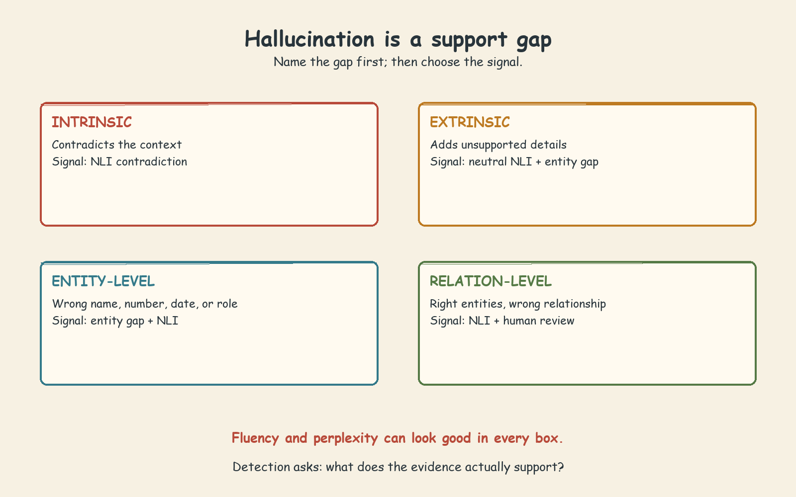
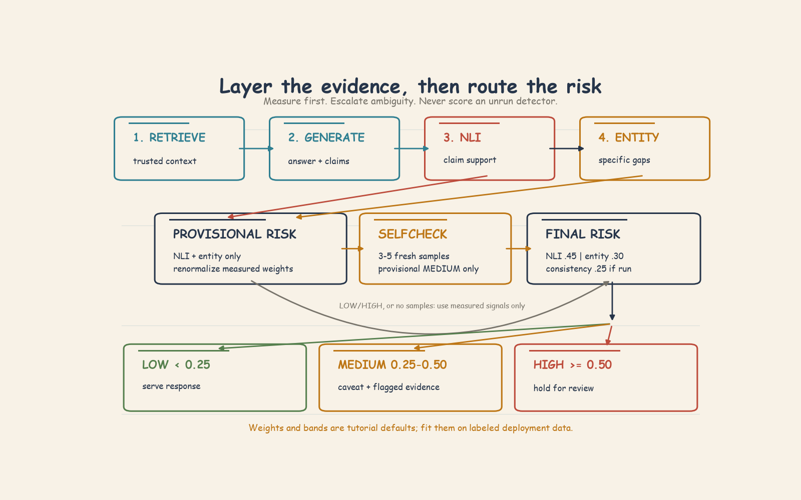

# Hallucination Detection and Factual Grounding

Hallucination is not ordinary bad writing. Relative to a stated evidence boundary, it is a plausible, fluent claim that is unsupported or contradictory and may be false. That boundary matters: in RAG it is usually the retrieved context; in open-domain fact checking it may require external sources. Riverside's editorial assistant described Elena Marchetti as the 2019 Booker Prize winner when she had only been longlisted. The sentence sounded natural, used real entities, and expressed the false relation with confidence. BERTScore, an LLM judge, toxicity, and perplexity all passed it.

The practical lesson is simple: **quality is not factuality**. Similarity metrics ask whether an answer resembles a reference. Perplexity asks whether the wording is fluent or in-domain. A judge can assess coherence and usefulness while sharing the model's lack of ground truth. Hallucination detection asks a different question: **which claims are actually supported?**

## 1. Four Types of Hallucination

Use the smallest useful taxonomy. It tells you what evidence is missing and which detector has a chance of finding it.

| Type | Test | Riverside-style example | Best signal in this chapter |
| --- | --- | --- | --- |
| **Intrinsic** | Does the answer contradict the supplied context? | Calling a colonial-survey cipher a Napoleonic French-spy code | NLI contradiction |
| **Extrinsic** | Does the answer add claims absent from or unverifiable in the context? | Adding quantum entanglement and wireless cloud storage to nanowire memory extraction | Entity gaps and neutral NLI results |
| **Entity-level** | Is a name, number, date, role, or other specific item wrong? | Chief medical officer and 6,000 passengers instead of chief navigation officer and 4,200 colonists | Entity gap plus NLI |
| **Relation-level** | Are real entities connected by the wrong action or relation? | Saying Mnemix copies memories when it overwrites them | NLI plus human review |

These categories can overlap. Elena, the Booker Prize, and 2019 were real, but "won" replaced "was longlisted for." The notebook calls this entity-level hallucination while also showing why relation errors are difficult: most of the sentence can be supported even when the decisive link is false. Treat the taxonomy as a routing aid, not four perfectly separate boxes.

Three properties make all four types dangerous. First, fluency does not imply accuracy; a model can generate smoothly from its training distribution instead of staying constrained by retrieved facts. Second, a model can express invented claims with the same confidence as supported ones. Third, BLEU, ROUGE, BERTScore, and LLM judges inspect output quality rather than independently verifying each claim.

## 2. NLI as Attribution

Natural Language Inference gives a RAG system a direct grounding test. Put the retrieved context in the role of **premise** and each answer claim in the role of **hypothesis**, then read the three-class sequence-pair logits from an NLI model. The NLI relation then has an operational meaning:

- **Entailment:** the context supports the claim.
- **Contradiction:** the context conflicts with the claim, indicating intrinsic hallucination.
- **Neutral:** the context neither confirms nor denies the claim, making it a candidate extrinsic hallucination.

The important shift is from whole-answer resemblance to sentence-level support. Split the answer into scoreable sentences, test each against the context, and calculate the attribution rate:

$$
\text{attribution rate} = \frac{\text{supported answer sentences}}{\text{scoreable answer sentences}}
$$

The notebook's implementation marks a sentence attributed when its support score exceeds `0.45`. It then labels an answer `GROUNDED` at attribution `>= 0.75`, `PARTIAL` from `0.40` up to `0.75`, and `HALLUCINATED` below `0.40`. The corresponding hallucination score is `1 - attribution rate`. These are tutorial rules over equally weighted scoreable sentences, not calibrated probabilities.

The notebook's runnable helper is not a production NLI implementation: it uses a zero-shot-classification wrapper and a single context string as a candidate label, rather than directly scoring the `(premise=context, hypothesis=claim)` pair for entailment, neutral, and contradiction. Treat its output as a pedagogical support proxy. A production evaluator should use direct sequence-pair NLI logits, preserve label mapping, handle long context by retrieval or chunking, and calibrate thresholds on labeled in-domain claims.

Even direct NLI is not a fact-checking oracle. A neutral claim may be true but absent from the retrieved passage. A mostly correct sentence with one wrong relation may appear partially entailed. Truncation can hide supporting evidence. NLI identifies attribution risk; it does not resolve the world's truth.

## 3. Entity Gaps: Point to What Needs Checking

An overall risk score is not enough for an editor. Review becomes faster when the guard can say, "Check this person, date, number, role, or phrase."

Entity-gap detection extracts named entities from the answer, extracts or searches the context, and compares the two sets. Exact case-insensitive matches count as grounded. Fuzzy semantic matches handle paraphrases such as an abbreviation versus a full role name. In the notebook, a similarity of `0.65` is the grounding cutoff. The gap score is:

$$
\text{entity gap} = \frac{\text{answer entities not grounded in context}}{\text{answer entities extracted}}
$$

A score of zero means every extracted answer entity found support; a score of one means none did. The notebook headline says this catches about 60% of entity-level hallucinations, but it does not establish that rate on a held-out labeled set. Do not report it as measured performance. Treat entity gaps as a **candidate generator** whose precision and recall must be measured for the deployed extractor, domain, and retrieval policy.

Entity gaps work especially well for invented organizations, historical periods, technologies, places, and changed quantities. They are weaker when the entities are all correct but the relation is wrong. "Mnemix copies memories" and "Mnemix overwrites memories" share the same named entity. "Elena Marchetti won the Booker Prize in 2019" can reuse every visible entity from the source. The missing evidence is in the verb or relation, so NLI and human review remain necessary. Entity extraction can also miss a relevant phrase or flag a legitimate detail that the retriever failed to return.

## 4. Consistency and Perplexity Are Different Signals

SelfCheckGPT is useful when no trusted context exists. Generate `k` independent high-temperature samples for the same prompt, split the main answer into claims, and compare each claim semantically with the samples. A learned fact should reappear as consistent paraphrases. An unstable invention may change role, event, number, or explanation from one sample to the next.

The notebook demonstrates `k = 5` and classifies consistency below `0.72` as hallucinated. That threshold separates its constructed samples; it is not validated performance. Variability can provide evidence without a reference at inference time, but validation still needs labeled claims. A model may repeat the same memorized falsehood across every sample, so high consistency does not prove truth. Multiple inference passes are also slow, and instability may not identify the exact bad entity. For RAG, contextual attribution is more direct; for context-free generation, consistency is one useful risk signal in this chapter.

Perplexity must not be confused with consistency. Perplexity measures how expected the token sequence is to a language model. Lower perplexity can mean fluent, domain-fitting prose, but fluent hallucinations also use high-probability tokens. Mean token log-probability has length bias, and model probabilities may be miscalibrated. A short false answer can therefore look more confident than a longer correct one. Use perplexity for fluency or domain fit, never as a factuality certificate.

## 5. Compose the Guard in Layers

No single detector covers every failure mode. The notebook combines complementary evidence:

1. **NLI attribution first:** find contradictions and unsupported claims.
2. **Entity gap second:** identify the specific details that need checking.
3. **Compute provisional risk:** combine only the signals already measured.
4. **SelfCheck for ambiguous cases:** generate `3-5` samples for provisional medium risk, then recompute final risk with consistency included.

The notebook's illustrative final composite uses `0.45` weight for NLI hallucination risk, `0.30` for entity gap, and `0.25` for inverted consistency. If samples are unavailable, its code redistributes the SelfCheck weight across measured signals. Do not substitute an estimated SelfCheck value and call it observed evidence. Record which signals ran, renormalize measured weights explicitly, and fit weights and bands on labeled deployment data.

The default triage bands are operational, not universal:

| Composite risk | Verdict | Action |
| --- | --- | --- |
| `< 0.25` | `LOW` | Serve the answer |
| `0.25-0.50` | `MEDIUM` | Add a disclaimer, surface flagged entities, and review as needed |
| `>= 0.50` | `HIGH` | Hold for human review |

The production sketch also routes attribution below `0.40` directly to a flag, and Riverside's delivery rule holds outputs with NLI attribution below `0.40` or entity gap above `0.50`. These are starting thresholds derived from the notebook's examples. Tune them on labeled traffic. Lower thresholds generally catch more hallucinations but create more false alarms; higher thresholds reduce review volume but miss more errors. For author-facing editorial content, the notebook favors recall because a missed factual error costs more than an unnecessary review. Track precision, recall, and F1, but choose the operating point from business consequences.

## 6. Worked Case: Elena Marchetti

**Source fact:** Elena Marchetti was longlisted for the Booker Prize in 2019.

**Generated claim:** "Elena Marchetti won the Booker Prize in 2019 for her debut novel *The Silence of Bridges*."

Start with what does **not** help. The sentence is fluent and plausible, so perplexity can be low. It is semantically close to the source, so BERTScore can be high. A judge without ground truth may rate it strongly. Toxicity is irrelevant.

Now decompose the claim. NLI compares the sentence with the source. Much of the hypothesis is supported, but "won" conflicts with "longlisted," while the novel title may be unsupported. This can reduce attribution or produce a partial result. Entity-gap detection checks Elena Marchetti, Booker Prize, 2019, and the title. The first three may appear grounded, while the title can become a review candidate. The critical won/longlisted error is relational, so an entity list alone may not expose it. If the composite enters the medium band, SelfCheck samples can test whether the model repeats the win consistently or changes the award relation.

The correct outcome is not an automated rewrite. It is `MEDIUM` risk with a visible verification warning and surfaced evidence, preventing the claim from reaching the author unchecked. The case demonstrates why layers matter: each signal sees a different part of the failure.

## 7. Limitations and Failure Modes

- **Retrieval bounds the evidence.** A correct claim absent from the retrieved context can look neutral or ungrounded.
- **Sentence aggregation can hide a small error.** One wrong relation inside an otherwise supported sentence may receive partial support.
- **Entity extraction is incomplete.** It can miss roles or relations and can over-flag legitimate entities.
- **Consistency can be confidently wrong.** A stable memorized falsehood may recur across every sample.
- **Consistency is expensive.** Multiple generations add latency and cost, so the notebook reserves it for ambiguous cases.
- **Perplexity and token confidence are weak factuality signals.** Fluency, length, and calibration distort them.
- **Thresholds move errors rather than eliminating them.** More recall usually means more false positives.
- **The guard narrows review; it does not replace fact-checking.** Relation-level errors can require an external knowledge source and a human decision.

## 8. Practical Rules and Breadth Checklist

1. Separate prose quality from factual support.
2. Score claims or sentences, not only whole answers.
3. In RAG, use retrieved context as the NLI premise.
4. Treat neutral NLI results as candidates, not proof of falsehood.
5. Use entity gaps to annotate what a reviewer should check.
6. Use SelfCheck when context is absent or provisional risk is ambiguous; recompute final risk after it runs.
7. Never use perplexity as a factuality gate.
8. Tune thresholds for the cost of misses versus false alarms.
9. Hold high-risk author-facing content for review.
10. Track high- and medium-risk rates across model versions and run quarterly red-team evaluations.

Before shipping, confirm breadth: intrinsic contradictions, extrinsic additions, wrong entities, wrong relations, correct answers, partially supported answers, no-entity answers, short fragments, long contexts, retrieval omissions, paraphrased entities, unstable hallucinations, and latency-constrained paths. A useful guard is not the detector with the prettiest single score. It is the composition that catches complementary failures, explains its evidence, and sends the uncertain cases to the right human.
