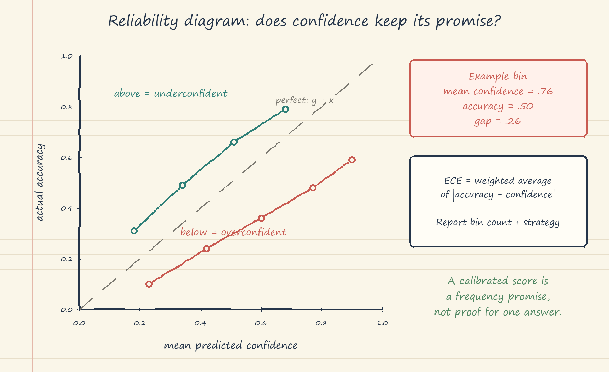

# Calibration and Confidence: Handwritten Theory Notes

## 1. Confidence is not the same thing as correctness

Correctness is an outcome: for one evaluated answer, the answer is correct or incorrect. Confidence is a model-produced score intended to describe uncertainty before that outcome is known. Accuracy summarizes many correctness outcomes. Calibration asks whether confidence scores have the right long-run meaning.

A model is calibrated at confidence $p$ when answers assigned confidence $p$ are correct about a fraction $p$ of the time. Therefore, "80% confident" does not mean the current answer is partly correct, and it does not prove that the current answer is correct. It means that, across a sufficiently large and representative group of answers receiving scores near 0.80, about 80% should be correct.

This distinction matters because a model may be accurate but miscalibrated. It may rank the right answer above alternatives while assigning an unjustifiably extreme probability. Conversely, a calibrated model can still be wrong: even a well-calibrated 0.80 bucket contains about 20% errors. Calibration makes a confidence number interpretable; it does not turn uncertainty into certainty.

The notebook's Palermo example captures the user contract. If editors read "87% confident" as a probability, the system must demonstrate that answers around 87% are right around 87% of the time. Otherwise the number creates false certainty and is worse than a plain warning.

## 2. Where an LLM confidence signal can come from

An autoregressive language model supplies a probability distribution for every next token. For generated tokens $(t_1,\ldots,t_n)$,

$$
P(t_1,\ldots,t_n)=\prod_{i=1}^{n}P(t_i\mid t_{<i}).
$$

Because products become tiny, use the length-normalized mean token log-probability:

$$
\overline{\ell}=\frac{1}{n}\sum_{i=1}^{n}\log P(t_i\mid t_{<i}),
\qquad \mathrm{PPL}=e^{-\overline{\ell}}.
$$

The notebook illustrates converting this signal to a score with a sigmoid and an empirical scale. This is a weak proxy, not a factuality probability. Three caveats must stay attached to it. First, length affects sequence scoring, so a long correct explanation can score below a short wrong sentence. Second, a model can assign high probability to fluent text that is factually false. Third, vocabulary smoothing spreads probability over many plausible continuations. Mean token log-probability may correlate with correctness, but it cannot be displayed directly as calibrated confidence.

Verbalized confidence is another signal: ask an instruction-following model to report a number from 0% to 100%. It can reflect linguistic uncertainty, but it can also be sycophantic, produce 100% to appear helpful, and has no necessary mechanistic link to generation probabilities. The notebook's claim that it calibrates better is demonstrated with simulated scores, not a model comparison. Small models such as GPT-2 are not trained to express reliable uncertainty. Every signal must therefore be checked on a representative calibration set.

## 3. Reliability diagrams

A reliability diagram groups predictions into confidence bins. The horizontal coordinate is mean predicted confidence in a bin; the vertical coordinate is empirical accuracy in that bin. Perfect calibration lies on $y=x$.

- A point below the diagonal means confidence exceeds accuracy: overconfidence.
- A point above the diagonal means accuracy exceeds confidence: underconfidence.
- A point on the diagonal means the bin is calibrated, within sampling noise.

For example, suppose ten answers in the 0.70-0.80 bin have mean confidence 0.76, but only five are correct. The plotted point is $(0.76,0.50)$, below the diagonal, with a 0.26 calibration gap. The diagram shows where the model fails instead of hiding all behavior in one average.

## 4. Expected Calibration Error

Expected Calibration Error, or ECE, compresses the reliability diagram into a weighted average absolute gap:

$$
\mathrm{ECE}=\sum_{b=1}^{B}\frac{|B_b|}{n}
\left|\mathrm{acc}(B_b)-\mathrm{conf}(B_b)\right|.
$$

Here $B_b$ is bin $b$, $|B_b|/n$ is its share of examples, $\mathrm{acc}(B_b)$ is its fraction correct, and $\mathrm{conf}(B_b)$ is its mean confidence. ECE = 0.10 means confidence is off by about 10 percentage points on average under the selected binning scheme.

Tiny example: six predictions form two equal bins. Bin A has mean confidence 0.60 and accuracy $2/3$; Bin B has mean confidence 0.90 and accuracy $1/3$. Then

$$
\mathrm{ECE}=\frac{3}{6}|0.667-0.60|+\frac{3}{6}|0.333-0.90|
\approx 0.317.
$$

The second bin dominates because it is confidently wrong. ECE does not reveal the direction of error because of the absolute value, so always inspect the reliability diagram too.

ECE is sensitive to bin boundaries and sample size. Fewer bins average away local errors and often look optimistic; too many bins make estimates noisy or empty. The notebook compares 5, 10, 15, and 20 equal-width bins. Its statement that 15 bins is standard is not a definition or a universally valid rule. Adaptive equal-mass bins reduce empty-bin sensitivity. Always report the bin count and strategy, include uncertainty when possible, and do not compare ECE values computed with incompatible procedures.

The notebook's 20-question data are simulated demonstrations, not production estimates. Its accuracy, confidence, ECE ranges, and before/after improvements are constructed teaching values. They must not be quoted as GPT-2 measurements or as typical LLM behavior. A deployed estimate needs representative labels, a fixed binning procedure, uncertainty analysis, and slice checks.

## 5. Temperature scaling

Temperature scaling is a one-parameter post-hoc calibration method. Before softmax, divide logits $z_i$ by a positive temperature $T$:

$$
p_i(T)=\mathrm{softmax}(z_i/T).
$$

If $T>1$, the distribution becomes flatter and confidence falls, which addresses overconfidence. If $T<1$, the distribution becomes sharper and confidence rises, which addresses underconfidence. $T=1$ leaves the original probabilities unchanged.

Fit $T$ on a held-out calibration split by minimizing negative log-likelihood:

$$
T^*=\arg\min_{T>0}\left[-\sum_{j=1}^{m}\log p_{y_j}^{(j)}(T)\right].
$$

Then freeze $T^*$ and evaluate it on a separate test set. Never fit and report performance on the same examples. Refit after a model, prompt, decoding policy, domain, or data-distribution change.

Temperature scaling preserves logit ordering because every logit is divided by the same positive number. It therefore does not change which class is preferred or improve accuracy; it changes probability magnitude. The notebook reconstructs a synthetic four-class logit vector from one simulated top-choice confidence and fits on 40% of only 20 examples. Its percentage-reduction headlines and production-style ECE are narrative targets, not measured or transferable results. In a real MCQ system, retain the original class logits, fit $T$ on a calibration split, and report held-out NLL and ECE before and after.

Temperature scaling cannot repair a useless confidence ordering. If wrong answers systematically receive higher scores than correct answers, flattening probabilities will not create discrimination. It also cannot detect unsupported claims. Calibration must be paired with factuality and hallucination checks.

## 6. Selective prediction and risk-coverage

Selective prediction lets the system abstain below a confidence threshold $\tau$. Define

$$
\mathrm{coverage}(\tau)=\frac{\#\{i:c_i\ge\tau\}}{n},
$$

$$
\mathrm{selective\ accuracy}(\tau)=
\frac{\#\{i:c_i\ge\tau\ \text{and correct}\}}
{\#\{i:c_i\ge\tau\}}.
$$

Selective risk is commonly $1-$ selective accuracy. Raising $\tau$ can only reduce coverage, because fewer answers qualify. Accuracy among answered items usually rises only when confidence ordering is informative; it is not mathematically guaranteed to rise at every step. A risk-coverage curve exposes this trade-off over all thresholds.

The notebook's narrative headline and its runnable 90% target are policy examples over simulated data, not achieved service levels. The correct threshold comes from the current model, domain, costs, and validation distribution. Also, temperature scaling is monotone: it changes numeric thresholds but not confidence ranking, so it cannot improve the ideal risk-coverage frontier as a function of coverage. Any apparent frontier change in a coarse threshold grid is a discretization effect.

Do not call the harmonic mean of selective accuracy and coverage ordinary F1 unless it is explicitly defined as a custom utility: coverage is not recall. Report selective risk and coverage directly, or use a cost function tied to the deployment decision.

## 7. Hallucination plus confidence routing

Confidence and hallucination risk answer different questions. Calibration asks, "How often are scores like this correct?" A hallucination guard asks, "Is this answer unsupported, contradictory, or populated with ungrounded entities?" A fluent fabrication may be high-confidence, so confidence alone cannot stop it. A correct but uncertain answer may be grounded yet still deserve a caveat.

Preserve the notebook's gate order and default example rules:

1. If hallucination risk is HIGH, use `HOLD_FOR_REVIEW` regardless of confidence.
2. Otherwise, if calibrated confidence is at least 0.65 and hallucination risk is LOW, use `SERVE`.
3. Otherwise, if calibrated confidence is at least 0.40, use `SERVE_WITH_CAVEAT`.
4. Otherwise use `REFUSE` and direct the user to source material.

MEDIUM hallucination risk therefore receives a caveat even when confidence exceeds 0.65. These thresholds are tutorial defaults, not validated production settings. Log raw score, temperature version, calibrated score, hallucination signals, chosen tier, and reason for auditability.

## 8. Failure modes to remember

- Dataset shift breaks calibration when production questions differ from the calibration set.
- Tiny bins make reliability estimates unstable; broad bins can hide local failure.
- ECE hides direction and worst-case subgroups, so retain diagrams and slice metrics.
- Token confidence rewards fluency and can be biased by answer length.
- Verbalized confidence can be sycophantic or prompt-sensitive.
- Temperature scaling fixes probability magnitude, not answer accuracy, ranking, or grounding.
- A global temperature can hide domain, language, or subgroup-specific miscalibration.
- Threshold tuning on the test set leaks information and produces optimistic results.
- Refusal can concentrate errors or poor coverage on important user groups.
- Showing a percentage without provenance, validation date, and policy meaning invites misuse.

## 9. Business threshold rules

Start with costs, not a favorite confidence number. Define the cost of a wrong served answer, an unnecessary caveat, editorial review, and refusal. Set a minimum precision or maximum selective-risk requirement for each use case, then choose the threshold with greatest validated coverage that satisfies it. High-impact publishing or legal claims should favor review; low-impact brainstorming may favor coverage.

Validate thresholds on representative time-split data and critical slices. Add minimum sample sizes and confidence intervals before declaring a target met. Keep hallucination overrides independent of confidence. Recalibrate after material system changes, monitor ECE and risk-coverage in production, and roll back or tighten routing when drift violates the service promise. The threshold is a business decision informed by technical evidence, not a technical constant.

## 10. Breadth checklist

- Separate correctness, accuracy, confidence, calibration, and factual grounding.
- Name the confidence source: token log-probability, verbalized score, or another model.
- Report accuracy, ECE, bin count, binning strategy, and reliability diagram together.
- Keep calibration and test splits separate; version the fitted temperature.
- Confirm that confidence ranks correct answers above errors before relying on abstention.
- Publish risk-coverage or coverage-accuracy curves, not one threshold alone.
- Evaluate domains, languages, answer lengths, safety classes, and user groups separately.
- Combine confidence routing with NLI attribution, entity-gap, SelfCheck, or equivalent grounding checks.
- Make `SERVE`, `SERVE_WITH_CAVEAT`, `HOLD_FOR_REVIEW`, and `REFUSE` observable and auditable.
- Revalidate after model, prompt, retrieval, decoding, or distribution changes.
- Explain to users that a calibrated percentage is a frequency promise, never proof about one answer.
