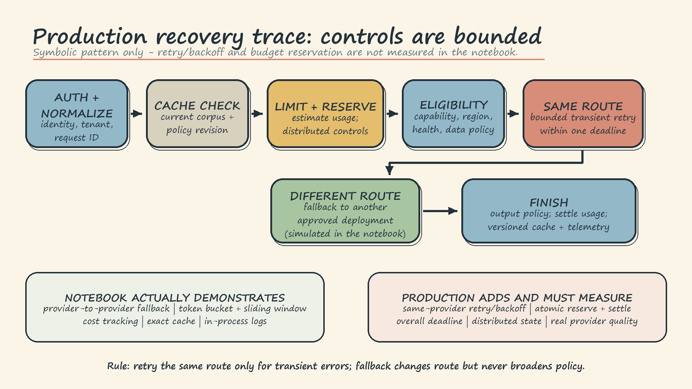

# LLM Gateway Theory: Handwritten Notes

## 1. Mental model and boundary

An LLM gateway is the request control plane between an application and model deployments. The application sends one stable request instead of knowing every provider SDK, quota, or failure shape. The gateway applies policy, chooses an eligible route, performs bounded recovery, normalizes the result, and records the outcome.

It is not an inference server. Continuous batching, GPU scheduling, KV-cache management, and model-serving backpressure remain inside the serving layer. The gateway controls traffic *to* that layer.

The notebook demonstrates this boundary with deterministic mocks. `MockLLMProvider` uses synthetic latency, token cost, and failures; it does not load a transformer, measure model quality, or prove provider reliability. The historical alias `local-llama-8b` is routing metadata, while the simulated deployment metadata selects a SmolLM2 model by hardware. No 8B model is loaded.

## 2. Component flow

**Application -> gateway policy -> cache and limits -> router -> provider adapter -> deployment -> normalized response and telemetry**

Providers disagree about request fields, response nesting, streaming events, token usage, model names, and errors. Each adapter translates the gateway request into its native SDK and returns one contract containing text, provider and pinned model version, token counts, latency, cost, finish status, request ID, and a small error taxonomy. Preserve whether an error is retryable and which deployment handled the attempt. Stable aliases such as `editing-default` separate application intent from deployment configuration.

Routing first filters by capability, context length, region, tenant policy, data sensitivity, and health. It then optimizes only inside that eligible set. Round-robin is reasonable for similar deployments. Weighted routing supports canaries and capacity differences. Latency-aware routing uses recent measurements but needs probes or exploration so an early winner does not monopolize traffic. Cost-aware routing means cheapest *capable* route, never cheapest at any quality.

Least-busy routing chooses the eligible deployment with the smallest in-flight count or queue. It works when service times vary, but queue state must be timely and shared across gateway replicas. Stale counters can send every replica toward the same apparently idle route; capacity weights or hysteresis reduce oscillation.

## 3. Traffic, recovery, and cache controls

Semantic similarity is not semantic equivalence. A word-overlap cache can score `How many chapters does it have?` and `How many chapters does it not have?` above the same threshold. The crude attempt is useful because it exposes the production requirement: stronger embeddings, explicit exclusions, authorization checks, versioned keys, and a threshold calibrated on real traffic.

Routing distributes work; rate limiting bounds it. Production controls commonly combine requests per minute, tokens per minute, concurrent requests, tenant quotas, and provider limits. A token bucket allows a defined burst while limiting sustained traffic. Estimate tokens before dispatch, reject oversized work early, then reconcile with actual usage. Counters must be atomic and distributed; an in-memory limiter protects only one gateway process.

Request limits are not hard spending limits. Reserve estimated cost atomically before dispatch, settle against actual cost afterward, alert near the ceiling, and reject predictably beyond it. Retries and failed attempts can still consume quota and money.

A retry calls the same deployment again; a fallback moves to another deployment. Retry only transient timeouts, connection failures, and selected throttling or server errors. Use a small attempt limit, jittered backoff, per-attempt timeouts, and one overall deadline. Never retry invalid input, policy denial, or deterministic context-length failures. After the retry budget, fall back to an independent, policy-approved deployment. Circuit breakers keep traffic away from a route already known to be unhealthy. The notebook simulates immediate provider-to-provider fallback, not retry backoff, deadlines, or circuit breaking.

Exact caching is safest when the key includes tenant, normalized input, pinned model, generation parameters, corpus version, policy version, and relevant tool state. Apply TTLs and explicit invalidation, isolate tenants, and run current output policy on hits. Do not cache sensitive prompts by default. The notebook's Jaccard word-overlap example only illustrates semantic-cache shape. Production semantic caching needs embeddings, a vector index, and thresholds tested for false reuse, especially around negation and changed context.

## 4. One request timeline

1. Ingress authenticates the caller, assigns a request ID, normalizes parameters, and resolves tenant, safety, region, and data policy.
2. The shared cache checks a complete versioned key. A stale corpus revision cannot satisfy the request.
3. The gateway estimates tokens, checks distributed rate and concurrency limits, and atomically reserves budget.
4. Policy removes ineligible or unhealthy deployments. The configured strategy, such as least-busy, chooses among those remaining.
5. The adapter dispatches within the attempt timeout. A retryable failure may receive a bounded same-route retry while the overall deadline still allows it.
6. If retries are exhausted, fallback tries the next independent approved route. If none succeeds, the gateway returns a clear normalized failure rather than violating policy.
7. On success, the adapter normalizes output and usage. The gateway runs output policy, settles actual cost, caches only an approved response, emits telemetry, and returns.

Operators need the attempt story even though the caller sees one result: routes, cache, limits, budget, retries, fallback position, token usage, latency, cost, safety, and remaining deadline. Trace ingress, gateway, cache, policy, and provider calls; redact prompts, secrets, and personal identifiers. Track tail latency, time to first token, success and rejection rates, cache hits, retry amplification, fallback share, cost per acceptable result, and quality by serving tier.

## 5. Compact production rules and failure modes

- Version and review routing, policy, aliases, and pinned deployment identities; make changes canaryable and reversible.
- If provider failures share a network, region, or upstream model, diversify fallback routes. Do not assume failures are independent.
- If retries raise tail latency or throttling, reduce attempts, honor provider retry guidance, and prefer circuit breaking or fallback.
- If least-busy oscillates, fix shared queue visibility and add capacity weights or hysteresis.
- If the cheapest route misses quality requirements, remove it from eligibility. Transport success is not answer quality.
- If cache hits are stale or semantically wrong, version more inputs, shorten TTL, narrow the domain, raise the similarity threshold, or return to exact matching.
- If normal users are throttled, revisit capacity and scope. If bursts pass untouched, tighten burst and concurrency controls.
- If spend exceeds limits despite request caps, use atomic budget reservation and reconciliation.
- If success rises while complaints rise, segment quality, latency, cost, and fallback share by the deployment that actually answered.
- Validate with live traffic before claiming provider behavior, Azure policy behavior, reliability, quality, or savings. The notebook proves only its deterministic simulation.
