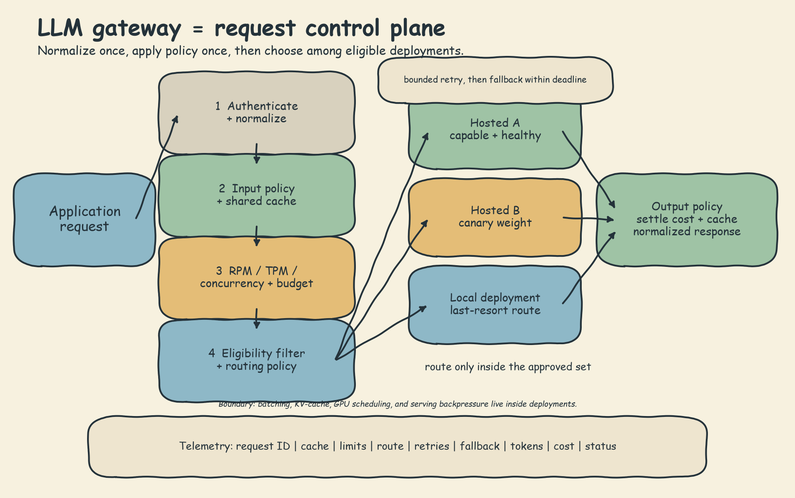

# LLM Gateway Theory: Handwritten Notes

## 1. The mental model

An LLM gateway is the request control plane between an application and a set of model deployments. The application should not need to know which provider SDK is used, which deployment is healthy, or which team has exhausted its budget. It asks for a completion through one contract. The gateway applies policy, chooses a route, handles bounded recovery, and records what happened.

The gateway is not the model server. It does not replace continuous batching, KV-cache management, GPU scheduling, or serving backpressure. Those belong inside the inference-serving layer. The gateway controls traffic *to* deployments.

The notebook teaches this control plane with deterministic simulations. `MockLLMProvider` does not load a transformer or measure model quality. Its latency, token cost, and failures are synthetic so routing behavior is reproducible. The local alias `local-llama-8b` is historical routing metadata; the concrete simulated deployment metadata selects a SmolLM2 model by hardware. No 8B model is loaded.

## 2. Normalize before optimizing

Providers disagree about request fields, response nesting, token usage, errors, streaming events, and model names. If every application call site understands those differences, adding a provider multiplies integration code and makes routing almost impossible.

The gateway therefore defines a normalized provider contract. Conceptually, the input contains messages or a prompt, generation parameters, tenant identity, and request metadata. The normalized result contains text, provider and model identity, input/output token counts, latency, estimated cost, finish status, and a request ID. Provider adapters translate native SDK objects into that shape and native exceptions into a small error taxonomy.

Normalization is more than renaming fields. The contract must preserve facts needed by later controls: whether an error is retryable, which deployment answered, which model version ran, whether output was streamed, and how usage was billed. Do not erase provider detail that policy or telemetry needs.

Stable aliases separate application intent from deployment identity. An application can request `editing-default`; configuration can map that alias to a local model today and a hosted deployment tomorrow. Pin the concrete model version in reviewed configuration so a provider-side alias change does not silently change behavior.

## 3. Routing and load balancing

Routing answers: "Which eligible deployment should receive this request now?" Eligibility comes first. Filter by required capability, region, tenant policy, data sensitivity, context length, and health. Optimize only inside that approved set.

- **Round-robin** takes turns. It is simple and fair when deployments are similar, but it ignores congestion and health.
- **Least-busy** chooses the smallest in-flight count or queue. It improves throughput when service times vary, provided queue state is current and shared.
- **Latency-aware** uses recent measurements, often an exponential moving average. A low smoothing factor is stable but slow to react; a high factor reacts quickly but follows noise. It needs exploration or health probes, otherwise an early winner can receive traffic forever.
- **Cost-aware** chooses the cheapest *capable* deployment. Price alone cannot determine capability or answer quality. The notebook implements the cheapest rule but leaves capability classification out of scope.
- **Weighted routing** sends configured proportions to deployments. Use it for canaries, capacity matching, and rollback-friendly model changes. A static weight is not a health policy.

One strategy rarely serves every path. Interactive editing may prefer low latency; background tagging may prefer low cost; sensitive manuscripts may require local-only routing. Keep policy explicit and versioned rather than hiding it in call-site conditionals.

## 4. Rate limits, concurrency, and budgets

Routing distributes work; it does not bound work. A runaway batch can still saturate the cheapest route.

A token bucket stores burst allowance and refills at a steady rate. Capacity controls the allowed burst; refill rate controls sustained throughput. A sliding window enforces a stricter maximum in every rolling interval. Production gateways usually need several axes at once: requests per minute, tokens per minute, concurrent requests, per-user or per-team quotas, and provider-specific limits.

Estimate tokens before dispatch so an oversized request can be rejected before consuming provider capacity. Reconcile the estimate with actual usage afterward. Keep distributed counters atomic across gateway replicas; an in-memory limiter protects only one process.

Rate limits are not hard budgets. Ten cheap calls and ten expensive calls consume the same request count. Reserve an estimated dollar amount atomically before dispatch, settle it against actual cost after the response, alert before the ceiling, and reject predictably after it. Size all limits from observed normal and burst traffic. A limiter should be nearly invisible during ordinary use and restrictive during the failure pattern it exists to contain.

## 5. Fallback is not retry

A retry calls the same deployment again after a transient failure. A fallback moves to a different deployment. The notebook's simulated chain implements fallback only: on `ProviderError`, it immediately tries the next provider. Its simple multiplicative reliability calculation assumes independent failures. Shared networks, shared regions, shared upstream models, or one bad request can make failures correlated, so production reliability must be measured rather than inferred from multiplication alone.

Retry only errors likely to be transient, such as selected timeouts, connection resets, and some 429 or 5xx responses. Do not retry invalid input, policy denial, or deterministic context-length errors. Use a small maximum, jittered exponential backoff, a per-attempt timeout, and one overall request deadline. Retries consume latency, tokens, provider quota, and possibly money. They can amplify an outage.

After bounded retries, fall back to an independent, policy-approved deployment. A circuit breaker stops repeatedly testing a route already known to be unhealthy; the notebook names this pattern but does not implement it. Track fallback position because "a response arrived" may hide slower or weaker service. Reliability and quality are separate axes.

## 6. Caching without lying

Exact-match caching is the safest first step for repeated, deterministic requests. A hit avoids routing and provider cost, but only if the cache key represents every input that can change the answer. Include tenant, normalized prompt or messages, model and version, generation parameters, retrieval corpus version, policy version, and any tool state that affects output. Use a TTL and explicit invalidation when source content changes.

Do not cache sensitive prompts by default. Do not share entries across tenants unless isolation and authorization are proved. Decide whether nondeterministic generations are cacheable. Run output safety checks on cached responses too; policy may have changed since the entry was written.

Semantic caching matches similar prompts rather than identical strings. The notebook illustrates the shape with Jaccard word overlap. That is a toy stand-in, not a meaning-aware production cache. A real design uses embeddings, a vector index, and a threshold tuned against false-hit cost. Even embeddings can confuse negation, changed context, or nearby questions with different answers. Measure false reuse, not just hit rate.

## 7. Cost and telemetry are part of correctness

Every request needs one traceable story. Record request ID, tenant or scoped key, policy/config version, cache result, limiter and budget decisions, chosen route, retry count, fallback position, provider/model version, input/output tokens, latency, estimated and actual cost, safety decisions, and final status. Redact prompts, secrets, emails, phone numbers, and identifiers before export.

Useful aggregates include p50/p95/p99 latency, time to first token for streaming, success rate, rate-limit rejection rate, cache hit rate, cost per successful request, tokens per task, retry amplification, fallback share, and quality by serving tier. A 100% success dashboard can still hide that 30% of requests were answered by a last-resort model. Cost per request can fall while cost per *successful, acceptable* answer rises.

Flat in-process logs and notebook dashboards demonstrate the fields, not distributed tracing. Production needs spans across ingress, gateway, cache, policy services, and provider calls, with retention and access controls.

## 8. The composed request lifecycle

Order cheap and decisive checks before expensive work:

1. Authenticate the caller and resolve tenant policy.
2. Validate and normalize the request; assign a request/trace ID.
3. Run input safety and data-routing checks.
4. Build the full cache key and check the shared cache.
5. Estimate tokens; atomically check RPM/TPM/concurrency and reserve budget.
6. Filter eligible, healthy deployments; route inside that set.
7. Dispatch with per-attempt timeout and overall deadline.
8. Retry only a bounded transient failure; then fall back if policy allows.
9. Normalize the response, settle actual usage/cost, and run output safety.
10. Cache only an approved response, emit telemetry, and return.

Some systems rate-limit cache hits because gateway CPU and abusive traffic still matter; others let trusted cache hits bypass provider quotas. That is a policy decision, not a universal ordering rule. The notebook's composed simulation checks cache before its token bucket.

## 9. Symbolic production trace

Follow one manuscript request without pretending the notebook measured production timing or spend:

1. Ingress authenticates the scoped caller, creates a request ID, normalizes parameters, and applies tenant data policy.
2. The shared cache misses because the current corpus revision is part of the key; an older revision cannot be reused.
3. The gateway estimates usage, checks distributed limits, and reserves budget. The mock notebook rate-limits requests and tracks cost, but it does not implement this hard reservation.
4. Policy removes ineligible regions and capabilities before a routing strategy chooses among healthy deployments.
5. A selected deployment returns a retryable failure. A production gateway may retry the same deployment within a fixed attempt and deadline budget. The notebook does not implement this retry/backoff step.
6. After the retry budget is exhausted, fallback moves to a different approved deployment. This provider-to-provider move is the recovery mechanism the notebook actually simulates.
7. On success, the gateway normalizes output, runs output policy, settles actual usage, caches only an approved version-keyed response, and emits telemetry.

Failed work still consumes deadline, quota, and possibly money. The caller may see one normalized response; operators must see every attempt, retry delay, fallback position, final model, usage, cost, and remaining deadline. If no eligible route succeeds, return a clear failure rather than violating policy.

## 10. Failure modes and production decision rules

- If provider failures share a region or network, diversify the fallback chain; do not assume independence.
- If retries increase p99 latency or 429 volume, reduce retry count, honor `Retry-After`, and rely on circuit breaking or fallback.
- If the cheapest route fails quality checks, remove it from the eligible set; "cheapest capable" is the rule.
- If least-busy oscillates, improve shared queue measurements and add hysteresis or weighted capacity.
- If cache hits return stale facts, version the corpus/policy/model in the key and shorten TTL; do not merely lower provider temperature.
- If semantic-cache false hits are costly, raise the threshold, narrow the cache domain, or return to exact matching.
- If ordinary users are throttled, capacity is too small or limits are scoped incorrectly. If bursts pass untouched, the controls are too loose.
- If spend can exceed a ceiling despite RPM limits, add atomic budget reservation and reconciliation.
- If "success" rises while complaints rise, segment quality, latency, and fallback share by the provider that actually answered.
- If no healthy eligible route remains, fail clearly within the deadline. Do not silently violate region, privacy, or capability policy.

## 11. Final breadth checklist

- [ ] One normalized request, response, usage, and error contract
- [ ] Stable aliases mapped to pinned model/deployment versions
- [ ] Eligibility filters before cost, latency, or load optimization
- [ ] Round-robin, load-aware, latency-aware, cost-aware, or weighted policy chosen per workload
- [ ] Distributed RPM, TPM, concurrency, tenant quota, and hard-budget controls
- [ ] Per-attempt timeout, overall deadline, bounded transient retries, and jittered backoff
- [ ] Independent fallback routes, monitored fallback position, and circuit-breaker plan
- [ ] Shared cache with tenant/model/parameters/corpus/policy version in the key
- [ ] Explicit TTL, invalidation, sensitivity, and semantic false-hit rules
- [ ] Request IDs, redaction, traces, token usage, cost, cache, retry, fallback, safety, and status telemetry
- [ ] Quality measured by serving tier, not inferred from transport success
- [ ] Routing and policy configuration versioned, reviewed, canaried, and reversible
- [ ] Live validation completed before making Azure, provider, reliability, or cost claims

The notebook implements and measures the central ideas with mocks, illustrates semantic caching with lexical overlap, and includes a disabled production-shaped adapter. It does not prove live provider behavior, Azure policy behavior, deployment reliability, model quality, or production savings. Those require real traffic, real infrastructure, and measured evidence.
