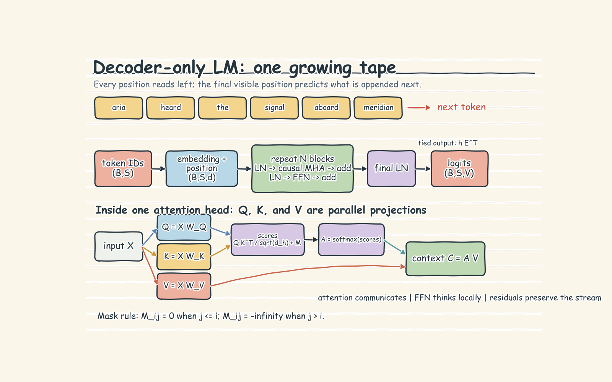

# Decoder-Only Language Models: Handwritten Theory Notes

## 1. The one-tape mental model

A decoder-only language model uses one sequence for both the prompt and its continuation. Think of it as a **reader and writer sharing one growing tape**. It reads the tokens already present, predicts one next token, appends that token, and repeats.

`aria heard the signal aboard meridian`

The key rule is **future-blind, not context-free**. A token may use itself and every token to its left, but nothing to its right. During training, the complete sentence is available to the training system, so a causal mask enforces this rule. During generation, future tokens do not exist yet, so the same rule happens naturally.

The notebook uses one word per token to keep the example readable. Real tokenizers usually split text into subwords. That changes sequence length, but not the next-token task.

## 2. Shapes and the decoder block

For batch size `B`, sequence length `S`, model width `d`, and vocabulary size `V`:

```text
token IDs          (B, S)
embeddings + position
hidden states      (B, S, d)
output logits      (B, S, V)
```

Token embeddings carry token identity; positional information carries order. Each decoder block then has two main stages:

1. **Masked multi-head self-attention** lets each position gather useful information from visible earlier positions. Different heads can focus on different relationships.
2. **Feed-forward network** transforms each position's features after attention has mixed context.

Layer normalization stabilizes feature scales. Residual connections add each stage's result back to the existing stream, preserving useful information and helping gradients move through deep stacks. Repeating the block makes representations increasingly contextual: the final position can summarize information accumulated through earlier positions and layers.



## 3. Causal masking and shifted labels

Attention normally compares every query position with every key position. The causal mask blocks the upper-right part of that comparison table. Row 0 can use only token 0; row 1 can use tokens 0 and 1; the final row can use the whole visible prefix. Blocked scores receive zero probability after softmax.

Training labels are the same sequence shifted by one position:

```text
tokens:   aria  heard  the     signal
inputs:   aria  heard  the
targets:  heard the    signal
```

So the logits after `aria` are judged against `heard`, the logits after `aria heard` against `the`, and so on. One sequence supplies several supervised lessons. The causal mask is essential because it stops the representation at each input position from seeing its target in advance.

The causal next-token loss is

$$
\mathcal{L}=-\frac{1}{N}\sum_i \log p_\theta(t_{i+1}\mid t_{\le i}).
$$

Here `N` is the number of valid target positions, `i` is a position, `t` denotes tokens, and `p` is the probability assigned by model parameters `theta`. Padding positions must be hidden from attention where appropriate and excluded from this average.

## 4. Training versus generation

Training is parallel across positions. The full known sequence enters once, producing all position logits together. The shifted targets produce one loss value per valid position; those values are averaged, backpropagated, and used for one optimizer update. Teacher forcing is efficient because the correct earlier tokens are already known.

Generation is serial because the next input depends on the model's previous choice:

```text
prompt -> logits at last position -> choose token -> append
	-> new longer prefix        -> choose token -> append ...
```

The loop stops at an end token, a length limit, or another stopping rule. Only the last-position logits are used to choose each new token, even though all visible positions participate in the forward pass.

## 5. Temperature and top-k

Greedy decoding always chooses the highest-logit token. Sampling instead draws from the probability distribution. Temperature changes its sharpness:

$$
p_T=\operatorname{softmax}(z/T).
$$

Here `z` is the next-token logit vector, `T` is temperature, and `p_T` is the adjusted distribution. Lower `T` makes high-scoring tokens more dominant; higher `T` spreads probability more evenly. Top-k sampling first keeps only the `k` highest-scoring candidates, then samples among them. It blocks very unlikely tokens, but a small `k` can also discard a good long-tail choice.

## 6. KV cache versus recomputation

The notebook's simple generation loop recomputes the entire prefix after every appended token. That is clear but wasteful: earlier tokens have not changed, so their attention keys and values are repeatedly rebuilt.

A KV cache stores each layer's earlier key and value vectors. For a new token, the model computes only that token's new query, key, and value, attends over the cached history, and appends the new key and value. The cache grows with the sequence and uses memory to save repeated computation. It stores per-layer keys and values, not final token predictions. With the same arithmetic and token choices, caching is an optimization and should preserve the prediction distribution.


## 7. Failure modes

- **Future leakage:** masking the wrong triangle gives unrealistically good training results and poor generation. Confirm that position `i` cannot read any position after `i`.
- **Shift errors:** logits at position `i` predict position `i + 1`, not the current token. Print a tiny input-target alignment before training.
- **Padding contamination:** padded keys can distort attention, and padded targets can distort loss. Apply padding masks and ignore invalid targets.
- **Training-generation confusion:** training may score all positions in parallel; generation must feed each selected token back into the next step.
- **Compounding errors:** a weak sampled token becomes context for later predictions. Temperature, top-k, and stopping rules affect how quickly generation drifts or repeats.
- **Context overflow:** tokens outside the supported window cannot be attended to. Truncate, chunk, retrieve relevant text, or use a longer-context model.
- **Cache mistakes:** preserve every layer's key/value order and invalidate the cache if the prefix or model state changes.
- **Over-reading attention:** an attention weight shows where one head looked, not the model's complete reasoning. Values, residual paths, feed-forward stages, and later layers also shape the result.
