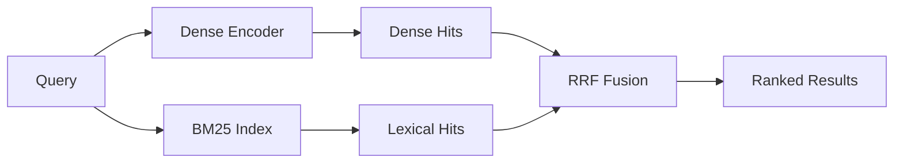

# GenAI Notebooks — Authoring Guide

> **Gold standard (mechanistic depth)**: [02-transformers/transformers.ipynb](02-transformers/transformers.ipynb)
> **Gold standard (narrative framing)**: [04-llm/01-llm-finetuning-data-techniques-pytorch.ipynb](04-llm/01-llm-finetuning-data-techniques-pytorch.ipynb)
> through [04-llm/03-llm-finetuning-comparison-and-decision-pytorch.ipynb](04-llm/03-llm-finetuning-comparison-and-decision-pytorch.ipynb)
> (a 3-part series -- data-based techniques, parameter-based techniques + QLoRA/quantization, and the
> head-to-head comparison/decision)
> Every notebook under `learning/genai/` should be brought to the same pedagogical flow,
> intuition-building, and technical depth as these notebooks. This guide extracts the
> reusable patterns so they can be applied consistently across the folder. Section 8 covers
> the narrative/business-framing techniques specifically; Sections 1-7 cover the
> mechanistic "prove, don't assert" techniques common to both. Section 9 covers code-clarity
> patterns (walkthrough cells, comparison grids, animations); Section 10 covers keeping a
> long, repeatedly-edited notebook navigable and internally consistent (TOC, legends,
> progressive disclosure, cross-reference hygiene). Section 11 covers introducing a
> competing/alternative technique purely for contrast, without training it to completion.
> Section 12 covers enumerating a chapter's full topic space *before* writing or enhancing
> content, so coverage gaps are deliberate and visible, never accidental.

This is not a generic "notebook style guide." It is a distillation of *why* the gold
standard notebook works as a teaching artifact, written so the patterns can be copied
deliberately rather than imitated by vibes.

---

## 1 · Core Philosophy

The gold standard notebook treats every concept as something the reader should be made
to **want** before it is given to them. Nothing is asserted; almost everything is
**measured, shown, or proven** with code and a plot. The reader is walked through the
same sequence of curiosity → crude attempt → complaint → refinement → payoff that a
person discovering the idea for themselves would experience.

Three non-negotiable habits fall out of that philosophy:

1. **Don't assert — demonstrate.** Every claim ("residuals help gradient flow",
   "multi-head lets heads specialise", "√dₖ prevents saturation") is followed by a code
   cell that measures the effect and prints/plots the number that proves it.
2. **One running example, threaded throughout.** A single toy sentence
   (`"the cat sat on the mat"`) and a single 3D "semantic space" embedding scheme carries
   every concept from tokenisation to GPT-2 internals. New mechanisms are always shown
   operating *on the same tokens* the reader already knows.
3. **Toy first, real second, same code.** Every mechanism is built by hand in a tiny,
   visualisable space (3 dimensions, 6 tokens) *before* the notebook shows the identical
   mechanism running inside a real pretrained model (DistilGPT-2). The bridge cell is
   always explicit: "same Q/K/V, same softmax(QKᵀ/√dₖ) — just wider vectors."

If a candidate notebook skips straight to "here is the formula, here is the code," it is
not at parity with the gold standard, no matter how correct the code is.

---

## 2 · Structural Skeleton

Reuse this shape when restructuring a notebook. Not every notebook needs every part —
adapt to the topic — but the *skeleton logic* (motivate → build small → prove → scale →
summarise) should survive.

| Block | Purpose |
|---|---|
| **Title + roadmap table** | One Markdown cell: title, one-paragraph pitch, and a `\| Step \| Concept \| Key Idea \|` table listing every part of the notebook in order. This is the reader's map — written *last*, after the notebook is finished, so it's accurate. |
| **Setup cell(s)** | A dependency-install cell that only installs what's missing (`try: import X except ImportError: pip install`), then one imports+seeding cell. Deterministic seeds (`np.random.seed`, `tf.random.set_seed`) are set once, up top. |
| **Part 1 — establish the substrate** | Define the running example: vocabulary, embeddings, or dataset. Explain *why* the toy space has the dimensionality/shape it does (e.g. 3D axes each mean something human-readable). |
| **Parts 2..N — one mechanism per part** | Each part = one Markdown "why do we need this" cell → one or more code cells that build/visualise/prove it → a short reflection cell ("What just happened — and what's missing") that creates the crack the *next* part will pry open. |
| **Toy → real bridge** | A comparison table (toy dims vs. GPT-2/production dims) and then the same mechanism run against a real pretrained model. |
| **Exercises** |  "Your turn" cells scattered after the concepts they exercise, not bunched at the end. |
| **Summary** | A final Markdown cell: the roadmap table again but completed, plus a bulleted "Key insights to keep" list — each bullet is a one-line, quotable takeaway, not a restatement of the section title. |

---

## 3 · Markdown Cell Conventions

- **Section headers** use `## Part N — Title` for major sections, `### Na. Subtitle` for
  subsections (letters for sub-steps within a numbered part: `3a`, `3b`, `3d`…).
- **Horizontal rules (`---`)** open every new major Part.
- **Tables over prose** whenever comparing ≥2 things (RNN vs Transformer, toy vs GPT-2,
  Encoder vs Decoder vs Encoder-Decoder). Tables are skimmable; paragraphs are for the
  one idea that can't be tabulated.
- **Math is always followed by a plain-English gloss** within the same or next cell —
  never leave a LaTeX block to speak for itself. Example pattern:
  > $$\text{Attention}(Q,K,V) = \text{softmax}(QK^T/\sqrt{d_k})\,V$$
  > "The √dₖ scaling prevents dot-products from growing so large that softmax saturates…"
- **Recurring emoji callouts** — reuse these exact markers, they are load-bearing
  signposts a returning reader will pattern-match on:
  - ` Predict first` — pose a concrete, falsifiable question *before* the reveal cell.
    Always phrased so the reader can be wrong (e.g. give 2–3 candidate outcomes).
  - ` Your turn — <topic>` — a change-one-variable-and-predict exercise, placed
    immediately after the concept it drills, with an inline `#  CHANGE ...` comment
    in the code cell telling the reader exactly what knob to turn.
  - `#### What just happened` / `#### So they differ — but…` — a short reflective
    cell after a reveal that (a) names what was just shown and (b) plants the question
    the next part answers. This is the "complaint that forces the next step."
  > **Plain-text equivalents are acceptable.** The mechanistic notebooks (`02-transformers/`,
  > `04-llm/`) consistently use plain-text `#### Predict first` / `#### Your turn — ...`
  > headers and `#### What just happened — and what's missing` cells rather than the emoji
  > forms. Both implementations fulfil the same pedagogical role. The emoji form is
  > preferred for new notebooks (easier to pattern-match when skimming), but the plain-text
  > form is not a deficiency — it's an established, consistent practice within this track.
- **"Predict, then verify" cadence**: a  cell is never immediately followed by the
  answer in the same cell — the reader must run code to find out. Don't spoil it in the
  markdown.
- **Numbered comparison callouts** ("Problem 1 — …", "Problem 2 — …") when motivating why
  a design choice (e.g. cross-attention) beats a naïve alternative.

---

## 4 · Code Cell Conventions

- **Section-banner comments**: every code cell opens with
  `#  Short Description ` to visually chunk
  the notebook when skimming source. Sub-comments below explain *why*, not just *what*
  (`# The √dₖ scaling prevents softmax saturation`, not `# divide by sqrt`).
- **Print statements are part of the pedagogy, not debug noise.** Every demo cell ends
  with a few `print()` lines that state the takeaway in words, often with a `→` or `->`
  arrow leading into the conclusion:
  ```python
  print("  → A single head serves ONE relation well, never both.")
  print("  → Concatenating [Head P ; Head C] delivers BOTH targets in parallel.")
  ```
  A reader who only reads output (no plots) should still get the point.
  For example, the "predict then verify" exercises should print whether the actual
  outcome matched the prediction to give closure and check understanding.
- **Claims get measured.** If a paragraph says "residual connections keep gradients
  alive," the very next cell builds the smallest experiment that produces a number
  proving it (e.g. 24-layer stack, with/without skip, gradient norm at layer 1,
  log-scale plot). Avoid hand-waved assertions with no accompanying measurement.
- **Visualisation stack**: `matplotlib` + `seaborn` heatmaps (`sns.heatmap` with
  `annot=True`) for anything matrix-shaped (attention weights, masks); `plotly`
  `Scatter3d` for interactive 3D with a `HAS_PLOTLY` try/except **matplotlib fallback**
  so the notebook still runs without the optional dependency; `FuncAnimation` +
  `HTML(ani.to_jshtml(default_mode="loop"))` for anything that unfolds over steps
  (attention forming, RoPE rotating). Animations `plt.close(fig)` before returning the
  HTML to avoid a duplicate static frame.
- **Multi-panel figures** (`plt.subplots` or `plt.GridSpec`) for anything with a
  before/after or A/B/C comparison — never make the reader mentally diff two separate
  cells' output when they can be side by side.
- **Hardware-capability graceful degradation.** The `HAS_PLOTLY` fallback above (degrade to
  matplotlib when an optional *package* is missing) has a hardware-capability analogue seen
  throughout `learning/ai-infrastructure/`: a benchmarking cell checks for a GPU and, when absent,
  substitutes a different *measurement API* entirely (not just a different plot) — e.g.
  `torch.cuda.max_memory_allocated()` vs. Python's `tracemalloc` for peak-memory profiling, or a
  measured bandwidth number vs. a literature-reference number printed side by side. Apply the same
  rule as the optional-dependency case: the notebook must still run and teach the same lesson
  without the hardware, with the fallback path clearly labeled as reference/estimated data rather
  than a real measurement.
- **External trace-file export for profiler visualization.** When a cell produces an artifact meant
  to be opened in an external tool rather than rendered inline (e.g. `torch.profiler`'s
  `prof.export_chrome_trace(path)`), print the saved file's path and the external viewer to open it
  in (`chrome://tracing`, `ui.perfetto.dev`) immediately after saving — this hands the reader off
  cleanly to production-grade tooling the notebook can't replicate inline.
- **Gantt-chart/timeline bars for scheduling or resource-utilization comparisons** (batch
  scheduling, pipeline stages, GPU slot occupancy): one row per resource/lane, one colored segment
  per unit of work, with idle/wasted time shown as a distinctly shaded (e.g. grey, hatched) segment
  — rather than a line or bar chart of aggregate utilization percentages. This makes *where* idle
  time occurs visible, not just how much exists.
- **Deterministic seeding** (`tf.random.set_seed(N)` / `np.random.seed(N)`) immediately
  before any cell whose numbers are quoted in the surrounding markdown, so re-running
  the notebook reproduces the exact prose.
- **Small, real classes, not black boxes.** `MultiHeadAttention`, `FeedForward`,
  `TransformerBlock`, `CrossAttention` are hand-written PyTorch `nn.Module` subclasses a reader can read
  top-to-bottom in under a minute — never an opaque library call standing in for the
  concept being taught.
- **Naming mirrors the math.** Variables are `W_Q`, `Q`, `K`, `V`, `d_k`, `attn_w` — not
  `weight1`, `out`, `x2`. The code should be legible against the LaTeX above it.

---

## 5 · Pedagogical Techniques Worth Copying

1. **"Build it crude, then let the complaint drive the next version."** The RoPE
   animation section (3d) is the clearest example: Attempt 1 (one dial) is deliberately
   too primitive, the cell's own printed output states the complaint
   ("a real query vector has 3 pairs… I want more"), and the next cell fixes exactly
   that gap. Use this instead of dropping the reader into the polished final artifact.
2. **"Prove the claim, don't state it."** Multi-head specialisation, W_V as a relevance
   filter, residual connections enabling depth, √dₖ preventing saturation — every one of
   these is validated with a tiny constructed experiment and a printed/plotted number,
   not a sentence of assertion.
3. **Toy/real parity table.** Before touching a real pretrained model, show a table
   mapping every toy hyperparameter to its production equivalent (`d_model: 3 → 16 → 768`,
   `heads: — → 2 → 12`). This is what makes "if you understood the toy, you understand
   GPT-2" a credible sentence instead of a platitude.
4. **Same weights, one variable changed.** When comparing two behaviors (encoder vs.
   decoder mask, RoPE vs. no RoPE), reuse the *same* learned/random projections and only
   flip the one variable under test. Side-by-side heatmaps generated this way isolate
   the causal factor cleanly — comparisons across differently-seeded models are avoided
   because they conflate multiple differences.
5. **Reflection cells that plant the next question.** Almost every part ends with a
   short Markdown cell naming what's missing or what a sharp reader would object to,
   which becomes the hook for the next part's opening paragraph.
6. **Exercises are drills, not new content.**  cells never introduce a new concept —
   they let the reader turn a knob (`my_query`, `n_heads`, `DEPTH`, `USE_ENCODER_MASK`)
   on a mechanism already explained, with an explicit prediction prompt and a printed
   correctness check where feasible.
7. **A running "Summary" table that mirrors the intro table.** The notebook opens with a
   roadmap table and closes with the same table restated as a completed journey, plus a
   short list of quotable one-line insights (not restated headings).
8. **Impossibility claims get a formal proof, paired with a brute-force empirical drill.** When a
   notebook's claim is negative ("no linear classifier can solve XOR"), a numeric experiment alone
   is unconvincing — a reader can always wonder if a different seed or a smarter search would have
   found a working boundary. Pair a plain algebraic proof by contradiction (printed step-by-step,
   not left to a footnote) with a companion "Your turn" cell that brute-force searches many random
   parameterizations (e.g. 1000 random linear boundaries) and counts successes, letting the reader
   empirically re-verify the impossibility claim and generalize it to related cases (e.g. swapping
   in AND/OR/NAND labels, which ARE separable) without redoing the algebra by hand.

---

## 6 · Checklist — Is a Notebook At Parity?

Use this when auditing or authoring a `plan.md` for a candidate notebook:

- [ ] Opens with a title + roadmap table pitching the whole notebook in one screen.
- [ ] Has a single running example/task threaded through every section (not a new
      dataset or sentence per part).
- [ ] Every non-trivial claim is followed by code that measures/proves it, not just
      states it.
- [ ] Uses  "Predict first" before any reveal that has a non-obvious answer.
- [ ] Has  "Your turn" exercises placed near the concept they drill, with a
      `#  CHANGE ...` comment and (where possible) a printed correctness check.
- [ ] Reflection cells ("What just happened", "So — but…") close each part and open a
      crack for the next.
- [ ] If a mechanism has a toy and a real-world form, both are shown, bridged by an
      explicit parameter-mapping table.
- [ ] Math is never left un-glossed; every formula has a plain-English explanation
      within the same or the next cell.
- [ ] Visualisations favor heatmaps/multi-panel comparisons over single unremarkable
      plots; optional interactive (plotly) visuals degrade gracefully to matplotlib.
- [ ] Code cells use section-banner comments, math-mirroring variable names, and
      pedagogical print statements (not silent computation).
- [ ] Ends with a completed roadmap table + a short "Key insights to keep" bullet list.
- [ ] Seeds are set deterministically wherever quoted numbers appear in markdown.

---

## 7 · How This Guide Is Used

Each notebook under `learning/genai/` (other than the gold standard itself) should have
a companion `plan.md` in its own folder, written against this checklist, that:

1. Summarises the notebook's current state (topic, structure, what pedagogy already
   exists).
2. Scores/flags it against Section 6's checklist.
3. Lists concrete, ordered changes (add a  cell here, add a toy→real bridge there,
   replace an assertion with a proof, restructure into numbered Parts, etc.) needed to
  reach parity with [02-transformers/transformers.ipynb](02-transformers/transformers.ipynb)
   and, where the notebook has a real-world use case to motivate, the [04-llm/01-llm-finetuning-data-techniques-pytorch.ipynb](04-llm/01-llm-finetuning-data-techniques-pytorch.ipynb) series.
4. Is scoped to that notebook only — it should not require changes to other notebooks.

---

## 8 · Narrative & Business-Stakes Framing (from the `04-llm/01-llm-finetuning-*.ipynb` series)

Sections 1-7 describe how to build *intuition* for a mechanism. This section describes a
complementary technique: giving the reader a reason to *care* which technique wins, by binding
the entire notebook to one concrete, named scenario with real constraints instead of a neutral
tour of options. The `04-llm/01-llm-finetuning-*.ipynb` 3-part series is the reference example -- a
small publishing firm, "Riverside House," wants an in-house editing assistant and knowledge base
trained on its own unpublished manuscripts, on a laptop CPU, with no data allowed to leave the
building -- the same brief threaded through all three notebooks.

### 8.1 One brief, one set of constraints, threaded through every section

The opening Markdown cell states a **named client, a concrete ask, and a hard constraint**
(confidential data that can never leave the building; a laptop CPU, not a GPU cluster) instead of
a generic "here's what fine-tuning is." Every technique introduced later is framed as **answering
one of that client's questions**, not as an entry in a taxonomy:

- Continued pretraining → "Does it even know our characters and world exist?"
- Instruction tuning → "Does it follow a request instead of rambling?"
- Preference alignment → "Does it write the way our editors actually prefer?"
- Partial freezing / LoRA → "IT gave us one laptop — what can we actually afford to train?"

Each major Markdown section opens with a one-line **"Riverside's question for this section"**
callout before any code or theory — the reader always knows *why* they're about to read this part
before they read it.

### 8.2 Real numbers, never illustrative ones

Where Section 5 says "prove the claim, don't state it," this notebook takes that a step further:
**every chart is generated from the actual model trained earlier in the same notebook**, never a
hand-drawn "typical" curve. Loss curves come from `trainer.state.log_history` of the real
`Trainer` run above; per-block weight deltas come from diffing `real_model.named_parameters()`
against the untouched base checkpoint; the LoRA "before/after" activation comparison is captured
with real forward hooks on the actual PEFT-wrapped layer, not a re-derivation of the matrix math.
Code comments say this explicitly ("real numbers, not a toy example") so the reader never mistakes
a real result for a staged one.

### 8.3 "Crack it open" — verify a training claim on the real trained weights

After every training run, a follow-up cell measures whether the run actually did what its config
claimed, using the same untouched base model as a reference point: diff every trained parameter
against its value in the untouched base checkpoint, per transformer block, and plot the norm of
that difference. For partial freezing this directly confirms the frozen blocks measured a real
delta of effectively zero — not "should be frozen," but "measured frozen." Reuse this pattern
anywhere a notebook makes a claim about *which* weights change: don't just show the config, measure
the actual diff against an untouched reference copy of the model.

### 8.4 Honest results, including the failed one

When the DPO run's numbers don't clearly improve (30 synthetic preference pairs turned out to be
too little signal), the notebook says so directly instead of quietly moving on or cherry-picking a
better seed: it states plainly that with only 30 preference pairs and one pass through them, there
isn't enough signal for DPO to reliably converge, and that this is a real, useful result rather than
a notebook bug. This is deliberate and load-bearing: a notebook that only ever shows clean successes
teaches the reader to expect clean successes, which is not how real fine-tuning runs behave. Branch
the printed interpretation on the actual recorded numbers (an `if margin_improved and loss_improved`
style check) so the "lesson" text is always true of the run that just happened, not aspirational.

### 8.5 Per-technique "Common Pitfalls" + runnable health checks

Every technique section ends with a **Common Pitfalls** Markdown cell (Bad/Good pairs, each with a
one-line "why it matters") followed by a **Quick Health Check** — a short list of prompts/tests a
practitioner would actually run to sanity-check the result — and then a code cell that *runs* those
exact checks rather than leaving them as a hypothetical snippet. This turns "here's what could go
wrong" from an abstract warning into a rehearsed debugging habit.

### 8.6 Ablation studies framed as "what if we cut this corner"

Rather than a neutral "here's what happens if you reorder these steps," the ablation section is
framed as a deadline-pressure scenario ("the launch date got moved up — which corner is safe to
cut?"), and each experiment ends with a **Verdict** that ties the technical result back to what it
would mean for the stated client, not just an abstract observation. Where a hypothetical experiment
is followed by an actual runnable version of it later in the notebook ("Putting Experiment N to the
Test"), make sure the earlier section actually defines that experiment number — a dangling
forward-reference to an experiment that was never introduced is a real, easy-to-miss break in flow
that a slow-reading learner will stumble on trying to find.

### 8.7 Close with a scorecard and a decision, not just a recap

The final section is not a generic "what we learned" list — it's a **decision** framed against the
opening brief: a table scoring every trained checkpoint against the criteria the client actually
cares about (held-out perplexity, instruction-following, preference match, retraining cost), followed
by a concrete "here's what we'd actually ship, and why" recommendation that explicitly revisits every
open question raised earlier (including the one technique that didn't work). A pure summary of
"what this notebook covered" belongs *before* this decision, not as the notebook's last word — ending
on a taxonomy recap after a narrative build-up undercuts the payoff.

### 8.8 Checklist addendum — narrative framing

- [ ] Opens with a named scenario, a concrete ask, and a real constraint that shapes every later
      technical choice (compute budget, privacy, latency, etc.), not just "let's learn fine-tuning."
- [ ] Every major section states, in one sentence, which of the scenario's questions it answers,
      before the theory/code.
- [ ] Charts and numbers come from the actual objects trained earlier in the notebook's own kernel,
      never a fabricated "typical" curve — say so in a comment when this matters.
- [ ] Any claim about *which* parameters/weights changed is verified by diffing real trained weights
      against an untouched reference copy, not asserted from the config alone.
- [ ] When a real run's result is ambiguous, mixed, or a failure, the notebook says so plainly and
      explains why, with the printed interpretation branching on the actual recorded numbers.
- [ ] Every "what could go wrong" pitfalls list is followed by a runnable health-check cell, not a
      hypothetical code snippet.
- [ ] Any experiment referenced by number later in the notebook ("Experiment N") is actually defined
      earlier with that number — no dangling forward references.
- [ ] The notebook ends with a decision/recommendation scored against the opening scenario's stated
      needs, with any pure recap/summary content placed *before* that closing decision, not after it.

### 8.9 Physical-System Framing — an alternative to business narrative framing for foundational math

For chapters that build raw mathematical intuition before any ML content appears (vectors,
derivatives, gradient descent, matrix multiplication, the chain rule, probability), an alternative
to Section 8's business-scenario framing is to thread the whole notebook through a single
**physical system with a true, independently-checkable ground truth** — not a fictional client, but
real equations (e.g. projectile motion) where every printed number can be verified against physics
itself, not just against the model's own computation. Each part still ends by naming the exact
ML/DL operation the physical computation is identical to (e.g. "dot product = kick alignment... =
the operation every `Dense` layer performs"), so the physical framing is a scaffold for the ML
concept, not a distraction from it. This is a genuine choice, not a stopgap for a missing business
scenario: physics gives the reader an intuition for *why* the operation exists in a way a synthetic
business dataset cannot, and every number is falsifiable against real-world physics rather than only
against the model's own output.

---

## 9 · Code Walkthrough Cells (from `04-llm/01-llm-finetuning-data-techniques-pytorch.ipynb` iteration 2)

Section 8 covers *why* the narrative framing works. This section documents four additional patterns
extracted from the second major iteration of `01-llm-finetuning-data-techniques.ipynb`: code walkthrough markdown
cells, completion-only generation helpers, multi-axis technique comparison grids, and `FuncAnimation`
token-position visualisations.

### 9.1 Code walkthrough markdown cells — after any dense code block

**When to add one:** any code cell longer than ~30 lines that combines multiple library calls, custom
functions, or framework patterns the reader hasn't seen yet. The walkthrough cell goes *after* the
code cell (never before — the reader should run first, then understand).

**Format:**

```markdown
### Code Walkthrough: [Cell Purpose]

**What just ran — [N] [description] combined into one cell:**

---

**[Step A / 1. `function_or_call()`] — [one-line summary]**

[2–4 sentences explaining WHY this call is needed, what problem it solves, and how
it connects to the surrounding concept.]

---

**[Step B / 2. `next_call()`] — [summary]**

[Explanation with a code snippet showing the key line(s) and what they do:]

```python
key_line = does_something_important   # why this matters
```

[Optional: a `| Param | Value | What it controls |` table for any hyperparameter
block the reader is likely to tune.]
```

**Rules:**
- Use `---` separators between each step — they act as visual paragraph breaks for dense content.
- Number steps `Step A / Step B /…` (or `1 / 2 / 3`) — makes it easy to refer back.
- End each step with *why* it matters or what breaks if you skip it, not just what it does.
- Add a `> **PyTorch / HuggingFace shape note:**` blockquote at the bottom of the cell whenever
  the code involves tensor shapes, batch dimensions, or slice indexing — these are the exact places
  where readers who are new to PyTorch get lost.

**Example (from the instruction-tuning walkthrough cell):**

```markdown
### Code Walkthrough: Instruction Tuning Cell

**What just ran — four conceptual steps combined into one cell:**

---

**Step B: `tokenize_instruction()` — the prompt-mask pattern**

This is the core difference from continued pretraining's `tokenize_causal()`:

```
Continued pretraining:  [-100 for padding only,  real labels for everything else]
Instruction tuning:     [-100 for prompt + pad,  real labels for completion only]
```

| Param | Value | What it controls |
|---|---|---|
| `r=8` | Rank | Bottleneck dimension — 8 basis vectors to express the update |
| `lora_alpha=16` | Scaling | Effective LR multiplier = `alpha/r` = 2.0 |
```

### 9.2 Completion-only generation helpers

Any helper function that calls `model.generate()` and is used for demo/test output throughout the
notebook **must return only the newly generated tokens**, not the full prompt + completion sequence.

**Pattern:**
```python
def generate(model, prompt, max_new_tokens=60):
    """Returns only the newly generated tokens (prompt is stripped).

    Parameters
    ----------
    model          : any HuggingFace causal-LM model (base, LoRA adapter, DPO policy…)
    prompt         : input text — the function strips it from the output automatically
    max_new_tokens : hard cap on new tokens; model can stop earlier at EOS
    """
    model.eval()
    inputs = tokenizer(prompt, return_tensors="pt").to(device)
    prompt_len = inputs["input_ids"].shape[1]          # track where the prompt ends
    with torch.no_grad():
        out = model.generate(
            **inputs,
            max_new_tokens=max_new_tokens,
            do_sample=True,      # stochastic → varied output
            top_p=0.9,           # nucleus sampling: top 90% mass
            temperature=0.8,     # soften distribution slightly
            pad_token_id=tokenizer.pad_token_id,
        )
    # Slice from prompt_len onward — returns ONLY the model's continuation
    completion = tokenizer.decode(out[0][prompt_len:], skip_special_tokens=True).strip()
    return completion if completion else "[model stopped immediately — sampled EOS as first token]"
```

**Why this matters:** if `generate()` returns the full sequence (prompt + completion), every test
print shows the prompt echoed back, which masks how much (or how little) the model actually
generated. Returning only `out[0][prompt_len:]` makes comparison cells clean and immediately legible.

**Corollary:** any downstream cell that previously stripped the prompt from `generate()` output
(e.g. `output[len(test_prompt):]`) should remove that stripping logic — it becomes a no-op and a
source of confusion.

### 9.3 Multi-axis technique comparison grids

When a notebook covers two orthogonal axes of technique choice (e.g. data objective × parameter
strategy, or architecture × training objective), add a **combination grid** after the held-out
evaluation section.

**Structure:**

1. A **Markdown table** listing all M×N combinations with  (trained in this run) /  (not trained):

```markdown
|                         | **Axis B — Option 1** | **Axis B — Option 2** | **Axis B — Option 3** |
|-------------------------|----------------------|----------------------|----------------------|
| **Axis A — Option 1**   |  `checkpoint_a1b1` |  `checkpoint_a1b2` |  not trained       |
| **Axis A — Option 2**   |  not trained       |  not trained       |  `checkpoint_a2b3` |
```

2. A **code cell** that renders two side-by-side heatmaps — one for a quality metric (lower = better)
   and one for a cost metric (lower = cheaper) — using `np.full((M, N), np.nan)` with a `trained_mask`
   array. Use `cmap.set_bad(color="#d3d3d3")` to grey out untrained cells:

```python
ppl_grid     = np.full((M, N), np.nan)
trained_mask = np.zeros((M, N), dtype=bool)

for (r, c), ckpt_name in checkpoint_map.items():
    if ckpt_name in results:
        ppl_grid[r, c]     = results[ckpt_name]["perplexity"]
        trained_mask[r, c] = True

cmap = plt.get_cmap("YlOrRd_r").copy()
cmap.set_bad(color="#d3d3d3")   # grey = untrained

im = ax.imshow(np.where(trained_mask, ppl_grid, np.nan), cmap=cmap, ...)
```

3. A **textual summary** that prints 2–3 numbered observations from the actual grid values:

```python
print("  Observation 1: Within [axis A row 0], quality degrades as [axis B] shrinks...")
print("  Observation 2: Models trained for [objective] show HIGHER [metric] on [eval]...")
print("  Observation 3: The grey cells represent real engineering options...")
```

### 9.4 `FuncAnimation` for token-position visualisations

Replace any static heatmap whose axes are (token position × dimension) or (step × something) with a
`FuncAnimation` where each frame advances by one position/step. This prevents the "cluttered heatmap"
anti-pattern while conveying the same information in a more legible, interactive form.

**Pattern:**

```python
#  Static panel: snapshot at last (richest) position
fig_static, (ax1, ax2) = plt.subplots(1, 2, figsize=(14, 4))
# ... ax1: line plot comparing two series at last_pos ...
# ... ax2: bar chart of delta at last_pos ...
plt.tight_layout(); plt.show()

#  Animated panel: evolve position-by-position
from matplotlib.animation import FuncAnimation
from IPython.display import HTML

n_frames  = data_arr.shape[0]             # one frame per token position / step
delta_max = np.abs(data_arr).max() * 1.15 or 1e-6

fig_anim, ax_anim = plt.subplots(figsize=(12, 4))
bars = ax_anim.bar(np.arange(n_dims), data_arr[0])
ax_anim.set_ylim(-delta_max, delta_max)
title_obj = ax_anim.set_title("")

def _update(frame):
    vals = data_arr[frame]
    for bar, v in zip(bars, vals):
        bar.set_height(v)
        bar.set_color("mediumseagreen" if v >= 0 else "coral")
    tok = tokens_decoded[frame] if frame < len(tokens_decoded) else "?"
    title_obj.set_text(f"Frame {frame}/{n_frames - 1}  token='{tok}'")
    return list(bars) + [title_obj]

anim = FuncAnimation(fig_anim, _update, frames=n_frames, interval=160, blit=False)
plt.close(fig_anim)    # prevent duplicate static frame in Jupyter

# Explain what to look for BEFORE displaying the animation
print("Animation: one frame per position. Green = positive, red = negative.")
print("Early positions show almost no signal; late positions fire harder (richer context).\n")
display(HTML(anim.to_jshtml(fps=6)))
```

**Rules:**
- Always call `plt.close(fig_anim)` before `display(HTML(...))` — otherwise Jupyter renders a
  redundant static frame alongside the widget.
- Print an explanation of what to watch for *before* the animation renders, not after.
- Use `to_jshtml(fps=N)` (not `to_html5_video`) — it works without `ffmpeg` installed.
- Decode the token labels using `tokenizer.convert_ids_to_tokens(input_ids[0].tolist())` and show
  the current token in the frame title — it transforms an abstract "frame 12" into "token 'Voss'."

### 9.5 Checklist addendum — code clarity patterns

- [ ] Any code cell longer than ~30 lines that combines multiple API calls or custom functions has a
      **Code Walkthrough** markdown cell immediately after it.
- [ ] Every `generate()`-style helper returns **only the completion tokens** (`out[0][prompt_len:]`),
      not the full prompt+completion sequence; has a docstring listing parameters and return value.
- [ ] When two orthogonal technique axes are compared, a **combination grid** (markdown table + dual
      heatmap code cell + printed observations) appears after the evaluation section.
- [ ] Any heatmap with a "token position" or "step" axis is replaced with a `FuncAnimation` using
      `to_jshtml(fps=N)`, with `plt.close(fig)` before `display(HTML(...))` and a print explaining
      the animation before it renders.

### 9.6 Primitives-Primer Cell — teaching unfamiliar vocabulary *before* the code, not after

Section 9.1 states a Code Walkthrough cell goes *after* the code cell (never before). One case
deliberately breaks that rule: when a notebook introduces a new *language/API surface* (e.g. Triton's
`tl.load`/`tl.program_id`/`tl.store`) rather than a new algorithm in a familiar language, the reader
has no vocabulary to parse the code at all — a post-hoc walkthrough is too late. When a code cell
uses primitives/API calls from an unfamiliar library or language (not just an unfamiliar algorithm),
precede it with a short primer cell mapping each new primitive to a familiar equivalent (e.g. a
CUDA/C++ analog), separated by `---` per primitive. This is the one case where explanation belongs
*before* the code, because the reader cannot read the syntax at all without it — reserve Section
9.1's after-the-fact walkthrough for cases where the syntax is already readable and only the
*purpose* needs unpacking.

---

## 10 · Navigation, Progressive Disclosure, and Cross-Reference Hygiene (iteration 3)

This section documents patterns extracted from a third pass over the `04-llm/01-llm-finetuning-*.ipynb`
series,
focused less on new pedagogy and more on **keeping a long notebook navigable, digestible, and
internally consistent** as it grows past ~50 cells. These patterns matter most once a notebook is
long enough that a reader can't hold its whole structure in their head, and once it's been edited
enough times that early "the cell below" phrasing is at real risk of going stale.

### 10.1 A Table of Contents for any notebook over ~40 cells

Add a **"## Table of Contents"** Markdown cell immediately after the title/brief cell (before the
first code cell). Use a numbered, nested list — top-level entries for every `##` section, indented
`-` entries for the handful of `###` subsections a reader would plausibly want to jump straight to
(setup steps, "Common Pitfalls" callouts, named sub-concepts like "Concept 4/5/6" nested under their
parent axis). Link each entry to a `#slug` anchor built from the heading text using the standard
GitHub-style slug algorithm (lowercase; strip punctuation except hyphens; spaces → hyphens; collapse
repeats):

```markdown
## Table of Contents

1. [The Brief: ...](#the-brief-...)
   - [Corpus](#corpus-...)
   - [Setup](#setup)
2. [Why Fine-Tuning? The Three-Gap Problem](#why-fine-tuning-the-three-gap-problem)
...

> Links jump to the matching heading below. If a link doesn't scroll correctly in your Jupyter
> viewer, use `Ctrl+F` / the notebook outline panel with the section title instead.
```

Include the caveat line about outline-panel/`Ctrl+F` fallback — anchor-link behavior varies slightly
across nbviewer/GitHub/VS Code/JupyterLab, and the numbered list is still useful even if a given
viewer doesn't support the jump.

### 10.2 Per-subplot legends — no color-coded region without a key

Every subplot that uses color to distinguish categories (frozen vs. trainable blocks, real vs.
padding tokens, positive vs. negative deltas) needs its **own** legend — relying on a shared caption,
a title string, or a separate print statement to explain what a color means is not sufficient once a
figure has more than one subplot. This extends Section 4's visualization rules with a concrete
checklist:

- **Categorical color-coding** (2-3 discrete categories): use `matplotlib.patches.Patch` handles
  passed explicitly to `ax.legend(handles=[...])` — this works even when the colors were set via a
  list comprehension rather than per-series `plot()`/`bar()` calls, which is the case that's easiest
  to accidentally ship without a legend:
  ```python
  ax.legend(handles=[
      Patch(facecolor="lightblue", edgecolor="black", label="Frozen block (untouched)"),
      Patch(facecolor="coral", edgecolor="black", label="Trainable block (updated)"),
  ], loc="upper left", fontsize=9)
  ```
- **Continuous color-coding** (a heatmap/imshow of magnitudes): a `plt.colorbar(im, ax=ax, label=...)`
  is the legend — don't skip it just because the plot also has a title.
- **Animated bar colors that flip sign** (e.g. green = positive, red = negative delta, decided inside
  the per-frame update function): add a **static** legend with `Patch` handles once, before the
  animation loop starts — the legend doesn't need to update per-frame, it just needs to exist.
- Single-color/single-series subplots still benefit from a one-entry legend naming the series
  (`label="Gradient norm per block"`) for consistency, even though a reader could infer it from the
  axis labels — treat "does every subplot have a legend" as a mechanical check, not a judgment call.

### 10.3 Qualitative combination matrix *before* the quantitative one

Section 9.3 covers the **quantitative** combination grid (a heatmap of real trained results,
populated after the evaluation section). Add a complementary **qualitative** version earlier in the
notebook, right where the two axes are first established as independent/orthogonal choices — a
Markdown table with a pros/cons cell for every combination, e.g.:

```markdown
| Data objective ↓ / Parameter strategy → | **Full FT** | **Partial Freeze** | **LoRA** |
|---|---|---|---|
| **Continued Pretraining** | Pros: ... Cons: ... | Pros: ... Cons: ... | Pros: ... Cons: ... |
| **Instruction Tuning**    | Pros: ... Cons: ... | Pros: ... Cons: ... | Pros: ... Cons: ... |
```

Follow it with 1-2 sentences naming the pattern the table reveals (e.g. "production pipelines
converge on LoRA for every data-based stage because instruction tuning/DPO usually have far less
data than continued pretraining, and full fine-tuning on a small preference dataset invites reward
hacking") and a forward-pointer to the quantitative grid ("the Technique Combination Grid near the
end of this notebook revisits this exact matrix with real held-out perplexity numbers"). The
qualitative table teaches *why* to expect a pattern; the quantitative grid later confirms it
actually held for this run — deliberately give the reader both.

### 10.4 State the common mental model first, then correct it — don't assume it was already taught

When a concept is usually explained with a slightly-wrong shorthand (e.g. "causal-LM labels are the
input shifted one position to the left"), don't jump straight to "here's what the code *actually*
does" — a reader who hasn't seen the shorthand yet has nothing to contrast the correction against,
and a reader who *has* seen it elsewhere needs the callback made explicit rather than assumed.
Structure the explanation in three beats, all in the same cell:

1. **State the common shorthand as a real, named claim** ("Causal-LM training is usually summarized
   in one line: *'the label at every position is just the input shifted one to the left.'*"), and
   show what it would imply if taken completely literally (a diagram of a second, offset array).
2. **Show what the code actually builds**, side by side with that literal interpretation, naming the
   specific gap ("That's not what the code actually builds. It does this instead: ...").
3. **Resolve where the shorthand's intuition *does* live** (here: in how the loss lines up two
   identical arrays, not in a separately-constructed shifted array) — the shorthand isn't wrong, it's
   describing an effect that happens somewhere the reader wouldn't have guessed.

This same beat structure generalizes to any place a notebook corrects a common oversimplification —
tokenization myths, "attention is just weighted averaging," etc.

### 10.5 Ground "expected outcome" claims in real corpus/dataset facts, not invented examples

Whenever a notebook says what a *successful* result *should* look like (a test prompt after
fine-tuning, a target metric range), don't invent a generic-sounding example — pull the concrete
detail from the actual dataset/corpus the notebook uses, even if the model hasn't been run against
that specific case yet. For `01-llm-finetuning-data-techniques.ipynb`, this meant grounding "what success looks like"
for the corpus-knowledge test prompts in details pulled directly from the actual chapter text (the
Under-Hold, the Lantern, node seventeen, the 1879 land-fraud conspiracy) rather than a plausible but
made-up placeholder. This keeps the notebook's "real numbers, not fabricated" ethos (Section 8.2)
extended to *prose* claims about expected behavior, not just to charts and metrics.

### 10.6 Progressive disclosure — split any 30+ line multi-concept cell into small cells with a short intro before each, not one big cell with a walkthrough after

Section 9.1 covers **Code Walkthrough** cells that follow a dense block. For code cells that combine
several genuinely separate conceptual steps (data prep → tokenize → wrap in adapter → configure
`Trainer` → train → save), prefer **splitting the cell** into one small cell per step, each preceded
by 2-4 sentences of Markdown explaining just that step, over one large cell followed by a single
after-the-fact walkthrough. Concretely:

- Each split-out cell should be small enough to read top-to-bottom in a few seconds, and end where a
  natural checkpoint exists (a dataset is built; a model is loaded; a Trainer is configured and run).
- The intro Markdown before each piece should be short — 2-4 sentences connecting it to what came
  before, not a full re-derivation. Save deeper mechanism explanations (hyperparameter tables, "what
  Trainer.train() does under the hood") for the topics that need them.
- Where a **Code Walkthrough** cell already existed for the now-split block, don't delete it if it
  contains detail not covered by the smaller intros (hyperparameter tables, formula breakdowns) —
  retitle it as a **"..., Recapped"** cell and reword its opening line so it no longer claims the code
  was "combined into one cell" (see Section 10.7 for why stale structural claims are a real bug
  class, not a nitpick).
- This is a **complement** to Section 9.1, not a replacement — very short or genuinely single-purpose
  code cells still just get an after-the-fact walkthrough if one is needed at all; only split cells
  that mix multiple, separately-nameable steps.

### 10.7 Cross-reference hygiene — never hardcode a cell distance

Phrases like "the code cell right after this one," "two cells below," or "(next cell)" are a bug
waiting to happen: any later edit that inserts, splits, or reorders a cell between the reference and
its target silently makes the claim false, and nothing short of manually re-reading every such phrase
catches it. Prefer **directional, distance-free language**:

- Use "further down" / "further up" / "near the top of this notebook" / "later in this notebook"
  instead of a specific cell count.
- If you must reference a specific upcoming artifact, name *what* it is, not *where* it is
  ("the `shift_logits`/`shift_labels` lines you'll see further down" rather than "the cell below").
- When you *do* need "the cell right after this one" (e.g. "the code cell right after this one runs
  the actual numbers below"), treat that phrase as fragile: re-verify it's still true any time a cell
  is inserted or split anywhere between the reference and its target, not just adjacent to it.
- After any pass that splits, inserts, or reorders cells, grep the notebook's raw markdown source for
  `cell below|cells below|cell above|cells above|next cell|following cell|cells? (right )?after` and
  re-check every hit — this is the fastest way to catch the whole bug class in one pass rather than
  relying on having remembered every affected phrase while editing.

### 10.8 Checklist addendum — navigation & consistency

- [ ] Notebooks over ~40 cells have a Table of Contents cell right after the title, with anchor links
      to every `##` section and the handful of `###` subsections worth jumping to directly.
- [ ] Every subplot with color-coded categories has its own legend (`Patch` handles for categorical
      color, `colorbar` for continuous, a static legend added once for animations with sign-flipping
      colors) — not just a title or a caption elsewhere in the notebook.
- [ ] When two orthogonal technique axes exist, a qualitative pros/cons matrix appears where the axes
      are first introduced, in addition to (and pointing forward to) the quantitative combination grid
      from Section 9.3.
- [ ] Any correction of a common oversimplified mental model states the shorthand explicitly first,
      shows what it would imply literally, and only then shows what the code actually does — never
      assumes the reader already knows the shorthand is wrong.
- [ ] "Expected outcome" claims about test prompts, target metrics, or example output are grounded in
      real facts from the notebook's own dataset/corpus, not generic invented placeholders.
- [ ] Code cells mixing several separately-nameable steps are split into one small cell per step with
      a short (2-4 sentence) intro before each, rather than left as one large cell with only an
      after-the-fact walkthrough; pre-existing walkthrough cells for a newly-split block are kept only
      if they add detail the short intros don't, and are retitled/reworded as a "Recapped" cell.
- [ ] No Markdown cell hardcodes a specific cell distance ("two cells below," "(next cell)") to
      something that isn't immediately adjacent; a repo-wide grep for that phrase pattern is run and
      every hit re-verified after any pass that inserts, splits, or reorders cells.

### 10.9 Inline "skip-ahead" callouts for optional/tangential sections

This is distinct from the static Table of Contents (10.1): it's a *contextual, in-the-moment* fork
for a reader who has just realized a section doesn't match their goal. When a notebook contains a
section that is tangential to its main scenario/goal (an appendix, a training-time technique inside
a deployment-focused notebook, etc.), add a short Markdown callout immediately before it stating:
what the section covers, why a reader pursuing the main goal can skip it, and exactly which section
to jump to instead. Repeat the same disclaimer at the top of the tangential section itself, so a
reader who scrolls past the callout still gets the context.

---

## 11 · Contrast Subsections — Introducing a Competing Technique Without Training It (from the DPO vs. PPO addition to `04-llm/01-llm-finetuning-data-techniques-pytorch.ipynb`)

Sometimes a notebook needs to explain **why technique A was chosen over competing technique B**,
without actually building B to production quality (it would double the notebook's scope for a point
that's fundamentally about mechanics, not about shipping a second checkpoint). The DPO vs. PPO
subsection added to `04-llm/01-llm-finetuning-data-techniques-pytorch.ipynb`'s preference-alignment section is the reference
example: a from-scratch, illustrative PPO update sitting inside the DPO section purely to make the
difference concrete. The same pattern was reused for the QLoRA vs. LoRA contrast added to
`04-llm/02-llm-finetuning-parameter-techniques-pytorch.ipynb`'s parameter-efficiency section -- illustrative
`BitsAndBytesConfig` code inside the LoRA-adjacent Concept 7, not a trained checkpoint.

### 11.1 Reuse the primary technique's helpers, state, and chart layout — don't re-derive from zero

The contrast technique should run through the *same* tokenization/scoring helpers, the *same*
preference/example data, and ideally the *same* frozen reference model the primary technique already
built, rather than re-implementing its own data pipeline. Visualize it with the **same chart layout**
(subplot count, ordering, style) as the primary technique's own chart, so a reader can flip between
the two figures and compare like-for-like panels instead of reconciling two different visual
vocabularies.

### 11.2 Lead with an explicit "this is NOT the production library" disclaimer, before the code

State plainly, before the code cell, exactly which real-world pieces the illustration skips (a
learned reward model, on-policy rollout sampling, a value/baseline network, multiple epochs per
batch) and name the production tool a reader would reach for instead (`trl.PPOTrainer`). This is the
same honesty principle as Section 8.2 ("real numbers, never illustrative ones") applied to *scope*
rather than to numbers: the reader should never come away thinking a simplified illustration is a
faithful reproduction.

### 11.3 If you claim "identical data," the code has to actually use identical data

It's tempting to shrink the contrast technique's demo to a smaller slice of the dataset to keep a
notebook fast (e.g. 10 pairs instead of the primary technique's 30) — but if the surrounding Markdown
claims the two techniques are "compared on identical data," a smaller slice makes that claim false,
and forces an awkward walk-back in the results print ("this isn't a fair comparison — different pair
counts"). Pick one and be consistent: either match the primary technique's exact data/count so the
closing comparison needs no disclaimer, or scope the Markdown's claim down to what's actually true
("the same *kind* of data, a smaller slice, kept quick on a laptop CPU") — don't promise parity the
code doesn't deliver.

### 11.4 Match scaffolding depth — a contrast concept needs the same "story before formula" treatment as its sibling

If the primary technique got a plain-English, jargon-free walkthrough before its formula (Section
10.4's "state the shorthand, then correct it" pattern, or an equivalent numbered story), the contrast
technique needs the *same depth of ramp-up* for its own vocabulary — not an assumption that the
reader already knows terms like "on-policy," "advantage," "clipped surrogate objective," or "KL
penalty" just because they made it through the primary technique's section. A comparison table of
pros/cons (Section 10.3's pattern, adapted from data×parameter axes to technique×technique) helps,
but it is not a substitute for building the contrast technique's own core mechanism up from a plain-
English story first — skipping that step quietly raises the section's reading difficulty above the
rest of the notebook's, even when every individual sentence is accurate.

### 11.5 Checklist addendum — contrast subsections

- [ ] The contrast technique's code reuses the primary technique's helper functions, state (frozen
      reference model, tokenized data), and chart layout, rather than re-deriving its own pipeline.
- [ ] A disclaimer before the code names exactly what real-world pieces are skipped (reward model,
      on-policy sampling, value network, etc.) and points to the production library a reader would
      actually reach for.
- [ ] Any claim that the two techniques are compared on "identical data" is checked against the code:
      either the data/counts genuinely match, or the Markdown's claim is scoped down to what's true.
- [ ] The contrast technique's own jargon gets the same plain-English, story-before-formula ramp-up
      the primary technique received — not an assumption that its vocabulary is already familiar.

---

## 12 · Topic-Space Enumeration — Before Writing, List Everything a Complete Treatment Needs

Sections 1-11 describe *how* to build intuition once you know what to cover. This section is about a
step that has to happen **before** that: before writing a new notebook, or substantially enhancing an
existing one, explicitly enumerate the full set of techniques/sub-topics a genuinely complete
treatment of the chapter's subject would include — not just the ones that occurred to the author
while drafting. The `04-llm/01-llm-finetuning-*.ipynb` series is the reference example: "fine-tuning" isn't treated
as "here are the 2-3 techniques I know," it's treated as a 2-axis space (data objective × parameter
strategy) that's enumerated explicitly, with every cell of that space either trained for real or named
and reasoned about in a visible "not covered" ledger.

### 12.1 Enumerate the topic space before drafting content, not after

Before adding or substantially rewriting a notebook's content, write down (even just in a scratch
`plan.md`, not necessarily the notebook itself) the full list of techniques, sub-variants, and
axes-of-choice a subject-matter expert would expect a "complete enough to build real intuition"
treatment to at least address. For fine-tuning, that list is roughly: the *data objective* axis
(continued pretraining, instruction tuning/SFT, preference alignment — and, within preference
alignment, DPO **and** PPO-based RLHF as the two real approaches) crossed with the *parameter* axis
(full fine-tuning, partial/layer freezing, LoRA — and adjacent PEFT methods: adapters, prefix tuning,
QLoRA, BitFit, IA3). Only once that list exists should you decide what to actually build vs. what to
name-and-skip — deciding scope *without* first writing the full list is how a notebook ends up with
silent, accidental gaps (a technique nobody chose to omit, it just never came up).

### 12.2 Turn the enumeration into a visible ledger, not a private checklist

The enumeration from 12.1 should show up in the notebook itself as an explicit, three-way ledger, not
stay in an author's head:

1. **Implemented and demonstrated** — built with real, runnable code and verified against real
   output/weights (Section 8.2's "real numbers" standard).
2. **Explained but not fully implemented** — the mechanism is described accurately (ideally with the
   Section 10.4 "story first" treatment and, where it clarifies the difference, a Section 11-style
   contrast subsection with illustrative code), but not built to production completeness, with a
   one-line reason why (cost, scope, "the point is the mechanics, not the checkpoint").
3. **Named but out of scope** — acknowledged to exist, with a one-line reason it's out of scope for
   *this* notebook (GPU-specific, a minor variant with "similar principles" to something already
   covered, etc.).

`03-llm-finetuning-comparison-and-decision.ipynb`'s "What This Fine-Tuning Arc Covered (and What It Didn't)" section is the concrete
pattern: bullet lists for tiers 1 and 3, and (after the DPO vs. PPO addition) a tier-2 item that
explicitly says a simplified version *was* built for contrast even though the full production version
wasn't. A reader should never have to guess which tier a missing technique falls into.

### 12.3 "Mentioned in a list" is not the same as "covered" — match the tier to the claim

A one-line bullet naming a technique ("RLHF/PPO — more complex, not demoed here") reads, to a
skimming learner, like the topic has been addressed. It hasn't — it's tier 3, not tier 1, and the
notebook should say so as plainly as the ledger in 12.2 does. Before shipping a notebook, re-check
every technique name that appears anywhere in its markdown and confirm it's sitting in the tier its
actual treatment earns:

- If real code trains/builds it and verifies a real result -> tier 1.
- If it gets a genuine plain-English mechanism explanation and/or illustrative-but-simplified code
  (Section 11's contrast-subsection pattern) -> tier 2.
- If it's a bare name with no mechanism explanation -> tier 3, and it should read like tier 3 (a short
  "not covered, here's why, here's where to learn it" note), not like an implicit promise of depth
  that was never delivered.

This is what turned `01-llm-finetuning-data-techniques.ipynb`'s original one-line PPO mention into the DPO vs. PPO
comparison subsection (Section 11): the enumeration exercise flagged that "RLHF/PPO" was named in two
different places in the notebook (the intuition section and the closing recap) while never actually
being unpacked anywhere — a tier-3 item wearing tier-1/2 clothing, purely because nobody had
re-checked the claim against what was actually built.

### 12.4 Where the enumeration and the ledger live

- Do the enumeration early in the authoring process (a scratch `plan.md` is enough — it doesn't need
  to survive into the finished notebook).
- Put a *compact* version of it where the topic/axes are first introduced (an early qualitative
  matrix or bullet list, per Section 10.3), so a reader knows the shape of the whole space before
  diving into any one cell of it.
- Put the *complete* three-tier ledger near the end, as part of (or immediately before) the closing
  "what this notebook covered" recap (Section 8.7) — that's the one place a reader checking "did this
  actually address X" will look.

### 12.5 Checklist addendum — topic-space enumeration

- [ ] Before writing or substantially enhancing a notebook, the full set of techniques/sub-variants a
      complete treatment of the subject would include was enumerated (even just in a scratch
      `plan.md`), not assembled ad hoc while drafting.
- [ ] The notebook's closing recap sorts every technique that's been named anywhere in the notebook
      into one of three tiers — implemented & demonstrated, explained/illustrated but not fully
      built, or named and explicitly out of scope — with a one-line reason for tiers 2 and 3.
- [ ] No technique is left as a bare name with no tier assigned — a reader should never have to guess
      whether "mentioned" means "you'll learn this here" or "purely for your awareness."
- [ ] Every technique that reads as tier 1 (implemented) in the notebook's prose actually has real,
      runnable code and a real verified result behind it — not just a formula or a bullet point.

---

## 13 · Multi-Notebook Continuity Patterns (from the `04-llm/` arc)

Sections 1-12 describe how to author a single notebook. This section covers patterns that emerge
when a topic spans **multiple notebooks** — specifically the save/reload arc and the cross-chapter
bridge mechanics used consistently across the `04-llm/` series and adopted by `04-hybrid-search-pytorch.ipynb`
and `05-rag-evaluation-pytorch.ipynb`. Apply these whenever a notebook depends on state (trained models,
checkpoints) from a prior notebook, or assumes knowledge from a prior chapter.

### 13.1 Prerequisite Bridge Cell — make the dependency visible, not assumed

Any notebook that picks up directly from a prior chapter should have an explicit **Prerequisite
Bridge** Markdown cell near the top (after the title/brief, before the first code cell). The bridge
summarises, in a compact table, what the prior chapter built and exactly how this chapter uses it:

```markdown
| Foundation (prior chapter) | Role in this notebook | Why it matters here |
|---|---|---|
| Transformer decoder-only architecture | Our fine-tuning target; we treat it as a black box here | We don't re-derive attention; we tune what it has already learned |
| Cross-attention (encoder-decoder) | Contrast case for the decoder-only framing | Clarifies *why* we use GPT-2 rather than T5 for this task |
| Autoregressive generation | What fine-tuning must not break | Test prompts verify the generation pathway survives training |
```

**Rules:**
- The table should be short (3-7 rows) — it is orientation, not a full recap.
- If a prior notebook saved checkpoints to disk that this notebook reloads, name the checkpoint
  paths in this cell, so a reader running notebooks non-sequentially knows what to run first.
- Include a one-line statement of what happens if the dependency is missing: "If you haven't run
  `01-llm-finetuning-data-techniques.ipynb`, the checkpoint paths in the next cell will not resolve."
- For the first notebook in a chapter arc, the bridge maps from prior **chapters** (e.g.
  `02-transformers/`) rather than prior notebooks in the same folder.

### 13.2 Multi-Notebook Arc State Management — save and reload cleanly between notebooks

When a training arc spans multiple notebooks, treat each notebook as independently resumable:

**Saving (end of a training notebook):**
- Save every checkpoint produced in the notebook to named, stable paths (e.g.
  `./checkpoints/continued-pretrain/`, `./checkpoints/sft-lora/`).
- Add a closing "Checkpoint Map" Markdown cell listing every artifact produced and which downstream
  notebook uses each one. This prevents silent failures where a reader runs Notebook 2 before
  Notebook 1 completes.

**Reloading (start of a downstream notebook):**
- Open with a **"Re-establishing Prior Foundations"** code section that reloads the tokenizer,
  base model, and every prior-notebook checkpoint from disk — never assume kernel state is shared.
- Add an inline comment: `# Kernels do not share memory between notebooks — reload everything fresh`.
- Use **`torch.no_grad()` + `model.eval()`** when reloading inference-only models, and explicitly
  re-apply any adapter/parameter settings (e.g. `requires_grad=False` on frozen blocks) that were
  part of the saved model's configuration but are not stored in the checkpoint file itself — note
  this bookkeeping in a comment so a reader doesn't assume the loaded model matches the saved
  config automatically.

**Why this matters:** without explicit reload sections, a reader who runs Notebook 2 after a kernel
restart gets wrong results with no error, because `model` was None and PyTorch silently initialized
fresh weights.

### 13.3 Stand-in Corpus / Proxy Dataset Pattern — confidentiality-aware pedagogy

When the real dataset cannot be used in the notebook (confidentiality, licensing, or API key
requirements), use a **deliberate proxy dataset** chosen to mirror the structural properties that
matter for the chapter's topic, and say so explicitly before the first code cell.

**What "structural mirror" means:** for hybrid retrieval, the proxy needs rare exact-match terms
(rare drugs like "tachycardia") and paraphrasable descriptions (symptom ↔ paraphrase), not random
text. For RAG evaluation, the proxy should be a domain the authoring team "knows cold" — so they
can manually verify whether the retriever is actually failing, not just trusting the metric. Match
the *property that makes the chapter's technique difficult*, not just "it's a text corpus."

**Disclosure placement and content:**
- State before the first code cell that you're using a stand-in, name the stand-in, and explain
  in one sentence why it was chosen (what property it mirrors).
- Add a brief "Handoff" table connecting every structural feature of the proxy to the corresponding
  feature of the real dataset.
- At the chapter's closing decision section, add a one-liner: "Swap the document set and query list
  — every function above works unchanged on the real corpus."

This extends Section 11.2's "lead with a disclaimer" principle from contrast *subsections* to entire
notebook setups.

### 13.4 Checklist addendum — multi-notebook continuity

- [ ] Any notebook that depends on a prior notebook's output has a Prerequisite Bridge cell listing
      what was built, how it's used, and which checkpoint paths to have available.
- [ ] Each notebook in a multi-notebook arc opens with a "Re-establishing Foundations" code section
      that reloads all required state from disk and re-applies any config not stored in the checkpoint.
- [ ] Any notebook using a proxy/stand-in dataset discloses this before the first code cell, names
      the structural property the proxy mirrors, and closes with a "swap the corpus" note.

### 13.5 Forward-pointing bridge cells — the mirror image of the Prerequisite Bridge

Section 13.1's Prerequisite Bridge is exclusively backward-looking (what a prior notebook built,
and how this one uses it). A complementary pattern fits notebooks that feed *into* a later chapter
rather than depending on one: a closing "Forward pointers" cell that explicitly maps this notebook's
own toy mechanics onto specific structures a reader will meet in a *later* notebook (e.g. "this toy
embedding lookup is the same operation as `layers.Embedding` in the transformers chapter"). Use this
in prerequisite/foundational tracks where a notebook's job is to seed vocabulary and intuition that a
specific downstream chapter will reuse by name.

---

## 14 · Additional Pedagogical Patterns Found in the Gold-Standard Notebooks

This section documents patterns observed consistently in `04-llm/04-hybrid-search-pytorch.ipynb` through
`06-llm-gateway-pytorch.ipynb` and the `04-llm/01-03` series, which are not yet covered by Sections 1-13.

### 14.1 Prediction-Check Print Block — close the predict-first loop explicitly

The guide's " Predict first" pattern (Section 3) requires posing a question before the reveal.
The gold-standard notebooks add a further step: the reveal cell **prints whether the prediction
was correct**, names the actual outcome, and — when the actual outcome doesn't match the expected
failure mode — explains why the corpus/data didn't produce the textbook case. Example:

```python
# Prediction check — did the outcome match what we predicted?
if dense_rank_of_rare_term <= 3:
    print("[HONEST RESULT] Dense retrieval found the rare term despite its name: "
          f"Doc {dense_rank_of_rare_term} ranked first.")
    print("  → This corpus excerpt doesn't exhibit the pure synonym-blind failure mode.")
    print("  → The claim still holds in general; this specific query was too easy.")
else:
    print(f"[CONFIRMED] Dense retrieval missed the rare term (ranked {dense_rank_of_rare_term}).")
    print("  → Exact-term queries are a genuine blind spot for dense-only retrieval.")
```

**Rules:**
- The check cell must print a **verdict** on whether the prediction was right, not just the raw
  number — a reader who only reads output should still get the lesson even when the outcome was
  surprising.
- When the corpus doesn't produce the expected failure mode, say so plainly and explain why: this
  is the Section 8.4 "honest results" principle applied to *prediction exercises*, not just training
  runs.
- This pattern is especially valuable at the start of chapters where the reader hasn't yet seen the
  dataset — their prediction is blind, making the correctness check a genuine test of intuition.

### 14.2 Two-Sided Health Checks — test both failure directions

Section 8.5 prescribes a runnable health check after every "Common Pitfalls" cell. The gold-standard
notebooks implement a stronger version: test *both* directions a mechanism can fail.

**One-sided (avoid):** "Here is a health check that verifies the mechanism works."

**Two-sided (preferred):**
- **Too restrictive / too tight:** verify the mechanism rejects what it should (a burst of requests
  exceeds the rate limit; a block measured a near-zero weight delta because it was actually frozen).
- **Too permissive / too loose:** verify it doesn't also reject or pass things it shouldn't (the
  rate limiter still serves legitimate traffic after the burst; a supposedly frozen block didn't
  silently train when the configuration was wrong).

Implement both cases in the same health-check code cell. Print a distinct label for each case so a
reader who gets unexpected output knows which direction failed:

```python
print("Health Check 1 (too-tight risk): rejected a burst?", burst_rejected)
print("Health Check 2 (too-loose risk): legitimate request still served?", legitimate_served)
```

This is particularly important for mechanisms where the correct behavior is a balance point (rate
limiters, partial-freezing configs, threshold-based release criteria).

### 14.3 Closing Scorecard Cell — one cell, every metric measured in this notebook

The last code cell in any notebook that measures more than two metrics should be a **Closing
Scorecard** cell that:

1. Collects every key metric already computed elsewhere in the notebook into one place (never
   re-compute — reference the variables that already exist).
2. Labels each row clearly (mechanism name, metric name, value, interpretation).
3. Prints a comment stating: "Every number below comes from a cell already run in this notebook."
4. Branches the closing recommendation on the actual recorded numbers, so the recommendation is
   always true of the specific run rather than aspirational.

```python
#  Closing Scorecard
# Every number below comes from a cell already run in this notebook.

print("=" * 55)
print("  Technique            | Recall@5 | MRR   | Decision")
print("=" * 55)
for name, r5, mrr in [
    ("BM25 only",    bm25_r5,    bm25_mrr),
    ("Dense only",   dense_r5,   dense_mrr),
    ("Hybrid α=0.3", hybrid_r5,  hybrid_mrr),
]:
    verdict = " Ship" if r5 >= RECALL_THRESHOLD else " Investigate"
    print(f"  {name:<20} | {r5:.2f}     | {mrr:.2f}  | {verdict}")
```

The scorecard is distinct from the closing **Decision / Recommendation** section (Section 8.7): the
scorecard is a code cell that assembles evidence; the decision is a Markdown cell that interprets it
and gives a concrete recommendation. Always place the scorecard *before* the decision Markdown cell.

### 14.4 "When to Use What" Practitioner Table — generalize beyond the chapter's scenario

After the closing decision, add a compact Markdown table mapping common practitioner scenarios to
the recommended configuration from this chapter. Unlike the Decision section (which is tailored to
the chapter's specific brief), this table generalizes to scenarios a reader would encounter on their
own project:

```markdown
| Use-case signal | Recommended approach |
|---|---|
| Technical docs with product codes / rare proper nouns | α = 0.2–0.4 (favor lexical) |
| Conversational QA over prose documents | α = 0.5–0.7 (favor semantic) |
| Mixed: structured catalog + natural descriptions | α ≈ 0.5, validate on held-out queries |
| Recall is more important than latency | Two-stage: dense broad retrieval → cross-encoder reranking |
```

**Rules:**
- Keep entries to one line each (this is a quick-reference, not a tutorial).
- Ground the recommendations in actual measurements from the notebook where possible
  ("α = 0.3 minimized held-out loss in the sweep above").
- Put it between the Closing Scorecard cell and the three-tier topic ledger — after the evidence,
  before the recap.

### 14.5 Training-Process Dynamics Animations (extends Section 9.4)

Section 9.4 documents `FuncAnimation` for **token-position** visualizations (one frame per token
position in a forward pass). A second valid use case is **training-process dynamics**: one frame
per training step or epoch, showing how model internals change *during* training rather than how a
single forward pass works.

Appropriate training-process animations:
- **Gradient norm per transformer block over training steps** — frame = step; bars show which blocks
  are updating most heavily; reveals that lower blocks "wake up" as training progresses.
- **Per-position loss over training steps** — frame = step; bars show which token positions are
  hardest; reveals the model's learning curriculum as early tokens become easy and later ones remain
  hard.
- **Weight update magnitude per block** — frame = step; shows where the model is changing fastest
  and slowest; complements the gradient-norm view with the actual parameter change.

Apply all of Section 9.4's rules: `plt.close(fig)` before `display(HTML(...))`, print what to look
for before the animation, use `to_jshtml(fps=N)`. Decode meaningful labels from the training state
(block names rather than integer indices) and show them in the frame title.

**Labeling convention:** use `f"Step {step}/{n_steps}  block='{block_name}'"` in the frame title,
not just a step counter, to make the animation readable as a reference artifact after the fact.

### 14.6 Mermaid Flowcharts for Architecture and Data-Flow Diagrams

For system-level flow diagrams (pipeline stages, request lifecycles, retrieval stacks) where a
static PNG is too static and a matplotlib plot is the wrong tool, use a Markdown code block with
`mermaid` syntax placed directly in a Markdown cell — Jupyter renders these natively in VS Code
and modern JupyterLab:

````markdown

````

**When to use vs. when to use a PNG:**
- **Mermaid:** sequential or branching pipelines (≤8 nodes), architecture overviews, request
  lifecycles, when the diagram may be edited during the chapter's development.
- **PNG:** richer diagrams with color coding, data annotations, or visual elements Mermaid can't
  express cleanly; diagrams that are "finished" and authored once (the pre-authored images in
  `images/` are examples).

**Rules:**
- Keep Mermaid diagrams simple — they are orientation aids, not definitive architecture references.
  If a diagram needs annotations, colored regions, or detailed labels, use a PNG instead.
- Follow any Mermaid diagram with a one-sentence caption explaining what the flow shows.
- Do not use Mermaid for toy-model explanations (attention weight computation, the gradient graph)
  — those need proper visualization with real numbers from the notebook's own outputs.

### 14.7 Checklist addendum — additional patterns

- [ ] Every "Predict first" exercise has a prediction-check code block that explicitly prints whether
      the actual outcome matched the prediction, and — when it didn't — names the reason.
- [ ] Health checks for balance-point mechanisms (rate limiters, freezing configs, thresholds) test
      BOTH directions of failure: too tight (rejects legitimate) AND too loose (allows harmful).
- [ ] Notebooks measuring multiple mechanisms end with a Closing Scorecard code cell that collects
      every key metric into one place and branches the printed recommendation on actual values.
- [ ] A "When to Use What" Markdown table generalizing the chapter's findings appears between the
      scorecard and the three-tier ledger.
- [ ] `FuncAnimation` for training-process dynamics (gradient norms, loss per position, weight
      update magnitude per block) uses block names in the frame title, `plt.close(fig)` before
      `display(HTML(...))`, and a print before the animation explaining what to look for.
- [ ] System-level data-flow diagrams with ≤8 nodes use `mermaid` code blocks in Markdown cells
      instead of unstyled prose or external images; more complex diagrams use a PNG in `images/`.

### 14.8 Tune-then-honestly-re-validate — a health check for hyperparameter sweeps

When a notebook sweeps a hyperparameter to find a good value (e.g. a hybrid-search fusion weight
`α`) on a small validation set, don't stop at reporting the winning value — immediately re-test that
same chosen value against a *disjoint* set of held-out queries it was never tuned on, and honestly
report whether it generalized. This is a health check for the sweep itself, distinct from Section
8.4's "honest results" principle for training runs: it catches a value that only looked good because
it was fit to the small validation set's quirks, and it models the exact workflow a practitioner
should follow before shipping a swept hyperparameter.

---

## 15 · Framework-Migration and Cross-Framework API-Translation Notebooks

Sections 1-14 assume a single implementation framework (mostly PyTorch). Several notebooks in
`learning/genai-prerequisites/` and `learning/genai/00-pytorch-fundamentals/` instead exist
specifically to translate a reader's existing knowledge of one framework (typically Keras/TensorFlow)
into another (PyTorch), or vice versa. This section documents the patterns that recur across those
notebooks, independently converged on by several of them.

### 15.1 Keras-reference blocks — anchor every new PyTorch idiom to the Keras call it replaces

Use a recurring block type: a `### Keras reference — <topic>` Markdown cell containing a short
fenced Keras/TF snippet of an operation the reader already knows, immediately followed by 1-3
sentences naming exactly what's identical vs. different, then a PyTorch code cell translating that
same idea 1:1. Reinforce this at the notebook level with a roadmap table whose columns are
"Keras idea you know | PyTorch translation | Project evidence" rather than a technique sequence.
This is structurally distinct from Section 11 (contrasting two *competing techniques* for the same
problem) and Section 13.1 (bridging *conceptual* knowledge from a prior chapter) — here the axis is
*syntax/API migration between two frameworks for the identical operation*.

### 15.2 State the framework choice and the divergence points up front

When a notebook is itself written in a non-default framework relative to the rest of the track (e.g.
a TensorFlow/Keras notebook inside a mostly-PyTorch series), its intro cell should include an explicit
"Key API differences vs. PyTorch" mapping (`layers.SimpleRNN` ↔ `nn.RNN`, `tf.GradientTape` ↔
`.backward()`, `embed.embeddings` vs. `embed.weight`, a `sample_weight` mask vs. `ignore_index=-100`,
etc.), repeated at each point in the notebook where the two frameworks' idioms genuinely diverge, not
just once in the intro.

### 15.3 Dataset provenance/licensing disclosure for real (non-proxy) datasets

Section 13.3 covers disclosing a *proxy/stand-in* dataset used in place of confidential real data.
A lighter-weight, complementary case: when a notebook uses a real, public, non-confidential dataset,
include an explicit "Source and rights" cell naming the dataset, its license (e.g. CC0), and where it
came from — provenance/licensing disclosure, not confidentiality disclosure, but the same underlying
principle of never letting a reader wonder where the data came from or whether it's safe to reuse.

### 15.4 Checklist addendum — framework-migration notebooks

- [ ] Every new PyTorch idiom introduced has an adjacent Keras-reference block showing the Keras
      equivalent the reader already knows, not just a bare PyTorch code cell.
- [ ] The notebook's roadmap table (if framework-migration is its primary purpose) is framed as
      "Keras idea you know | PyTorch translation | Project evidence" rather than a technique list.
- [ ] A notebook written in a non-default framework for its track states the key API divergences
      from the track's default framework up front, and again at each point they matter.
- [ ] Real (non-proxy) datasets used in a notebook have an explicit source/license disclosure cell.
