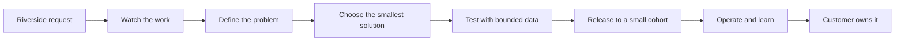
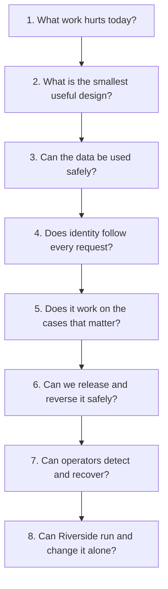

# FDE Role Baseline: From Request to Reliable Handoff

Riverside House opens with a familiar request:

> Help editors find answers and continue manuscripts faster.

That sounds like a product idea. It is not yet a buildable problem. Which editors? Which manuscripts? What counts as a good answer? Who may see embargoed work? Who can approve a workflow update? What happens when the system is wrong?

An FDE turns that uncertainty into a small, testable path from today's workflow to a system the customer can safely own.

## What the FDE owns

The FDE owns the technical journey, not every business decision.

| The FDE does | The authorized customer owner does |
|---|---|
| Turns workflow needs into tests | Chooses the workflow priority and accepts the result |
| Recommends and builds the smallest useful design | Accepts major platform and service dependencies |
| Traces data, identity, failures, and cost | Approves data use, policy, budget, and production exposure |
| Produces rollout and recovery evidence | Makes the go/no-go decision |
| Trains operators and proves the runbooks work | Accepts ongoing ownership and known limits |

The FDE must not declare a system secure, compliant, valuable, or production-ready by confidence alone. Those statements need evidence and the right decision owner.

## Three labels that prevent accidental promises

Use these labels whenever a number or decision could influence scope, budget, safety, or release.

### Measured

Use `[Measured]` when you observed a result in a named test or environment.

> `[Measured]` In staging, release r17 denied all 20 seeded cross-imprint retrieval attempts. This test did not cover a production identity-provider configuration error.

Keep the test population, release, method, result, and limitation together. A result without its boundary is easy to misuse.

### Modeled

Use `[Modeled]` when the result comes from assumptions or a calculation.

> `[Modeled]` Riverside's monthly model cost is estimated at $8,100-$12,600 using the proposed traffic and token ranges. Replace this estimate with a two-week shadow measurement before making a budget commitment.

Show the important inputs, the plausible range, and what future measurement will replace the estimate. A precise spreadsheet is still a model.

### Customer-validated

Use `[Customer-validated]` when someone with the right authority accepts a specific workflow, criterion, or decision for a stated scope.

> `[Customer-validated]` The Editorial Director accepted the policy-lookup criteria for UK editors. Rights questions and US imprints remain outside this decision.

Record who decided, what they reviewed, the scope, conditions, date, and what would trigger another review.

Customer acceptance does not turn a forecast into a measurement. If Riverside accepts a modeled cost range for planning, the range stays `[Modeled]`; the planning decision is `[Customer-validated]`.

## The engagement as a set of questions

The stages below are not paperwork checkpoints. Each one answers a practical question before more people, data, or money are exposed.

| Stage | Riverside example | Ready to move on when |
|---|---|---|
| Discover | Follow an editor from policy question to verified answer | The workflow owner confirms the current steps, important exceptions, baseline plan, and non-goals |
| Choose | Compare process change, search, retrieval with generation, and agentic options | The smallest option that can meet the need has a clear reason and owner |
| Prepare data | Inspect policy, manuscript, rights, and workflow sources | Purpose, access, region, retention, deletion, and bad-data handling are testable |
| Prove controls | Carry user, imprint, role, and purpose through retrieval and actions | Cross-imprint and over-privileged attempts fail and leave useful audit evidence |
| Evaluate | Replay common, difficult, and forbidden cases | Quality, safety, latency, and cost are separated; must-pass cases are explicit |
| Roll out | Start in shadow mode, then with a small editor group | Pause and rollback conditions are tested, and a named owner approves exposure |
| Operate | Watch service health, answer quality, policy failures, and spend | Alerts have owners; incident drills show containment and recovery |
| Hand off | Riverside operators run the dashboards and drills | Recurring work has an owner and no essential knowledge depends on the FDE |

Some work can overlap. Riverside can prototype with synthetic data while source approval is pending. It cannot use production manuscripts before data purpose, access, retention, and identity decisions are made. It cannot begin a canary before success, pause, and rollback rules exist.

When later evidence changes the picture, go back. A new role model reopens identity testing. A new manuscript format reopens data checks. A model or prompt change reopens evaluation and rollout.

## Keep the important boundaries visible

Every proposed feature should answer these questions in plain language:

| Question | Riverside example |
|---|---|
| Who needs it? | An editor checking the current policy for an assigned imprint |
| What information may it use? | Approved policy documents the editor is allowed to read |
| What may the system do? | Retrieve and draft; never publish or change rights records by itself |
| How will we know it failed? | A forbidden document appears, no supporting source exists, or latency exceeds the agreed limit |
| How is exposure limited? | A named cohort, budget cap, timeout, feature flag, and human approval |
| How do we stop or correct it? | Stop new traffic, then repair any action that already happened |
| Who owns it later? | A named Riverside operator with a dashboard and tested runbook |

Stopping a deployment and correcting an action are different jobs. Turning off a release prevents new work. It does not undo a workflow transition or message already committed. Those effects need reconciliation, correction, or escalation.

## Baseline challenge

Use the synthetic [Shared Riverside FDE Case](shared/README.md) to decide where to begin the route.

### The situation

Riverside editors work across several imprints. Some manuscripts are embargoed. Rights and contract records live in a separate system. The customer has not yet supplied an accepted baseline, target, identity design, approved source list, support model, or definition of a good manuscript continuation. A stakeholder has already asked for a multi-agent platform.

### Your response

Create a compact engagement sketch that shows:

1. The first workshop, including frontline editors and the people who own workflow, data, identity, rights, operations, and budget decisions.
2. What is known, what is only claimed, and how you will measure the current workflow.
3. A few testable outcomes and clear non-goals.
4. Smaller options alongside the requested multi-agent design.
5. The path of data and identity, with unresolved approval and deletion questions visible.
6. One measured example, one modeled example, and one customer decision that still needs validation.
7. How evaluation, a small rollout, incident response, and handoff would work.

The challenge fails if it treats "multi-agent" as a fixed requirement, invents customer approval, presents estimates as observations, uses production data before approval, ignores cross-imprint tests, or omits recovery and operational ownership.

## What a real handoff looks like

Handoff is not a folder transfer. Riverside should be able to operate and change the system without private FDE knowledge.

Before closing, ask Riverside operators to perform these tasks:

- trace a failed request across the gateway, retrieval or model step, policy check, and audit record;
- stop a release and explain which already-committed actions still need correction;
- revoke access or process a deletion and verify that the change reaches downstream stores;
- respond to a seeded cross-imprint retrieval attempt and preserve the evidence;
- change an evaluation threshold through the agreed review process.

If a drill fails, the handoff stays open. Repair the runbook, dashboard, access, or training and repeat the drill.

Close the engagement with four short lists:

1. What was measured and where, including limitations.
2. What is still modeled and which assumptions matter most.
3. What Riverside validated, for which users and workflow.
4. What remains unknown, who owns the next step, and what stays blocked.

Deployment is not the finish line. The agreed scope is complete when the result is testable, exposure is bounded, Riverside can operate it, and every remaining uncertainty has an owner or an explicit decision to stop.# FDE Role Baseline: From Request to Reliable Handoff

Riverside House opens with a familiar request:
> Help editors find answers and continue manuscripts faster.

That sounds like a product idea. It is not yet a buildable problem. Which editors? Which manuscripts? What counts as a good answer? Who may see embargoed work? Who can approve a workflow update? What happens when the system is wrong?
An FDE turns that uncertainty into a small, testable path from today's workflow to a system the customer can safely own.

## What the FDE owns

The FDE owns the technical journey, not every business decision.
| The FDE does | The authorized customer owner does |
|---|---|
| Turns workflow needs into tests | Chooses the workflow priority and accepts the result |
| Recommends and builds the smallest useful design | Accepts major platform and service dependencies |
| Traces data, identity, failures, and cost | Approves data use, policy, budget, and production exposure |
| Produces rollout and recovery evidence | Makes the go/no-go decision |
| Trains operators and proves the runbooks work | Accepts ongoing ownership and known limits |

The FDE must not declare a system secure, compliant, valuable, or production-ready by confidence alone. Those statements need evidence and the right decision owner.
## Three labels that prevent accidental promises

Use these labels whenever a number or decision could influence scope, budget, safety, or release.
### Measured

Use `[Measured]` when you observed a result in a named test or environment.
> `[Measured]` In staging, release r17 denied all 20 seeded cross-imprint retrieval attempts. This test did not cover a production identity-provider configuration error.

Keep the test population, release, method, result, and limitation together. A result without its boundary is easy to misuse.
### Modeled

Use `[Modeled]` when the result comes from assumptions or a calculation.
> `[Modeled]` Riverside's monthly model cost is estimated at $8,100-$12,600 using the proposed traffic and token ranges. Replace this estimate with a two-week shadow measurement before making a budget commitment.

Show the important inputs, the plausible range, and what future measurement will replace the estimate. A precise spreadsheet is still a model.
### Customer-validated

Use `[Customer-validated]` when someone with the right authority accepts a specific workflow, criterion, or decision for a stated scope.
> `[Customer-validated]` The Editorial Director accepted the policy-lookup criteria for UK editors. Rights questions and US imprints remain outside this decision.

Record who decided, what they reviewed, the scope, conditions, date, and what would trigger another review.
Customer acceptance does not turn a forecast into a measurement. If Riverside accepts a modeled cost range for planning, the range stays `[Modeled]`; the planning decision is `[Customer-validated]`.

## The engagement as a set of questions

The stages below are not paperwork checkpoints. Each one answers a practical question before more people, data, or money are exposed.

| Stage | Riverside example | Ready to move on when |
|---|---|---|
| Discover | Follow an editor from policy question to verified answer | The workflow owner confirms the current steps, important exceptions, baseline plan, and non-goals |
| Choose | Compare process change, search, retrieval with generation, and agentic options | The smallest option that can meet the need has a clear reason and owner |
| Prepare data | Inspect policy, manuscript, rights, and workflow sources | Purpose, access, region, retention, deletion, and bad-data handling are testable |
| Prove controls | Carry user, imprint, role, and purpose through retrieval and actions | Cross-imprint and over-privileged attempts fail and leave useful audit evidence |
| Evaluate | Replay common, difficult, and forbidden cases | Quality, safety, latency, and cost are separated; must-pass cases are explicit |
| Roll out | Start in shadow mode, then with a small editor group | Pause and rollback conditions are tested, and a named owner approves exposure |
| Operate | Watch service health, answer quality, policy failures, and spend | Alerts have owners; incident drills show containment and recovery |
| Hand off | Riverside operators run the dashboards and drills | Recurring work has an owner and no essential knowledge depends on the FDE |

Some work can overlap. Riverside can prototype with synthetic data while source approval is pending. It cannot use production manuscripts before data purpose, access, retention, and identity decisions are made. It cannot begin a canary before success, pause, and rollback rules exist.
When later evidence changes the picture, go back. A new role model reopens identity testing. A new manuscript format reopens data checks. A model or prompt change reopens evaluation and rollout.

## Keep the important boundaries visible

Every proposed feature should answer these questions in plain language:
| Question | Riverside example |
|---|---|
| Who needs it? | An editor checking the current policy for an assigned imprint |
| What information may it use? | Approved policy documents the editor is allowed to read |
| What may the system do? | Retrieve and draft; never publish or change rights records by itself |
| How will we know it failed? | A forbidden document appears, no supporting source exists, or latency exceeds the agreed limit |
| How is exposure limited? | A named cohort, budget cap, timeout, feature flag, and human approval |
| How do we stop or correct it? | Stop new traffic, then repair any action that already happened |
| Who owns it later? | A named Riverside operator with a dashboard and tested runbook |

Stopping a deployment and correcting an action are different jobs. Turning off a release prevents new work. It does not undo a workflow transition or message already committed. Those effects need reconciliation, correction, or escalation.
## Baseline challenge

Use the synthetic [Shared Riverside FDE Case](shared/README.md) to decide where to begin the route.

### The situation

Riverside editors work across several imprints. Some manuscripts are embargoed. Rights and contract records live in a separate system. The customer has not yet supplied an accepted baseline, target, identity design, approved source list, support model, or definition of a good manuscript continuation. A stakeholder has already asked for a multi-agent platform.

### Your response

Create a compact engagement sketch that shows:

1. The first workshop, including frontline editors and the people who own workflow, data, identity, rights, operations, and budget decisions.
2. What is known, what is only claimed, and how you will measure the current workflow.
3. A few testable outcomes and clear non-goals.
4. Smaller options alongside the requested multi-agent design.
5. The path of data and identity, with unresolved approval and deletion questions visible.
6. One measured example, one modeled example, and one customer decision that still needs validation.
7. How evaluation, a small rollout, incident response, and handoff would work.

The challenge fails if it treats "multi-agent" as a fixed requirement, invents customer approval, presents estimates as observations, uses production data before approval, ignores cross-imprint tests, or omits recovery and operational ownership.
## What a real handoff looks like

Handoff is not a folder transfer. Riverside should be able to operate and change the system without private FDE knowledge.

Before closing, ask Riverside operators to perform these tasks:

- trace a failed request across the gateway, retrieval or model step, policy check, and audit record;
- stop a release and explain which already-committed actions still need correction;
- revoke access or process a deletion and verify that the change reaches downstream stores;
- respond to a seeded cross-imprint retrieval attempt and preserve the evidence;
- change an evaluation threshold through the agreed review process.

If a drill fails, the handoff stays open. Repair the runbook, dashboard, access, or training and repeat the drill.

Close the engagement with four short lists:

1. What was measured and where, including limitations.
2. What is still modeled and which assumptions matter most.
3. What Riverside validated, for which users and workflow.
4. What remains unknown, who owns the next step, and what stays blocked.

Deployment is not the finish line. The agreed scope is complete when the result is testable, exposure is bounded, Riverside can operate it, and every remaining uncertainty has an owner or an explicit decision to stop.
