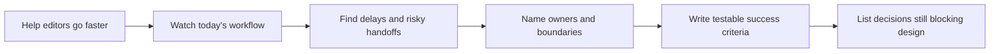

# Discovery and Success Criteria

Riverside House wants to help editors find answers and continue manuscripts faster. The temptation is to start choosing models, agents, and databases.

This chapter pauses before the design. You will follow one editor's work, identify who can make each decision, and turn a promising idea into outcomes that Riverside can actually test.



## What you will build

By the end of the notebook, you will have a compact discovery pack:

- a map of Riverside users and decision owners;
- the current editorial workflow and its known baseline;
- desired outcomes and explicit non-goals;
- a boundary between what the assistant may suggest and what a human must approve;
- an inventory of candidate data sources and unresolved approvals;
- success criteria for normal, difficult, and forbidden cases;
- a prioritized list of assumptions, conflicts, risks, and unknowns.

The notebook uses internal artifact keys such as `DSC-01` so later chapters can consume the results. You do not need to memorize those keys. The important skill is knowing what each artifact helps Riverside decide.

## Keep three kinds of evidence separate

The synthetic case contains statements with different levels of certainty.

| Label | Riverside example | What you may conclude |
|---|---|---|
| Measured baseline | Policy lookup took 18 minutes for the recorded sample | This happened in the stated sample, with the stated limitations |
| Modeled assumption | A forecast of traffic or cost | It is a planning input until a real run measures it |
| Customer claim | A stakeholder says quality must improve | It needs corroboration and an authorized decision before it becomes a target |

Some records are policy constraints, deliberate conflicts, or unknowns. Keep them visible until the named owner decides or supplies evidence. Do not silently choose a convenient answer in code.

All people, organizations, metrics, and records are synthetic. Local fixture checks do not prove customer, cloud, security, legal, compliance, or production behavior.

## Before you run the notebook

The notebook uses Python's standard library and `jsonschema`. It needs no network connection or paid service.

PowerShell:

```powershell
.\setup.ps1
```

Bash:

```bash
./setup.sh
```

Use `-SkipKernel` or `--skip-kernel` to install dependencies without registering the chapter kernel.

## Work through the Riverside story

Open [discovery-and-success-criteria.ipynb](discovery-and-success-criteria.ipynb) and run the cells in order.

The notebook follows this path:

1. See why a solution-first workshop misses the problem.
2. Match each decision to the person who can make it.
3. Trace the seven-step editorial workflow and its delays.
4. Separate helpful suggestions from actions that require human approval.
5. Test averages against must-pass safety cases.
6. Keep unresolved questions visible and owned.
7. Decide whether Riverside is ready to compare architectures.

The committed outputs are intentionally empty. Your run builds the teaching artifacts in memory and does not modify the shared fixtures, contact external services, or create customer validation.

## Reuse the work

The [templates](templates/README.md) directory contains blank versions of the discovery artifacts. Use them for another synthetic case or an authorized engagement after you understand the Riverside example.

For a later run, record results in [templates/notebook-output-record.md](templates/notebook-output-record.md). It begins as `NOT RUN` so supplied facts, observed results, limitations, and decisions remain separate.

## When discovery is ready

Architecture comparison can begin only when:

- the Riverside workflow owner confirms today's process and the non-goals;
- every success criterion says what is tested, for whom, how, and who owns the decision;
- forbidden cases such as cross-imprint retrieval are explicit must-pass tests;
- actions that change Riverside systems show the proposal, human approval, commit, audit, and correction boundaries;
- every important conflict or unknown has an owner and a point by which it must be resolved.

It is valid for this chapter to end with `BLOCKED`. A clear stop is better than an architecture built on invented decisions.

Next, the architecture chapter compares smaller process and software options with retrieval, generation, workflow, and agentic designs while preserving these Riverside boundaries.
