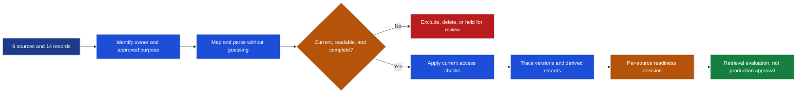

# Data Onboarding and Contracts

Riverside House has six source systems and fourteen synthetic records. At first
glance, every record looks ready because it has an ID and a payload. A closer
look finds an old policy, a scrambled two-column PDF, a repeated rights page, a
deleted autosave, a missing rights territory, a renamed API field, and a disabled
contractor who still appears in an old group snapshot.

This chapter decides which records may move toward retrieval evaluation, which
must wait for an owner, and which must never enter the current index.

## Situation

A document is more than its text. Riverside also needs to know where it came
from, which version is current, who may use it, what region it belongs to, and
how every derived copy disappears after deletion.

A naive loader would accept all fourteen sample records and carry every seeded
failure into search. The safer path asks five questions for each source:

1. Who owns its purpose, access, retention, and deletion decisions?
2. Can its shape be mapped without guessing or silently changing meaning?
3. Can current and deleted versions be distinguished without losing history?
4. Does each request use current identity, title, region, role, and purpose?
5. Can a source change or deletion be traced through parsed text, chunks,
	vectors, and the searchable index?

The notebook uses only frozen synthetic fixtures in
[`../shared/`](../shared/README.md). It writes no customer or cloud data.

## Sketch



Records that fail a check do not disappear into one generic error bucket. A
superseded policy is excluded from the current view. A deleted autosave emits a
deletion marker. Unreadable or incomplete records are held for review with a
safe reason and enough lineage to replay them from governed storage.

## Hands-On Check

Run the setup script for your platform:

```powershell
.\setup.ps1
```

```bash
./setup.sh
```

Select `Python (FDE 03 Data Onboarding .venv)`, open
`data-onboarding-and-contracts.ipynb`, and run from the top.

The exercises test the concrete failures:

- Raise the sample threshold and identify which source owners need more evidence.
- Try accepting a missing rights territory as worldwide. The record must remain
  held for review instead.
- Include superseded policy. The current-view assertion must fail.
- Accept an undocumented API field rename. The versioned contract must still fail.
- Authorize from the contractor's stale role alone. Current identity must deny it.
- Remove sync overlap. The late-arrival protection assertion must fail.

The route environment and notebook were previously executed successfully against
the committed synthetic fixtures. Outputs were then cleared. That run proves the
local checks detect the seeded failures; it does not prove customer or Databricks
behavior.

## Decision

The notebook produces one decision per source, then an overall verdict:

| Verdict | Meaning |
|---|---|
| `CONDITIONAL` | Local mapping can proceed, but named owner or target-system evidence is still required |
| `BLOCKED` | A parser, contract, identity, rights, or access failure prevents exposure |
| `EXCLUDED` | A stale or prohibited record must not enter the current searchable view |
| Ready for retrieval evaluation | Data gates passed for a bounded current view; relevance, citations, and answers remain untested |

Under the frozen fixture, the policy and manuscript sources remain conditional.
The rights, ERP, workflow API, and identity API sources are blocked. No source is
declared production-ready by this chapter.

Carry the chapter artifacts into implementation in this order:

1. Map source inventory and field mappings into the pipeline contracts without
	silently filling missing values.
2. Turn fixture failures into per-source quality and review rules.
3. Implement version, access refresh, sync checkpoint, deletion, reindex, and
	reconciliation behavior in the target jobs.
4. Use the readiness verdict to design supervised tests for identity, filters,
	deletion, drift, latency, quota, region, cost, and rollback.

The linked implementation surfaces are candidates, not deployment evidence:

- [remote ingestion contracts](../../../../projects/rag-knowledge-pipeline/phase1-ingest/src/remote/contracts.py)
- [parsing and review routing](../../../../projects/rag-knowledge-pipeline/phase1-ingest/src/remote/pipeline.py)
- [durable quality gates](../../../../projects/rag-knowledge-pipeline/phase1-ingest/src/remote/quality.py)
- [chunk and vector contracts](../../../../projects/rag-knowledge-pipeline/phase2-vectorize/src/remote/contracts.py)
- [Databricks index operations](../../../../projects/rag-knowledge-pipeline/databricks/indexing/OPERATIONS.md)

## Evidence Boundary

| Label | Meaning here |
|---|---|
| `[Measured - local fixture]` | A deterministic result calculated from committed synthetic records during a run |
| `[Modeled]` | A projection based on stated assumptions, not observed production behavior |
| `[Customer-validated]` | A future decision made by an authorized Riverside owner |
| `[External validation required]` | A cloud, Databricks, legal, security, or operating behavior the fixtures cannot prove |

Frozen labels such as `customer_claim`, `policy_constraint`, and `unknown` keep
their original evidence class. Calculating over a customer claim does not turn it
into measured customer truth.

The local lab cannot prove representative parser accuracy, source completeness,
customer ownership, legal retention, identity freshness, Databricks access
control, merge behavior, vector filters, regional behavior, completed deletion,
performance, cost, or operating readiness. Those items remain blocked or
conditional until their owners produce target-environment evidence.

## Takeaway

Do not index text first and repair authority later. Keep uncertainty out of the
searchable view, preserve identity and history before detecting duplicates, use
current request context for access, and trace deletion through every derived
record. Passing these data gates permits retrieval evaluation only; it says
nothing yet about relevance, citation support, or generated answer quality.

## Artifacts

| Artifact | Decision supported | Template |
|---|---|---|
| `DATA-01` | Sources, owners, purposes, refresh paths, and unknowns | `templates/source-inventory.yaml` |
| `DATA-02` | Source-to-document mappings without silent coercion | `templates/mapping-specification.yaml` |
| `DATA-03` | Passed, failed, and held-for-review fixture checks | `templates/quality-report.json` |
| `DATA-04` | Version, access, sync, lineage, and deletion propagation | `templates/lineage-sync-delete-plan.yaml` |
| `DATA-05` | Ready, conditional, blocked, or excluded sources | [Retrieval readiness verdict](templates/retrieval-readiness-verdict.md) |
| Run record | Observed environment, method, results, and limitations | [Notebook output record](templates/notebook-output-record.md) |

Use [Hybrid Search](../../../genai/10-rag/01-hybrid-search.ipynb) and
[RAG Evaluation](../../../genai/10-rag/02-rag-evaluation.ipynb) after approved
current views pass this chapter's gates.
