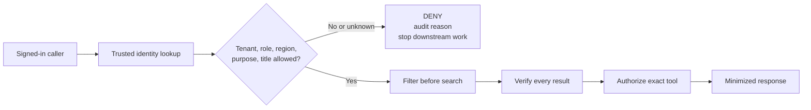

# Identity, Isolation, and Compliance

An EU editor asks Riverside's assistant for a manuscript. The sign-in is valid,
but the request says `TEN-RIV-US`, asks for an editor role the caller does not
have, and names a US title. Should the assistant trust the request because the
user signed in? No. It must rebuild authority from trusted records and deny the
request before any US content reaches search, a model, or a tool.

This chapter makes that decision path visible. You will work with synthetic
Riverside identities and resources, predict each decision, run the local checks,
and explain where the request stopped. Nothing here contacts Azure, an identity
provider, a model, a vector store, or a customer system.

## What you will build

**Before:** a valid sign-in and caller-provided filters can accidentally become
authorization.

**After:** every request carries trusted tenant, actor, active roles, region,
purpose, title assignments, and trace ID through separate gateway, retrieval,
tool, audit, and response checks.

By the end, you can:

1. Explain why authentication is not authorization.
2. Derive tenant, actor, and effective roles from trusted identity data rather than request fields.
3. Deny stale, disabled, cross-tenant, wrong-region, missing-purpose, and wrong-title requests.
4. Filter before retrieval and verify again after retrieval.
5. Authorize the exact tool and payload independently of model intent or human approval.
6. Record allow and deny reasons without leaking content or identity into metrics.
7. Separate local test results from deployed security, residency, privacy, and legal evidence.

## Riverside cases to watch

| Case | Riverside situation | Safe result |
|---|---|---|
| `ISO-RIV-001` | Active EU editor asks for an assigned EU manuscript | Allow retrieval after all checks |
| `ISO-RIV-002` | EU editor asks for a US manuscript | Deny before retrieval |
| `ISO-RIV-003` | Disabled contractor still appears in a nested editor group | Deny on inactive identity before checking roles |
| `ISO-RIV-004` | Caller adds a broader role and requests a rights write | Deny the role escalation |
| `ISO-RIV-005` | EU content is routed to a disallowed region | Deny the region mismatch |
| `ISO-RIV-006` | Valid identity provides no purpose | Deny missing purpose |
| `ISO-RIV-007` | Editor requests a title not assigned to them | Deny the title mismatch |
| `ISO-RIV-008` | Valid editor confirms a prohibited rights change | Deny; confirmation cannot create authority |
| `ISO-RIV-009` | Editor proposes, but does not commit, a permitted workflow change | Allow the bounded proposal |

Any forbidden allow is a stop-ship result mapped to `RISK-RIV-003`. The stale
contractor case maps to `INC-RIV-003`, whose frozen severity is `SEV-1`.

## What the evidence labels mean

| Label | Plain meaning | Riverside example |
|---|---|---|
| `[Local-static]` | We inspected source or an expected result; nothing ran | The fixture contains a cross-tenant deny case |
| `[Local-measured]` | A named local run produced this result | A recorded run matched all nine expected decisions |
| `[Modeled]` | Policy says this is how the design should behave | EU manuscripts should remain in `REG-UKS` |
| `[External validation required]` | An authorized owner must prove this in the target environment | Deployed tokens, RBAC, networking, backups, and diagnostics preserve the boundary |

Python producing a green result does not turn a modeled rule into deployed
evidence. Do not write `secure`, `compliant`, `resident`, or `least privilege`
without the scope, environment, reviewer, date, and evidence that support it.

## Chapter files

| Item | Use |
|---|---|
| [Notebook](identity-isolation-and-compliance.ipynb) | Predict and test each identity boundary |
| [Scenario fixture](fixtures/identity-scenarios-v1.json) | Synthetic allow and deny cases |
| [Identity flow](templates/identity-flow.md) | Show where identity becomes trusted context |
| [RBAC matrix](templates/rbac-matrix.md) | Map roles to exact actions and resources |
| [Data-flow and residency map](templates/data-flow-residency-map.md) | Track data categories, locations, transfers, and owners |
| [Threat model](templates/threat-model.md) | Sketch assets, boundaries, abuse paths, and controls |
| [Controls matrix](templates/controls-matrix.md) | Connect each control to evidence, owner, and status |
| [Isolation report](templates/isolation-test-report.md) | Record expected and observed decisions |
| [Notebook output record](templates/notebook-output-record.md) | Keep `NOT RUN` until a real local run is recorded |
| [Local proof checklist](checklists/local-proof-checklist.md) | Review what the fixture run actually supports |
| [External validation checklist](checklists/external-validation-checklist.md) | Track cloud, customer, security, privacy, and legal gates |
| [Setup](SETUP.md) | Create the optional local Jupyter environment |

## Run the exercise

1. Follow [SETUP.md](SETUP.md).
2. Read the synthetic fixture before running code.
3. For each section, predict `ALLOW` or `DENY` and name the first boundary that should decide.
4. Run cells in order.
5. Compare the observed decision with your prediction.
6. Store a completed output record separately; keep the committed example at `NOT RUN`.

Never replace the synthetic IDs with production identifiers, exports, logs, or
tokens. The notebook was route-validated against its fixtures and then cleared,
so committed code cells have null execution counts and empty outputs.

## What still needs production proof

The notebook teaches the mechanism. A supervised implementation review must map
`SEC-01` through `SEC-06` to the real enforcement point in APIM, the application,
retrieval, tools, telemetry, and infrastructure. It must rerun negative tests for
tenant, role, region, purpose, title, stale entitlement, and deleted content.

Use these production-shaped references:

- [Security and data boundaries](../../../../projects/riverside-ai-platform/docs/security-and-data-boundaries.md)
- [Data residency](../../../../projects/riverside-ai-platform/docs/data-residency.md)
- [APIM gateway boundary](../../../../projects/riverside-ai-platform/apim/README.md)
- [APIM client authentication policy](../../../../projects/riverside-ai-platform/apim/policies/fragments/client-auth.xml)
- [Managed identity and RBAC infrastructure](../../../../projects/riverside-ai-platform/infra/README.md)
- [Versioned contracts](../../../../projects/riverside-ai-platform/contracts/README.md)
- [Governance, guardrails, and security](../../../agentic-ai-system-design/11-governance-guardrails-and-security.md)

Entra configuration, private networking, deployed RBAC, diagnostic destinations,
residency, and legal or compliance conclusions remain with their authorized
owners. A local pass starts that review; it does not close it.
