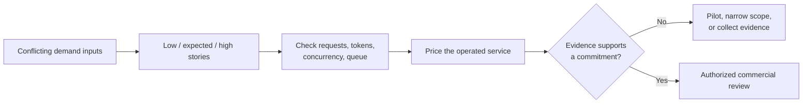

# SLA, Capacity, and Commercials

Riverside expects 620 sessions on a business day and gives you a peak of 90
requests per hour. A quick spreadsheet divides 620 by ten covered hours and gets
62. It looks precise, but it compares sessions with requests and says nothing
about bursts. Would you reserve capacity or promise an SLA from that number? No.

This chapter turns conflicting Riverside inputs into a planning range that a
customer, engineer, finance reviewer, and service owner can challenge. You will
predict which constraint fails, run the model, and keep every estimate visibly
separate from measurements and contractual commitments.

## The decision you are preparing

**Before:** one average, one expected cost, and a 99.5% target can be mistaken for
capacity, a quote, and an achieved service level.

**After:** Riverside gets low, expected, and high cases; separate request, token,
concurrency, queue, and spend checks; a full-service cost range; and a pilot
recommendation with named blockers.



You will build:

- low, expected, and high demand stories;
- simple arrival, concurrency, RPM, TPM, retry, cache, and headroom checks;
- costs for model use, infrastructure, retrieval/storage, observability, software, and support;
- before/after sensitivity checks that show which assumption moves cost most;
- service tiers tied to architecture, quota, monitoring, rollout, support, and price;
- a decision record that states what Riverside may discuss now and what still blocks a quote.

The notebook deliberately breaks two weak plans: sizing from a daily average and
turning the expected-cost output into a final price.

## Read every number with its label

| Label | Plain meaning | What not to claim |
|---|---|---|
| `[Measured: synthetic fixture]` | A committed synthetic trace was observed | Production traffic will behave the same way |
| `[Modeled]` | Python calculated from explicit assumptions | The result was observed in production |
| `[Policy constraint]` | A rule the design must preserve | It can be traded for cost or availability |
| `[Unknown]` | A missing input needs an owner and a decision | A convenient default is true |
| `[External validation required]` | Live evidence or authorized approval is still needed | The gate is closed because the notebook ran |

A modeled calculation does not become measured because Python produced it. A
customer target does not prove achievement. Forbidden access and duplicate
workflow commits remain fail-closed, zero-tolerance constraints; they are never
spent from an ordinary availability error budget.

## Riverside inputs

- [Frozen Riverside FDE case](../shared/fixtures/riverside-engagement-v1.json)
- [Expected-facts ledger](../shared/fixtures/expected-facts-v1.json)
- [AI Engineer request traces](../../ai-engineer/shared/latency-cost/request-traces.jsonl)
- [Trace expected outcomes](../../ai-engineer/shared/latency-cost/EXPECTED_OUTCOMES.md)

The shared case is read-only. Requests per session, planning service time, unit
rates, and realized cache hits are chapter assumptions with validation owners,
not hidden facts.

## Run the exercise

Python 3.10 or newer is recommended. From this folder, run one setup script:

```powershell
.\setup.ps1
```

```bash
./setup.sh
```

Both scripts create `.venv`, install [requirements.txt](requirements.txt), and
register the `fde-sla-capacity` kernel unless you use the skip-kernel option.
They do not contact a cloud service.

Then open [sla-capacity-and-commercials.ipynb](sla-capacity-and-commercials.ipynb).
Before each code cell, write down what you expect to become the limiting factor
and why. Run from top to bottom, compare the result with your prediction, and
keep the result's evidence label attached.

Route validation executed the notebook against committed synthetic fixtures and
then cleared all generated outputs. That proves the scenario, capacity, cost,
and decision code ran in that local route environment. It does not prove live
prices, quota, latency, capacity, failover, staffing, customer approval, legal
terms, or production readiness.

## Reusable decision files

| Template | Use |
|---|---|
| [Capacity scenario](templates/capacity-scenario-template.csv) | Record workload assumptions, evidence, and owners for each case |
| [Cost input ledger](templates/cost-input-template.csv) | Keep each rate's unit, source, date, and validation status visible |
| [SLA tier mapping](templates/sla-tier-mapping-template.md) | Tie targets to the system and people needed to support them |
| [Commercial decision record](templates/commercial-decision-record-template.md) | Separate estimate, ceiling, exclusions, approvals, and quote prerequisites |

Version completed artifacts. Never overwrite a template with a silent "final"
number, and retain the source and date for every changed input.

## Before and after a credible recommendation

| Weak version | Credible Riverside version |
|---|---|
| "Expected cost is 13,420 USD" | "Modeled range is X-Y; rates are dated placeholders; the high case crosses the 18,000 USD ceiling" |
| "The system supports 99.5%" | "99.5% is a target for named covered hours; production measurement and support approval remain open" |
| "Cache saves 20%" | "A portion is eligible; realized hits require authorization-scoped keys and load evidence" |
| "Quota is sufficient" | "RPM, TPM, concurrency, region, and failover quota each have a validation owner" |
| "We can support deadlines" | "The proposed response window fits the funded staffing schedule, or the tier is narrowed" |

## What this chapter cannot close

- current prices, discounts, taxes, or exchange rates;
- model and regional quota availability;
- production p95/p99 latency and burst behavior;
- safe cache realization under authorization-scoped keys;
- failover RTO/RPO and cross-region data behavior;
- support staffing, response, and service-credit terms;
- legal enforceability of SLA or contract language.

The FDE may gather assumptions, model scenarios, expose tradeoffs, and recommend
technical options. Finance or procurement owns price and discount inputs; the
service owner owns support commitments; commercial/legal owners own contract and
liability language; authorized customer and seller representatives own final
acceptance. When they disagree, show the consequences of each option rather than
choosing a contractual position for them.

## Where the evidence goes next

Review the outputs against Riverside's [cost and capacity assumptions](../../../../projects/riverside-ai-platform/docs/cost-and-capacity-assumptions.md),
[staged load-test assets](../../../../projects/riverside-ai-platform/load-tests/README.md),
[evaluation strategy](../../../../projects/riverside-ai-platform/docs/evaluation-strategy.md),
and [infrastructure choices](../../../../projects/riverside-ai-platform/infra/README.md).
A supervised practicum must replace assumptions with dated quotes and retained
measurements, reconcile quota and region constraints, and return saturation,
latency, recovery, and cost evidence to the claim register before commitment.

Related references:

- [Application Latency and Cost fixtures](../../ai-engineer/shared/latency-cost/EXPECTED_OUTCOMES.md)
- [LLM Gateway](../../../genai/05-llm-gateway/01-llm-gateway.ipynb)
- [Inference Systems](../../../ai-infrastructure/07-inference-systems/inference-systems.ipynb)
- [Production Scale and Capacity](../../../agentic-ai-system-design/12-production-scale-and-capacity.md)
- [Azure Operational LLM Serving](../../../ai-infrastructure/09-azure-operational-llm-serving/README.md)

The Azure chapter is a later validation path. No Azure operation or claim is
required here.
